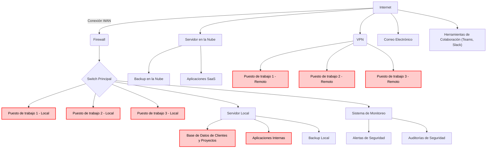

# UNIDAD 1: Desarrollo de planes de prevención y concienciación en ciberseguridad

## Apartado 1: Diseño de una empresa ficticia

>Deberás efectuar las siguientes tareas:
>- Diseñar una empresa con un esquema sencillo de Sistemas de Información, en el que se reflejen los puntos habituales de vulnerabilidad: bases de datos, puestos de trabajo en local o en remoto, conmutadores, servidores, etc.
>- El diseño deberá ser imaginativo para que se puedan tratar los temas relevantes en una auditoría de prevención.

---

## Apartado 2: Detalle de los puntos vulnerables del puesto de trabajo que se deberán tener en cuenta

>Deberás efectuar las siguientes tareas. Se puede presentar desglosado por apartados o todo junto (elemento->escenario->medida, etc.), siendo la extensión total de este apartado unas 2-3 páginas aproximadamente:
>- Tomando el diseño del apartado anterior, efectuar una labor de inventariado de todos los elementos esenciales para el negocio (activos): hardware, software, comunicaciones, instalaciones, datos y personas, que se desea incluir (de media a una página).
>- A continuación, identificar escenarios de riesgo de los elementos esenciales anteriormente indicados (entre 8-15 escenarios, aunque el listado anterior sea superior).
>- Para cada escenario de riesgo, plantear una medida de seguridad adaptada.

Para comenzar el análisis de seguridad de la empresa, primero identificamos los activos esenciales del negocio, desglosados en categorías clave. Dichos activos son críticos para el funcionamiento de la empresa y deben ser protegidos mediante medidas adecuadas de ciberseguridad:

- **Hardware**
	- Servidores locales: Almacenamiento de datos críticos de la empresa y de los clientes, junto con datos de aplicaciones internas y backups locales.
	- Equipos de trabajo: Equipos de los empleados para desarrollo, gestión y operación, tanto locales como remotos.
	- Switches y routers: Gestión de la red interna y acceso a internet.
	- Firewalls: Dispositivos de seguridad perimetral que controlan el tráfico de entrada y salida.
	- Dispositivos móviles: Tablets y smartphones utilizados por empleados para acceder remotamente.
- **Software**
	- **Sistemas operativos**: Windows, Linux y/o macOS en servidores y estaciones de trabajo.
	- **Aplicaciones de gestión interna**: Herramientas desarrolladas para la gestión de proyectos y clientes, como ERPs o CRMs.
	- **Aplicaciones SaaS**: Aplicaciones de terceros como Office 365 o Google Workspace.
	- **Software de seguridad**: Antivirus, firewalls, sistemas de detección de intrusiones (IDS)...
	- **Software de backup**: Soluciones para realizar copias de seguridad automatizadas.
- **Comunicaciones**
	- **VPN**: Red privada virtual para acceso remoto seguro de los empleados.
	- **Red local (LAN)**: Interconexión de los servidores, estaciones de trabajo y otros dispositivos.
	- **Conexión a Internet**: Acceso a servicios en la nube y comunicaciones externas.
	- **Correo electrónico**: Servicio de comunicaciones interno y externo.
	- **Herramientas de colaboración**: Utilizadas para la comunicación y coordinación de proyectos.
- **Instalaciones**
	- **Centro de datos local**: Instalaciones físicas donde se encuentran los servidores y equipos críticos.
	- **Oficinas**: Espacios de trabajo para los empleados locales.
	- **Sistemas de climatización y energía**: Infraestructura que mantiene la operación de los servidores (UPS, generadores…).
- **Datos**
	- **Base de datos de clientes y proyectos**: Información crítica sobre los clientes y contratos en curso.
	- **Datos de recursos humanos**: Información sensible sobre los empleados.
	- **Datos financieros**: Información sobre ingresos, gastos y facturación.
	- **Datos en la nube**: Almacenamiento de datos y backups en servidores externos.
- **Personas**
	- **Equipo de TI**: Encargado de la gestión de sistemas, redes y seguridad.
	- **Empleados de administración**: Gestión de clientes, proyectos y finanzas.
	- **Empleados remotos**: Contribuyen al desarrollo y gestión desde distintas ubicaciones.
	- **Socios y proveedores**: Acceso a partes del sistema para servicios de soporte o integración.

Una vez identificados los activos esenciales de la empresa, procedemos a identificar los principales escenarios de riesgo que pueden comprometer la integridad, la disponibilidad o la confidencialidad de dichos activos:

1. **Fallo en el servidor local**
	- **Riesgo**: Pérdida de acceso a datos y aplicaciones internas, interrumpiendo la operación.
	- **Medida de seguridad**: Implementar redundancia con servidores de respaldo y backups automáticos diarios.

2. **Acceso no autorizado a la red local**
	- **Riesgo**: Intrusión en la red interna que comprometa datos sensibles.
	- **Medida de seguridad**: Configurar el firewall adecuadamente, restringir accesos por VPN, implementar sistemas IDS y segmentación de red.

3. **Fallo en la VPN de acceso remoto**
	- **Riesgo**: Imposibilidad de acceder remotamente a los sistemas corporativos.
	- **Medida de seguridad**: Implementar un segundo canal de conexión VPN y monitorización continua del servicio.

4. **Ataque de phishing en el correo electrónico**
	- **Riesgo**: Robo de credenciales o infección con malware a través de correos falsificados.
	- **Medida de seguridad**: Formación constante a los empleados sobre detección de correos fraudulentos y software de análisis de correos.

5. **Malware en equipos de trabajo**
	- Riesgo: Infección de los equipos que afecte a su funcionamiento y/o que robe información confidencial.
	- Medida de seguridad: Antivirus y software de detección de malware actualizados en todos los dispositivos, con políticas de control de acceso.

6. **Pérdida o robo de dispositivos móviles**
	- **Riesgo**: Exposición de información corporativa al perder acceso a tablets o teléfonos móviles.
	- **Medida de seguridad**: Habilitar el cifrado de datos en dispositivos móviles y activar la capacidad de borrado remoto.

7. **Filtración de datos desde las aplicaciones SaaS**
	- **Riesgo**: Pérdida de datos sensibles al utilizar servicios en la nube sin suficientes medidas de seguridad.
	- **Medida de seguridad**: Control de acceso basado en roles (RBAC) y auditoría continua del acceso a los servicios en la nube.

8. **Fallo en el sistema de backup**
	- **Riesgo**: Imposibilidad de restaurar información crítica en caso de una interrupción de los servicios.
	- **Medida de seguridad**: Verificar y probar periódicamente los backups. Tener sistemas de copia local y en la nube.

9. **Sobrecarga en la red local por tráfico malicioso**
	- **Riesgo**: Ataques DDoS o infecciones que saturan la red e impiden el acceso a servicios.
	- **Medida de seguridad**: Implementar firewalls con protección DDoS y configurar sistemas de detección y respuesta ante anomalías.

10. **Fallo en el suministro eléctrico del centro de datos**
	- **Riesgo**: Pérdida de servicios si el suministro eléctrico es interrumpido en las instalaciones.
	- **Medida de seguridad**: Instalar sistemas de alimentación ininterrumpida (UPS) y generadores de respaldo.

11. **Pérdida de datos en la base de datos de clientes**
	- **Riesgo**: Pérdida o corrupción de información crítica de clientes.
	- **Medida de seguridad**: Realizar copias de seguridad automáticas y duplicar la base de datos en servidores alternos.

12. **Fugas de información por despidos o personal externo**
	- **Riesgo**: Filtración de datos confidenciales por empleados o terceros con acceso a la información.
	- **Medida de seguridad**: Implementar políticas de control de acceso estrictas y deshabilitar credenciales inmediatamente al finalizar la relación contractual.

13. **Incumplimiento de la normativa GDPR**
	- **Riesgo**: Multas y sanciones por no proteger adecuadamente los datos personales de los clientes.
	- **Medida de seguridad**: Auditar los sistemas regularmente para asegurar el cumplimiento y mejorar el cifrado de datos.

14. **Desastres naturales en las oficinas o centros de datos**
	- **Riesgo**: Daños físicos a los servidores o interrupciones en el negocio.
	- **Medida de seguridad**: Tener un plan de recuperación ante desastres (DRP) y replicar servicios en diferentes ubicaciones geográficas.

15. **Falta de conciencia sobre seguridad en el personal**
	- **Riesgo**: Malas prácticas en la gestión de contraseñas o manejo de datos.
	- **Medida de seguridad**: Crear programas de formación continua en ciberseguridad y concienciación de riesgos.

---

## Apartado 3: Detalle del plan de formación y concienciación

>El Plan de formación contará al menos con los siguientes apartados (entre 2 y 5 páginas aproximadamente):
>- Objetivos.
>- Evaluación de las necesidades de formación.
>- Roles incluidos (concreción del plan).
>- Contenidos (de la formación y los criterios).
>- Asociación de roles y contenidos (adecuados a los distintos puestos de trabajo).
>- Metodologías formativas (para cada grupo, indicar contenidos, metodología y duración/periodicidad).
>- Evaluación del plan de concienciación (comprobar lo aprendido con evidencias, campañas de prácticas y ataques simulados).

### Objetivos

El plan de formación contará con los siguientes objetivos:

- **Concienciar a todos los empleados** sobre la importancia de la ciberseguridad, centrándose en la protección de la información y las herramientas digitales que utilizan en su trabajo diario.
- **Desarrollar habilidades específicas** entre los distintos grupos de empleados para garantizar la correcta implementación de las medidas de seguridad según sus funciones.
- **Garantizar el cumplimiento normativo** en términos de protección de datos, específicamente con respecto al **Reglamento General de Protección de Datos (GDPR)** y otras normativas aplicables, como la **Ley Orgánica de Protección de Datos (LOPD)** en España.
- **Reducir los riesgos** derivados de ataques cibernéticos, tales como phishing, malware, o accesos no autorizados, a través de la adopción de prácticas seguras.
- **Fomentar una cultura de ciberseguridad** en la empresa que se mantenga a lo largo del tiempo mediante formación continua y prácticas de seguridad activa.

### Evaluación de las necesidades de la formación

Para determinar las necesidades formativas, se debe realizar una evaluación previa de los niveles de conocimiento y de los riesgos asociados a cada puesto de trabajo dentro de la empresa:
- **Personal técnico (TI)**: Necesitan formación avanzada en ciberseguridad, detección de intrusiones, y protección de infraestructuras críticas.
- **Empleados administrativos y de recursos humanos**: Se centran en el manejo seguro de datos personales y financieros.
- **Personal en remoto**: Necesitan formación específica sobre el uso seguro de las redes públicas, las VPNs, y la correcta gestión de los dispositivos móviles.
- **Alta dirección**: Necesitan formación en toma de decisiones en ciberseguridad, cumplimiento normativo y riesgos relacionados con la protección de datos.
- **Usuarios generales**: Deben adquirir conocimientos básicos sobre amenazas como el phishing, el uso seguro de contraseñas y la gestión de datos confidenciales.

### Roles incluidos

Los roles específicos incluidos en el plan, con sus correspondientes áreas de enfoque, son:

- **Equipo de TI**: Gestión de redes, servidores y ciberseguridad a nivel técnico.
- **Personal administrativo**: Manejo de datos confidenciales y seguridad en el correo electrónico.
- **Personal en remoto**: Acceso seguro a sistemas desde redes externas y uso de dispositivos móviles.
- **Alta dirección**: Toma de decisiones estratégicas y cumplimiento de normativas.
- **Usuarios generales**: Uso básico de herramientas digitales y concienciación sobre ciberamenazas.

### Contenidos de la formación y los criterios

La formación se adaptará a las necesidades de cada grupo, cubriendo los siguientes puntos clave:

1. **Ciberseguridad básica** (para todos los empleados):
	- Reconocimiento de correos de phishing y malware.
	- Gestión segura de contraseñas.
	- Políticas de uso de dispositivos USB y redes externas.
	- Buenas prácticas en el manejo de datos personales y corporativos.

2. **Protección de datos personales y GDPR** (especialmente para administrativos y recursos humanos):
	- Manejo seguro de datos sensibles.
	- Cumplimiento con la GDPR y protección de la privacidad de los clientes y empleados.
	- Políticas de retención y eliminación de datos.

3. **Uso seguro de redes y dispositivos móviles** (para empleados en remoto):
	- Conexiones seguras a través de VPN.
	- Seguridad en el uso de redes Wi-Fi públicas.
	- Cifrado de datos en dispositivos móviles y uso de aplicaciones seguras.

4. **Gestión avanzada de ciberseguridad** (para el equipo de TI):
	- Gestión de firewalls, antivirus y sistemas de detección de intrusos.
	- Auditorías de seguridad de red y sistemas.
	- Implementación de políticas de acceso seguro y segmentación de red.

5. **Toma de decisiones estratégicas en seguridad** (para la alta dirección):
	- Evaluación de riesgos y gestión de incidentes.
	- Cumplimiento normativo y su impacto en la empresa.
	- Planes de recuperación ante desastres y continuidad del negocio.

### Metodologías formativas

El plan de formación utilizará diferentes enfoques según el grupo objetivo, con duración y periodicidad variables:

- **Cursos presenciales y online**: Para la alta dirección y el equipo de TI, se realizarán formaciones presenciales con expertos externos, mientras que el resto de empleados podrá acceder a módulos formativos online.
	- **Duración**: 2-3 horas para sesiones iniciales.
	- **Periodicidad**: Trimestral.
	- **Metodología**: Teoría, estudios de caso y ejercicios prácticos.

- **Seminarios de concienciación**: Los usuarios generales y personal administrativo recibirán sesiones más breves, tanto online como presenciales, con el foco en concienciación sobre riesgos comunes como phishing y malware.
	- **Duración**: 1-2 horas.
	- **Periodicidad**: Semestral.
	- **Metodología**: Presentaciones interactivas, ejemplos reales y ejercicios prácticos.

- **Simulaciones y ejercicios de phishing**: Se utilizarán ejercicios prácticos, como campañas simuladas de phishing, para medir la respuesta de los empleados ante amenazas reales.
	- **Duración**: 1-2 horas.
	- **Periodicidad**: Trimestral.
	- **Metodología**: Simulaciones controladas y análisis posterior de resultados.

- **Talleres de seguridad**: Los talleres estarán diseñados para personal en remoto y se centrarán en la implementación de prácticas seguras en dispositivos móviles y el uso de VPN.
	- **Duración**: 2-3 horas.
	- **Periodicidad**: Anual.
	- **Metodología**: Prácticas guiadas y configuraciones seguras.

### Evaluación del plan de concienciación

Para medir la efectividad del plan de formación y concienciación, se aplicarán las siguientes técnicas:

- **Evaluaciones iniciales y finales**: Cada empleado deberá realizar una evaluación al inicio y al final de cada curso formativo, midiendo el nivel de conocimiento adquirido.
- **Simulaciones de ataques**: Se llevarán a cabo simulaciones periódicas, como campañas de phishing, para comprobar la respuesta de los empleados y medir la mejora en la detección de amenazas.
- **Campañas de prácticas**: Periódicamente se organizarán campañas internas de buenas prácticas en ciberseguridad, en las que se evaluará el cumplimiento de las políticas internas de seguridad (uso de contraseñas, manejo de datos).
- **Análisis de incidentes de seguridad**: Se hará un seguimiento de los incidentes de seguridad en la empresa y su relación con las prácticas de los empleados para ajustar el contenido formativo según las áreas de mejora detectadas.

---

## Apartado 4: Detalle de los materiales de formación y concienciación utilizados

>Describir los materiales planteados con su contenido (al **menos 3 distintos**) tanto para la fase de formación como para la de evaluación. Debe ser un material inteligible por sí solo, es decir, que sea lo que uses para formar o concienciar a tus empleados. Pueden ser consejos, carteles, emails, vídeos, cuestionarios, etc. relacionados con cualquier elemento involucrado en la ciberseguridad.

A continuación, se detallan los materiales propuestos para el plan de formación y concienciación en seguridad de la información de TechCorp Solutions, tanto para la fase de formación como para la de evaluación. Estos materiales son esenciales para garantizar la comprensión y el cumplimiento de las medidas de ciberseguridad por parte de todos los empleados de la empresa.

### 1. Manual de ciberseguridad (fase de formación)

**Formato**: Documento en PDF interactivo y disponible online en el portal interno de la empresa.  

**Audiencia**: Todos los empleados, incluyendo personal administrativo, técnico, en remoto y alta dirección.  

**Contenido**:
- **Conceptos clave de ciberseguridad**: Definiciones básicas de amenazas como phishing, malware, ransomware, y ataques DDoS.
- **Buenas prácticas para el manejo de contraseñas**: Uso de gestores de contraseñas, habilitación de autenticación multifactor (MFA) y políticas de rotación de contraseñas.
- **Manejo de datos sensibles**: Instrucciones sobre cómo clasificar y manejar la información personal y corporativa de acuerdo con la GDPR y otras normativas.
- **Políticas de acceso seguro**: Normas sobre el uso de redes Wi-Fi, VPN, y dispositivos personales en el entorno de trabajo.
- **Protocolo de respuesta a incidentes**: Procedimientos a seguir en caso de detectar una brecha de seguridad o ciberincidente.

**Objetivo**: Ofrecer a todos los empleados una referencia clara y accesible sobre las mejores prácticas de seguridad en sus actividades cotidianas, así como las normativas vigentes que deben respetar.

### 2. Presentaciones interactivas (fase de formación)

**Formato**: Presentaciones dinámicas con videos explicativos, gráficos, y actividades interactivas disponibles tanto presencialmente como online.

**Audiencia**: Personal en remoto, equipo de TI, usuarios generales y alta dirección.

**Contenido**:
- **Introducción a las amenazas cibernéticas**: Videos cortos que describen situaciones reales de ciberataques (p. ej., simulaciones de phishing, ransomware) con ejemplos visuales de cómo suceden.
- **Segmentos interactivos**: Ejercicios en los que los empleados deben identificar las amenazas en correos electrónicos falsos o situaciones simuladas.
- **Configuración de redes seguras y dispositivos móviles**: Guía práctica para empleados remotos y técnicos sobre cómo usar VPNs, configurar cortafuegos personales y cifrar dispositivos móviles.

**Objetivo**: Proporcionar una experiencia de aprendizaje interactiva y práctica para reforzar el conocimiento sobre ciberseguridad, aumentando la participación y retención del contenido formativo.

### 3. Guía rápida de seguridad (fase de formación)

**Formato**: Folleto en formato digital y físico (distribuido en áreas comunes y enviado por correo electrónico).

**Audiencia**: Usuarios generales y empleados en remoto.

**Contenido**:
- **Top 10 consejos de seguridad**: Incluyendo no compartir contraseñas, reconocer correos sospechosos, bloquear dispositivos cuando no están en uso, etc.
- **Acceso seguro a la red**: Pasos rápidos para conectarse de forma segura desde ubicaciones externas, uso de VPNs y evitar conexiones Wi-Fi no seguras.
- **Protección de datos confidenciales**: Consejos sobre cómo manejar correctamente documentos físicos y digitales, incluyendo el uso de cifrado para archivos sensibles. - **Qué hacer en caso de sospecha**: Instrucciones rápidas para reportar incidentes de seguridad al equipo de TI.

**Objetivo**: Brindar un recordatorio rápido y fácil de consultar para reforzar las políticas de ciberseguridad en el día a día de los empleados, facilitando la implementación de hábitos seguros.

### 4. Simulaciones de ataques phishing (fase de evaluación)

**Formato**: Simulaciones de correos electrónicos fraudulentos enviadas a todos los empleados de manera periódica.

**Audiencia**: Todos los empleados.

**Contenido**:
- **Envío de correos electrónicos simulando ataques de phishing**: Los empleados reciben correos diseñados para parecer reales, que simulan intentos de robo de credenciales u otros ataques.
- **Registro y análisis de respuestas**: Se monitoriza cuántos empleados clican en los enlaces sospechosos o comparten información sensible.
- **Retroalimentación y refuerzo**: Aquellos que fallen recibirán una explicación detallada de por qué el correo era peligroso y cómo deberían haber actuado.

**Objetivo**: Evaluar la capacidad de los empleados para identificar amenazas reales de phishing y corregir comportamientos inseguros, mejorando su habilidad para detectar intentos de ataque.

### 5. Cuestionarios de evaluación (fase de evaluación)

**Formato**: Test de opción múltiple y preguntas abiertas disponibles online, con puntuación automática.

**Audiencia**: Todos los empleados, diferenciados por rol.

**Contenido**:

- **Evaluación de conocimientos**: Preguntas que cubren desde la seguridad básica (uso de contraseñas, phishing) hasta conceptos avanzados para el personal de TI (configuración de firewalls, gestión de vulnerabilidades).
- **Escenarios hipotéticos**: Preguntas basadas en situaciones reales o simuladas. Por ejemplo, "Recibes un correo inesperado con un archivo adjunto, ¿qué haces?".
- **Retroalimentación automática**: Al finalizar, los empleados reciben comentarios sobre sus respuestas incorrectas con explicaciones detalladas.

**Objetivo**: Medir la comprensión de los empleados sobre los contenidos enseñados y detectar áreas que necesiten reforzarse en futuras sesiones de formación.

### 6. Campañas de prácticas de seguridad (fase de evaluación)

**Formato**: Campañas mensuales centradas en áreas específicas de seguridad. Por ejemplo, "Mes del manejo seguro de contraseñas".

**Audiencia**: Todos los empleados.

**Contenido**:
- **Prácticas sugeridas**: Durante un mes, se lleva a cabo una campaña con mensajes y recordatorios sobre una práctica específica, como la rotación de contraseñas o la habilitación de autenticación multifactor.
- **Desafíos de seguridad**: Los empleados son incentivados a participar en desafíos, como cambiar sus contraseñas o configurar MFA en sus cuentas de trabajo, y reciben premios o reconocimientos simbólicos.

**Objetivo**: Fomentar el cambio de hábitos mediante la participación activa de los empleados en la implementación de medidas de seguridad.

---

## Apartado 5: Detalle de las auditorías internas de cumplimiento en prevención

>Para los elementos esenciales establecidos en el [Apartado 2](#apartado-2-detalle-de-los-puntos-vulnerables-del-puesto-de-trabajo-que-se-deberán-tener-en-cuenta), comprobar si disponen de las siguientes medidas de seguridad:
>- Sistemas antimalware.
>- Procesos de gestión de permisos.
>- Procesos de cumplimiento legal (compliance).
>- Políticas de prevención de fraude y de fuga de datos.
>- Sistema de actualizaciones.
>- Sistemas de monitorización de recursos.
>
>En función del elemento a revisar, proponer la auditoría requerida junto con los indicadores de logro necesarios para Apto/No apto:
>- Test de penetración o de Hacking Ético.
>- Auditoría de red.
>- Auditoría de seguridad perimetral.
>- Auditoría web.
>- Auditoría forense.
>- Auditoría legal.
>
>Decidir qué sistema (Esquema de Mejora Continua o Modelo de Madurez) se deberá aplicar para garantizar que los resultados de la auditoría tengan como fin la implantación continua de mejoras en materia de ciberseguridad y la consecución de los diferentes niveles de seguridad.

A continuación, se comprueba si los elementos esenciales del sistema de TechCorp Solutions disponen de las medidas de seguridad necesarias y se propone la auditoría requerida para cada caso junto con los indicadores de logro necesarios para determinar si los controles son aptos o no.

### 1. Sistemas antimalware

**Elementos aplicables**:
- Equipos de trabajo (locales y remotos).
- Servidores.

**Medida de seguridad**:
- Verificación de que todos los dispositivos cuentan con software antimalware actualizado, configurado correctamente y activo en todo momento.

**Auditoría requerida**:
- **Auditoría de seguridad perimetral** para evaluar la efectividad de los sistemas antimalware instalados en los servidores y dispositivos individuales.

**Indicadores de logro**:
- **Apto**: Todos los dispositivos cuentan con protección antimalware activa, con actualizaciones automáticas habilitadas.
- **No apto**: Falta de protección activa en algunos dispositivos o desactualización del software.

### 2. Procesos de gestión de permisos

**Elementos aplicables**:
- Bases de datos.
- Equipos de trabajo (locales y remotos).
- Aplicaciones de gestión interna.

**Medida de seguridad**:
- Control riguroso del acceso a los sistemas y bases de datos. Revisión de que los usuarios solo tienen permisos necesarios para desempeñar sus tareas.

**Auditoría requerida**:
- Auditoría de red para verificar la correcta implementación de los procesos de control de acceso y permisos.

**Indicadores de logro**:
- **Apto**: Los permisos están bien definidos y se aplican políticas de acceso basadas en roles (RBAC) con controles de autenticación multifactor (MFA).
- **No apto**: Acceso indiscriminado a sistemas, sin restricción adecuada ni auditorías de acceso.

### 3. Procesos de cumplimiento legal (compliance)

**Elementos aplicables**:
- Sistemas de gestión de datos.
- Servidores y bases de datos.

**Medida de seguridad**:
- Cumplimiento con normativas como GDPR, PCI-DSS, o leyes locales de protección de datos.

**Auditoría requerida**:
- Auditoría legal para asegurar el cumplimiento de las normativas aplicables a la gestión de datos.

**Indicadores de logro**:
- **Apto**: Se cumplen las normativas aplicables, y se dispone de procedimientos de cumplimiento actualizados.
- **No apto**: Falta de procesos establecidos para cumplir con normativas de protección de datos o incumplimiento de requisitos legales.

### 4. Políticas de prevención de fraude y fuga de datos

**Elementos aplicables**:
- Bases de datos.
- Servidores de aplicaciones.

**Medida de seguridad**:
- Políticas documentadas y mecanismos implementados para la prevención de fugas de datos y fraude interno o externo.

**Auditoría requerida**:
- **Test de penetración o de Hacking Ético** para evaluar la vulnerabilidad de las bases de datos frente a posibles fugas de datos o fraudes.

**Indicadores de logro**:
- **Apto**: Existencia de políticas claras de prevención y detección de fraude y fuga de datos, con herramientas activas para mitigarlo.
- **No apto**: Políticas insuficientes o sin implementar, o inexistencia de mecanismos de detección.

### 5. Sistema de actualizaciones

**Elementos aplicables**:
- Equipos de trabajo (locales y remotos).
- Servidores.
- Dispositivos de red.

**Medida de seguridad**:
- Implementación de un sistema de actualizaciones automatizadas para garantizar que todos los sistemas y software estén actualizados con los últimos parches de seguridad.

**Auditoría requerida**:  
- **Auditoría de seguridad perimetral** para evaluar el estado de actualización de los sistemas.

**Indicadores de logro**:
- **Apto**: Todos los sistemas y software críticos están actualizados y las actualizaciones automáticas están activadas.
- **No apto**: Presencia de sistemas desactualizados o falta de procedimientos claros para gestionar las actualizaciones.

### 6. Sistemas de monitorización de recursos

**Elementos aplicables**:
- Servidores.
- Redes y dispositivos de red (conmutadores, routers, etc.).

**Medida de seguridad**:
- Herramientas de monitorización de redes, servidores y aplicaciones para detectar comportamientos inusuales o anomalías en tiempo real.

**Auditoría requerida**:
- Auditoría de red y auditoría de seguridad perimetral para asegurar que los sistemas de monitorización están operativos y se actúa sobre las alertas de forma proactiva.

**Indicadores de logro**:
- **Apto**: Sistema de monitorización en tiempo real activo, con alertas configuradas y revisadas regularmente.
- **No apto**: Ausencia de sistemas de monitorización o sistemas no configurados correctamente.

### Sistema de mejora continua para implementación de resultados de auditoría

Para garantizar que los resultados de las auditorías se traduzcan en mejoras continuas en la ciberseguridad de TechCorp Solutions, se propone aplicar el **Esquema de Mejora Continua basado en el Ciclo PDCA (Plan-Do-Check-Act)**.

**Pasos del ciclo PDCA**:

1. **Plan (Planificar)**: Identificar áreas de mejora basadas en los resultados de la auditoría. Desarrollar un plan de acción para subsanar las deficiencias encontradas.
2. **Do (Hacer)**: Implementar las medidas correctivas o mejoras necesarias para subsanar los problemas identificados en las auditorías.
3. **Check (Verificar)**: Realizar una nueva auditoría o pruebas periódicas para verificar si las medidas correctivas implementadas han resuelto los problemas.
4. **Act (Actuar)**: Ajustar las políticas y procedimientos de seguridad en función de los resultados obtenidos en la fase de verificación. Si las medidas fueron exitosas, institucionalizarlas; si no, volver a planificar.
 
Adicionalmente, se podría aplicar el **Modelo de Madurez de la Capacidad de Ciberseguridad (C2M2)**, que permite medir el nivel de madurez de la seguridad en diferentes áreas. De esta manera, se pueden establecer metas y objetivos para alcanzar un nivel de madurez más avanzado a medida que se implementan las mejoras derivadas de las auditorías.

**Niveles de madurez**:

1. Inicial.
2. Repetible.
3. Definido.
4. Gestionado.
5. Optimizado.

**Objetivo**: Alcanzar un nivel de madurez "Optimizado", donde las mejores prácticas de seguridad estén completamente integradas y la organización esté en constante evolución y adaptación frente a nuevas amenazas.