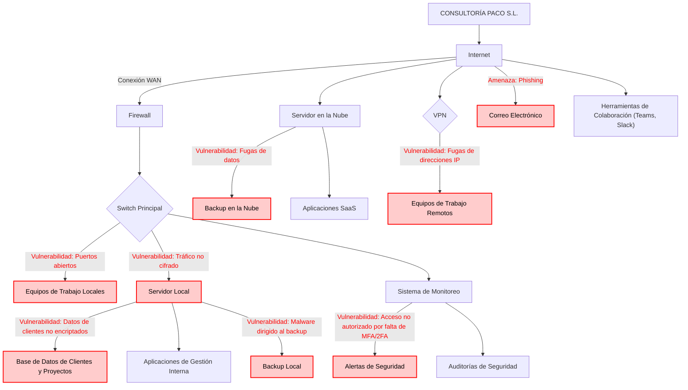

# UNIDAD 1: Desarrollo de planes de prevención y concienciación en ciberseguridad

## Apartado 1: Diseño de una empresa ficticia

>Deberás efectuar las siguientes tareas:
>- Diseñar una empresa con un esquema sencillo de Sistemas de Información, en el que se reflejen los puntos habituales de vulnerabilidad: bases de datos, puestos de trabajo en local o en remoto, conmutadores, servidores, etc.
>- El diseño deberá ser imaginativo para que se puedan tratar los temas relevantes en una auditoría de prevención.

---

## Apartado 2: Detalle de los puntos vulnerables del puesto de trabajo que se deberán tener en cuenta

>Deberás efectuar las siguientes tareas. Se puede presentar desglosado por apartados o todo junto (elemento->escenario->medida, etc.), siendo la extensión total de este apartado unas 2-3 páginas aproximadamente:
>- Tomando el diseño del apartado anterior, efectuar una labor de inventariado de todos los elementos esenciales para el negocio (activos): hardware, software, comunicaciones, instalaciones, datos y personas, que se desea incluir (de media a una página).
>- A continuación, identificar escenarios de riesgo de los elementos esenciales anteriormente indicados (entre 8-15 escenarios, aunque el listado anterior sea superior).
>- Para cada escenario de riesgo, plantear una medida de seguridad adaptada.

De acuerdo con el esquema presentado en el [apartado 1](#apartado-1-diseño-de-una-empresa-ficticia), el desglose de los activos mencionados según su categoría es el siguiente:

- **Hardware**
	- **Servidor local**.
	- **Equipos de trabajo locales y remotos** (incluyendo tanto ordenadores como dispositivos móviles).
	- **Switch principal**.
	- **Firewall** (físico).

- **Software**
	- **Aplicaciones de gestión interna**: ERPs, CRMs, etc.
	- **Aplicaciones SaaS**: Aplicaciones de terceros como Office 365 o Google Workspace).
	- **Sistemas de monitoreo**: Esto incluye a las auditorías de seguridad y a las alertas de seguridad.
	- **Servidor en la nube**: Servicio basado en software que se ejecuta sobre infraestructura de hardware. La distinción entre software y hardware en el contexto de la nube puede ser un poco difusa, pero lo clasifico como software ya que no está físicamente en las oficinas de la empresa.

- **Comunicaciones**
	- **VPN**.
	- **Internet**.
	- **Correo electrónico** (también podría catalogarse como software).
	- **Herramientas de colaboración** (también podrían catalogarse como software).

- **Instalaciones** (no especificadas en el esquema)
	- **Centro de datos local**: Instalaciones físicas donde se encuentran los servidores que alojan la base de datos local de clientes y proyectos y las aplicaciones de gestión interna.
	- **Oficinas**: Espacios de trabajo para los empleados locales.
	- **Sistemas de climatización y energía**: Infraestructura que mantiene la operación de los servidores y los equipos de los trabajadores locales.

- **Datos**
	- **Base de datos de clientes y proyectos**: Información crítica sobre los clientes y contratos en curso.
	- **Datos de la empresa**: Información sensible sobre los empleados, las finanzas de la empresa y los clientes y proveedores.
	- **Datos en la nube**: Almacenamiento de datos y backups en servidores externos.

- **Personas** (no especificadas en el esquema)
	- **Auditores de seguridad**: Realizan las auditorías de seguridad.
	- **Equipo de TI**: Encargado de la gestión de sistemas, redes y seguridad. Trabajan en remoto.
	- **Empleados de administración**: Gestionan clientes, proyectos y finanzas. Usan sistemas de monitoreo, aplicaciones SaaS y aplicaciones de gestión interna.
	- **Socios y proveedores**: Acceden a partes del sistema para servicios de soporte o integración.

Ahora que tenemos el inventario de los activos de la empresa clasificados por categoría, identificamos posibles escenarios de riesgo de los elementos esenciales anteriormente indicados:

1. **Fallo en el servidor local**. Puede ocasionar una pérdida de acceso a datos y aplicaciones internas, interrumpiendo la operación. Para prevenirlo, podemos activar backups automáticos diarios.
2. **Fuga de datos en el backup de la nube**. Puede darse durante la transferencia de datos, lo que puede llevar a que datos sensibles sean expuestos. Para mitigar este riesgo, podemos configurar el cifrado de los datos para prevenir cualquier posible fuga durante el proceso de respaldo. También es importante contemplar otras medidas, como la correcta configuración del firewall o restringir los accesos por VPN.
3. **Fugas de direcciones IP**. La incorrecta configuración de la VPN de la empresa genera fugas de IP, lo cual expone la ubicación real del usuario. Para solucionar este problema, podemos cambiar al uso de una VPN de alta calidad y confiable que tenga funciones avanzadas de seguridad, como cifrado robusto y protocolos seguros. También es importante que el proveedor de VPN no almacene logs para evitar cualquier fuga por su parte.
4. **Ataque de phishing en el correo electrónico**. Esto puede conllevar la revelación de información confidencial y sensible, la cual se puede usar por un ciberdelincuente con un fin perjudicial para la empresa. Para evitar esto, es esencial impartir una formación constante a los empleados sobre detección de correos fraudulentos y software de análisis de correos.
5. **Puertos abiertos en equipos de trabajo locales**. Permiten conexiones de red entrantes y salientes, lo que implica que los atacantes accedan a los equipos de la empresa y puedan, por ejemplo, escanear la red y mapear los servicios en ejecución. Para prevenirlo, se tienen que cerrar los puertos no necesarios y escanear regularmente los puertos en uso para minimizar la superficie de ataque.
6. **Tráfico no cifrado en el servidor local**. Los datos transmitidos pueden ser interceptados y leídos por atacantes, especialmente en el entorno de red de una empresa. Esto implica que un ataque intercepte la información entre el servidor y el cliente con el fin de modificarla o usarla a su favor. Como solución, podemos implementar un protocolo de cifrado TLS para asegurar que los datos sean transmitidos de forma cifrada.
7. **Acceso no autorizado por falta de 2FA/MFA al sistema de monitoreo**. Sin estas medidas de seguridad en el acceso al sistema de monitoreo, las auditorías de seguridad y las alertas de seguridad quedan vulnerables al acceso no autorizado. Para prevenir esto, es esencial la implementación de autenticación multifactor (MFA) o autenticación en dos pasos (2FA) para evitar que una persona pueda acceder al sistema con las credenciales básicas de un empleado de Consultoría Paco S.L.
8. **Datos sensibles de clientes no cifrados en la base de datos de clientes y proyectos**. Cualquier acceso no autorizado, tanto interno como externo, podría resultar en la exposición de información confidencial, lo cual es un riesgo importante en términos de seguridad y cumplimiento normativo. Para proteger esta información, se tendría que implantar un algoritmo de cifrado robusto en la base de datos. Adicionalmente, se puede implementar un sistema seguro de gestión de claves de cifrado que controle y proteja las claves utilizadas para el cifrado de los datos.

A su vez, se pueden dar los siguientes escenarios de riesgo a partir de los activos con los que cuenta la empresa, los cuales no están explícitamente detallados en el esquema.

9. **Pérdida o robo de dispositivos móviles**. Esto conlleva la exposición de información corporativa, por lo que es conveniente habilitar el cifrado de datos en dispositivos móviles y activar la capacidad de borrado remoto.
10. **Fallo en el sistema de backup**. Significa la imposibilidad de restaurar la información de la empresa. Como medida, es importante verificar y probar periódicamente los backups, así como tener sistemas de copia local y en la nube.
11. **Sobrecarga en la red local por tráfico malicioso**. Puede darse por ataques DDoS que saturan la red e impiden el acceso a servicios. Para prevenirlo, es importante Implementar firewalls con protección DDoS y configurar sistemas de detección y respuestas automáticas para actuar rápidamente ante estos ataques.
12. **Fallo en el suministro eléctrico del centro de datos**. Esto puede suponer pérdida de datos y la caída de los servicios informáticos de la empresa. Para poder hacer frente a estas situaciones, es importante instalar sistemas de alimentación ininterrumpida (UPS) y generadores de respaldo.
13. **Falta de conciencia sobre seguridad en el personal**. Es un escenario extenso que puede derivar a multitud de riesgos, como ataques de phishing, como se ha apuntado anteriormente. Para educar al personal de la empresa sobre este ámbito y concienciar sobre la importancia de este aspecto, es necesario crear programas de formación continua sobre este ámbito, así como la concienciación de riesgos derivados de ciberataques.

---

## Apartado 3: Detalle del plan de formación y concienciación

>El Plan de formación contará al menos con los siguientes apartados (entre 2 y 5 páginas aproximadamente):
>- Objetivos.
>- Evaluación de las necesidades de formación.
>- Roles incluidos (concreción del plan).
>- Contenidos (de la formación y los criterios).
>- Asociación de roles y contenidos (adecuados a los distintos puestos de trabajo).
>- Metodologías formativas (para cada grupo, indicar contenidos, metodología y duración/periodicidad).
>- Evaluación del plan de concienciación (comprobar lo aprendido con evidencias, campañas de prácticas y ataques simulados).

### Objetivos

El plan de formación contará con los siguientes objetivos:

- **Concienciar a todos los empleados** sobre la importancia de la ciberseguridad, centrándose en la protección de la información y las herramientas digitales que utilizan en su trabajo diario.
- **Desarrollar habilidades específicas** entre los distintos grupos de empleados para garantizar la correcta implementación de las medidas de seguridad según sus funciones.
- **Garantizar el cumplimiento normativo** en términos de protección de datos, específicamente con respecto al **Reglamento General de Protección de Datos (GDPR)** y otras normativas aplicables, como la **Ley Orgánica de Protección de Datos (LOPD)** en España.
- **Reducir los riesgos** derivados de ataques cibernéticos, tales como phishing, malware, o accesos no autorizados, a través de la adopción de prácticas seguras.
- **Fomentar una cultura de ciberseguridad** en la empresa que se mantenga a lo largo del tiempo mediante formación continua y prácticas de seguridad activa.

### Evaluación de las necesidades de la formación

Para determinar las necesidades formativas, se debe realizar una evaluación previa de los niveles de conocimiento y de los riesgos asociados a cada puesto de trabajo dentro de la empresa. Entre ellos, distinguimos los siguientes:
- **Personal técnico (TI)**: Necesitan formación avanzada en ciberseguridad, detección de intrusiones, y protección de infraestructuras críticas.
- **Personal administrativo y de recursos humanos**: Se centran en el manejo seguro de datos personales y financieros.
- **Personal en remoto**: Necesitan formación específica sobre el uso seguro de las redes públicas, las VPNs, y la correcta gestión de los dispositivos móviles.
- **Alta dirección**: Necesitan formación en toma de decisiones en ciberseguridad, cumplimiento normativo y riesgos relacionados con la protección de datos.
- **Todos los trabajadores**: Deben adquirir conocimientos básicos sobre amenazas como el phishing, el uso seguro de contraseñas y la gestión de datos confidenciales.

### Roles incluidos (concreción del plan)

Los roles que identificamos para impartir la formación son los siguientes:

- **Personal de TI**.
- **Personal administrativo**.
- **Personal de recursos humanos**.
- **Personal en remoto**.
- **Alta dirección**.
- **Todos los trabajadores**.

### Contenidos (de la formación y los criterios)

La formación se adaptará a las necesidades de cada grupo, cubriendo los siguientes puntos clave:

1. **Ciberseguridad básica**:
	- Reconocimiento de correos de phishing y malware.
	- Gestión segura de contraseñas.
	- Políticas de uso de dispositivos USB y redes externas.
	- Buenas prácticas en el manejo de datos personales y corporativos.

2. **Protección de datos personales y GDPR**:
	- Manejo seguro de datos sensibles.
	- Cumplimiento con la GDPR y protección de la privacidad de los clientes y empleados.
	- Políticas de retención y eliminación de datos.

3. **Uso seguro de redes y dispositivos móviles**:
	- Conexiones seguras a través de VPN.
	- Seguridad en el uso de redes Wi-Fi públicas.
	- Cifrado de datos en dispositivos móviles y uso de aplicaciones seguras.

4. **Gestión avanzada de ciberseguridad**:
	- Gestión de firewalls, antivirus y sistemas de detección de intrusos.
	- Auditorías de seguridad de red y sistemas.
	- Implementación de políticas de acceso seguro y segmentación de red.

5. **Toma de decisiones estratégicas en seguridad**:
	- Evaluación de riesgos y gestión de incidentes.
	- Cumplimiento normativo y su impacto en la empresa.
	- Planes de recuperación ante desastres y continuidad del negocio.

### Asociación de roles y contenidos (adecuados a los distintos puestos de trabajo)

Primero se menciona el contenido y, a continuación, se procede a asociar el personal correspondiente:

- **Ciberseguridad básica**: Todos los empleados de la empresa.
- **Protección de datos personales y GDPR**: Personal administrativo y de recursos humanos.
- **Uso seguro de redes y dispositivos móviles**: Personal en remoto.
- **Gestión avanzada de ciberseguridad**: Personal de TI.
- **Toma de decisiones estratégicas en seguridad**: Alta dirección.

### Metodologías formativas

El plan de formación utilizará diferentes enfoques según el grupo objetivo, con duración y periodicidad variables:

- **Cursos presenciales y online**: Para la alta dirección y el equipo de TI, se realizarán formaciones presenciales con expertos externos, mientras que el resto de empleados podrá acceder a módulos formativos online.
	- **Duración**: 2-3 horas para sesiones iniciales.
	- **Periodicidad**: Trimestral.
	- **Metodología**: Teoría, estudios de caso y ejercicios prácticos.

- **Seminarios de concienciación**: Los usuarios generales y personal administrativo recibirán sesiones más breves, tanto online como presenciales, con el foco en concienciación sobre riesgos comunes como phishing y malware.
	- **Duración**: 1-2 horas.
	- **Periodicidad**: Semestral.
	- **Metodología**: Presentaciones interactivas, ejemplos reales y ejercicios prácticos.

- **Simulaciones y ejercicios de phishing**: Se utilizarán ejercicios prácticos, como campañas simuladas de phishing, para medir la respuesta de los empleados ante amenazas reales.
	- **Duración**: 1-2 horas.
	- **Periodicidad**: Trimestral.
	- **Metodología**: Simulaciones controladas y análisis posterior de resultados.

- **Talleres de seguridad**: Los talleres estarán diseñados para personal en remoto y se centrarán en la implementación de prácticas seguras en dispositivos móviles y el uso de VPN.
	- **Duración**: 2-3 horas.
	- **Periodicidad**: Anual.
	- **Metodología**: Prácticas guiadas y configuraciones seguras.

### Evaluación del plan de concienciación

Para medir la efectividad del plan de formación y concienciación, se aplicarán las siguientes técnicas:

- **Evaluaciones iniciales y finales**: Cada empleado deberá realizar una evaluación al inicio y al final de cada curso formativo, midiendo el nivel de conocimiento adquirido.
- **Simulaciones de ataques**: Se llevarán a cabo simulaciones periódicas, como campañas de phishing, para comprobar la respuesta de los empleados y medir la mejora en la detección de amenazas.
- **Campañas de prácticas**: Periódicamente se organizarán campañas internas de buenas prácticas en ciberseguridad, en las que se evaluará el cumplimiento de las políticas internas de seguridad (uso de contraseñas, manejo de datos).
- **Análisis de incidentes de seguridad**: Se hará un seguimiento de los incidentes de seguridad en la empresa y su relación con las prácticas de los empleados para ajustar el contenido formativo según las áreas de mejora detectadas.

---

## Apartado 4: Detalle de los materiales de formación y concienciación utilizados

>Describir los materiales planteados con su contenido (al **menos 3 distintos**) tanto para la fase de formación como para la de evaluación. Debe ser un material inteligible por sí solo, es decir, que sea lo que uses para formar o concienciar a tus empleados. Pueden ser consejos, carteles, emails, vídeos, cuestionarios, etc. relacionados con cualquier elemento involucrado en la ciberseguridad.

He aquí materiales adecuados tanto para la fase de formación y evaluación para formar o concienciar a los empleados de Consultoría Paco S.L.:

- [Kit de concienciación del INCIBE](https://www.incibe.es/empresas/formacion/kit-concienciacion), el cual cuenta con recursos didácticos y herramientas de entrenamiento.
- [Vídeo del INCIBE sobre un caso de éxito en una compañía farmacéutica sobre cómo desarrollar una cultura de seguridad](https://www.youtube.com/watch?v=zK34B2G2ce4).
- Una vez impartida la formación y proporcionados los dos anteriores recursos a los empleados, podemos medir el nivel de concienciación adquirido al evaluarlos con [este test de ciberseguridad para los empleados realizado por Dolbuck](https://dolbuck.net/test-ciberseguridad-empleados/).

---

## Apartado 5: Detalle de las auditorías internas de cumplimiento en prevención

>Para los elementos esenciales establecidos en el [apartado 2](#apartado-2-detalle-de-los-puntos-vulnerables-del-puesto-de-trabajo-que-se-deberán-tener-en-cuenta), comprobar si disponen de las siguientes medidas de seguridad:
>- Sistemas antimalware.
>- Procesos de gestión de permisos.
>- Procesos de cumplimiento legal (compliance).
>- Políticas de prevención de fraude y de fuga de datos.
>- Sistema de actualizaciones.
>- Sistemas de monitorización de recursos.
>
>En función del elemento a revisar, proponer la auditoría requerida junto con los indicadores de logro necesarios para Apto/No apto:
>- Test de penetración o de Hacking Ético.
>- Auditoría de red.
>- Auditoría de seguridad perimetral.
>- Auditoría web.
>- Auditoría forense.
>- Auditoría legal.
>
>Decidir qué sistema (Esquema de Mejora Continua o Modelo de Madurez) se deberá aplicar para garantizar que los resultados de la auditoría tengan como fin la implantación continua de mejoras en materia de ciberseguridad y la consecución de los diferentes niveles de seguridad.

A continuación, se comprueba si los elementos esenciales del sistema de TechCorp Solutions disponen de las medidas de seguridad necesarias y se propone la auditoría requerida para cada caso junto con los indicadores de logro necesarios para determinar si los controles son aptos o no.

1. **EQUIPOS DE TRABAJO (LOCALES Y REMOTOS).**

	**Medidas de seguridad**:
	- ✅ Sistemas antimalware.
	- ✅ Procesos de gestión de permisos.
	- ❌ Procesos de cumplimiento legal (compliance).
	- ❌ Políticas de prevención de fraude y de fuga de datos.
	- ✅ Sistema de actualizaciones.
	- ❌ Sistemas de monitorización de recursos.

	**Auditoría requerida**:
	- **Auditoría de seguridad perimetral** para verificar la efectividad del antimalware, gestión de permisos, y la aplicación de actualizaciones.

	**Indicadores de logro**:
	- **Apto**: El equipo cuenta con protección antimalware activa, permisos ajustados a las necesidades de cada usuario, y un sistema de actualizaciones automático habilitado.
	- **No apto**: Antimalware desactivado, permisos sin restricciones adecuadas, o falta de actualizaciones regulares, lo que deja el equipo expuesto a vulnerabilidades.

2. **FIREWALL.**

	**Medidas de seguridad**:
	- ❌ Sistemas antimalware.
	- ✅ Procesos de gestión de permisos.
	- ✅ Procesos de cumplimiento legal (compliance).
	- ✅ Políticas de prevención de fraude y de fuga de datos.
	- ✅ Sistema de actualizaciones.
	- ❌ Sistemas de monitorización de recursos.

	**Auditoría requerida**:
	- **Auditoría de seguridad perimetral** para evaluar la configuración de políticas de acceso, cumplimiento legal, y protección frente a fuga de datos.

	**Indicadores de logro**:
	- **Apto**: El firewall cuenta con políticas de acceso seguras, cumple con normativas legales y tiene reglas efectivas de prevención de fugas de datos. Además, las actualizaciones están automatizadas.
	- **No apto**: Configuración de acceso inadecuada, falta de cumplimiento con normativas legales, o reglas de prevención de fugas no implementadas correctamente.

3. **SISTEMA DE MONITOREO.**

	**Medida de seguridad**:
	- ❌ Sistemas antimalware.
	- ✅ Procesos de gestión de permisos.
	- ✅ Procesos de cumplimiento legal (compliance).
	- ✅ Políticas de prevención de fraude y de fuga de datos.
	- ✅ Sistema de actualizaciones.
	- ✅ Sistemas de monitorización de recursos.

	**Auditoría requerida**:
	- **Auditoría de seguridad perimetral** para evaluar la configuración de las políticas de acceso y la efectividad del sistema de monitoreo en la detección de actividades sospechosas.

	**Indicadores de logro**:
	- **Apto**: El sistema de monitoreo está configurado correctamente, con políticas de acceso adecuadas, actualizado regularmente y con reglas para detectar actividades inusuales o fuga de datos.
	- **No apto**: El sistema de monitoreo no está funcionando correctamente, carece de políticas de acceso o no está actualizado, lo que impide la detección adecuada de amenazas.

4. **CORREO ELECTRÓNICO.**

	**Medida de seguridad**:
	- ✅ Sistemas antimalware.
	- ✅ Procesos de gestión de permisos.
	- ✅ Procesos de cumplimiento legal (compliance).
	- ✅ Políticas de prevención de fraude y de fuga de datos.
	- ✅ Sistema de actualizaciones.
	- ✅ Sistemas de monitorización de recursos.

	**Auditoría requerida**:
	- **Auditoría de red** para revisar la seguridad de la infraestructura de red que soporta el sistema de correo electrónico y garantizar que no existan vulnerabilidades a nivel de comunicación.

	**Indicadores de logro**:
	- **Apto**: El sistema de correo electrónico cuenta con protección antimalware activa, políticas de acceso adecuadas, filtros de phishing eficaces, actualizaciones regulares y protocolos de seguridad de red implementados correctamente.
	- **No apto**: Falta de protección antimalware, acceso sin restricciones, ausencia de filtros para phishing, falta de actualización o vulnerabilidades en la infraestructura de red que podrían poner en riesgo los datos.

5. **APLICACIONES DE GESTIÓN INTERNA.**

	**Medida de seguridad**:
	- ✅ Sistemas antimalware.
	- ✅ Procesos de gestión de permisos.
	- ✅ Procesos de cumplimiento legal (compliance).
	- ✅ Políticas de prevención de fraude y de fuga de datos.
	- ✅ Sistema de actualizaciones.
	- ✅ Sistemas de monitorización de recursos.

	**Auditoría requerida**:  
	- **Auditoría de seguridad perimetral** para evaluar la seguridad de la infraestructura de la aplicación y garantizar que las conexiones entre la aplicación y los sistemas externos estén protegidas adecuadamente.

	**Indicadores de logro**:
	- **Apto**: Las aplicaciones de gestión interna están protegidas por antimalware, cuentan con políticas de acceso adecuadas, cumplen con las normativas legales aplicables, están actualizadas y son monitoreadas de forma proactiva.
	- **No apto**: Las aplicaciones presentan vulnerabilidades en su infraestructura, acceso no autorizado, no cumplen con normativas de seguridad, o no están protegidas adecuadamente por medidas como el antimalware y la actualización regular.

6. **APLICACIONES SaaS.**

	**Medida de seguridad**:
	- ✅ Sistemas antimalware.
	- ✅ Procesos de gestión de permisos.
	- ✅ Procesos de cumplimiento legal (compliance).
	- ✅ Políticas de prevención de fraude y de fuga de datos.
	- ✅ Sistema de actualizaciones.
	- ✅ Sistemas de monitorización de recursos.

	**Auditoría requerida**:
	- **Auditoría legal** para verificar que las aplicaciones SaaS cumplen con las normativas de protección de datos (como GDPR, CCPA, etc.) y los acuerdos de nivel de servicio (SLA) de seguridad proporcionados por el proveedor de SaaS.

	**Indicadores de logro**:
	- **Apto**: Las aplicaciones SaaS cumplen con las normativas de protección de datos y están cubiertas por contratos de seguridad adecuados con el proveedor.
	- **No apto**: Las aplicaciones SaaS no cumplen con las normativas de seguridad o protección de datos, carecen de medidas adecuadas para prevenir fraudes y fugas de datos.

7. **SERVIDOR LOCAL.**

	**Medida de seguridad**:
	- ✅ Sistemas antimalware.
	- ✅ Procesos de gestión de permisos.
	- ✅ Procesos de cumplimiento legal (compliance).
	- ✅ Políticas de prevención de fraude y de fuga de datos.
	- ✅ Sistema de actualizaciones.
	- ✅ Sistemas de monitorización de recursos.

	**Auditoría requerida**:
	- **Test de penetración (Hacking Ético)** para evaluar las vulnerabilidades del servidor local mediante un enfoque proactivo, simulando posibles ataques externos para identificar fallos en la seguridad y en los mecanismos de protección.

	**Indicadores de logro**:
	- **Apto**: No se identifican vulnerabilidades significativas en el test de penetración.
	- **No apto**: Durante el test, se identifican riesgos críticos que comprometen la seguridad de los datos alojados en el servidor.

8. **BASE DE DATOS DE CLIENTES Y PROYECTOS.**

	**Medida de seguridad**:
	- ❌ Sistemas antimalware.
	- ✅ Procesos de gestión de permisos.
	- ✅ Procesos de cumplimiento legal (compliance).
	- ✅ Políticas de prevención de fraude y de fuga de datos.
	- ✅ Sistema de actualizaciones.
	- ✅ Sistemas de monitorización de recursos.

	**Auditoría requerida**:
	- **Auditoría forense** para investigar accesos no autorizados o manipulación de datos en la base de datos, revisar logs de acceso, transacciones realizadas, y determinar posibles fugas de datos.

	**Indicadores de logro**:
	- **Apto**: No se detectan accesos no autorizados, las políticas de acceso se aplican correctamente y no se han producido alteraciones maliciosas en los datos. Los registros de auditoría muestran que todas las actividades en la base de datos están documentadas y son legítimas.
	- **No apto**: Se han detectado accesos no autorizados, alteraciones en los datos o actividades sospechosas que no se han registrado adecuadamente. Alguien ha manipulado los datos sensibles o ha extraído información de forma maliciosa.

### Sistema de mejora continua para implementación de resultados de auditoría

Para garantizar que los resultados de las auditorías se traduzcan en mejoras continuas en la ciberseguridad de TechCorp Solutions, se propone aplicar el **Esquema de Mejora Continua basado en el Ciclo PDCA (Plan-Do-Check-Act)**.

**Pasos del ciclo PDCA**:

1. **Plan (Planificar)**: Identificar áreas de mejora basadas en los resultados de la auditoría. Desarrollar un plan de acción para subsanar las deficiencias encontradas.
2. **Do (Hacer)**: Implementar las medidas correctivas o mejoras necesarias para subsanar los problemas identificados en las auditorías.
3. **Check (Verificar)**: Realizar una nueva auditoría o pruebas periódicas para verificar si las medidas correctivas implementadas han resuelto los problemas.
4. **Act (Actuar)**: Ajustar las políticas y procedimientos de seguridad en función de los resultados obtenidos en la fase de verificación. Si las medidas fueron exitosas, institucionalizarlas; si no, volver a planificar.
 
Adicionalmente, se podría aplicar el **Modelo de Madurez de la Capacidad de Ciberseguridad (C2M2)**, que permite medir el nivel de madurez de la seguridad en diferentes áreas. De esta manera, se pueden establecer metas y objetivos para alcanzar un nivel de madurez más avanzado a medida que se implementan las mejoras derivadas de las auditorías.

**Niveles de madurez**:

1. Inicial.
2. Repetible.
3. Definido.
4. Gestionado.
5. Optimizado.

**Objetivo**: Alcanzar un nivel de madurez "Optimizado", donde las mejores prácticas de seguridad estén completamente integradas y la organización esté en constante evolución y adaptación frente a nuevas amenazas.