# TAREA Unidad 1: Aplicación de metodologías de análisis forenses

## Índice

- [Caso práctico](#caso-práctico)
	- [Detalles](#detalles)
	- [Ficheros](#ficheros)
- [¿Qué te pedimos que hagas?](#qué-te-pedimos-que-hagas)
	- [Apartado 1. Analiza la memoria RAM](#apartado-1-analiza-la-memoria-ram)
	- [Apartado 2. Preguntas del juez.](#apartado-2-preguntas-del-juez)
		- [¿Qué sistema operativo estaba en ejecución?](#qué-sistema-operativo-estaba-en-ejecución)
		- [¿Qué usuario estaba activo durante la sesión?](#qué-usuario-estaba-activo-durante-la-sesión)
		- [¿Se observan procesos sospechosos en ejecución?](#se-observan-procesos-sospechosos-en-ejecución)
		- [¿Cuáles son los PID de: FTK Imager, Notepad, Microsoft Edge (principal con varias pestañas)?](#cuáles-son-los-pid-de-ftk-imager-notepad-microsoft-edge-principal-con-varias-pestañas)
		- [¿Qué revela el historial de navegación? ¿Qué se estaba buscando en GitHub?](#qué-revela-el-historial-de-navegación-qué-se-estaba-buscando-en-github)
		- [¿Cuál es la IP del dispositivo?](#cuál-es-la-ip-del-dispositivo)
		- [¿Qué conexiones se encontraban activas?](#qué-conexiones-se-encontraban-activas)
		- [¿Qué tarea o asignatura parece haber motivado la instalación de software?](#qué-tarea-o-asignatura-parece-haber-motivado-la-instalación-de-software)
		- [¿Qué contiene el archivo `importante.zip`? ¿Es malicioso? ¿Cuál es la contraseña del `archivo.zip`?](#qué-contiene-el-archivo-importantezip-es-malicioso-cuál-es-la-contraseña-del-archivozip)
		- [¿Qué imágenes fueron extraídas del volcado?](#qué-imágenes-fueron-extraídas-del-volcado)
		- [¿Se puede extraer algún hobby del usuario?](#se-puede-extraer-algún-hobby-del-usuario)
		- [¿Algún proceso sospechoso tenía conexiones establecidas?](#algún-proceso-sospechoso-tenía-conexiones-establecidas)
- [Resultado](#resultado)
	- [Calificación](#calificación)
	- [Comentarios de retroalimentación y rúbrica](#comentarios-de-retroalimentación-y-rúbrica)

<br>

## Caso práctico

### Detalles

La Brigada de Delitos Telemáticos de la Policía Nacional ha intervenido un equipo informático durante una operación contra delitos informáticos. El equipo pertenece a Víctor R., un estudiante universitario de informática, sospechoso de estar involucrado en actividades maliciosas mediante software remoto. Durante la incautación se realizó un volcado completo de la memoria RAM del sistema operativo Windows 10 que se encontraba activo en ese momento.

El juzgado de instrucción Nº 4 ha solicitado un análisis forense completo del volcado de memoria. Se requiere que el informe permita determinar si el equipo fue utilizado para actividades ilícitas, así como comprender el contexto de uso del sistema y si existen elementos relevantes que puedan suponer un riesgo o constituir delito.

El juez ha planteado una serie de preguntas clave que servirán como guía para el análisis técnico. Como peritos forenses, tu misión será responder con claridad y detalle estas cuestiones a partir de la evidencia digital obtenida y elaborar un informe forense completo, estructurado y reproducible.

### Ficheros

El artefacto disponible para el análisis es [este volcado de memoria RAM](https://drive.google.com/file/d/1eXKMT1JJ4Hs-tKa8yfg7KLuSqdcsCiDK/view?usp=sharing).

## ¿Qué te pedimos que hagas?

### Apartado 1. Analiza la memoria RAM

>[!NOTE]
>Lo ideal es usar la herramienta [Volatility](https://volatilityfoundation.org/).
>- Debes de ejecutar Volatility desde consola ya sea en Windows o Linux.
>- Guías de vídeo que pueden ayudar en el proceso:
>	- [VOLATILITY // Cómo hacer un análisis de memoria y determinar si una maquina está infectada](https://www.youtube.com/watch?v=RFYbevw6hxI).
>	- [Encontrando Secretos en la memoria del computador con Volatility Instalación No Standalone en Win10](https://www.youtube.com/watch?v=iU9mqB4h3Tg)
>- Otras herramientas que pueden ser útiles:
>	- [Floss](https://github.com/mandiant/flare-floss)
>	- [Foremost](https://github.com/gerryamurphy/Foremost)

<br>

En primer lugar, tenemos que instalar la herramienta Volatility. Para ello, seguimos los pasos indicados en el [repositorio de GitHub](https://github.com/volatilityfoundation/volatility3):

1. Instalar Python 3.8+ desde la [página oficial](https://www.python.org/downloads/).
2. Crear y activar un entorno virtual en el que instalar Volatility. En este caso, vamos a usar Volatility3.

	```bash
	# 1. Creamos el directorio en el que instalar la herramienta
	mkdir volatility3 && cd volatility3

	# 2. Creamos el entorno virtual
	python -m venv venv

	# 3. Lo activamos
	# Windows
	venv\Scripts\activate
	# macOS / Linux
	source venv/bin/activate

	# 3. Instalamos la última versión de Volatility3
	pip install volatility3
	```
3. Comprobar que Volatility se ha instalado correctamente.

	```bash
	vol -h
	```

	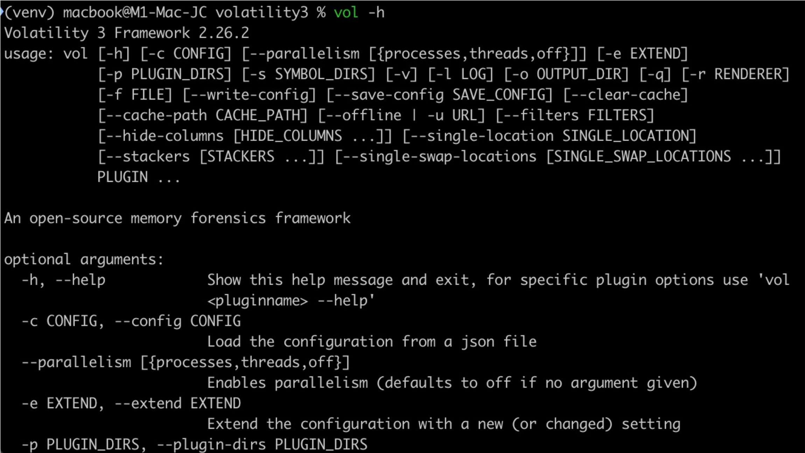
	>Guía rápida de uso de Volatility3

---

### Apartado 2. Preguntas del juez.

>[!NOTE]
>Elabora un manual en el que se indique el paso a paso para resolver el caso respondiendo a las preguntas que ha solicitado el juez. El manual debe ser lo más detallado posible, indicando los comandos utilizados y capturas de pantalla según se indica en la nota de final de página.

<br>

#### ¿Qué sistema operativo estaba en ejecución?

Para detectar el SO de la imagen, ejecutamos uno de los siguientes comandos:

```bash
# Prueba Windows
vol -f memdump.mem windows.info

# Prueba Linux
vol -f memdump.mem linux.banners

# Prueba macOS
vol -f memdump.mem mac.info
```

En primer lugar, he ejecutado el comando correspondiente a Windows, lo cual ha generado la siguiente salida:

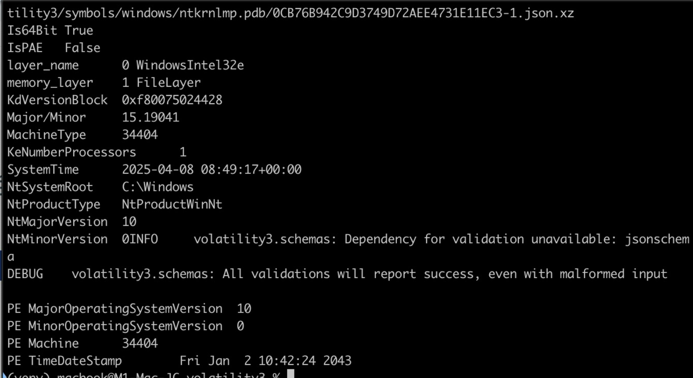
>Información del sistema operativo extraído del volcado de memoria

Como podemos observar, **Windows 10 (64 bits)** es el sistema operativo que estaba en ejecución.

<br>
<br>

#### ¿Qué usuario estaba activo durante la sesión?

Para saber el usuario activo durante la sesión, ejecutamos este comando:

```bash
# Listar procesos y localizar explorer.exe
vol -f memdump.mem windows.envars | grep USERNAME
```

Cada proceso en ejecución tiene variables de entorno. Windows almacena el nombre del usuario en la variable USERNAME.

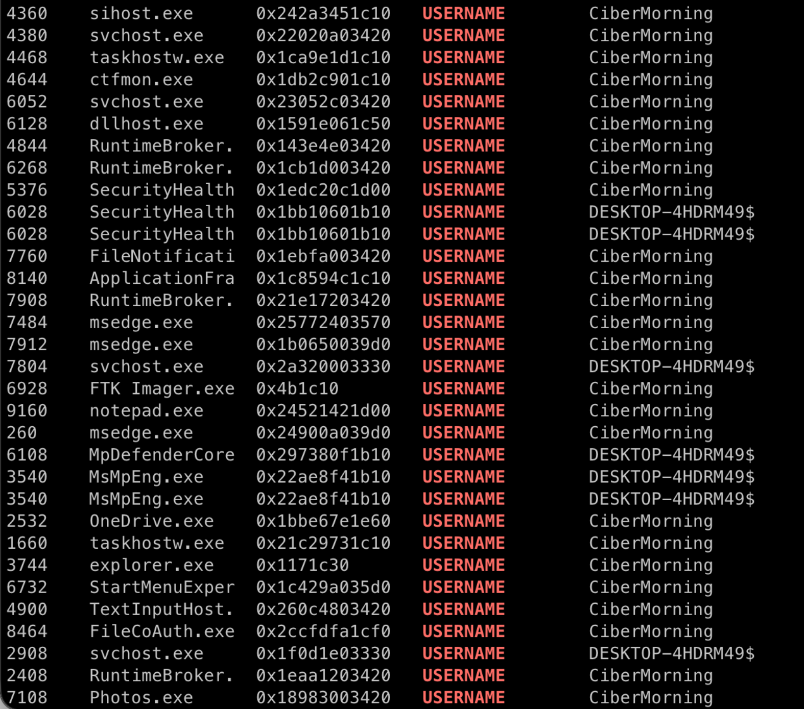
>Variables de entorno configuradas

Como podemos ver, hay procesos de usuario, como `Photos.exe` o `explorer.exe`, que pertenecen al usuario `CiberMorning`, el cual es el nombre del usuario activo durante la sesión.

<br>
<br>

#### ¿Se observan procesos sospechosos en ejecución?

Para ver la lista de procesos en ejecución, ejecutamos el siguiente comando:

```bash
vol -f memdump.mem windows.pslist
```

Al introducirlo, veremos un listado por consola de todos los procesos que estaban en ejecución. Como podemos apreciar en la siguiente imagen, vemos uno que destaca por encima del resto, el cual se llama `Virus Rat v7.0`.

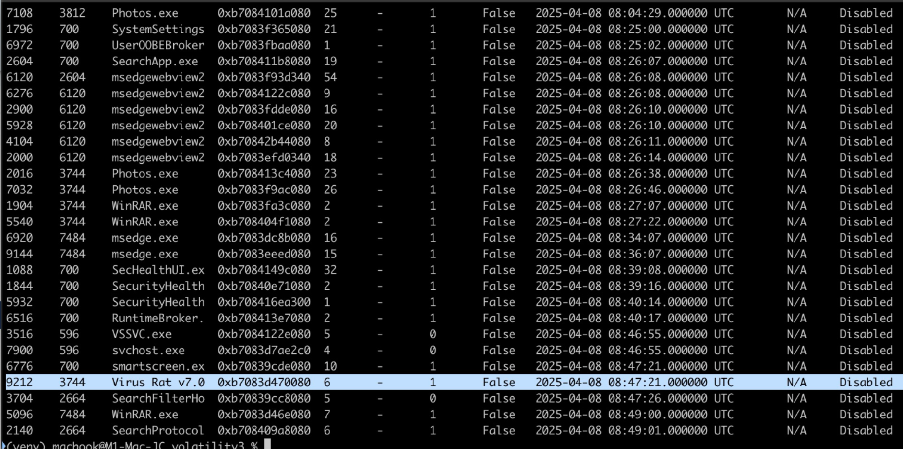
>Lista de procesos en ejecución

<br>
<br>

#### ¿Cuáles son los PID de: FTK Imager, Notepad, Microsoft Edge (principal con varias pestañas)?

Para ver el PID de FTK Imager, ejecutamos el siguiente comando:

```bash
vol -f memdump.mem windows.pslist \
  | grep 'FTK Imager' \
  | awk '{print $1, $3}'
```

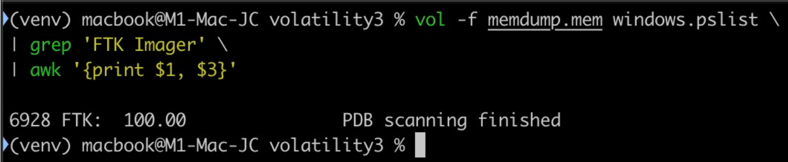
>PID FTK Imager

El PID de FTK Imager es **6928**.

<br>

Para ver el PID de Notepad, ejecutamos el siguiente comando:

```bash
vol -f memdump.mem windows.pslist \
  | grep 'notepad' \
  | awk '{print $1, $3}'
```

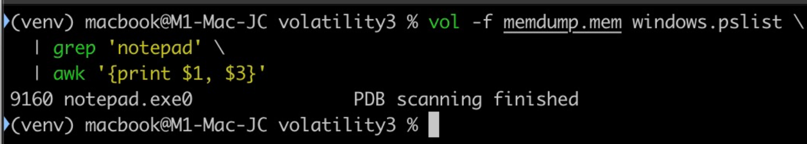
>PID Notepad

El PID de Notepad es **9160**.

<br>

Para ver la lista de procesos de Microsoft Edge con los procesos hijos, partimos del siguiente comando:

```bash
vol -f memdump.mem windows.pslist | grep 'msedge.exe'
```

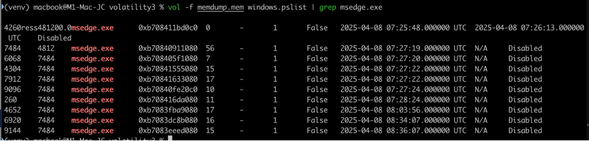
>PID Microsoft Edge

Como podemos apreciar, Microsoft Edge tiene varios PID, lo cual se debe a que los navegadores modernos basados en Chromium utilizan una arquitectura multiproceso: tienen un proceso principal y múltiples procesos secundarios para las distintas pestañas, la GPU, extensiones, etc.

Si observamos la primera columna de la salida, los PIDs que se están ejecutando bajo el nombre `msedge.exe` son:

- 4260
- 7484
- 6068
- 4304
- 7912
- 9096
- 260
- 4652
- 6920
- 9144

De todos ellos, el proceso **7484** parece ser el proceso principal de esta sesión de navegación. Si nos fijamos en la segunda columna, que corresponde al PPID, casi todos los demás procesos de Edge tienen a 7484 como su proceso padre.

<br>
<br>

#### ¿Qué revela el historial de navegación? ¿Qué se estaba buscando en GitHub?

Sabemos que el usuario usa Microsoft Edge como navegador al ver la lista de procesos. Edge guarda el historial en un archivo de base de datos SQLite llamado History. Para volcar la base de datos y analizarla, tenemos que buscar su posición en memoria con el siguiente comando:

```bash
vol -f memdump.mem windows.filescan | grep "History"
```

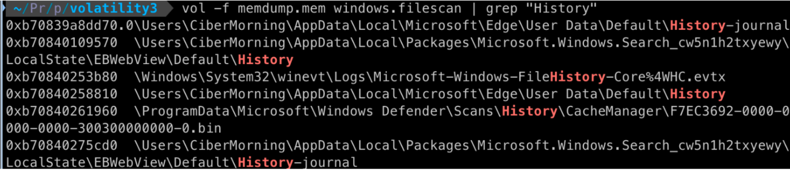
>Posición en memoria de la base de datos que contiene el historial

Ahora que tenemos la posición en memoria (0xb70840258810) del archivo que contiene el historial, procedemos a volcarlo con este comando:

```bash
vol -f memdump.mem windows.dumpfiles --virtaddr 0xb70840258810
```

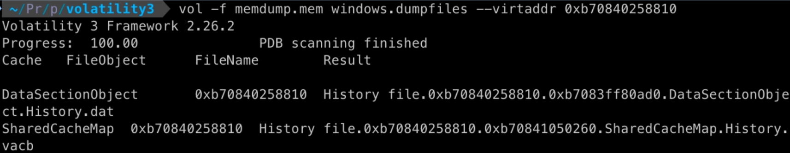
>Volcado de la base de datos

Tenemos dos archivos, pero nos tenemos que fijar en el archivo `.dat`, el cual es realmente un archivo `.sqlite`. Por lo tanto, renombramos el archivo a `.sqlite` para poder abrirlo con un visor de base de datos.

```bash
mv file.0xb70840258810.0xb7083ff80ad0.DataSectionObject.History.dat historial.sqlite
```

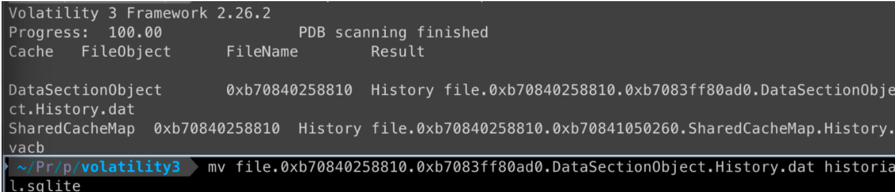
>Renombre del archivo de la base de datos

Por último, abrimos el archivo `.sqlite`. con un programa. En este caso, usaré [TablePlus](https://tableplus.com/). Al abrirlo, veremos muchos caracteres "raros", pero si filtramos por `https://`, nos encontraremos los sitios web que el usuario ha visitado, los cuales son los siguientes:

```
https://github.com/Cryakl/Ultimate-RAT-Collection (acceso a un repositorio de GitHub que cuenta con más de 500 troyanos)
https://github.com/Cryakl/Ultimate-RAT-Collectionapplication/x-zip-compressedapplication/zip (descarga del .zip disponible en el repositorio)
https://www.bing.com/search?q=juegos%20ps5&qs=n&form=QBRE&sp=-1&ghc=1&lq=0&pq=juegos%20ps5&sc=12-10&sk=&cvid=657BA7CEA6DF41B0B034FD34548DBB7Aimage/jpegimage/jpeg (“juegos de PS5” en Bing)
https://www.bing.com/search?qs=AS&pq=spiderman&sk=CSYN1&sc=13-9&pglt=2083&q=spiderman&cvid=d3480911402849bba8373cead8d1791d&gs_lcrp=EgRlZGdlKgYIARAAGEAyBggAEEUYOTIGCAEQABhAMgYIAhAuGEAyBggDEAAYQDIGCAQQABhAMgYIBRAAGEAyBggGEAAYQDIGCAcQABhAMgYICBAAGEDSAQkyMDYyNWowajGoAgiwAgE&FORM=ANSPA1&PC=U531 (“spiderman” en Bing)
https://www.winrar.es/descargas/103/descargar-winrar-para-windows-x64-en-espanol (página de descarga de Winrar)
https://drive.usercontent.google.com/download?id=16q8UnGC9gF4tktko17G4sHuvy9CUflSG&export=download (enlace a Drive para descargar el archivo AccessData_FTK_Imager_4.5.0_(x64).exe)
```

Como podemos apreciar, el usuario buscó un recopilatorio de troyanos en GitHub, los cuales terminó descargando y ejecutando, tal y como vimos en el apartado de procesos sospechosos en ejecución.

<br>
<br>

#### ¿Cuál es la IP del dispositivo?

Para consultar la IP del dispositivo, ejecutamos el siguiente comando:

```bash
vol -f memdump.mem windows.netscan
```

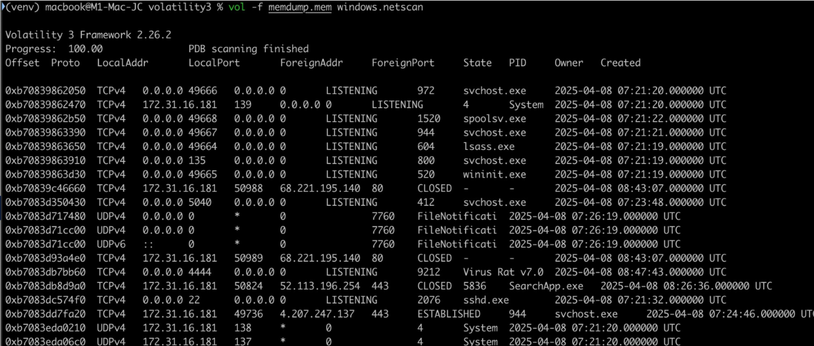
>IP del dispositivo junto a las conexiones

Como podemos ver en la columna `LocalAddr`, la dirección IP del dispositivo es `172.31.16.181`.

<br>
<br>

#### ¿Qué conexiones se encontraban activas?

Aprovechando el mismo comando visto en el apartado anterior, podemos consultar las conexiones activas añadiendo `grep ESTABLISHED`:

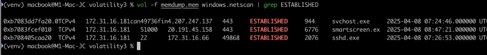
>Conexiones activas

<br>
<br>

#### ¿Qué tarea o asignatura parece haber motivado la instalación de software?

Como sabemos que el usuario tenía el bloc de notas abierto, podemos hacer un volcado del contenido del archivo para, posteriormente, buscar la palabra "tarea":

```bash
vol -f memdump.mem windows.memmap --dump --pid 9160
```

Ahora que tenemos el archivo, buscamos la palabra "tarea". Como estoy en macOS y no tengo acceso al programa , voy a ejecutar el siguiente código de Python en la terminal:

```bash
python3 -c "import re; print('\n'.join([m.decode('utf-16le') for m in re.findall(b'(?:[\x20-\x7e]\x00){4,}', open('pid.9160.dmp','rb').read())]))" | grep -i "tarea" -C 5
```

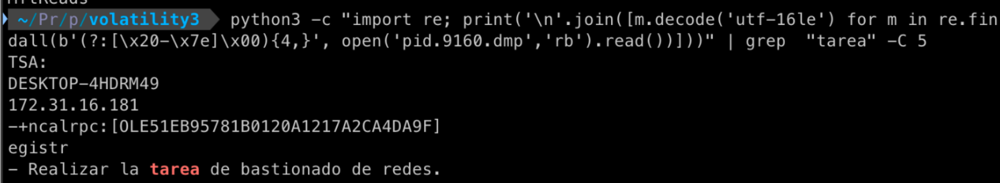
>Resultado de la búsqueda

A través de esta salida, observamos que el usuario tenía anotado realizar una tarea de bastionado de redes.

Esta asignatura o tarea académica justifica de manera clara y directa la instalación y descarga de las herramientas encontradas durante la investigación:
- **Ultimate-RAT-Collection**: Para realizar prácticas de bastionado y comprobar la eficacia de las medidas de seguridad aplicadas en un sistema, es habitual simular ataques controlados utilizando malware real, como troyanos de acceso remoto o RATs.
- **WinRAR**: Herramienta necesaria para poder descomprimir el repositorio de troyanos descargado desde GitHub.
- **FTK Imager**: Es una herramienta fundamental en el análisis forense digital. Su instalación indica que, como parte de la práctica, el estudiante probablemente debía realizar un volcado de la memoria RAM o del disco duro para analizar los artefactos dejados por el troyano, o bien documentar el estado del sistema antes y después de la infección.

Por lo tanto, la descarga de software de administración remota y de herramientas de análisis forense responde a los requisitos de un entorno de pruebas para una práctica académica de ciberseguridad.

<br>
<br>

#### ¿Qué contiene el archivo `importante.zip`? ¿Es malicioso? ¿Cuál es la contraseña del `archivo.zip`?

Para saber el contenido del archivo importante.zip, primero tenemos que obtener su dirección en memoria. Para ello, ejecutamos el siguiente comando: 

```bash
vol -f memdump.mem windows.filescan | grep "importante.zip"
```

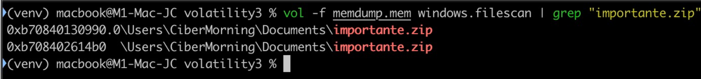
>Posición en memoria del archivo `importante.zip`

Cada línea tiene una posición en memoria diferente (`0xb70840130990` y `0xb708402614b0`). Esto indica que la información del archivo está duplicada en memoria, posiblemente porque estaba siendo usado por diferentes procesos o por la caché. A efectos prácticos, ambas son válidas.

Volcamos uno de ellos (por ejemplo, `0xb70840130990`) con el siguiente comando:

```bash
vol -f memdump.mem windows.dumpfiles --virtaddr 0xb70840130990
```

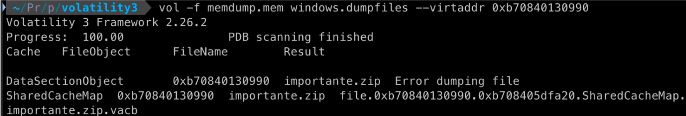
>Posición en memoria del archivo `importante.zip`

Aunque dio error al volcar el primer objeto, el archivo se extrajo correctamente a través de la caché (`SharedCacheMap`). El archivo que necesitamos es el que termina en `.vacb`. Como sabemos que está en formato `.zip`, podemos renombrarlo como `importante.zip`:

```bash
mv file.0xb70840130990.0xb708405dfa20.SharedCacheMap.importante.zip.vacb importante.zip
```

Si intentamos descomprimir el archivo, nos aparecerá un error de este estilo:

```
# Comando
unzip importante.zip

# Salida
Archive:  importante.zip
  End-of-central-directory signature not found.  Either this file is not
  a zipfile, or it constitutes one disk of a multi-part archive.  In the
  latter case the central directory and zipfile comment will be found on
  the last disk(s) of this archive.
unzip:  cannot find zipfile directory in one of importante.zip or
        importante.zip.zip, and cannot find importante.zip.ZIP, period.
```


Como podemos apreciar, el volcado del archivo desde la memoria está incompleto o corrupto. Parte del archivo podía estar en el disco y no en la RAM en el momento de la captura, o Volatility no pudo reconstruirlo perfectamente. En este caso, tendremos que tomar una vía alternativa para averiguar los contenidos del archivo. Como el usuario tenía el bloc de notas abierto, vamos a probar a buscar importante:

```bash
strings pid.9160.dmp | grep -C 5 "importante"
```

A partir de ese texto, podemos apreciar lo siguiente:

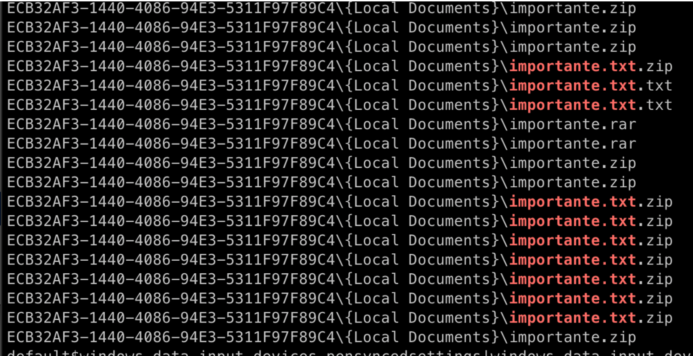
>Resultados de la búsqueda

Como podemos apreciar, el archivo `importante.zip` contiene un archivo .txt. Si buscamos más a fondo, podemos apreciar que el contenido del archivo es una flag que indica la superación de una prueba, lo cual es típico en retos como Capture The Flag:

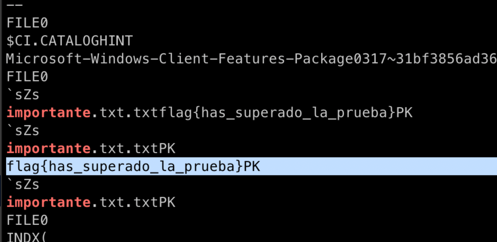
>Contenido del archivo `.txt` comprimido en `importante.zip`

Por tanto, podemos concluir que el contenido del archivo es seguro. 

Por último, nos queda obtener la contraseña del archivo `.zip`. Si filtramos por `password|pwd|contraseña|contrasenya` usando `grep`, no aparece ninguna contraseña directamente relacionada con `importante.zip`. No obstante, hay una línea que dice `PASSWORD_ZIP=ciberzip` junto a la cabecera `7zgO` que confirma que el usuario interactuó con un archivo comprimido (`.7z`/`.zip`), el cual requería una contraseña (`ciberzip`). Dado que no tenemos más evidencia, es más que probable que esta sea la contraseña del archivo `importante.zip`.

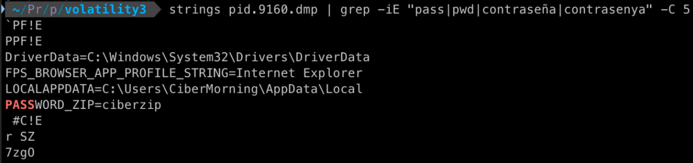
>Contraseña del archivo `importante.zip`

<br>
<br>

#### ¿Qué imágenes fueron extraídas del volcado?

Para ello, escaneamos buscando imágenes con el siguiente comando para listar todos los archivos gráficos (JPG, PNG, BMP, GIF) que Windows estaba gestionando:

```bash
vol -f memdump.mem windows.filescan | grep -iE "\.jpg|\.png|\.bmp|\.gif|\.jpeg"
```

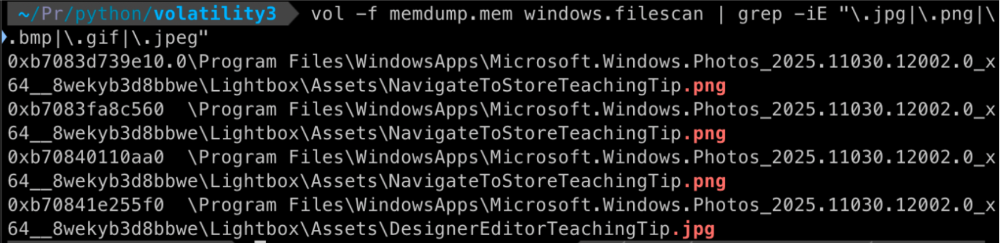

<br>
<br>

#### ¿Se puede extraer algún hobby del usuario?

Como hemos podido comprobar en las búsquedas en Microsoft Edge, al usuario le gustan los videojuegos y, probablemente, los superhéroes, ya que aparecía “Spiderman” en el historial de búsqueda. 

Por otro lado, si buscamos “Xbox” en el bloc de notas, podemos ver texto relacionado con programas relacionados con videojuegos:

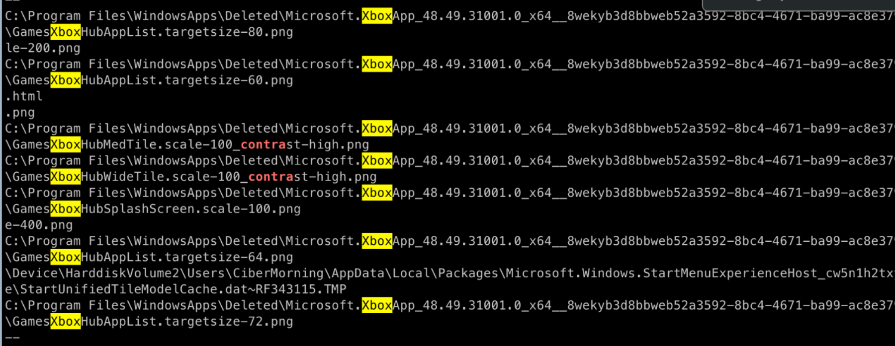

<br>
<br>

#### ¿Algún proceso sospechoso tenía conexiones establecidas?

Como sabemos por los anteriores apartados que el PID del proceso sospechoso es 9212, ejecutamos el siguiente comando para ver las conexiones del proceso:

```bash
vol -f memdump.mem windows.netscan | grep 9212
```

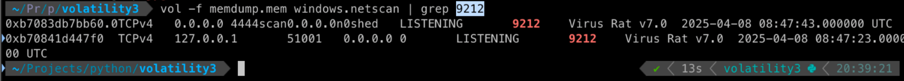
>Conexiones sospechosas

En ambas líneas, la columna de estado indica `LISTENING`, lo cual significa que el virus ha convertido el ordenador en un servidor y está esperando a que el hacker se conecte a él. Si el hacker estuviera conectado, aparecería como `ESTABLISHED`.

---

## Resultado

### Calificación

10,00 / 10,00

### Comentarios de retroalimentación y rúbrica

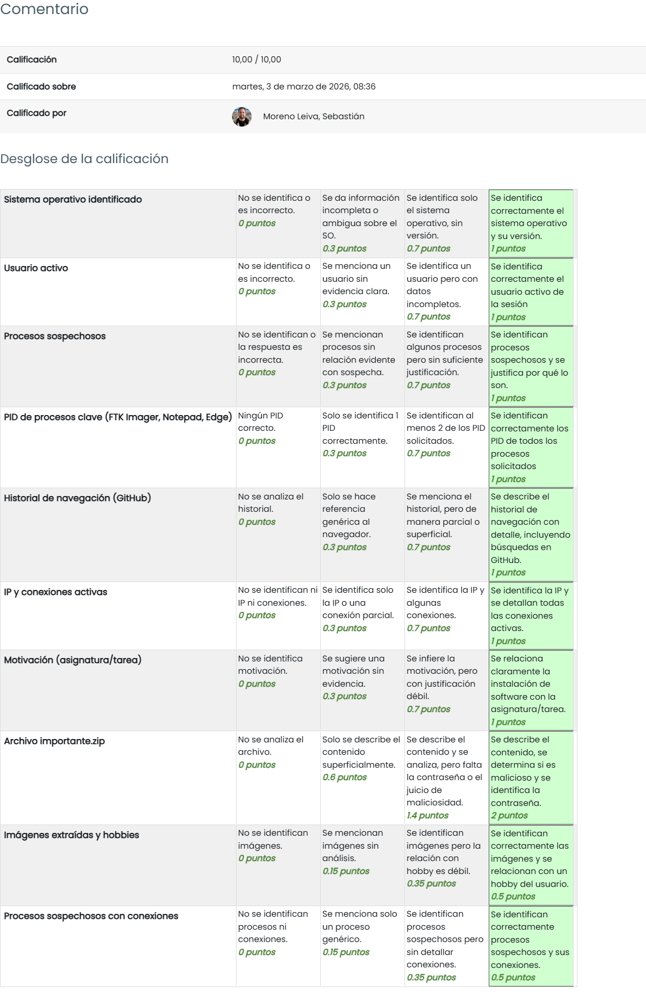
