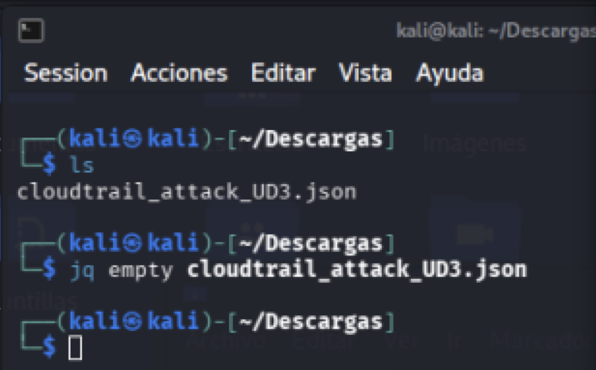
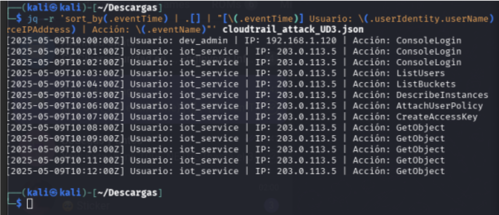
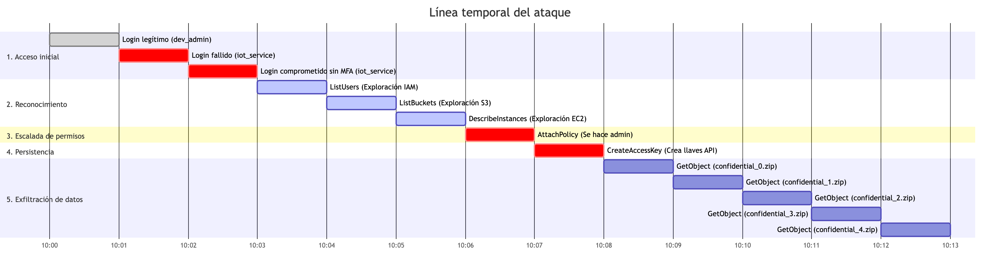
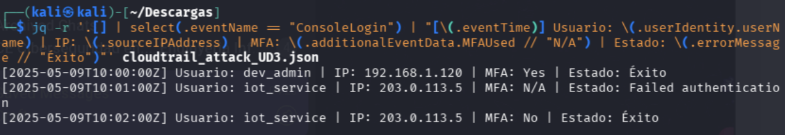
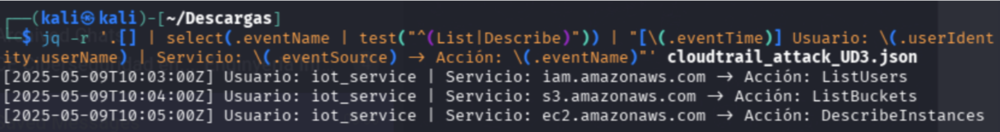
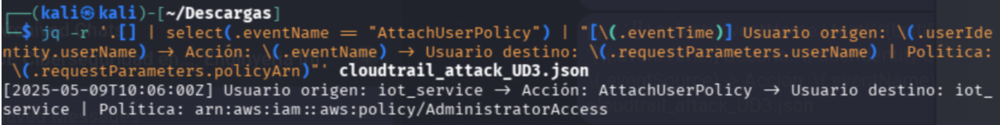
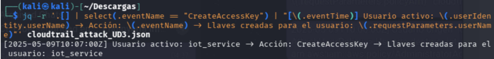
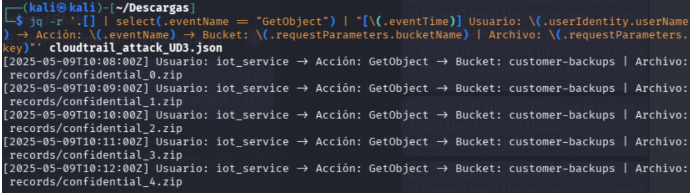
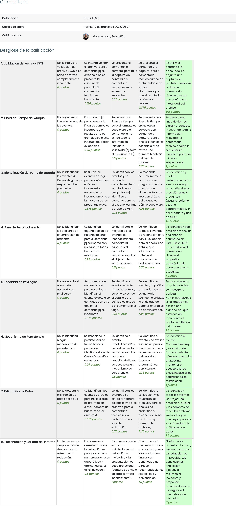

# TAREA Unidad 3: Realización de análisis forenses en Cloud

## Índice

- [Caso práctico](#caso-práctico)
- [¿Qué te pedimos que hagas?](#qué-te-pedimos-que-hagas)
	- [Fase 1: Validación y preparación](#fase-1-validación-y-preparación)
	- [Fase 2: Análisis cronológico y detección](#fase-2-análisis-cronológico-y-detección)
		- [Línea de tiempo (Timeline)](#línea-de-tiempo-timeline)
		- [Identificación del punto de entrada](#identificación-del-punto-de-entrada)
			- [¿Qué usuario es el legítimo?](#qué-usuario-es-el-legítimo)
			- [¿Qué usuario sufrió el compromiso de su cuenta?](#qué-usuario-sufrió-el-compromiso-de-su-cuenta)
			- [¿Desde qué dirección IP se originó el ataque?](#desde-qué-dirección-ip-se-originó-el-ataque)
			- [¿Se utilizó autenticación multifactor (MFA)?](#se-utilizó-autenticación-multifactor-mfa)
	- [Fase 3: Reconstrucción del ataque](#fase-3-reconstrucción-del-ataque)
		- [Reconocimiento](#reconocimiento)
		- [Escalada de privilegios](#escalada-de-privilegios)
		- [Persistencia](#persistencia)
		- [Exfiltración de datos](#exfiltración-de-datos)
- [Conclusiones finales](#conclusiones-finales)
- [Resultado](#resultado)
	- [Calificación](#calificación)
	- [Comentarios de retroalimentación y rúbrica](#comentarios-de-retroalimentación-y-rúbrica)

<br>

## Caso práctico

El pasado fin de semana, el equipo de monitorización de CloudTech Solutions detectó una serie de alertas de seguridad en su infraestructura de Amazon Web Services (AWS). El sistema de detección de intrusos (IDS) notificó accesos anómalos a la consola de administración fuera del horario laboral y desde una ubicación geográfica no habitual.

Informes preliminares sugieren que un actor de amenazas podría haber obtenido credenciales de acceso de un empleado, iniciando un movimiento lateral por el entorno cloud. Se sospecha que el atacante no solo logró elevar sus privilegios, sino que también intentó asegurar su permanencia en el sistema y, finalmente, acceder a un bucket S3 que contenía información sensible de clientes.

Tu misión: Como analista forense del SOC, se te ha entregado un volcado de eventos en formato JSON extraído de AWS CloudTrail ([cloudtrail_attack_UD3.json](cloudtrail_attack_UD3.json)). Tu objetivo es reconstruir la línea de tiempo del ataque, identificar al responsable y determinar el alcance de la exfiltración.

La resolución de esta práctica debe realizarse en una máquina Kali Linux utilizando la herramienta jq para el procesamiento de datos JSON. Deberás completar los siguientes hitos técnicos:

<br>

## ¿Qué te pedimos que hagas?

### Fase 1: Validación y preparación

>[!NOTE]
>**Apertura y validación:** Verificar la integridad del archivo JSON para asegurar que no hay errores de sintaxis que impidan el análisis.

Para comprobar la integridad de un archivo JSON, utilizamos la herramienta `jq` para procesarlo. En este caso, utilizamos el filtro `empty` para que `jq` analice todo el documento, pero no devuelva ningún resultado por consola, a no ser que el archivo tenga algún error, como una llave sin cerrar. De ser así, `jq` devolvería un mensaje de error indicando la línea y el tipo de fallo.

```bash
jq empty cloudtrail_attack_UD3.json
```


>Captura del comando ejecutado

<br>

### Fase 2: Análisis cronológico y detección

#### Línea de tiempo (Timeline)

>[!NOTE]
>Genera un listado de los eventos ordenados cronológicamente para entender la secuencia de acciones.

Para entender la secuencia del ataque, es fundamental extraer una línea de tiempo clara y ordenada cronológicamente. Dado que estás en Kali Linux, podemos usar jq para formatear los datos y extraer solo la información más relevante de cada evento: cuándo ocurrió, quién lo hizo, desde dónde y qué acción intentó.

Ejecutamos este comando:

```bash
jq -r 'sort_by(.eventTime) | .[] | "[\(.eventTime)] Usuario:
\(.userIdentity.userName) | IP: \(.sourceIPAddress) | Acción: \(.eventName) |
MFA: \(.additionalEventData.MFAUsed // "N/A")"' cloudtrail_attack_UD3.json
```

Donde:

- `-r (raw-output)`: Le dice a `jq` que devuelva el resultado como texto plano (sin comillas dobles alrededor de las cadenas) para facilitar su lectura.
- `sort_by(.eventTime)`: Esta función ordena los eventos del más antiguo al más reciente.
- `.[]`: Itera sobre cada uno de los elementos de la matriz ordenada.
- `"[\(.eventTime)]..."`: Utilizamos la interpolación de cadenas de `jq (\(campo))` para construir una línea de texto personalizada por cada evento. En este caso, usamos el tiempo, el nombre de usuario, la IP de origen, el nombre del evento y si se usó MFA al iniciar sesión. En caso de que la acción no use MFA, el valor será N/A.

Al ejecutar el comando, obtenemos una línea de tiempo clara y concisa que presenta la progresión exacta de los eventos:

```
[2025-05-09T10:00:00Z] Usuario: dev_admin | IP: 192.168.1.120 | Acción: ConsoleLogin
[2025-05-09T10:01:00Z] Usuario: iot_service | IP: 203.0.113.5 | Acción: ConsoleLogin
[2025-05-09T10:02:00Z] Usuario: iot_service | IP: 203.0.113.5 | Acción: ConsoleLogin
[2025-05-09T10:03:00Z] Usuario: iot_service | IP: 203.0.113.5 | Acción: ListUsers
[2025-05-09T10:04:00Z] Usuario: iot_service | IP: 203.0.113.5 | Acción: ListBuckets
[2025-05-09T10:05:00Z] Usuario: iot_service | IP: 203.0.113.5 | Acción: DescribeInstances
[2025-05-09T10:06:00Z] Usuario: iot_service | IP: 203.0.113.5 | Acción: AttachUserPolicy
[2025-05-09T10:07:00Z] Usuario: iot_service | IP: 203.0.113.5 | Acción: CreateAccessKey
[2025-05-09T10:08:00Z] Usuario: iot_service | IP: 203.0.113.5 | Acción: GetObject
[2025-05-09T10:09:00Z] Usuario: iot_service | IP: 203.0.113.5 | Acción: GetObject
[2025-05-09T10:10:00Z] Usuario: iot_service | IP: 203.0.113.5 | Acción: GetObject
[2025-05-09T10:11:00Z] Usuario: iot_service | IP: 203.0.113.5 | Acción: GetObject
[2025-05-09T10:12:00Z] Usuario: iot_service | IP: 203.0.113.5 | Acción: GetObject
```


>Lista de los eventos ordenados cronológicamente

A continuación, interpretamos cada evento:

<table>
	<tr>
		<th>#</th>
		<th>Evento</th>
		<th>Interpretación</th>
	</tr>
	<tr>
		<td>1</td>
		<td>
			<code>
				[2025-05-09T10:00:00Z] Usuario: dev_admin | IP: 192.168.1.120 | Acción: ConsoleLogin`
			</code>
		</td>
		<td>
			Inicio de sesión legítimo del usuario <code>dev_admin</code> desde una IP privada.
		</td>
	</tr>
	<tr>
		<td>2</td>
		<td>
			<code>[2025-05-09T10:01:00Z] Usuario: iot_service | IP: 203.0.113.5 | Acción: ConsoleLogin</code>
		</td>
		<td>
			El usuario <code>iot_service</code> intenta iniciar sesión desde una IP pública y falla. Esto se ve en el JSON: <code>"errorMessage": "Failed authentication"</code>.
		</td>
	</tr>
	<tr>
		<td>3</td>
		<td>
			<code>[2025-05-09T10:02:00Z] Usuario: iot_service | IP: 203.0.113.5 | Acción: ConsoleLogin</code>
		</td>
		<td>
			El usuario <code>iot_service</code> logra entrar. Lo más crítico aquí es el campo <code>MFAUsed: "No"</code>. El atacante ha comprometido la contraseña de una cuenta de servicio que, al no estar protegida por MFA, le permite el acceso directo a la consola de AWS.
		</td>
	</tr>
	<tr>
		<td>4</td>
		<td>
			<code>[2025-05-09T10:03:00Z] Usuario: iot_service | IP: 203.0.113.5 | Acción: ListUsers</code>
		</td>
		<td>El atacante revisa qué otros usuarios existen en la cuenta.</td>
	</tr>
	<tr>
		<td>5</td>
		<td>
			<code>[2025-05-09T10:04:00Z] Usuario: iot_service | IP: 203.0.113.5 | Acción: ListBuckets</code>
		</td>
		<td>
			El atacante enumera los repositorios de almacenamiento en busca de datos valiosos.
		</td>
	</tr>
	<tr>
		<td>6</td>
		<td>
			<code>[2025-05-09T10:05:00Z] Usuario: iot_service | IP: 203.0.113.5 | Acción: DescribeInstances</code>
		</td>
		<td>El atacante mapea la infraestructura de servidores virtuales que están corriendo.</td>
	</tr>
	<tr>
		<td>7</td>
		<td>
			<code>[2025-05-09T10:06:00Z] Usuario: iot_service | IP: 203.0.113.5 | Acción: AttachUserPolicy</code>
		</td>
		<td>
			El atacante se da cuenta de que la cuenta <code>iot_service</code> tiene permisos excesivos (probablemente un error de configuración, ya que un servicio IoT no debería poder modificar políticas IAM). Aprovecha esto para autoasignarse la política <code>AdministratorAccess</code>. A partir de este momento, el atacante tiene control total sobre toda la cuenta de AWS.
		</td>
	</tr>
	<tr>
		<td>8</td>
		<td>
			<code>[2025-05-09T10:07:00Z] Usuario: iot_service | IP: 203.0.113.5 | Acción: CreateAccessKey</code>
		</td>
		<td>El atacante, ahora siendo administrador, genera un nuevo par de llaves de acceso para persistir el ataque. Por ejemplo, si el equipo de seguridad detecta el inicio de sesión anómalo y cierra la sesión de la consola web, el atacante aún podrá seguir operando en la cuenta de forma a través de la terminal o de la API usando estas llaves.</td>
	</tr>
	<tr>
		<td>9</td>
		<td>
			<code>[2025-05-09T10:08:00Z] Usuario: iot_service | IP: 203.0.113.5 | Acción: GetObject</code>
		</td>
		<td>Ahora que el atacante cuenta con acceso total y ha persistido el ataque, pasa a la fase de robo de información. Realiza cinco peticiones <code>GetObject</code> consecutivas al bucket S3 llamado <code>customer-backups</code>. Con ello, consigue descargar los archivos <code>confidential_0.zip</code> hasta <code>confidential_4.zip</code>.</td>
	</tr>
</table>


>Línea temporal del ataque

Como podemos apreciar, estamos ante una brecha de seguridad originada por credenciales comprometidas y una mala configuración de IAM. El atacante pasó de no tener acceso a robar varias copas de seguridad confidenciales en 10 minutos.

<br>

#### Identificación del punto de entrada

>[!NOTE]
>Localiza los eventos de inicio de sesión (`ConsoleLogin`).

En esta fase, nos centramos en la táctica de descubrimiento. Una vez que el atacante `iot_service` ha logrado acceder a la cuenta, su primer paso instintivo es saber qué permisos tiene y qué infraestructura existe. En AWS, estas acciones suelen corresponder a eventos de las APIs que empiezan por `List` o `Describe`. Por tanto, pasamos a aislar exclusivamente estos eventos de reconocimiento utilizando el siguiente comando:

```bash
jq -r [] | select(.eventName == "ConsoleLogin") | "[\(.eventTime)] Usuario:
\(.userIdentity.userName) | IP: \(.sourceIPAddress) | MFA:
\(.additionalEventData.MFAUsed // "N/A") | Estado: \(.errorMessage //
"Éxito")"' cloudtrail_attack_UD3.json
```

Al ejecutarlo, obtenemos los tres intentos de acceso registrados al inicio del log:

```
[2025-05-09T10:00:00Z] Usuario: dev_admin | IP: 192.168.1.120 | MFA: Yes |
Estado: Éxito
[2025-05-09T10:01:00Z] Usuario: iot_service | IP: 203.0.113.5 | MFA: N/A |
Estado: Failed authentication
[2025-05-09T10:02:00Z] Usuario: iot_service | IP: 203.0.113.5 | MFA: No |
Estado: Éxito
Captura del comando ejecutado
¿Qué usuario es el legítimo?
El usuario legítimo es dev_admin. Esto se deduce porque realiza un inicio de sesión desde una IP
privada local (192.168.1.120) y utiliza MFA.
Evento: [2025-05-09T10:00:00Z] Usuario: dev_admin | IP: 192.168.1.120 | MFA: Yes | Estado:
Éxito
```


>Captura del comando ejecutado

<br>

##### ¿Qué usuario es el legítimo?

El usuario legítimo es `dev_admin`. Esto se deduce porque realiza un inicio de sesión desde una IP privada local (`192.168.1.120`) y utiliza MFA.

```
Evento: [2025-05-09T10:00:00Z] Usuario: dev_admin | IP: 192.168.1.120 | MFA: Yes | Estado: Éxito
```

<br>

##### ¿Qué usuario sufrió el compromiso de su cuenta?

El usuario comprometido es `iot_service`. Podemos apreciar que esta cuenta registra un intento de acceso fallido seguido de uno exitoso, para luego comenzar a ejecutar comandos de reconocimiento y robo de datos.

```
Evento: [2025-05-09T10:02:00Z] Usuario: iot_service | IP: 203.0.113.5 | MFA: No | Estado: Éxito
```

<br>

##### ¿Desde qué dirección IP se originó el ataque?

El ataque se originó desde la dirección IPI `203.0.113.5`. Como podemos ver en la línea temporal, todo el comportamiento anómalo y malicioso asociado a la cuenta `iot_service` proviene exclusivamente de esta IP.

```
Evento: [2025-05-09T10:02:00Z] Usuario: iot_service | IP: 203.0.113.5 | MFA: No | Estado: Éxito
```

<br>

##### ¿Se utilizó autenticación multifactor (MFA)?

Para el acceso legítimo del usuario `dev_admin`, sí (`MFAUsed: "Yes"`). No obstante, no fue así para el acceso del atacante, que comprometió la cuenta `iot_service` sin utilizar MFA (`MFAUsed: "No"`). Esta falta de doble factor de autenticación en la cuenta de servicio fue exactamente la vulnerabilidad que permitió al atacante acceder a la consola tras comprometer la contraseña.

```
Evento: [2025-05-09T10:02:00Z] Usuario: iot_service | IP: 203.0.113.5 | MFA: No | Estado: Éxito
```

<br>

### Fase 3: Reconstrucción del ataque

#### Reconocimiento

>[!NOTE]
>Identifica qué acciones realizó el atacante para enumerar los recursos del entorno.

En esta fase, nos centramos en la táctica de descubrimiento. Una vez que el atacante `iot_service` ha logrado acceder a la cuenta, su primer paso instintivo es saber qué permisos tiene y qué infraestructura existe. En AWS, estas acciones suelen corresponder a eventos de las APIs que empiezan por `List` o `Describe`. Por tanto, pasamos a aislar exclusivamente estos eventos de reconocimiento utilizando el siguiente comando:

```bash
jq -r '.[] | select(.eventName | test("^(List|Describe)")) | "[\(.eventTime)] Usuario: \(.userIdentity.userName) | Servicio: \(.eventSource) -> Acción: \(.eventName)"' cloudtrail_attack_UD3.json
```

Al ejecutarlo, obtenemos exactamente las acciones que el atacante usó para mapear el entorno:

```
[2025-05-09T10:03:00Z] Usuario: iot_service | Servicio: iam.amazonaws.com -> Acción: ListUsers
[2025-05-09T10:04:00Z] Usuario: iot_service | Servicio: s3.amazonaws.com -> Acción: ListBuckets
[2025-05-09T10:05:00Z] Usuario: iot_service | Servicio: ec2.amazonaws.com -> Acción: DescribeInstances
```


>Captura del comando ejecutado

El atacante ejecutó una enumeración sistemática y transversal que afectó a tres de los servicios más críticos de AWS:

- `ListUsers` (IAM): A las 10:03, el atacante explora el servicio de identidad y acceso (IAM). Su objetivo es descubrir otras cuentas de usuario, probablemente buscando quiénes son los administradores legítimos o si hay otras cuentas de servicio mal configuradas que pueda aprovechar.
- `ListBuckets` (S3): A las 10:04, obtiene información del servicio de almacenamiento (S3). Con este comando obtiene un listado de todos los repositorios de datos de la cuenta. 
- `DescribeInstances` (EC2): A las 10:05, consulta el servicio de cómputo (EC2) para listar todas las máquinas virtuales que están corriendo en la infraestructura. Esto le permite saber qué tipo de servidores maneja la empresa y sus direcciones IP para posibles ataques.

<br>

#### Escalada de privilegios

>[!NOTE]
>Localizar el momento exacto en que el atacante obtuvo permisos superiores a los iniciales.

En esta fase, el atacante trata de pasar de tener los permisos limitados de la cuenta inicial comprometida (`iot_service`) a obtener el control total del entorno. Para determinar cuándo y cómo ocurrió esto, vamos a filtrar los registros en busca de modificaciones en las políticas de acceso de IAM, concretamente del evento `AttachUserPolicy`.

Para ello, ejecutamos el siguiente comando `jq` para devolver únicamente los eventos donde la acción ejecutada sea `AttachUserPolicy`:

```bash
jq -r '.[] | select(.eventName == "AttachUserPolicy") | "[\(.eventTime)] Usuario origen: \(.userIdentity.userName) -> Acción: \(.eventName) -> Usuario destino: \(.requestParameters.userName) | Política: \(.requestParameters.policyArn)"' cloudtrail_attack_UD3.json
```

Al ejecutarlo, obtenemos exactamente las acciones que el atacante usó para la escalada de prvilegios:

```
[2025-05-09T10:06:00Z] Usuario origen: iot_service -> Acción: AttachUserPolicy -> Usuario destino: iot_service | Política: arn:aws:iam::aws:policy/AdministratorAccess
```


>Captura del comando ejecutado

Como podemos ver, el usuario `iot_service` (origen) se adjunta una política a sí mismo (destino `iot_service`). En concreto, se asigna la política `AdministratorAccess`, la cual es la política administrada de mayor nivel. Concede permisos completos sobre todos los recursos y servicios de la cuenta.

Hasta las 10:05, el atacante era un mero intruso haciendo reconocimiento. Sin embargo, debido a una vulnerabilidad de configuración excesiva de permisos (la cuenta `iot_service` tenía permisos IAM para modificar políticas, cosa que un servicio IoT nunca debería tener), el atacante logró elevar los permisos a administrador.

A partir de este momento, el atacante tiene el mismo poder que el dueño de la cuenta. Puede crear recursos, borrar infraestructuras, desactivar sistemas de seguridad y acceder a cualquier dato almacenado. Pone en compromiso total a toda la cuenta de AWS.

<br>

#### Persistencia

>[!NOTE]
>Detecta si el atacante creó nuevos usuarios, roles o llaves de acceso para mantener el control.

Una vez que un atacante consigue privilegios de administrador, el siguiente paso consiste en persistir el ataque para no perder el acceso al entorno. Esto se hace como medida preventiva en caso de que el equipo de seguridad detecte la intrusión y el atacante no pueda volver a explotar la misma vulnerabilidad.

Para detectar la actividad del atacante, ejecutamos el siguiente comando jq:

```bash
jq -r '.[] | select(.eventName == "CreateAccessKey") | "[\(.eventTime)] Usuario activo: \(.userIdentity.userName) -> Acción: \(.eventName) -> Llaves creadas para el usuario: \(.requestParameters.userName)"' cloudtrail_attack_UD3.json
```

Al ejecutarlo, obtenemos exactamente las acciones que el atacante usó para la persistencia:

```
[2025-05-09T10:07:00Z] Usuario activo: iot_service -> Acción: CreateAccessKey -> Llaves creadas para el usuario: iot_service
```


>Captura del comando ejecutado

Si el SOC detecta el inicio de sesión anómalo y reacciona rápidamente cambiando la contraseña del usuario `iot_service`, el atacante no perderá el acceso. Esto se debe a que, al ejecutar `CreateAccessKey`, AWS genera un par de credenciales. Por un lado, está el _access key ID_ (público) y un _secret access key_ (privado). Con este par de llaves guardadas en su propia máquina, el atacante puede seguir enviando comandos a la API de AWS desde su terminal sin necesidad de conectarse de nuevo a la consola web.

<br>

#### Exfiltración de datos

>[!NOTE]
>Identifica las descargas realizadas desde el servicio S3 y determina qué información fue sustraída.

Esta es la fase final del ataque. Una vez que el atacante ha obtenido privilegios máximos y ha asegurado su acceso en la fase de persistencia, su objetivo principal suele ser la monetización, que en la mayoría de los casos se traduce en el robo de información confidencial. En el entorno de AWS, la extracción de datos suele implicar el servicio de almacenamiento S3 y la acción `GetObject` (descarga de archivos).

Para rastrear exactamente qué información ha sido sustraída, vamos a filtrar los registros por descargas de archivos utilizando `jq` con el siguiente comando:

```bash
jq -r '.[] | select(.eventName == "GetObject") | "[\(.eventTime)] Usuario: \(.userIdentity.userName) -> Acción: \(.eventName) -> Bucket: \(.requestParameters.bucketName) | Archivo: \(.requestParameters.key)"' cloudtrail_attack_UD3.json
```

Al ejecutarlo, obtenemos exactamente las acciones que el atacante usó para descargar los archivos:

```
[2025-05-09T10:08:00Z] Usuario: iot_service -> Acción: GetObject -> Bucket: customer-backups | Archivo: records/confidential_0.zip
[2025-05-09T10:09:00Z] Usuario: iot_service -> Acción: GetObject -> Bucket: customer-backups | Archivo: records/confidential_1.zip
[2025-05-09T10:10:00Z] Usuario: iot_service -> Acción: GetObject -> Bucket: customer-backups | Archivo: records/confidential_2.zip
[2025-05-09T10:11:00Z] Usuario: iot_service -> Acción: GetObject -> Bucket: customer-backups | Archivo: records/confidential_3.zip
[2025-05-09T10:12:00Z] Usuario: iot_service -> Acción: GetObject -> Bucket: customer-backups | Archivo: records/confidential_4.zip
```


>Captura del comando ejecutado

El atacante localizó un bucket crítico llamado `customer-backups`, el cual almacena copias de seguridad de clientes. Gracias a su escalada previa a `AdministratorAccess`, los permisos restrictivos que pudiera tener este bucket fueron anulados, por lo que tiene vía libre para hacer lo que quiera con ellos.

Como podemos ver, extrae sistemáticamente cinco archivos comprimidos que están ubicados en el directorio `records/`. El nombre de los archivos indican claramente que contienen información sensible.

<br>

## Conclusiones finales

Nivel de Gravedad: **CRÍTICA**

El análisis forense de los registros de AWS CloudTrail revela una brecha de seguridad severa que ha resultado en el compromiso total de la cuenta de AWS y la exfiltración de datos confidenciales.

El incidente se desarrolló en una ventana de apenas 12 minutos durante la que se explotaron vulnerabilidades básicas de configuración. El atacante logró comprometer la contraseña de la cuenta `iot_service` gracias a la falta de MFA, lo cual permitió el acceso directo a la consola de administración.

La cuenta comprometida poseía permisos excesivos e innecesarios, como la capacidad para modificar políticas IAM, lo que permitió al atacante autoasignarse el rol de `AdministratorAccess` para tomar el control absoluto del entorno.

Tras ello, el atacante logró establecer persistencia mediante la creación de llaves de acceso y exfiltró exitosamente 5 archivos de copias de seguridad de clientes desde el bucket S3 `customer-backups`.

Con tal de detener la fuga de datos y expulsar al atacante, se deben ejecutar inmediatamente las siguientes acciones:

- Eliminar o desactivar inmediatamente las llaves de acceso creadas por el atacante para el usuario `iot_service` el 09-05-2025 a las 10:07.
- Cambiar la contraseña de la consola del usuario `iot_service` y forzar el cierre de todas las sesiones activas.
- Desvincular inmediatamente la política `AdministratorAccess` del usuario `iot_service`.
- Revisar si el atacante ha creado puertas traseras adicionales, instancias EC2 no autorizadas o modificado los permisos del bucket S3. Puede ser que estos eventos no estén presentes en este log al haberse realizado posteriormente a este ataque.

Por último, es fundamental evitar que un incidente de esta naturaleza vuelva a ocurrir, por lo que es imperativo implementar estas medidas de seguridad:

- Aplicar el principio de mínimos privilegios para que los usuarios cuenten con los justos y necesarios para desarrollar su operativa.
- Forzar autenticación MFA para todos los usuarios que tengan acceso a la consola de AWS.
- Configurar alarmas en Amazon EventBridge o AWS GuardDuty para que el SOC reciba notificaciones inmediatas ante múltiples fallos de autenticación seguidos, descargas masivas o anómalas de buckets S3 críticos. inicios de sesión en la consola sin MFA y eventos como escalada de privilegios importantes, como `AttachUserPolicy` o `PutUserPolicy`.

<br>

## Resultado

### Calificación

10,00 / 10,00

### Comentarios de retroalimentación y rúbrica


