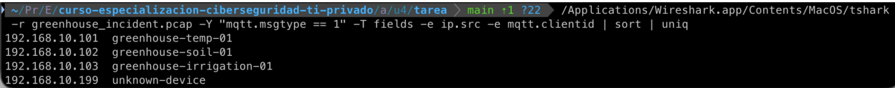
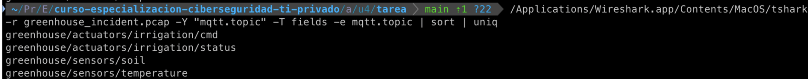
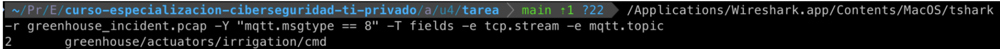
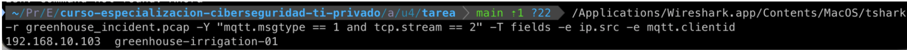
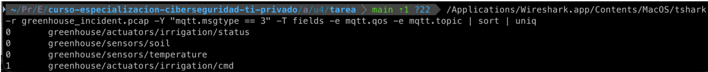
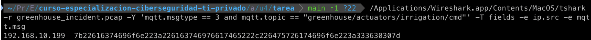
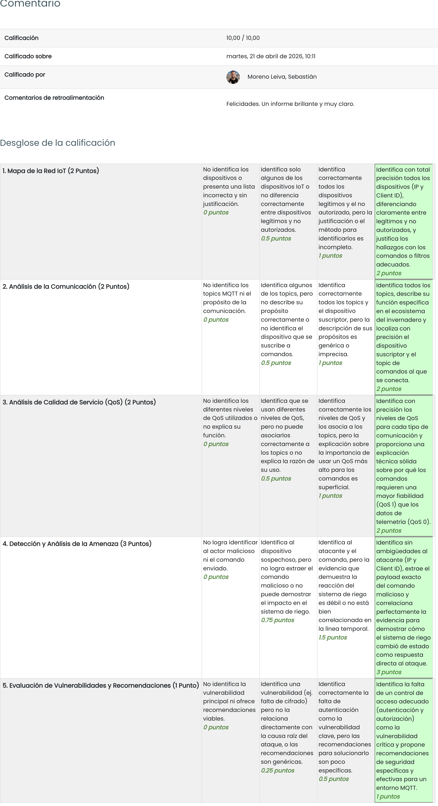

# TAREA Unidad 4: Realización de análisis forenses en IoT

## Índice

- [Caso práctico](#caso-práctico)
- [¿Qué te pedimos que hagas?](#qué-te-pedimos-que-hagas)
	- [Apartado 1: Mapa de la red IoT](#apartado-1-mapa-de-la-red-iot)
		- [Identificación](#identificación)
		- [Dispositivos legítimos y no autorizados](#dispositivos-legítimos-y-no-autorizados)
	- [Apartado 2: Análisis de la comunicación MQTT](#apartado-2-análisis-de-la-comunicación-mqtt)
		- [Listado de _topics_](#listado-de-topics)
		- [Obtención de Client ID y _topic_](#obtención-de-client-id-y-topic)
	- [Apartado 3: Análisis de la calidad de servicio (QoS)](#apartado-3-análisis-de-la-calidad-de-servicio-qos)
		- [Niveles de QoS](#niveles-de-qos)
		- [Justificación de uso de niveles QoS](#justificación-de-uso-de-niveles-qos)
	- [Apartado 4: Detección y análisis de la amenaza](#apartado-4-detección-y-análisis-de-la-amenaza)
		- [Identificación de la fuente del comando malicioso](#identificación-de-la-fuente-del-comando-malicioso)
		- [Identificación de _payload_](#identificación-de-payload)
		- [Evidencia de recepción del comando malicioso](#evidencia-de-recepción-del-comando-malicioso)
	- [Apartado 5: Evaluación de vulnerabilidades y recomendaciones](#apartado-5-evaluación-de-vulnerabilidades-y-recomendaciones)
		- [Evaluación de vulnerabilidades](#evaluación-de-vulnerabilidades)
		- [Recomendaciones](#recomendaciones)
- [Resultado](#resultado)
	- [Calificación](#calificación)
	- [Comentarios de retroalimentación y rúbrica](#comentarios-de-retroalimentación-y-rúbrica)


<br>

## Caso práctico

Eres un analista senior en un Centro de Operaciones de Seguridad (SOC) especializado en infraestructuras críticas. La empresa "AgroTech Solutions", que gestiona invernaderos inteligentes de alta tecnología, ha emitido una alerta de seguridad urgente.

Durante la noche, su sistema de monitorización ha registrado un comportamiento anómalo en el Invernadero Experimental Nº 7. El sistema de riego se activó de forma inesperada durante una hora, inundando una sección de cultivos sensibles y causando pérdidas significativas. El equipo de operaciones sospecha que el comando de activación no fue generado por su sistema de control central, sino por una fuente no autorizada.

Antes de que pudieran realizar un análisis completo, el protocolo de seguridad aisló la red y generó una captura de tráfico ([`greenhouse_incident.pcap`](greenhouse_incident.pcap)) que contiene la actividad de red justo antes y durante el incidente. Tu misión como experto forense es analizar esta evidencia para determinar el origen del ataque, reconstruir la secuencia de eventos y proporcionar recomendaciones para prevenir futuros incidentes.

<br>

## ¿Qué te pedimos que hagas?

### Apartado 1: Mapa de la red IoT

#### Identificación

>[!NOTE]
>Identifica las direcciones IP y los Client ID de todos los dispositivos IoT (excluyendo el _broker_) que se conectan a la red.

Para identificar todas las direcciones IP y sus respectivos Client IDs excluyendo al broker, lo más eficiente es buscar los paquetes de conexión MQTT (Connect Command). En estos paquetes, los dispositivos IoT se anuncian al broker enviando su IP de origen y su Client ID. Para ello, ejecutamos el siguiente comando:

```bash
tshark -r greenhouse_incident.pcap -Y "mqtt.msgtype == 1" -T fields -e ip.src
-e mqtt.clientid | sort | uniq
```

Donde:
- `-r greenhouse_incident.pcap`: Lee el archivo de captura.
- `-Y "mqtt.msgtype == 1"`: Filtra únicamente los mensajes MQTT de tipo Connect. Esto es, los clientes conectándose al broker.
- `-T fields`: Indica que queremos extraer campos específicos (indicados con `-e`).
- `-e ip.src`: Extrae la dirección IP de origen. En este caso, la del dispositivo IoT.
- `-e mqtt.clientid`: Extrae el Client ID del dispositivo.
- `| sort | uniq`: Ordena los resultados y elimina los duplicados para tener una visión clara de los dispositivos.


>Captura del comando ejecutado

Como podemos ver, el resultado es el siguiente:

```
192.168.10.101 greenhouse-temp-01
192.168.10.102 greenhouse-soil-01
192.168.10.103 greenhouse-irrigation-01
192.168.10.199 unknown-device
```

<br>

#### Dispositivos legítimos y no autorizados

>[!NOTE]
>¿Cuántos dispositivos IoT legítimos (sensores/actuadores del invernadero) hay y cuántos dispositivos desconocidos o no autorizados?

En base a los resultados del apartado anterior, podemos identificar tres sensores/actuadores legítimos, los cuales son los siguientes:

```
192.168.10.101 greenhouse-temp-01
192.168.10.102 greenhouse-soil-01
192.168.10.103 greenhouse-irrigation-01
```

Como contraparte, identificamos un dispositivo desconocido, el cual es el siguiente:

```
192.168.10.199 unknown-device
```

<br>

### Apartado 2: Análisis de la comunicación MQTT

#### Listado de _topics_

>[!NOTE]
>Lista todos los topics MQTT utilizados en la captura. Para cada _topic_, describe brevemente su propósito (ej. "enviar datos de temperatura", "recibir comandos de riego").

En el protocolo MQTT, la información fluye a través de topics, que actúan como canales de
mensajería jerárquicos a los que los dispositivos se suscriben o publican. Para extraer una lista única de todos los topics utilizados durante la captura, ejecutamos el siguiente comando:

```bash
tshark -r greenhouse_incident.pcap -Y "mqtt.topic" -T fields -e mqtt.topic | sort | uniq
```

Donde:
- `-r greenhouse_incident.pcap`: Lee el archivo de captura.
- `-Y "mqtt.topic"`: Filtra la captura para mostrar solo los paquetes MQTT que contienen el campo _topic_.
- `-T fields -e mqtt.topic`: Extrae la cadena de texto correspondiente al nombre del _topic_.
- `| sort | uniq`: Ordena los resultados y elimina los duplicados para tener una visión clara de los dispositivos.


>Captura del comando ejecutado

El resultado y el propósito de cada topic son los siguientes:

- `greenhouse/actuators/irrigation/cmd`: Recibe comandos de riego.
- `greenhouse/actuators/irrigation/status`: Reporta el estado del sistema de riego.
- `greenhouse/sensors/soil`: Envía datos de humedad del suelo.
- `greenhouse/sensors/temperature`: Envía datos de temperatura

<br>

#### Obtención de Client ID y _topic_

>[!NOTE]
>Uno de los dispositivos legítimos se suscribe a un _topic_ para recibir comandos. ¿Cuál es su Client ID y a qué _topic_ se suscribe?

Para vincular ese dispositivo con su Client ID real, tenemos que usar el flujo TCP (tcp.stream) como puente. Lo hacemos en dos pasos:

1. **Identificamos el número de flujo TCP del mensaje `SUBSCRIBE`**

	Ejecutamos este comando para ver a qué flujo TCP pertenece esa suscripción:

	```bash
	tshark -r greenhouse_incident.pcap -Y "mqtt.msgtype == 8" -T fields -e tcp.stream -e mqtt.topic
	```

	
	>Captura del comando ejecutado

2. **Buscamos el paquete `CONNECT` de ese mismo flujo TCP**

	Ahora que sabemos que el número de flujo es 2, buscamos el mensaje de conexión inicial de esa misma conversación para extraer el Client ID:

	```bash
	tshark -r greenhouse_incident.pcap -Y "mqtt.msgtype == 1 and tcp.stream == 2" -T fields -e ip.src -e mqtt.clientid
	```

	
	>Captura del comando ejecutado

Uniendo la información obtenida, sabemos que el Client ID del dispositivo legítimo que se suscribe al _topic_ `greenhouse/actuators/irrigation/cmd` para recibir comandos es `192.168.10.103`.

<br>

### Apartado 3: Análisis de la calidad de servicio (QoS)

#### Niveles de QoS

>[!NOTE]
>¿Qué niveles de QoS se utilizan en la comunicación? Proporciona un ejemplo de un topic que utilice cada nivel de QoS identificado.

Para descubrir qué niveles de Calidad de Servicio (QoS) se están empleando en la red del invernadero, debemos analizar los mensajes de publicación (`PUBLISH`, `mqtt.msgtype == 3`).

Para extraer todos los niveles de QoS utilizados y cruzarlos con sus respectivos topics, ejecutamos el siguiente comando:

```bash
tshark -r greenhouse_incident.pcap -Y "mqtt.msgtype == 3" -T fields -e mqtt.qos
-e mqtt.topic | sort | uniq
```


>Captura del comando ejecutado

Como podemos apreciar, se usan los **niveles 0 y 1**. El nivel 0 indica que el mensaje se envía una sola vez y no requiere confirmación de recepción (`ACK`) por parte del _broker_. Se usa para datos que no son críticos, como los topics relacionados con los sensores (en este caso). Por otra parte, el nivel 1 sí que requiere confirmación de recepción (`PUBACK`), por lo que si el emisor no recibe dicho paquete, volverá a enviar el mensaje. En este caso, se usa para el _topic_ `greenhouse/actuators/irrigation/cmd`, el cual recibe comandos de riego.

<br>

#### Justificación de uso de niveles QoS

>[!NOTE]
>¿Por qué crees que se utiliza un nivel de QoS más alto para los comandos enviados al sistema de riego en comparación con los datos de los sensores?

La **telemetría ambiental** se envía con mucha frecuencia. Si un paquete de **QoS 0** se pierde por una pequeña caída de red, el impacto es nulo, ya que el sistema central simplemente recibirá la siguiente lectura unos segundos después. No vale la pena gastar recursos de red en confirmar cada paquete.

Sin embargo, los **comandos de control** son esporádicos y piezas fundamentales del sistema. Si el sistema central envía una orden para apagar el irrigador y el paquete se pierde, el agua seguirá saliendo indefinidamente. El **QoS 1** fuerza que el mensaje llegue al menos una vez al exigir una confirmación (`PUBACK`). Si el emisor no recibe dicha confirmación, retransmitirá la orden de apagado hasta que se asegure de que la válvula la ha recibido.

<br>

### Apartado 4: Detección y análisis de la amenaza

#### Identificación de la fuente del comando malicioso

>[!NOTE]
>¿Cuál es la dirección IP y el Client ID del dispositivo que envió el comando de activación no autorizado?

Basándonos en la identificación de dispositivos que realizamos al inicio de nuestra investigación, sabemos que los datos del dispositivo atacante son IP `192.168.10.199` y Client ID `unknown-device`.

Para demostrar irrefutablemente que esta IP fue la que envió el comando de activación no autorizado, cruzamos la IP de origen con los mensajes de publicación (`PUBLISH`) enviados al _topic_ de control. El comando de `tshark` para extraer esta evidencia es el siguiente:

```bash
tshark -r greenhouse_incident.pcap -Y "mqtt.msgtype == 3 and mqtt.topic === 'greenhouse/actuators/irrigation/cmd'" -T fields -e ip.src -e mqtt.msg
```


>Captura del comando ejecutado

Como podemos ver, la IP es `192.168.10.199`, la cual coincide con la del dispositivo sospechoso localizado en apartados anteriores.

<br>

#### Identificación de _payload_

>[!NOTE]
>¿Qué comando exacto (_payload_) envió este dispositivo sospechoso al sistema de riego?

En el apartado anterior, obtuvimos el mensaje en formato hexadecimal. Al convertirlo a texto ASCII, obtenemos el siguiente JSON en texto plano:

```
{"action":"activate","duration":3600}
```

Este payload encaja perfectamente con el caso práctico y explica el comportamiento anómalo que desencadenó la alerta del SOC al inicio de nuestro caso. El atacante inyectó el comando para activar las válvulas de agua haciéndose pasar por el sistema central legítimo. El riego estuvo activo durante 3600 segundos. Es decir, 1 hora exacta.

<br>

#### Evidencia de recepción del comando malicioso

>[!NOTE]
>¿Cómo confirma la captura de red que el sistema de riego recibió y actuó según el comando malicioso?

Debemos buscar dos tipos de evidencias en la captura de red: la confirmación a nivel de protocolo MQTT y la confirmación a nivel de aplicación.

Por apartados anteriores, sabemos que la arquitectura cuenta con el canal `greenhouse/actuators/irrigation/status`. Cuando un actuador recibe un comando y lo ejecuta físicamente, publica un mensaje en su _topic_ de estado para notificar al sistema central que su condición ha cambiado. Para ver si el dispositivo (`192.168.10.103`) notificó que estaba regando justo después del ataque, ejecutamos este comando buscando en el canal de _status_:

```bash
tshark -r greenhouse_incident.pcap -Y "mqtt.msgtype == 3 and mqtt.topic === 'greenhouse/actuators/irrigation/status'" -T fields -e frame.time_relative -e mqtt.msg
```

Los mensajes de `greenhouse/actuators/irrigation/status` son:

1. Estado inicial (T = 0.044s): `{"status":"idle","valve":"closed"}`
2. Estado tras el ataque (T = 0.061s): `{"status":"active","valve":"open"}`

Esto significa que apenas 17 milisegundos después de que el sistema reportara su estado normal y 6 milisegundos después del ataque (se efectuó en T = 0.055s) procesó el comando malicioso del atacante y ejecutó la acción física de abrir el agua.

<br>

### Apartado 5: Evaluación de vulnerabilidades y recomendaciones

#### Evaluación de vulnerabilidades

>[!NOTE]
>Basado en tu análisis completo, ¿cuál fue la vulnerabilidad de seguridad fundamental en la configuración del _broker_ MQTT que permitió que este ataque tuviera éxito?

La vulnerabilidad fundamental que hizo posible este incidente fue la **ausencia total de controles de autenticación y autorización (ACL)** en el _broker_ MQTT. Además, también se le suma la comunicación en texto plano.

De forma más extensa, el broker permitió que un dispositivo ajeno al invernadero (IP `192.168.10.199`, Client ID `unknown-device`) estableciera una conexión sin necesidad de introducir credenciales ni certificados digitales. No obstante, incluso si un dispositivo logra conectarse, no debería poder hablar en cualquier canal. El _broker_ no tenía configuradas políticas de permisos. Permitió que un dispositivo genérico publicara un mensaje en un _topic_ reservado para operaciones críticas (`greenhouse/actuators/irrigation/cmd`).

Como pudimos extraer el _payload_ en hexadecimal y traducirlo directamente a JSON, sabemos que la comunicación no estaba cifrada con TLS/SSL. Esto facilitó que el atacante pudiera capturar el tráfico previo para aprender la estructura de los _topics_ y el formato de los comandos legítimos antes de inyectar el suyo.

#### Recomendaciones

>[!NOTE]
>Como analista forense, ¿qué dos recomendaciones críticas le darías a AgroTech Solutions para asegurar su infraestructura MQTT y prevenir que un incidente similar vuelva a ocurrir?

Para evitar que el invernadero vuelva a ser comprometido, el equipo de ingeniería de AgroTech Solutions debe implementar estas dos medidas de seguridad:

1. **Fortalecimiento del _broker_ MQTT**

	Tienen que deshabilitar conexiones anónimas y requerir credenciales únicas para cada sensor o actuador para que solo los dispositivos con _hardware_ certificado por la empresa puedan conectarse. Por otro lado, se podrían configurar políticas de lectura/escritura por topic para evitar operaciones inesperadas.

2. **Cifrado de las comunicaciones**

	Tienen que configurar MQTT para usar MQTTS (MQTT sobre TLS) para evitar que cualquier atacante en la red local pueda aplicar ingeniería inversa a los comandos leyendo los paquetes en texto plano.

## Resultado

### Calificación

10,00 / 10,00

### Comentarios de retroalimentación y rúbrica


