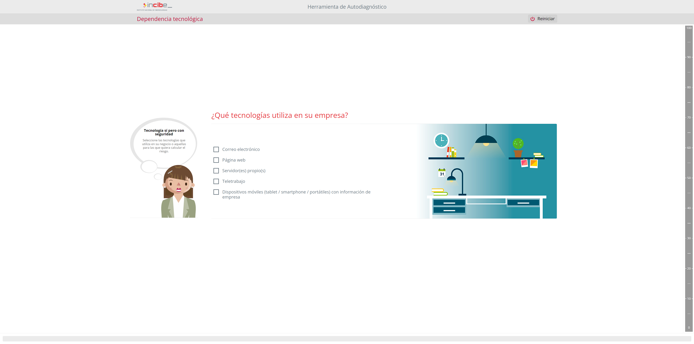

# TAREA Unidad 1: Introducción al bastionado

## Caso práctico

### Datos básicos

- **Nombre** de la empresa: Tecnologías Innovadoras S.A.
- **Sector**: Desarrollo de software y consultoría tecnológica
- **Ubicación**: Málaga, España
- **Número de empleados**: 50
- **Años de operación**: 8
- **Descripción de la actividad**: Tecnologías Innovadoras S.A. es una empresa que se dedica al desarrollo de software a medida y a la consultoría tecnológica. Ofrecen soluciones para la digitalización de pequeñas y medianas empresas, con especialización en aplicaciones web, móviles y servicios en la nube.

### Infraestructura tecnológica

**Red interna**:

- 2 servidores físicos (para almacenamiento de archivos y gestión de bases de datos).
- 10 servidores virtuales en la nube (para aplicaciones y hosting web).
- Red Wi-Fi interna utilizada por todos los empleados.
- Uso de VPN para acceso remoto de empleados que trabajan en proyectos externos.
- Firewall de nivel empresarial, pero no actualizado desde hace 6 meses.

**Dispositivos**:

- 40 ordenadores de sobremesa y portátiles con Windows 10/11.
- 10 portátiles adicionales para el equipo comercial y directivo.
- 10 tablets y 20 smartphones utilizados por el equipo de ventas y directores.

**Software**:

- Suite de herramientas de colaboración en la nube (Google Workspace).
- Sistema CRM para la gestión de clientes (HubSpot).
- Servidor de correo propio (POP3/IMAP).
- Herramientas de desarrollo y control de versiones (GitHub, Visual Studio Code).
- Antivirus estándar en todos los equipos, pero con licencias próximas a vencer.

### Ciberseguridad actual

**Políticas de seguridad**:

- No existe una política formal de ciberseguridad documentada.
- No se realizan formaciones regulares de ciberseguridad para los empleados.
- Contraseñas de empleados rotadas cada 6 meses, pero no se exige doble factor de autenticación (2FA).
- Algunos empleados reutilizan las contraseñas entre sus cuentas personales y corporativas.

**Protección de datos**:

- Cumplen con las normativas de GDPR, pero no realizan auditorías periódicas de protección de datos.
- Almacenamiento de datos sensibles (clientes y empleados) en los servidores físicos, sin cifrado.

**Historial de incidentes**:

- Hace un año sufrieron un ataque de phishing que comprometió las credenciales de dos empleados del departamento de ventas. Se implementaron medidas temporales, pero no se ha realizado una auditoría completa desde entonces.
- Se detectaron intentos fallidos de acceso no autorizado al servidor de correo electrónico hace 3 meses, pero no se tomó ninguna acción al respecto.

**Situación actual**:

- La empresa está en proceso de expandir sus operaciones internacionales y busca mejorar su ciberseguridad antes de que nuevos socios comerciales y clientes del extranjero soliciten auditorías. No tienen un equipo especializado de ciberseguridad interno y sus recursos se limitan a un proveedor externo que realiza mantenimiento básico de los servidores y redes.

### Recursos necesarios y recomendaciones

- [Herramienta de diagnóstico de ciberseguridad del INCIBE](https://www.incibe.es/protege-tu-empresa/herramienta-diagnostico)
- [Guía de buenas prácticas de ciberseguridad para empresas (INCIBE)](https://www.incibe.es/sites/default/files/contenidos/guia-pymes/files/guia-ciberseguridad-pymes.pdf)
- [Medidas de seguridad esenciales para empresas (Agencia Española de Protección de Datos - AEPD)](https://www.aepd.es/es/documento/medidas-seguridad-basicas-pymes.pdf)
- [Cómo implementar la autenticación de dos factores (2FA)](https://www.incibe.es/protege-tu-empresa/seguridad/implementa-autenticacion-doble-factor)
- [Cifrado de datos para pymes (INCIBE)](https://www.incibe.es/protege-tu-empresa/herramientas/cifrado)
- [Phishing: Cómo identificar y prevenir ataques](https://www.incibe.es/protege-tu-empresa/seguridad/evita-el-phishing)
- [Guía práctica de auditorías de ciberseguridad](https://www.incibe.es/protege-tu-empresa/seguridad/realiza-auditoria-seguridad-informatica)
- [Recursos sobre políticas de ciberseguridad](https://www.incibe.es/protege-tu-empresa/seguridad/elabora-una-politica-de-seguridad)

## ¿Qué te pedimos que hagas?

### Apartado 1. Acceso a la herramienta.

>[!NOTE]
>Visita el sitio web del INCIBE y localiza la herramienta de diagnóstico de ciberseguridad.
>
>Regístrate o accede si ya tienes una cuenta.

Para acceder a la herramienta de autodiagnóstico del INCIBE, tenemos que acceder al sitio web [https://adl.incibe.es](https://adl.incibe.es).

>Página de inicio de la herramienta de autodiagnóstico del INCIBE

 

Una vez dentro, pulsamos sobre el botón "Calcula el riesgo de tu negocio", el cual arrancará la herramienta de autodiagnóstico.

>Herramienta de autodiagnóstico del INCIBE

### Apartado 2. Evaluación inicial.

>[!NOTE]
>Realiza una evaluación utilizando los datos de una empresa ficticia o basándote en los recursos que se te proporcionarán (puedes usar la empresa del caso de estudio "Tecnologías Innovadoras S.A.", cuyas características recibirás).
>
>Responde a todas las preguntas del cuestionario, reflejando la situación de ciberseguridad de la empresa según el caso proporcionado.

La herramienta nos irá haciendo preguntas relacionadas con aspectos de seguridad de la organización, que responderemos con la información proporcionada en el enunciado del ejercicio.

>Ejemplo de pregunta del diagnóstico

 

Una vez terminamos de contestar a todas las preguntas, recibimos el resultado del diagnóstico:

>Resultado del diagnóstico

### Apartado 3. Análisis de resultados.

>Una vez completada la evaluación, revisa los resultados que te proporcionará la herramienta. Deberás identificar las áreas críticas de mejora en la ciberseguridad de la empresa.

Según la [evaluación inicial](#evaluación-inicial), podemos apreciar que el riesgo de ciberseguridad de la empresa es alto. Pese a que todas las áreas tienen un gran margen de mejora debido al elevado porcentaje de nivel de riesgo, cabe destacar el **área tecnológica** como la más afectada, con un 4,6% más de riesgo que el área personal.

Entre los puntos críticos detectados que provocan un riesgo tan elevado, destacan los siguientes:

1. **Infraestructura TI desactualizada.**
	- **Firewall no actualizado**: Un firewall desactualizado puede tener vulnerabilidades conocidas que los atacantes pueden explotar.
	- **Licencias de antivirus próximas a expirar**: Esto reduce la efectividad de la protección frente a malware y virus.
	- **Almacenamiento de datos sensibles sin cifrado**: Aumenta la exposición de información confidencial en caso de accesos no autorizados o fugas.
2. **Ausencia de políticas y procedimientos de seguridad.**
	- **Falta de política formal de ciberseguridad**: Esto crea un vacío en cuanto a la gestión y los estándares para la protección de los activos.
	- **Sin formación regular para empleados**: Los empleados no están capacitados para identificar y gestionar amenazas como el phishing.
	- **Rotación de contraseñas sin 2FA**: Aunque se hace un esfuerzo por rotar las contraseñas, la ausencia de autenticación multifactorial es un riesgo mayor, especialmente tras un incidente de phishing previo.
3. **Gestión de incidentes deficiente.**
	- **Falta de seguimiento en intentos de acceso no autorizado**: Los intentos de intrusión recientes en el servidor de correo no fueron investigados ni se tomaron medidas adicionales.
	- **Sin auditorías completas tras incidentes pasados**: No auditar tras el ataque de phishing refleja una actitud reactiva en lugar de proactiva hacia la ciberseguridad.
4. **Conexiones y accesos no controlados.**
	- **Uso de red Wi-Fi interna para todos los empleados**: Sin segmentación, aumenta el riesgo de que se comprometan dispositivos y sistemas críticos.
	- **Reutilización de contraseñas**: Este hábito debilita la seguridad de acceso, sobre todo en caso de que se comprometan cuentas personales.

### Apartado 4. Propuesta de medidas.

>[!NOTE]
>Elabora un informe de al menos 500 palabras en el que describas:
>
>- Los principales problemas detectados en la evaluación.
>- Medidas concretas que se podrían implementar para mejorar la seguridad en cada área vulnerable.
>- Recursos necesarios para llevar a cabo dichas medidas (humanos, tecnológicos, formativos, etc.).

Con tal de mitigar las amenazas y vulnerabilidades de la ciberseguridad de la empresa, es conveniente tomar las siguientes medidas para las áreas de riesgo alto identificadas en el [análisis](#análisis-de-resultados):

- **Personas**: 
	- **Formar a los empleados**, ya que la mayoría de los ataques aprovechan su falta de concienciación sobre la importancia de la ciberseguridad.
	- En la información adicional proporcionada en la tarea no se determina quién administra las cuentas de correo electrónico de la empresa Tecnologías Innovadoras S.A. No obstante, es fundamental que este rol recaiga sobre una persona o un equipo concreto para **restringir el acceso** y aumentar la seguridad en este ámbito.
	- En caso de que la empresa disponga de una **página web**, es importante mantener actualizados tanto los contenidos como las credenciales de acceso, ya que se puede publicar material que pueda ocasionar daños de imagen a la empresa.
	- Asignar la realización de **copias de seguridad rutinarias** a una persona o equipo antes de que sea demasiado tarde, ya que un error en algún sistema puede provocar el colapso de la infraestructura tecnológica de la empresa durante horas e incluso días.
	- Restringir **cuentas de usuario con privilegios de administrador** a personas que estén autorizadas para este cometido.
	- En caso de que se pueda acceder a **aplicaciones internas desde el exterior**, hay que pensar concienzudamente sobre qué permisos otorgar a los usuarios.
	- Para los **smartphones corporativos** que usan el equipo de ventas y los directores, es necesario establecer y comunicar una política que indique los usos permitidos y no permitidos. Además, es importante instaurar medidas de seguridad como el mantenimiento, la actualización o la sincronización del dispositivo.
	- Por último, es esencial **contratar a personal experto en ciberseguridad** para asegurar la correcta puesta en marcha de las medidas propuestas en este apartado.
- **Procesos de negocio**: 
	- Establecer reglas para la **actualización periódica de contraseñas**, así como medidas que comprueben su fortaleza.
	- Establecer **políticas de destrucción de la información** para la correcta eliminación de datos sensibles.
	- Establecer procesos para realizar **copias de seguridad** frecuentes (a poder ser, diarias).
	- Realizar **auditorías de seguridad periódicas** de protección de datos, sobre todo teniendo en cuenta el ataque de phishing que sufrieron dos trabajadores el año pasado.
	- Establecer los **servidores y routers** de la empresa en un lugar seguro y con acceso restringido para evitar alguna manipulación de los mismos. Como mecanismos de seguridad, se pueden instalar cámaras y elementos físicos que bloqueen la entrada al sitio en el que están alojados los materiales. Para poder acceder a ellos, se requerirán tarjetas de acceso o llaves. En casos de empresas con una infraestructura tecnológica mayor, se podría contemplar también la posibilidad de contratar a un guardia de seguridad.
	- Establecer un **plan B** en caso de que ocurra algún imprevisto que afecte a la ciberseguridad de la empresa con el fin de poder adaptarse a las circunstancias y remediar el problema con la mayor celeridad posible.
	- Si se contratan servicios informáticos, hay que comprobar que contemplen las condiciones de ciberseguridad necesarias para hacer que su información esté segura. Es necesario que se cumpla con la **Ley Orgánica de Protección de Datos** (LOPD).
- **Tecnología**: 
	- **Cifrar los datos sensibles** de clientes y empleados almacenados en los servidores.
	- Exigir **doble factor de autenticación** (2FA) para añadir una capa extra de seguridad al binomio usuario/contraseña. También se puede contemplar la **autenticación multifactor** (MFA).
	- **Evitar que los empleados reutilicen las contraseñas** entre sus cuentas personales y corporativas. Para conseguirlo, la empresa debería ser la responsable de generar contraseñas seguras y proporcionárselas a los empleados. Hacerlo cada 6 meses, tal y como tiene establecido la empresa, es un periodo de tiempo razonable.
	- Tomar **medidas de protección** y analizar los intentos de ataque recibidos. Para lograrlo, se pueden establecer, por ejemplo, pruebas de penetración (pentesting).
	- **Renovar las licencias de los antivirus** para evitar el escenario en el que las licencias estén caducadas y los equipos sean vulnerables a cualquier tipo de amenaza.
	- **Actualización periódica** de los sistemas para tener instalados los parches de seguridad más recientes.

Para implementar las medidas expuestas, es necesario contar con una combinación óptima de **recursos tecnológicos, humanos y organizativos**, los cuales se han especificado en cada medida identificada. Con carácter general, es necesario contar con **personal de TI especializado** y un **responsable o un equipo encargado de la ciberseguridad** de la empresa para formar y concienciar a los empleados sobre la importancia de este aspecto, además de implementar la estrategia de seguridad y la toma de decisiones sobre riesgos y protección. 

Asimismo, es fundamental tener en mente el **cumplimiento normativo y estándares de ciberseguridad**. Aunque la empresa ya cumple con normativas como la GDPR, es necesario poner énfasis en el **cifrado de datos sensibles** almacenados en la base de datos para cumplir con la LOPD.

Por otro lado, es necesario contar con los **recursos financieros** adecuados para la ejecución de dichas medidas. Para ello, es necesario formalizar un **presupuesto específico** destinado a este sector de la empresa e incluso considerar la **contratación de seguros** que cubran los riesgos asociados a posibles ciberataques.

### Apartado 5. Conclusión.

Como hemos podido comprobar, Tecnologías Innovadoras S.A. contaba con numerosas lagunas en aspectos críticos de la ciberseguridad de la empresa. No obstante, si volvemos a ejecutar la herramienta de autodiagnóstico del INCIBE con las medidas propuestas, podemos apreciar la diferencia abismal de resultados, consiguiendo un porcentaje de **riesgo bajo**.

>Generado a partir de la herramienta de autodiagnóstico

Para fomentar la aplicación de **buenas prácticas** en el ámbito de la ciberseguridad, es esencial que las compañías entiendan su importancia en la estructura empresarial y las graves consecuencias que puede acarrear un ciberataque a su estructura tecnológica.

---

## Resultado

### Calificación

8,00 / 10,00

### Comentarios de retroalimentación

- Hace un uso incompleto o erróneo de la herramienta de diagnóstico (1,5 / 2,5 puntos).
- El análisis de los resultados es demasiado escaso (1,5 / 2,5 puntos).

### Notas personales

He aplicado el feedback proporcionado por el profesor sobre la entrega original, por lo que ahora debería tener la máxima puntuación.