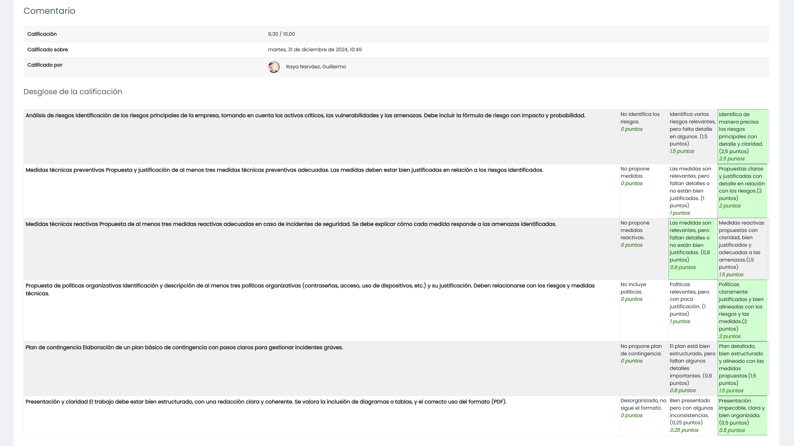

# TAREA Unidad 2: Diseño de planes de securización

## Caso práctico

**Nombre de la empresa**: TechHealth Solutions
**Sector**: Desarrollo de software para la gestión de clínicas de salud
**Tamaño de la empresa**: Mediana (150 empleados)
**Ubicación**: Oficinas en tres ciudades principales de España: Madrid, Barcelona y Málaga.

### Activos críticos

- **Datos de pacientes**: Registros médicos electrónicos que incluyen información sensible como diagnósticos, tratamientos y datos personales.
- **Infraestructura TI**: Servidores locales que almacenan los datos de pacientes y servicios en la nube para su acceso desde diferentes clínicas.
- **Aplicaciones críticas**: Software de gestión de historiales médicos, nóminas, facturación y citas de pacientes.
- **Página web corporativa**: Usada por los clientes para acceder a información general, y por los pacientes para solicitar citas.

### Infraestructura TI

- **Servidores físicos**: Se encuentran en la sede principal en Madrid y albergan los sistemas de gestión de pacientes y nóminas. Sin redundancia en otras ubicaciones.
- **Conexión a la nube**: Servicios en la nube para el acceso remoto de los historiales y sistemas de gestión desde las otras sedes.
- **Antivirus y firewall**: Utilizan soluciones básicas de antivirus que no han sido actualizados en los últimos 6 meses. Un firewall básico protege el acceso a la red.
- **Copias de seguridad**: Las copias de seguridad se realizan de forma semanal y se almacenan en el servidor local, pero no se verifica su restauración periódica.

### Estado actual de la ciberseguridad

- **Políticas de seguridad**: No hay políticas formales implementadas para la gestión de contraseñas o el uso de dispositivos corporativos. No se ha realizado ninguna formación en ciberseguridad para el personal.
- **Control de acceso**: Los empleados utilizan contraseñas poco seguras y compartidas para acceder a los sistemas críticos. No se ha implementado autenticación de doble factor (2FA).
- **Actualizaciones**: Los sistemas operativos de los servidores y el software de gestión no han sido actualizados en los últimos 12 meses, lo que los hace vulnerables a vulnerabilidades conocidas.
- **Concienciación del personal**: La mayoría del personal médico y administrativo no ha recibido formación sobre ciberseguridad, lo que los hace susceptibles a ataques de phishing y otras amenazas.

### Contexto financiero y organizativo

- **Presupuesto**: Aunque la empresa está en proceso de expansión, su presupuesto para ciberseguridad es limitado, lo que restringe la posibilidad de adquirir soluciones avanzadas. La prioridad es mejorar la protección sin incrementar demasiado los costes operativos.
- **Regulación**: La empresa debe cumplir con el Reglamento General de Protección de Datos (RGPD) de la Unión Europea, dado que maneja información personal y médica altamente sensible.

### Amenazas potenciales

- **Ataques de ransomware**: Debido a la falta de actualizaciones y un sistema de copias de seguridad poco robusto, la empresa es vulnerable a ataques que podrían bloquear el acceso a los datos médicos.
- **Phishing**: El personal no está entrenado en detectar intentos de phishing, lo que podría derivar en una filtración de datos sensibles.
- **Pérdida de datos**: La falta de redundancia en los servidores y una política ineficaz de seguridad pone en riesgo la disponibilidad de los datos de los pacientes.
- **Accesos no autorizados**: El uso de contraseñas compartidas y sin autenticación de doble factor incrementa el riesgo de accesos no autorizados a los sistemas críticos.
- **Infección por malware**: Las soluciones antivirus desactualizadas y la falta de políticas de control del acceso a dispositivos externos (USBs, discos duros externos) facilitan la propagación de malware en la red.

## ¿Qué te pedimos que hagas?

### Apartado 1. Análisis de riesgos.

>[!NOTE]
>Evalúa la situación actual de la empresa TechHealth Solutions. Considera los siguientes aspectos:
>- El estado de la infraestructura TI (servidores, redes, sistemas).
>- Nivel de madurez de las políticas de seguridad.
>- Cumplimiento con normativas como el RGPD (Reglamento General de Protección de Datos).
>- Criticidad de la información (datos de pacientes y financieros).
>
>Identifica al menos cinco riesgos a los que está expuesta la empresa. Utiliza la fórmula del riesgo: **Riesgo = Impacto (€) x Probabilidad**
>- Ejemplo: Pérdida de acceso a datos críticos debido a un ataque de ransomware.

Para realizar el siguiente análisis de riesgos, he tomado la [guía del INCIBE](https://www.incibe.es/empresas/blog/analisis-riesgos-pasos-sencillo) como referencia.

**FASE 1. Definición del alcance.**

El alcance del análisis de riesgos de TechHealth Solutions se centra en identificar, evaluar y mitigar las amenazas y vulnerabilidades que puedan afectar a la seguridad y disponibilidad de los activos críticos de la empresa, con el objetivo de garantizar la protección de los datos sensibles de los pacientes, la continuidad operativa y el cumplimiento normativo del RGPD.

**FASE 2. Identificación de activos críticos.**

- **Datos de pacientes**: Registros médicos electrónicos que incluyen información sensible como diagnósticos, tratamientos y datos personales.
- **Infraestructura TI**: Servidores locales que almacenan los datos de pacientes y servicios en la nube para su acceso desde diferentes clínicas.
	- **Servidores físicos**: Se encuentran en la sede principal en Madrid y albergan los sistemas de gestión de pacientes y nóminas. Sin redundancia en otras ubicaciones.
	- **Conexión a la nube**: Servicios en la nube para el acceso remoto de los historiales y sistemas de gestión desde las otras sedes.
	- **Antivirus y firewall**: Utilizan soluciones básicas de antivirus que no han sido actualizadas en los últimos 6 meses. Un firewall básico protege el acceso a la red.
	- **Copias de seguridad**: Las copias de seguridad se realizan de forma semanal y se almacenan en el servidor local, pero no se verifica su restauración periódica.
- **Aplicaciones críticas**: Software de gestión de historiales médicos, nóminas, facturación y citas de pacientes.
- **Página web corporativa**: Usada por los clientes para acceder a información general, y por los pacientes para solicitar citas.

**FASE 3. Identificación de amenazas.**

- **Ataques de ransomware**: Debido a la falta de actualizaciones y un sistema de copias de seguridad poco robusto, la empresa es vulnerable a ataques que podrían bloquear el acceso a los datos médicos.
- **Phishing**: El personal no está entrenado en detectar intentos de phishing, lo que podría derivar en una filtración de datos sensibles.
- **Pérdida de datos**: La falta de redundancia en los servidores y una política ineficaz de copias de seguridad pone en riesgo la disponibilidad de los datos de los pacientes.
- **Accesos no autorizados**: El uso de contraseñas compartidas y sin autenticación 2FA o MFA incrementa el riesgo de accesos no autorizados a los sistemas críticos.
- **Infección por malware**: Las soluciones antivirus desactualizadas y la falta de políticas de control del acceso a dispositivos externos (USBs, discos duros externos) facilitan la propagación de malware en la red.

**FASE 4. Identificación de vulnerabilidades.**

- **Programas y sistemas desactualizados**: Los sistemas operativos de los servidores y el software de gestión no han sido actualizados en los últimos 12 meses, lo que los hace vulnerables a amenazas conocidas. Además, las soluciones básicas de antivirus no han sido actualizadas en los últimos 6 meses.
- **Red insegura**: Solo hay un firewall básico que protege el acceso a la red.
- **Falta de verificación** de la restauración periódica de las **copias de seguridad**.
- **Copias de seguridad sin redundancia**: Al estar almacenadas en un solo servidor local, se crea una dependencia extrema hacia dicho servidor. En caso de que sufra algún percance que imposibilite su acceso, no habría forma de recuperar las copias de seguridad.
- **Falta de políticas de ciberseguridad**: No existen políticas formales de seguridad de la información ni para el uso de dispositivos corporativos.
- **Empleados no formados en ciberseguridad**: Esto aumenta los riesgos de phishing e infección por malware.
- **Control de acceso débil**: Se utilizan contraseñas compartidas y poco seguras. Por otra parte, no se dispone de MFA ni 2FA, ni tampoco se aplican políticas de contraseñas, lo que puede dar lugar a accesos no autorizados a los servidores y a las aplicaciones críticas.

**FASE 5. Evaluación del riesgo.**
 
Aquí se contemplan algunos de los riesgos posibles:

- **Pérdida de acceso a datos críticos debido a un ataque de ransomware**:
	- **Probabilidad alta** (80%) debido a los sistemas desactualizados y a las copias de seguridad no verificadas. 
	- **Impacto alto** (500.000€), ya que paraliza las operaciones informáticas de la empresa y compromete datos sensibles. El montante incluye el coste de recuperar los datos, la interrupción operativa, las posibles multas del RGPD y el daño reputacional.
	- **Riesgo muy alto**: 500.000€ x 0,8 = 400.000€
- **Filtración de datos personales de pacientes mediante phishing**:
	- **Probabilidad alta** (70%) debido a la falta de formación del personal.
	- **Impacto alto** (300.000€). La cantidad contempla las multas por el incumplimiento del RGPD, los litigios por incumplimiento normativo y la pérdida de confianza en la empresa.
	- **Riesgo muy alto**: 300.000€ x 0,7 = 210.000€
- **Pérdida de datos debido a un fallo en los servidores locales**:
	- **Probabilidad media** (50%) debido a la falta de redundancia de los servidores y a la falta de verificación de la restauración periódica de las copias de seguridad.
	- **Impacto alto** (200.000€) debido al daño causado a la disponibilidad de los datos de los pacientes. El montante incluye los costes asociados a la interrupción de las operaciones y a la recuperación de los datos.
	- **Riesgo alto**: 200.000€ x 0,5 = 100.000€
- **Acceso no autorizado a activos críticos por contraseñas débiles**:
	- **Probabilidad alta** (75%) debido a las contraseñas débiles y a la ausencia de 2FA o MFA.
	- **Impacto alto** (150.000€), ya que supone una brecha crucial en la confidencialidad de los datos y en el cumplimiento del RGPD. El montante contempla el coste de remediar accesos indebidos y posibles litigios o multas.
	- **Riesgo muy alto**: 150.000€ x 0,75 = 112.500€
- **Infección por malware en la red interna**:
	- **Probabilidad media** (50%) debido a los antivirus desactualizados y a la falta de control sobre dispositivos externos.
	- **Impacto alto** (100.000€), dado que compromete a los activos críticos y a los datos de pacientes. El montante incluye la pérdida de productividad, la recuperación del sistema y la limpieza del malware.
	- **Riesgo alto**: 100.000€ x 0,5 = 50.000€

**FASE 6. Tratamiento del riesgo.**

Abordado en detalle en los apartados 2 (plan de securización) y 3 (implementación de políticas de seguridad).

### Apartado 2. Propuesta de medidas técnicas.

>[!NOTE]
>Selecciona al menos tres medidas técnicas preventivas y tres medidas reactivas de seguridad adecuadas para la empresa. Puedes incluir herramientas como:
>
>- Antimalware y firewall.
>- Copias de seguridad.
>- Sistemas de detección de intrusos (IDS) o de respuesta a incidentes (IPS).
>
>Justifica por qué estas medidas son las más adecuadas para los riesgos que has identificado.

**Medidas técnicas preventivas**

Es conveniente recordar que las medidas técnicas preventivas son herramientas destinadas a evitar que una amenaza se materialice en un activo. También cabe señalar que, por cada medida, se mencionan las amenazas y los riesgos que mitiga, los cuales han sido descritos en el [apartado 1](#apartado-1-análisis-de-riesgos).

Dicho esto, estas son algunas medidas técnicas preventivas que se podrían aplicar a TechHealth Solutions:

1. **Implementación de un sistema de copias de seguridad en la nube.**

	Actualmente, la empresa realiza copias de seguridad semanales que se almacenan en servidores locales. Esto es inadecuado debido al riesgo de pérdida de acceso a datos críticos en caso de un ataque de ransomware, así como por el riesgo de pérdida de datos en caso de un fallo de los servidores locales.

	Para mitigarlos, podemos almacenar las copias de seguridad en la nube, lo que garantiza que los datos estén disponibles incluso si los servidores locales están comprometidos. Además, la nube ofrece un sistema de seguridad mayor del que disponen actualmente los servidores locales de la empresa.

	Esta medida se puede implementar mediante servicios en la nube, como Amazon Web Services (AWS) o Microsoft Azure. 

2. **Automatización del sistema de copias de seguridad.**

	Según la descripción detallada de la empresa, no se especifica si cuenta con un sistema automatizado para generar copias de seguridad. No obstante, es importante definirlo, ya que se mitigaría el riesgo de pérdida de datos debido a un fallo en los servidores locales.

	Por otra parte, el sistema de copias de seguridad se podría automatizar para aumentar su frecuencia a, por ejemplo, todos los días. De este modo, se garantiza que los datos sean lo más recientes posible y se minimiza el impacto de una posible pérdida de datos.

3. **Implementación de 2FA o MFA.**

	La falta de MFA o 2FA, junto con el uso de contraseñas débiles y compartidas, es uno de los principales riesgos para la seguridad de los sistemas de TechHealth Solutions. Esto pone en riesgo la seguridad de los activos críticos y los hace vulnerables a accesos no autorizados, lo que podría dar lugar a filtraciones de datos sensibles.

	Como solución, se puede implementar 2FA o MFA en todos los accesos a aplicaciones críticas y a datos de pacientes para añadir una capa de seguridad adicional al proceso de inicio de sesión. Esto dificulta el acceso no autorizado incluso si un atacante obtiene las credenciales de un usuario a través de, por ejemplo, phishing. 

	Para su integración, se pueden usar diversas estrategias, como un código enviado al teléfono móvil o una aplicación de autenticación como Google Authenticator o Authy.

4. **Implementación de sistemas de protección avanzados y actualizados.**

	El uso de antivirus desactualizados y un firewall básico para proteger el acceso a la red deja a la empresa vulnerable a infecciones por malware, lo cual supone un riesgo de infección por malware en la red interna. Esto afecta a los servidores locales y a los dispositivos conectados, lo que podría provocar robo de datos, y en casos graves, interrupción de servicios críticos.

	Este riesgo se puede abordar con la implementación de medidas como la configuración de un sistema de detección de intrusos (IDS), la segmentación de la red interna para limitar la propagación del malware, y la inclusión de un firewall de nueva generación que controle el tráfico entre segmentos y detecte amenazas a nivel de red. 

	Con todo ello, habría que habilitar las actualizaciones automáticas para garantizar que los sistemas y el software de seguridad cuenten con los parches más recientes.

	En conjunto, estas medidas reducen significativamente tanto la probabilidad como el impacto de una infección por malware, así como el tiempo de recuperación tras un ataque.

**Medidas técnicas reactivas**

Al igual que hemos hecho con las medidas técnicas preventivas, es oportuno matizar que las medidas técnicas reactivas son herramientas que pueden llevar a cabo alguna acción para contener, eliminar o corregir un incidente una vez identificado o materializado.

1. **Verificación de la integridad de los sistemas y los datos.**

	Este proceso nos permite evaluar si los datos y sistemas críticos han sido alterados o comprometidos tras un incidente de seguridad, tal como la pérdida de datos, la infección por malware o accesos no autorizados. Esto es crucial para detectar cambios no autorizados en los archivos, bases de datos o configuraciones de sistemas.

	Para llevarlo a cabo, podemos utilizar soluciones integradas de detección y respuesta de endpoint (EDR, por sus siglas en inglés) para monitorizar archivos críticos (configuraciones de servidores, bases de datos, registros médicos, etc.) y comparar los estados actuales con copias de referencia o hashes previamente generados. Estos datos son fundamentales a la hora de prevenir la restauración de datos o sistemas ya comprometidos desde copias de seguridad.

	También se pueden realizar pruebas en los sistemas para garantizar que los servicios restaurados funcionan correctamente y sin alteraciones. Si se identifica algún comportamiento sospechoso, se pueden revisar los logs para investigar el problema más a fondo.

2. **Implementación de un plan de contingencia.**

	Un plan de contingencia es una política que recoge herramientas y soluciones que permiten restaurar la actividad de una organización mediante un procedimiento específico tras sufrir un ataque.

	Pese a que en el [apartado 4](#apartado-4-plan-de-contingencia) se aborda este plan con más detalle, un plan de contingencia común debe contemplar las siguientes fases, las cuales han sido tomadas como referencia del [plan de contingencia del INCIBE](https://www.incibe.es/empresas/que-te-interesa/plan-contingencia-continuidad-negocio):

	- **Fase 0**: Determinación del alcance.
	- **Fase 1**: Análisis de la organización.
	- **Fase 2**: Determinación de la estrategia de continuidad.
	- **Fase 3**: Respuesta a la contingencia.
	- **Fase 4**: Prueba, mantenimiento y revisión.
	- **Fase 5**: Concienciación.

3. **Implementación de _virtual patching_.**

	El _virtual patching_ bloquea o detiene los intentos de ataque a un sistema antes de que pueda comprometerlo. De este modo, se garantiza que los servicios funcionen sin interrupciones mientras se soluciona el problema causado por el ataque. Además, ayuda a mitigar el riesgo de incumplimiento del RGPD al proteger datos sensibles contra accesos no autorizados o infecciones por malware.

### Apartado 3. Políticas de seguridad.

>[!NOTE]
>Propón tres políticas organizativas que la empresa debería implementar. Ejemplos:
>
>- Política de uso de dispositivos corporativos.
>- Política de contraseñas y acceso.
>- Política de seguridad.
>
>Explica cómo estas políticas ayudarán a reducir los riesgos y mejorar la seguridad general de la empresa.

Si tomamos los apuntes del temario como referencia, podemos comprobar que las políticas del ejemplo combinan políticas organizativas, como la de uso de dispositivos corporativos y la de uso de contraseñas, con políticas técnicas, como la de control de acceso y la de copias de seguridad. Ante esta tesitura, he decidido dividir la política de control de acceso de la política de uso de contraseñas, ya que la primera está más enfocada al ámbito técnico, mientras que la segunda es de índole organizativa. Como compensación, he añadido la política de concienciación y formación, ya que está más orientada a la organización.

Dicho esto, a continuación indico algunas políticas organizativas que la empresa debería considerar:

1. **Política de uso de dispositivos corporativos.**

	Esta política regula el uso de los dispositivos de la empresa (ordenadores, teléfonos o tablets) con el fin de evitar fugas de datos y accesos no autorizados, entre otros. Para garantizar su cumplimiento, se pueden imponer medidas como la prohibición de conectar dispositivos ajenos a la empresa a la red interna y a los activos críticos. Por otra parte, se pueden configurar controles de acceso en los dispositivos corporativos, incluyendo cifrado y gestión remota, y exigir el uso de una VPN corporativa para cualquier acceso remoto.

	El conjunto de estas medidas mitigan las amenazas que pueden surgir debido a una red insegura, como los ataques man-in-the-middle o la pérdida de datos por una infección de malware o un ataque ransomware.

2. **Política de uso de contraseñas.**

	Para llevarla a cabo, es imprescindible establecer requisitos estrictos para la creación, uso y gestión de las contraseñas, así como aplicar la medida técnica del uso de 2FA o MFA en todos los activos críticos que requieran de inicio de sesión. A su vez, también se debe prohibir el uso de contraseñas compartidas y exigir cambios de contraseña regulares. Por ejemplo, cada 90 días.

	En cuanto a los requisitos para crear contraseñas, se puede establecer un mínimo de 12 caracteres que incluyan letras mayúsculas y minúsculas, números y símbolos. Una vez generadas, se pueden almacenar en gestores de contraseñas corporativos seguros, pero nunca en medios sensibles sin ningún tipo de cifrado ni entorno de almacenamiento seguro que la expongan fácilmente.

	Al aplicar esta política, se mitiga el riesgo de filtración de contraseñas y, por tanto, los riesgos asociados con accesos no autorizados. Adyacentemente, se reforzaría también el cumplimiento del RGPD al proteger los datos personales sensibles de los pacientes.

3. **Política de copias de seguridad.**

	La información es el activo más importante de una empresa y, actualmente, TechHealth Solutions no dispone de ninguna política de copias de seguridad, por lo que se encuentra expuesta al riesgo de no poder recuperar datos en caso de  ataque, entre otros. 

	Para establecer una política efectiva en este aspecto, es importante aumentar la frecuencia con la que se realizan las copias de seguridad de activos críticos para mitigar, en la medida de lo posible, el riesgo de pérdida de datos por un ataque. Asimismo, también es importante verificar la integridad de dichas copias regularmente para asegurar que no han sufrido ningún tipo de cambio desde su creación.

	Por otra parte, es importante aplicar la medida técnica preventiva de implementación de un sistema de copias de seguridad en la nube para asegurar la redundancia geográfica y evitar la pérdida de acceso a los datos. Por otra parte, es importante añadir un sistema de encriptación para evitar la exposición de datos sensibles a posibles ataques de malware. 

	Por último, es conveniente aplicar la medida técnica preventiva de automatización del sistema de copias de seguridad y restaurar los datos periódicamente a partir de dichas copias para comprobar y garantizar su completa funcionalidad e integridad.

	Si todas estas medidas se aplican correctamente, nos aseguramos de que las amenazas que puedan comprometer a la disponibilidad, integridad o confidencialidad de la información de TechHealth Solutions  sean mitigadas. A su vez, también se minimiza el tiempo de inactividad de las operaciones de la empresa durante un posible ataque, ya que se puede garantizar que los datos comprometidos que se recuperan a partir de una copia de seguridad son recientes, seguros y verificados.

4. **Política de control de acceso.**

	En una empresa, los empleados no tienen la necesidad de tener acceso a aquellos dominios que no son propios de su rol de trabajo. Por ello, es fundamental aplicar el paradigma “Zero Trust”, lo cual respalda el principio de mínimos privilegios, que consiste en establecer roles y permisos limitados en función del desempeño del trabajador con tal de reducir la superficie de exposición de la información.

	Para aplicar este paradigma en la política de control de acceso de la empresa, es fundamental establecer una jerarquía de roles y responsabilidades, a partir de la cual se definirán las funciones y la información a la que puede acceder cada rol. Asimismo, la medida de implementación de sistemas de protección avanzados y actualizados supondría un refuerzo aún mayor de la seguridad de los activos críticos para evitar cualquier acceso no deseado.

	De esta manera, TechHealth Solutions mitigaría la amenaza de riesgos no autorizados y, por ende, de fuga de información.

5. **Política de formación.**

	Esta política es de las más importantes en el ámbito organizativo de cara a permitir que los empleados puedan elevar el nivel de ciberseguridad. Una política de este tipo garantiza la existencia de un “firewall humano” que será capaz de identificar los incidentes y eliminarlos o reportarlos.

	Como sabemos, el personal de TechHealth Solutions no está entrenado en el ámbito de la ciberseguridad, por lo que no existe ninguna política al respecto. Para integrarla, se puede establecer un programa de formación continuo para todos los empleados, con el objetivo de concienciarlos sobre las amenazas y fomentar las buenas prácticas de seguridad. Además, también se estaría reduciendo el riesgo de incidentes derivados de errores humanos.

	Respecto a los temas cubiertos en la formación, se pueden abordar temas como buenas prácticas en la creación y gestión de contraseñas, reconocimiento de ataques de phishing, seguridad en el manejo de dispositivos y políticas de acceso y protección de datos. A su vez, para garantizar que los empleados comprenden los temas impartidos, conviene realizar pruebas prácticas y teóricas periódicamente con tal de evaluar sus respuestas y ajustar la formación según los resultados.

	El personal encargado de ofrecer dicha formación puede ser tanto externo como interno. En este último supuesto, los responsables serían el equipo de TI. En cualquier caso, es necesario llevar a cabo un proceso de registro de las formaciones impartidas y realizar un seguimiento para identificar posibles mejoras.

	Esta política mitiga la amenaza de ataques de phishing y asegura que el personal está capacitado para manejar datos sensibles de acuerdo con el RGPD y la LOPD. Además, como se ha mencionado previamente, convierte a los trabajadores en “firewall humano” que actúa en primera línea de defensa frente a las amenazas.

### Apartado 4. Plan de contingencia.

>[!NOTE]
>Diseña un plan básico de contingencia que indique los pasos a seguir en caso de un incidente de seguridad grave (por ejemplo, un ataque de ransomware que comprometa los servidores).
>
>Define las acciones clave para restaurar los sistemas y asegurar que los servicios críticos se mantengan operativos.

Como mencioné en las medidas técnicas reactivas del apartado 2, voy a tomar como referencia el plan de contingencia del INCIBE. En este caso, el plan va a contemplar los pasos a seguir en caso de un ataque de ransomware que comprometa los servidores, tal y como propone el enunciado de este apartado. Su objetivo principal es garantizar la continuidad operativa en el menor tiempo posible y proteger los datos sensibles de los pacientes conforme a la normativa del RGPD.

**FASE 0. Determinación del alcance.**

Para ello, es crucial recopilar los activos que dan soporte a la operatividad crítica del negocio, que consiste en desarrollar software y dar soporte tecnológico a las clínicas de salud para las que trabaja TechHealth Solution. 

En el proceso intervienen las siguientes tecnologías:

- Datos de pacientes almacenados y transmitidos entre las sedes de Madrid, Barcelona y Málaga.
- Servidores físicos en Madrid.
- Servicios en la nube.
- Aplicaciones críticas (gestión de historiales, nóminas, facturación y citas).

A nivel del personal, intervendrá, principalmente, el equipo de TI, y algunos trabajadores del equipo administrativo para gestionar el proceso de comunicación a nivel externo e interno.

**FASE 1. Análisis de la organización.**

En primer lugar, debemos reunirnos de forma inmediata con el personal de TI para evaluar la escala de la gravedad del ataque y analizar qué activos críticos se han visto afectados. Además, es importante estimar cuánto tiempo se requiere para que dichos activos vuelvan a la operatividad normal. Por otra parte, es fundamental notificar a las empresas afectadas sobre la situación y el tiempo estimado para la resolución del problema..

A partir de los datos recabados en la reunión, debemos elaborar el Análisis de Impacto sobre el Negocio o BIA (_Business Impact Analysis_), en el que se estipularán los siguientes puntos:

1. **Tiempo de recuperación o RTO (Recovery Time Objective)**:
 
	- **Datos de pacientes**: 4 horas. Se le da la prioridad más alta ya que es la información más sensible que se puede comprometer. Además, puede acarrear sanciones por el incumplimiento del RGPD, lo que se traduce en sanciones económicas y daños reputacionales.
	- **Aplicaciones críticas**: 8 horas. Esto engloba al software de gestión de historiales, citas y nóminas.
	- **Página web corporativa**: 24 horas. La prioridad es media, ya que no afecta directamente al funcionamiento interno.

2. **Recursos humanos y tecnológicos empleados en el proceso:**

	- **Recursos humanos**:
		- **Equipo de TI interno**. En el enunciado no se especifica el nivel de formación con el que cuenta el personal, pero vamos a suponer que se destinan a 2 ingenieros con formación en recuperación de ataques cibernéticos.
		- **Empresa externa** de ciberseguridad para la asistencia en incidentes críticos.
		- 2 empleados del **personal administrativo** responsables de coordinar comunicaciones internas y externas.
	- **Recursos tecnológicos**
		- Servidores físicos alojados en Madrid que contienen las copias de seguridad.
		- Servidores en la nube.
		- Sistemas de recuperación para la restauración de las copias de seguridad.

3. **Tiempo máximo tolerable de caída o MTD (Maximum Tolerable Downtime)**:
 
	Para poder realizar una estimación más realista del tiempo máximo tolerable de caída para cada activo crítico, sería necesario conocer detalles más concretos sobre la actividad de la empresa. No obstante, he elaborado una estimación del tiempo de caída aproximado para cada activo, respaldada por una breve justificación basada en un escenario general.

	- **Datos de pacientes**: 12 horas. Es uno de los activos más importantes de la empresa, por lo que un número superior implicaría que los datos están gravemente comprometidos, así como las empresas que dependen de ellos.
	- **Aplicaciones críticas**: 16 horas. Un número superior afectaría severamente a la programación de citas y al registro de tratamientos de forma interna y externa.
	- **Página web corporativa**: En caso de que el ataque afecte a activos de mayor importancia, la recuperación de la página quedaría relegada a un segundo plano, ya que, a priori, “sólo” tendría un impacto reputacional de la empresa. Desde esta perspectiva, podríamos decir que 48 horas es un límite de tiempo razonable. Ahora bien, en caso de que la página sea la única víctima del ataque, el tiempo máximo tendría que reducirse a la mitad (24 horas).

4. **Niveles mínimos de recuperación de servicio** o **ROL (_Revised Operating Level_)**:

	A continuación, se establecen unos porcentajes aproximados para ofrecer una idea del nivel mínimo de recuperación del servicio de los activos críticos afectados.

	- **Datos de pacientes**: Acceso a historiales médicos limitados a la información esencial para citas del día (60% de la capacidad total).
	- **Aplicaciones críticas**: Capacidad para registrar nuevas citas, aunque las funcionalidades avanzadas pueden no estar disponibles (50% del nivel normal).
	- **Página web corporativa**: Página funcional para información básica de contacto y solicitud de citas (70% del nivel habitual).

5. **Dependencias de otros procesos internos o proveedores externos**:

	- **Procesos internos**:
		- La disponibilidad de los datos de los pacientes y de las aplicaciones críticas depende del correcto funcionamiento de los servidores locales ubicados en Madrid. Esto condiciona la operatividad de TechHealth Solutions y de las empresas que contratan sus servicios.
		- Dependencia de los sistemas de gestión para operar las aplicaciones de historiales y citas.

	- **Proveedores externos**:
		- **Servicios en la nube**, como AWS o Azure para la replicación de datos.
		- **Proveedores de software de seguridad**, como el antivirus, el firewall o el EDR.
		- La **empresa externa de ciberseguridad** mencionada anteriormente.

6. **Grado de dependencia de la actualidad de los datos** o **RPO (_Recovery Point Objective_)**:

	Me he ayudado de [esta entrada](https://www.datos101.com/blog/recovery-point-objective-y-recovery-time-objective/) del blog de la página [datos101.com](https://www.datos101.com) para determinar cómo medir el RPO. Estos son los grados de dependencia de la empresa respecto al ataque de ransomware:

	- **RPO de los datos de pacientes**: 1 hora. La pérdida de datos debe ser mínima. Los historiales médicos deben actualizarse en tiempo casi real.
	- **RPO de las aplicaciones críticas**: 4 horas. Se admite cierta pérdida de datos, siempre y cuando puedan recuperarse desde registros locales o manuales.
	- **RPO de la página web corporativa**: 12 horas. Los cambios en la web pueden ser implementados de nuevo sin impacto significativo en las operaciones.

	A partir de la información obtenida previamente, la guía del INCIBE aborda la realización de un análisis de riesgos. Esto ya fue realizado en el [apartado 1](#apartado-1-análisis-de-riesgos), por lo que voy a omitirlo en este apartado.

**FASE 2. Determinación de la estrategia de continuidad.**
 
En esta fase, identificamos si los recursos actuales de la empresa y sus estrategias de recuperación permitirían alcanzar el MTD establecido para cada proceso identificado en la fase 1 (análisis de la organización).

Actualmente, la empresa no cuenta con redundancia geográfica de los datos almacenados en el servidor local de Madrid, lo cual implica que el acceso a los datos de los pacientes, a las copias de seguridad, a las aplicaciones críticas y a la página web corporativa es totalmente dependiente de la funcionalidad de dicho servidor. Por tanto, si sufre un ataque de ransomware, el MTD planteado para todos los activos críticos sería inviable, ya que prácticamente toda la infraestructura tecnológica de la empresa quedaría en jaque.

**FASE 3. Respuesta a la contingencia.**
 
Antes de entrar en detalle sobre cómo responder al ataque, es esencial seguir los siguientes pasos para mitigar el riesgo de un ataque por ransomware al máximo:

- Aplicar todas las medidas propuestas en el [apartado 2](#apartado-2-propuesta-de-medidas-técnicas).
- Llevar a la práctica todas las políticas planteadas en el [apartado 3](#apartado-3-políticas-de-seguridad).

Con el anterior matiz planteado, procedemos a dictar una respuesta a la contingencia, la cual es capital para contener, gestionar y recuperar los activos afectados por el ataque de ransomware. Esta fase debe activar el Plan de Crisis, ejecutar los Planes Operativos de Recuperación de Entornos y utilizar los Procedimientos Técnicos de Trabajo.

Para no hacer el plan excesivamente largo, dado que el enunciado especifica que sea básico, resumiré cada plan brevemente:

- **Plan de Crisis**: Coordina las primeras acciones para contener el ataque, minimizar el daño y evitar decisiones improvisadas. En este caso, hay que notificar al equipo y al proveedor externo de ciberseguridad inmediatamente tras detectar el problema, así como aislar de la red los activos afectados para evitar que se propague el ataque. Hecho esto, hay que comunicar la situación a las partes interesadas externas para que estén al tanto de la situación.
- **Planes Operativos de Recuperación de Entornos**: Hay que validar la integridad de las copias de seguridad y restaurarlas desde la nube al servidor afectado. Por otra parte, hay que reinstalar el software desde dichas copias y restablecer la conexión con bases de datos restauradas. Tras hacer esto, hay que realizar pruebas internas antes de escalar la solución.
- **Procedimientos Técnicos de Trabajo**: Recogen instrucciones detalladas sobre el aislamiento de sistemas, la recuperación de datos, la eliminación del ransomware, la revalidación de accesos y la comunicación interna y externa.

**FASE 4. Prueba, mantenimiento y revisión.**

Para esta fase, realizaremos simulacros de ransomware cada seis meses con tal de evaluar los tiempos de respuesta y eficiencia ante el ataque. En función a los resultados de las pruebas, tenemos que ajustar los planes anteriormente expuestos para asegurar una correcta documentación y ejecución del plan en caso de ataque real.

**FASE 5. Concienciación.**

Tal y como se estipula en la política de formación del [apartado 3](#apartado-3-políticas-de-seguridad), hay que impartir cursos y talleres para concienciar a los empleados sobre el impacto que puede acarrear un ataque de este tipo, junto con los mecanismos y los planes de actuación ante él.

---

## Resultado

### Calificación

9,30 / 10,00

### Comentarios de retroalimentación y rúbrica

