# UNIDAD 3: Configuración de sistemas de acceso y autenticación de personas

## Introducción a los sistemas PAM

Los sistemas PAM (Pluggable Authentication Modules) son una tecnología ampliamente utilizada en sistemas Linux y Unix para gestionar la autenticación de usuarios y otros procesos relacionados con la seguridad. PAM permite que las aplicaciones y servicios del sistema implementen métodos de autenticación de manera flexible y modular, lo que facilita la personalización de políticas de seguridad sin necesidad de modificar el código fuente de cada aplicación.

PAM funciona mediante la configuración de módulos que se ejecutan en secuencia para verificar la identidad de los usuarios, gestionar contraseñas, controlar el acceso a recursos y manejar sesiones. Estos módulos son definidos en archivos ubicados en `/etc/pam.d/`, los cuales son específicos para cada servicio o aplicación que requiera autenticación, como `login`, `sshd`, `sudo`, entre otros.

La importancia de tener PAM bien configurado radica en que es la primera línea de defensa del sistema contra accesos no autorizados. Un sistema PAM mal configurado puede dejar vulnerabilidades críticas que permitan a atacantes evadir medidas de seguridad, obtener privilegios elevados o acceder a cuentas protegidas. Por ello, es fundamental que los administradores de sistemas comprendan cómo funciona PAM y cómo se puede utilizar para fortalecer la seguridad de autenticación en todo el sistema.

## ¿Qué te pedimos que hagas?

El alumno configurará un sistema Linux para que requiera un código de autenticación generado por Google Authenticator en las siguientes situaciones, con el objetivo de que el alumno comprenda cómo se configuran los módulos PAM para fortalecer la seguridad del sistema mediante autenticación multifactor.

### Instalar `libpam-google-authenticator`

Antes de empezar, es necesario instalar el paquete libpam-google-authenticator. Para ello, lo instalamos ejecutando el siguiente comando:

```
sudo apt-get install libpam-google-authenticator
```

<div align="center">
	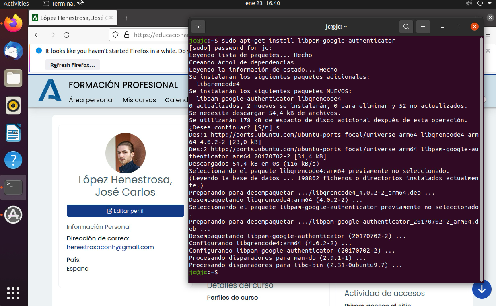
</div>

>Instalando el paquete `libpam-google-authenticator`

Una vez hecho esto, configuramos Google Authenticator para el usuario actual ejecutando `google-authenticator`.

<div align="center">
	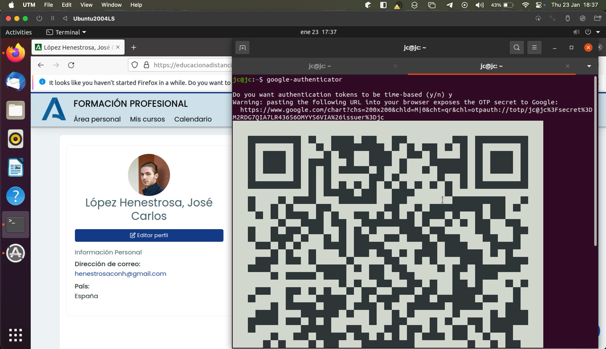
	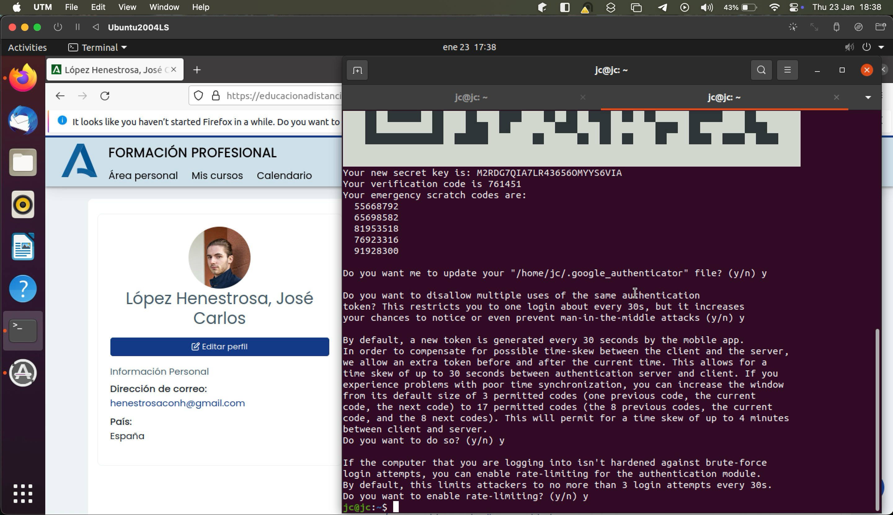
</div>

>Configurando Google Authenticator

Para habilitar la autenticación 2FA, necesitamos escanear el QR generado en un dispositivo móvil para tener acceso a los códigos de verificación. Para ello, instalamos la aplicación Google Authenticator. Como tengo un dispositivo móvil Android, la descargaré desde la Play Store.

<div align="center">
	
</div>

>Página de la app de Google Authenticator en la Play Store. Mi dispositivo está en francés.

A continuación, accedemos a la aplicación y escaneamos el QR. Al hacerlo, nos aparecerá la siguiente pantalla con los códigos de verificación correspondientes a nuestro equipo:

<div align="center">
	
</div>

>Pantalla principal de la app de Google Authenticator tras escanear el QR. La aplicación no permite capturar la pantalla, por lo que tuve que tomar la imagen desde otro dispositivo móvil.

---

### Login desde terminal de texto

>**Configura el archivo `/etc/pam.d/login` para que el sistema pida un código de autenticación cuando se intente iniciar sesión en una terminal sin entorno gráfico.**

En primer lugar, tenemos que editar el archivo `/etc/pam.d/login` para añadir la siguiente línea tras incluir los contenidos del archivo `common-auth`:

```
auth required pam_google_authenticator.so
```

<div align="center">
	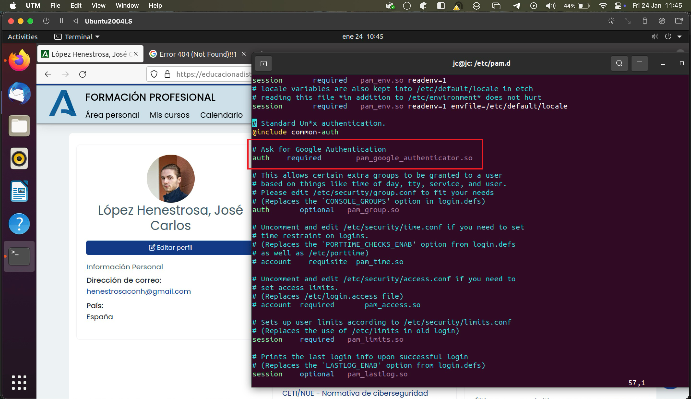
</div>

>Archivo `/etc/pam.d/login` con los cambios marcados en rojo

Esto le indica al sistema que, además de la contraseña, se debe pedir el código TOTP (Time-based One-Time Password) de Google Authenticator como un segundo factor.

Para comprobar que funciona correctamente, reiniciamos el servicio `systemd-logind` con el comando sudo systemctl restart `systemd-logind` para que se vuelvan a pedir las credenciales en la terminal y se pida el código de verificación.

<div align="center">
	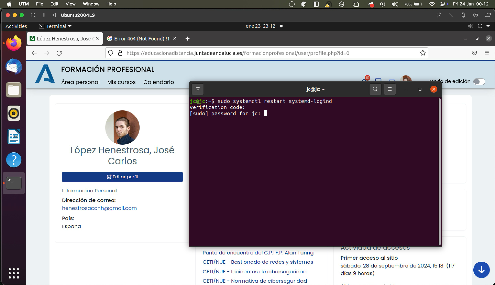
</div>

>Reiniciando el servicio `systemd-logind`

Como podemos apreciar, se nos pide el código de verificación de Google Authenticator correctamente para poder iniciar sesión con nuestro usuario desde la terminal, por lo que la configuración se ha aplicado con éxito.

---

### Login en entorno gráfico 

>**Configura el archivo `/etc/pam.d/lightdm` (o equivalente) para que el sistema solicite un código de autenticación en el inicio de sesión gráfico.**

Mi distribución de Ubuntu usa GNOME como display manager, por lo que voy a configurar el archivo `/etc/pam.d/gdm-password` en lugar de `/etc/pam.d/lightdm` para cumplir con lo que pide el enunciado. 

Para ello, es necesario editar dicho archivo para añadir la siguiente línea tras incluir los contenidos del archivo `common-auth`, tal y como hicimos con el archivo `/etc/pam.d/login`:

```
auth required pam_google_authenticator.so
```

<div align="center">
	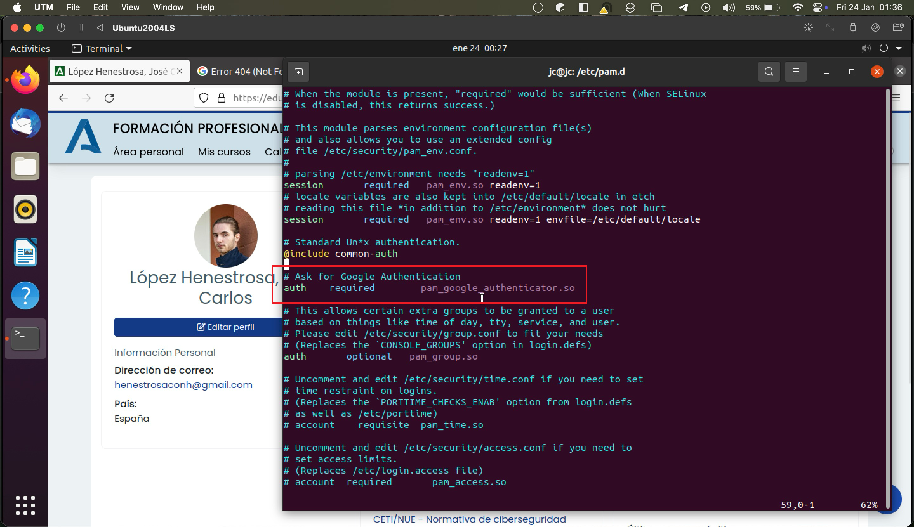
</div>

>Archivo `/etc/pam.d/gdm-password` con los cambios marcados en rojo

Al realizar este proceso, ejecutamos `sudo systemctl restart gdm` para que los cambios surtan efecto.

Tras esto, cerramos la sesión y la volvemos a iniciar para comprobar que, efectivamente, se pide el código de verificación al intentar iniciar sesión de nuevo.

<div align="center">
	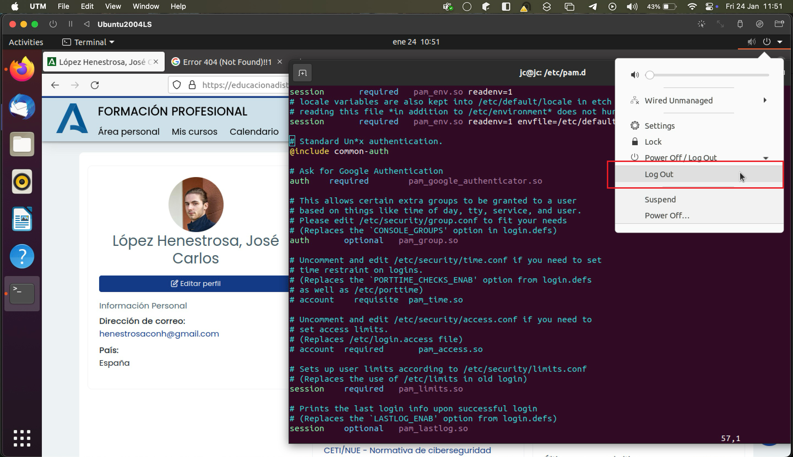
</div>

>Cerrando sesión en el entorno gráfico

<br>

<div align="center">
	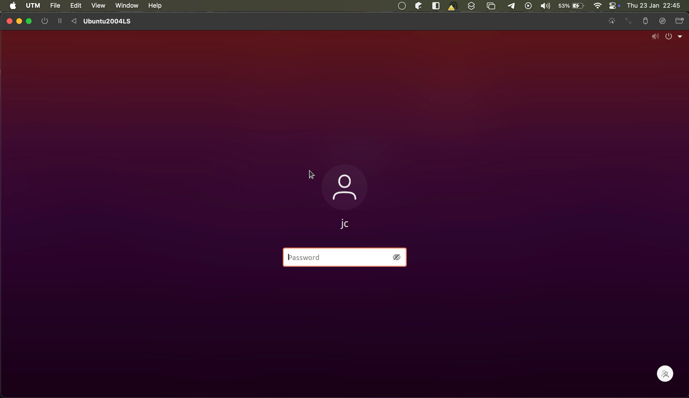
</div>

>Petición de contraseña al intentar iniciar sesión en entorno gráfico

<br>

<div align="center">
	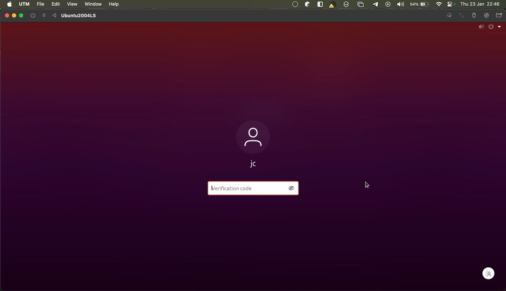
</div>

>Petición de código de verificación tras introducir la contraseña al intentar iniciar sesión en entorno gráfico

Como podemos observar, la configuración se ha aplicado con éxito.

---

### Uso del comando sudo 

>**Configura el archivo `/etc/pam.d/sudo` para que el sistema requiera un código de autenticación adicional cuando se ejecute un comando con privilegios elevados.**

Para ello, tenemos que editar el archivo /etc/pam.d/sudo para añadir la siguiente línea después de incluir los contenidos del archivo common-auth, tal y como hicimos en los procesos de configuración anteriores:

```
auth required pam_google_authenticator.so
```

<div align="center">
	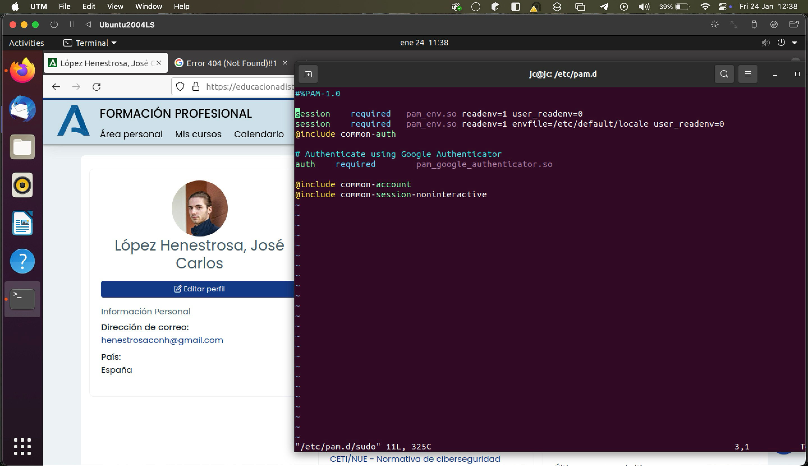
</div>

>Archivo `etc/pam.d/sudo` con los cambios marcados en rojo

Tras esto, borramos la caché de autenticación de `sudo` con el comando `sudo -k` y ejecutamos cualquier comando con `sudo` para realizar la acción con permisos elevados:

<div align="center">
	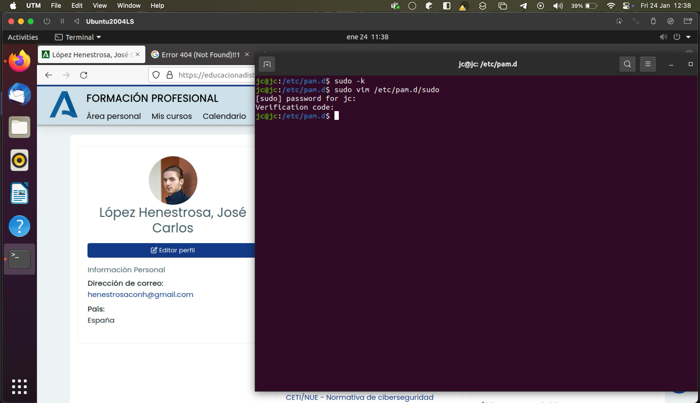
</div>

>Petición de código de verificación tras ejecutar un comando con privilegios de superusuario

Como podemos comprobar, se pide la contraseña y el código de verificación correctamente.

---

### Preguntas adicionales

#### 1. ¿Por qué influye el **orden** en el que se añaden las directivas en el archivo PAM que se está configurando?

El orden es crucial porque PAM evalúa las directivas de arriba hacia abajo, lo que influye significativamente en el proceso de autenticación de los usuarios. Por ejemplo, si movemos la línea `auth required pam_google_authenticator.so` al principio del archivo `/etc/pam.d/sudo`, tal que así:

<div align="center">
	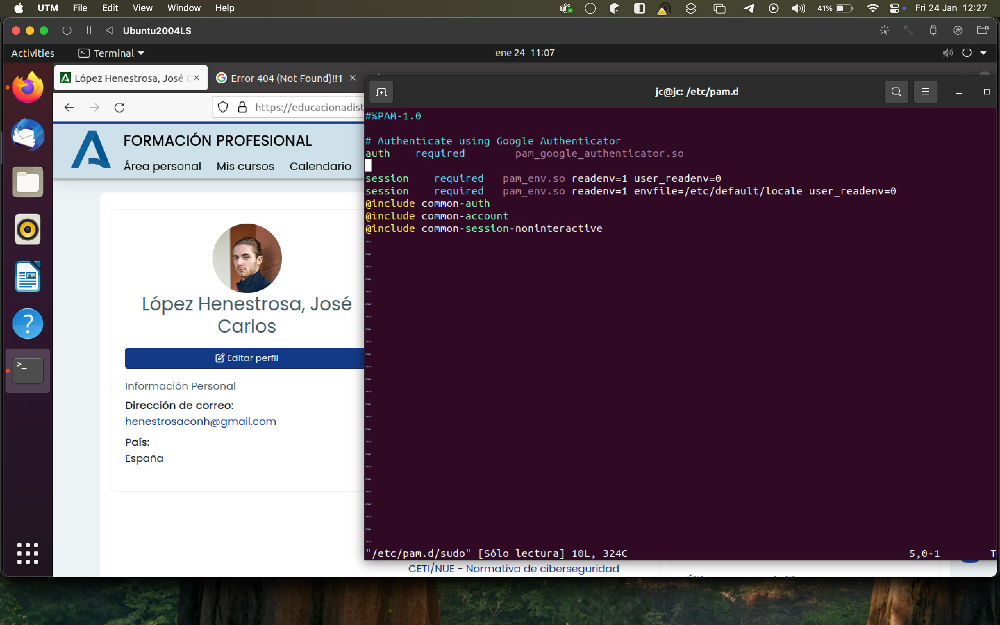
</div>

>Archivo `/etc/pam.d/sudo` con los cambios marcados en rojo

Como podemos apreciar, el orden de petición del código de verificación se invierte; es decir, ahora se solicita el código de verificación de Google Authenticator antes que la contraseña, tal y como se muestra en la siguiente captura:

<div align="center">
	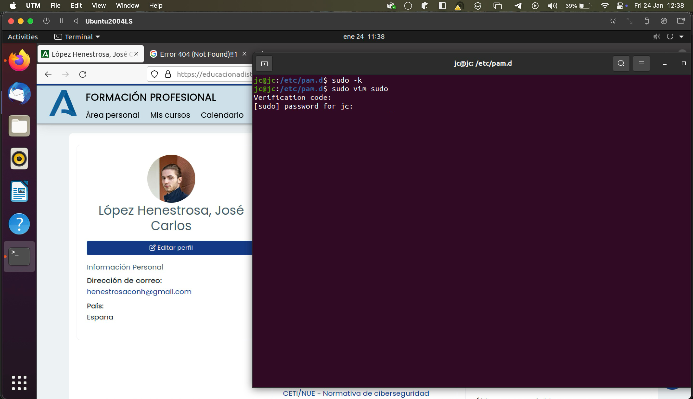
</div>

>Petición de código de verificación invertido respecto al apartado [Uso del comando sudo](#uso-del-comando-sudo)

---

#### 2. ¿En qué **otras acciones o servicios** sería aconsejable configurar PAM para reforzar la autenticación del usuario?

Se puede utilizar en multitud de situaciones. Por ejemplo, para proteger conexiones sensibles de transferencia de datos y similares, como VPN (Virtual Private Network), SSH (Secure Socket Shell), FTP (File Transfer Protocol) o SMTP (Simple Mail Transfer Protocol). Asimismo, también se podría usar para integrar servicios en red con sistemas de autenticación centralizados, como LDAP (Lightweight Directory Access Protocol) o NIS (Network Information Service).

Por otra parte, mediante el uso de módulos, se puede emplear para restringir el acceso dependiendo de la hora del día o de la semana y la dirección IP del dispositivo, así como bloquear cuentas e intentos fallidos de inicio de sesión a consecuencia de ataques de fuerza bruta con el módulo `pam_tally2`. Además, gracias al módulo `pam_ecryptfs`, también es posible configurar el desbloqueo de particiones cifradas al iniciar sesión e imponer políticas estrictas de contraseñas, como la caducidad de las mismas y la prevención de la reutilización de contraseñas previamente usadas.

Por último, cabe destacar que PAM también puede integrarse en sistemas donde se requiere cumplir con normativas que exigen mantener un seguimiento de quién accede al sistema y cuándo, configurar alertas en caso de accesos sospechosos y conocer qué intentos de inicio de sesión han fallado. Esto resulta muy útil de cara a auditorías.

Como podemos apreciar, este módulo va más allá de añadir la capa de 2FA al proceso de autenticación del usuario, ya que también se puede utilizar en otros contextos esenciales para garantizar la seguridad del acceso al sistema.

---

#### 3. ¿Cuál es la finalidad de los archivos `common-account`, `common-password`, `common-auth` y `common-session`?

Dichos archivos son configuraciones compartidas y centralizadas que definen políticas comunes relacionadas con la autenticación, la autorización y la gestión de sesiones y contraseñas. Estos archivos están, por lo general, ubicados en el directorio /etc/pam.d/ y su propósito es evitar la duplicación de configuraciones entre diferentes servicios o aplicaciones.

He aquí una explicación breve sobre cada uno:

- `common-account`: Contiene la configuración de las políticas de autenticación del usuario. Se utiliza, por ejemplo, durante el inicio de sesión, el uso de sudo o el acceso SSH.
- `common-password`: Gestiona las políticas relacionadas con las contraseñas, por ejemplo, al usar el comando `passwd`.
- `common-auth`: Define si un usuario tiene permiso para acceder al sistema o utilizar un recurso del mismo. En un caso de uso real, este archivo determina si un usuario está autorizado a continuar cuando se verifica su identidad.
- `common-session`: Administra las políticas relacionadas con las sesiones de un usuario, específicamente al iniciar o cerrar una sesión, ya sea de forma local o remota.

En un caso de uso genérico, el orden de ejecución de los archivos sería el siguiente:

1. En primer lugar, se verifica la identidad del usuario (`common-auth`).
2. Luego se comprueba si el usuario está autorizado a acceder al recurso (`common-account`).
3. Si se requiere un cambio de contraseña, se aplican las políticas definidas en `common-password`.
4. Finalmente, se gestionan las tareas relacionadas con la sesión (`common-session`).

---

#### 4. ¿Por qué se genera un código semilla al ejecutar el comando `google-authenticator` y cuál es su propósito en la autenticación?

El código semilla que se genera es una parte fundamental del mecanismo de autenticación, ya que establece un punto de partida compartido entre el servidor y el cliente para generar códigos TOTP.

Estos son los propósitos principales de un código semilla en el proceso de autenticación:
- Ser la base, junto con la hora actual, para que los códigos TOTP generados sean únicos.
- Proteger la cuenta con una segunda capa, además de la contraseña.
- Sincronizar el servidor y la app para que generen los mismos códigos sin necesidad de conexión constante.

Cabe destacar que este código no debe compartirse con nadie, ya que cualquiera con acceso a él puede generar los mismos códigos TOTP.

---

#### 5. ¿Por qué se proporcionan una serie de **códigos preestablecidos** al usuario una vez se ha generado el QR y cuál es su finalidad?

Se proporcionan porque sirven como códigos de recuperación en caso de que el usuario pierda acceso a la app de Google Authenticator o a su dispositivo. Tienen diversas finalidades, como:
- Permitir acceder a la cuenta sin necesidad de utilizar un nuevo dispositivo o de configurar el sistema desde cero.
- Cada código preestablecido se puede usar solo una vez, lo que impide que se puedan reutilizar si alguien más tiene acceso a uno que ya haya sido usado.
- Actuar como un mecanismo seguro para restablecer el acceso, ya que el usuario tiene que almacenarlos manualmente (por ejemplo, en papel o en un gestor de contraseñas).

---

#### 6. ¿En qué **ubicación** se almacena la configuración de Google Authenticator y los códigos preestablecidos para el usuario? Explica cómo se pueden usar estos códigos en caso de no disponer de la aplicación Google Authenticator, especificando que cada código solo se puede utilizar una vez

>**PISTA**: La información relacionada con Google Authenticator se almacena en un archivo oculto dentro del directorio `~` del usuario. Busca en ese archivo para responder a esta pregunta.

La configuración de Google Authenticator y los códigos de recuperación se almacenan en el archivo `~/.google_authenticator` del directorio personal del usuario (`~`). En él se almacenan el código semilla, las opciones de configuración y los códigos de recuperación generados durante la configuración inicial, tal y como se puede comprobar en la siguiente captura:

<div align="center">
	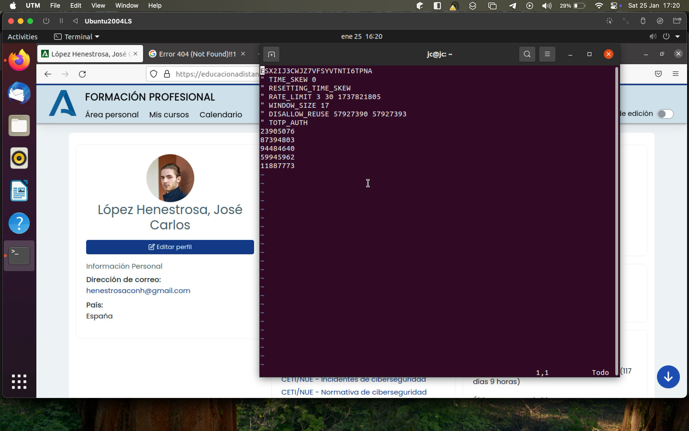
</div>

>Contenidos del archivo `~/.google_authenticator`

En caso de no disponer de la aplicación Google Authenticator, se pueden utilizar los códigos preestablecidos durante el proceso de autenticación (por ejemplo, al iniciar sesión), cuando el sistema solicita el código TOTP. En lugar de introducir un código generado por la app, se introduciría uno de los códigos de recuperación proporcionados.

Después de usar uno de los códigos preestablecidos, este queda invalidado automáticamente, mientras que los códigos restantes siguen siendo válidos. Si se usan todos los códigos de recuperación, se necesitará reconfigurar Google Authenticator.

---

## Recursos necesarios y recomendaciones

Para completar la tarea, es importante que el alumno revise y entienda los siguientes puntos:

1. **Instalación de Google Authenticator**:

	Instalar el paquete necesario:  

	```bash
	sudo apt-get install libpam-google-authenticator
	```

	Configurar Google Authenticator para el usuario actual ejecutando:  

	```bash
	google-authenticator
	```

	El alumno deberá seguir las instrucciones para generar un código QR, escanearlo con la aplicación Google Authenticator y configurar opciones como el límite de tiempo y la cantidad de códigos permitidos simultáneamente.

2. **Configuración de los archivos PAM**:

	- `/etc/pam.d/login`: Para que se pida un código en las sesiones de terminal.
	- `/etc/pam.d/lightdm`: Para que se solicite un código en las sesiones gráficas (el nombre del archivo puede variar según el gestor de sesiones, e.g., gdm o sddm).
	- `/etc/pam.d/sudo`: Para que se requiera un código cuando se utilice sudo.
	- El módulo de Google Authenticator debe configurarse **antes o después** de otros módulos en cada archivo según se quiera que la autenticación multifactor se realice antes o después de la verificación de la contraseña.

3. **El sistema PAM**:

	Comprender la estructura y el funcionamiento de los módulos PAM, específicamente los archivos como:
	- `/etc/pam.d/common-auth`: Definiciones generales de autenticación.
	- `/etc/pam.d/common-password`: Módulos relacionados con la gestión de contraseñas.
	- `/etc/pam.d/common-account`: Gestión de cuentas de usuario.
	- `/etc/pam.d/common-session`: Configuración de sesiones de usuario.

	También hay que comprender la importancia del orden de las directivas en los archivos de configuración para determinar cómo y en qué orden se aplican las políticas.
