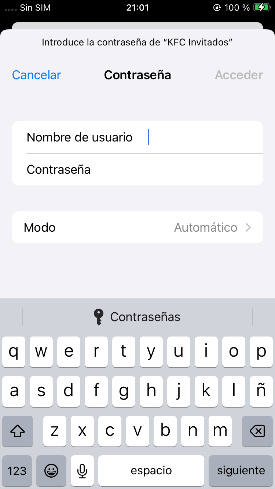

# TAREA Unidad 4: Administración de credenciales para el acceso a sistemas informáticos

## ¿Qué te pedimos que hagas?

>[!NOTE]
>Instalar, configurar y probar un servidor RADIUS para que el usuario se tenga que conectar usando unas credenciales en lugar de introducir una contraseña genérica para conectarse a una red Wi-Fi, como se hace habitualmente.
>
>Además, hay que configurar un router para que use el protocolo WPA2 Enterprise y se conecte con el servidor RADIUS para determinar si las credenciales enviadas por el usuario son válidas o no. 

### Introducción

**RADIUS (Remote Authentication Dial-In User Service)** es un protocolo que se utiliza en servidores para la autenticación, autorización y contabilización de usuarios. Para entender su relación con un router, primero es importante saber que **WPA (Wi-Fi Protected Access)** es un protocolo de seguridad para redes inalámbricas que protege las conexiones Wi-Fi mediante encriptación y autenticación. Actualmente, existe la versión WPA3, pero la más común es la **WPA2**, que reemplazó el protocolo TKIP (Temporal Key Integrity Protocol) por el protocolo **AES (Advanced Encryption Standard)**, el cual ofrece un cifrado mucho más fuerte.

Dentro de este protocolo, los dos modos más extendidos son los siguientes:

- **WPA2-Personal o WPA2-Pre-Shared Key (WPA2-PSK)**: Se usa comúnmente en routers domésticos, ya que solo requiere una contraseña compartida (Pre-Shared Key o PSK) para que los usuarios puedan conectarse a la red. Es fácil de configurar, pero si la contraseña se filtra, cualquier persona puede acceder a la red, además de que puede ser vulnerable a ataques de fuerza bruta si la clave es débil.
- **WPA2-Enterprise**: Se usa en entornos en los que muchos usuarios se conectan a una misma red privada, ya que en lugar de usar una clave compartida, cada usuario tiene credenciales únicas (usuario y contraseña, certificado digital, etc.). Esto hace que sea más seguro que WPA2-PSK porque permite administrar el acceso de cada usuario individualmente. No obstante, este modo requiere un servidor RADIUS para autenticar usuarios mediante protocolos como EAP (Extensible Authentication Protocol).

Como podemos ver, el servidor RADIUS es esencial para la autenticación de usuarios cuando un router está configurado con el protocolo WPA2-Enterprise. En este esquema, el enrutador no almacena ni valida las credenciales de los usuarios directamente, sino que actúa como un cliente RADIUS. 

En síntesis, este es el proceso que se sigue cuando un dispositivo intenta conectarse a una red Wi-Fi protegida con WPA2-Enterprise:

1. El router recibe las credenciales de autenticación y las reenvía al servidor RADIUS. 
2. El servidor RADIUS se encarga de verificar la información proporcionada y de compararla con una base de datos de usuarios autorizados, típicamente almacenados en el archivo /etc/freeradius/3.0/users. 
3. El servidor RADIUS envía una respuesta al router en la que indica si la autenticación ha sido exitosa o no.
	- Si el acceso es aprobado, el dispositivo puede conectarse a la red
	- Si el acceso es denegado, se le rechaza la conexión.

### Instalación del servidor RADIUS

En Ubuntu, se puede instalar un servidor RADIUS a través de FreeRADIUS, una de las implementaciones más populares de este protocolo. Para instalarlo, ejecutamos el siguiente comando:

```bash
sudo apt install freeradius freeradius-utils
```

<div align="center">
	
</div>

>Instalando los paquetes `freeradius` y `freeradius-utils`

Tras instalarlo, activamos el servicio ejecutando `sudo systemctl start freeradius` y verificamos su estado con `sudo systemctl status freeradius`

<div align="center">
	
</div>

>Iniciando y comprobando el correcto funcionamiento de `freeradius`

Llegados a este punto, el servidor RADIUS ha sido instalado e iniciado correctamente

### Configuración del servidor RADIUS

Para configurar FreeRADIUS en Ubuntu con el fin de que los usuarios se autentifiquen con credenciales (nombre de usuario y contraseña) en lugar de una clave WiFi genérica, tenemos que usar el protocolo EAP (Extensible Authentication Protocol) para habilitar el acceso seguro con credenciales en redes inalámbricas. 

Este es el procedimiento desglosado en pasos:

1. **Habilitar el módulo EAP-PEAP**

	Por defecto, EAP está configurado para usar MD5 (EAP-MD5), el cual es un método de autenticación dentro del protocolo EAP que utiliza el algoritmo de hash MD5 para validar credenciales. Es uno de los métodos más básicos de EAP, pero también el menos seguro.

	En su lugar, vamos a configurarlo para usar PEAP (Protected EAP) + MSCHAPv2 (Microsoft Challenge Handshake Authentication Protocol version 2), el cual es el método estándar en WPA2-Enterprise dado a su amplio soporte y seguridad.

	Para ello, editamos el archivo `/etc/freeradius/3.0/mods-enabled/eap` y cambiamos la línea en la que pone `default_eap_type = md5` por `default_eap_type = peap`.

	<div align="center">
		
	</div>
	
	>Configuración del archivo `/etc/freeradius/3.0/mods-enabled/eap` para habilitar el protocolo PEAP
	
	Tras cambiar el tipo de EAP, buscamos la línea `default_eap_type` dentro del bloque `peap {` para asegurarnos de que su valor es `mschapv2`.

	<div align="center">
		
	</div>
	
	>Configuración del archivo `/etc/freeradius/3.0/mods-enabled/eap` para habilitar MSCHAPv2

2. **Configurar usuarios y credenciales**

	Editamos el archivo `/etc/freeradius/3.0/users` para añadir usuarios con credenciales personalizadas. En este caso, vamos a añadir estas dos líneas:

	```
	usuario1 Cleartext-Password := "contraseña1"
	usuario2 Cleartext-Password := "contraseña2"
	```

	<div align="center">
		
	</div>
	
	>Configuración del archivo `/etc/freeradius/3.0/users`

3. **Obtener IP del Punto de Acceso (AP)**

	Obtener IP del Punto de Acceso (AP)

	Ejecutamos el comando sudo apt install net-tools para poder usar el comando arp -a. Este último paquete nos permitirá obtener la lista de dispositivos en la red junto con sus direcciones IP y MAC. Es importante mencionar que estoy ejecutando Ubuntu desde una máquina virtual, por lo que he tenido que cambiar el modo de red de la máquina a Bridge.

	Una vez que tenemos localizada la dirección IP, podemos ejecutar ping para comprobar que la conexión funciona correctamente.

	<div align="center">
		
	</div>
	
	>Hallando la IP del router doméstico y probando la conexión

4. **Añadir cliente (AP)**

	Editamos el archivo `/etc/freeradius/3.0/clients.conf` y añadimos la IP del AP (mi router doméstico) identificada anteriormente y una clave compartida (secret) que queramos:

	```
	client AP {
		ipaddr = 192.168.18.1
		secret = clavecompartida
	}
	```

	<div align="center">
		
	</div>
	
	>Configuración del archivo `/etc/freeradius/3.0/clients.conf` con el router doméstico añadido

	Tras guardar los cambios, reiniciamos el servicio para que la configuración surta efecto con el comando `sudo systemctl restart freeradius`.

5. **Configurar IP estática**

	Por último, le asignamos una IP estática al servidor para garantizar que siempre tenga la misma dirección, con el fin de que los clientes, dispositivos o servicios externos puedan conectarse a él sin interrupciones. Para ello, accedemos a las opciones de configuración de red del sistema y cambiamos el método **IPV4 a manual**.

	<div align="center">
		
	</div>
	
	>Configuración de la IP estática
	
	Pulsamos en **Apply** y, tras ello, ya tendremos configurado el servidor RADIUS en Ubuntu.

### Configuración de router o sistema emulador

Este punto puede variar en función de si el router que queremos configurar dispone del protocolo WPA2-Enterprise. En mi caso, mi router doméstico cuenta con él, por lo que voy a configurarlo directamente. Como método alternativo, podríamos utilizar software como OPNSense o RouterOS para emular un router que nos permita implementar la autenticación con usuario y contraseña, aunque sería por LAN en lugar de Wi-Fi. Todo este proceso debe realizarse desde una segunda máquina virtual que actuará como sistema emulador de router.

Dicho esto, procedemos a configurar el AP directamente siguiendo estos pasos:

1. **Acceder a la configuración del AP**

	Introducimos la IP del AP en un navegador web para acceder a su configuración. Como pudimos comprobar en el [apartado anterior](#configuración-del-servidor-radius), la IP del AP es `192.168.18.1`, por lo que la introducimos en el navegador.

	<div align="center">
		
	</div>
	
	>Pantalla principal de configuración del AP

	Hay que tener en cuenta que la pantalla cambiará dependiendo del fabricante del router. A su vez, cada fabricante asigna un usuario y una contraseña predeterminada. En el caso de Huawei, las credenciales son `Epuser` / `userEp`.

	<div align="center">
		
	</div>
	
	>Panel de configuraación del router tras iniciar sesión
	
2. **Configurar el AP para usar WPA2-Enterprise**

	Una vez dentro del panel de configuración del router, lo configuramos para usar WPA2-Enterprise y establecemos los parámetros del servidor RADIUS creado previamente. Para ello, seleccionamos **Advanced > WLAN > 2.4G Basic Network Settings**.

	<div align="center">
		
	</div>

	>Configuración 2.4G Basic Network por defecto

	Tenemos que cambiar el valor de la opción **Authentication Mode** a WPA2 Enterprise. Al hacer esto, se mostrarán campos de texto adicionales para añadir los parámetros del servidor RADIUS, los cuales son los siguientes:

	- **Modo de autenticación**: WPA2 Enterprise.
	- **Modo de encriptación**: AES (recordemos que TKIP es más débil).
	- **Dirección del servidor RADIUS**: Dado que lo hemos configurado para que sea estático, introducimos la dirección IP que le asignamos previamente (`192.168.18.1`).
	- **Puerto del servidor RADIUS**: `1812` (por defecto).
	- **Clave compartida RADIUS**: La definida en el archivo `clients.conf` (`clavecompartida`).
	
	Una vez terminamos el proceso, pulsamos **Apply** para que la configuración surta efecto.

## Demonstración del servidor RADIUS en funcionamiento

Para comprobar si el servidor RADIUS está funcionando correctamente, usamos `radtest` para realzar pruebas de autenticación. Como las estamos ejecutando desde la misma máquina en la que está alojado el servidor FreeRADIUS, tenemos que usar la contraseña por defecto para `localhost`, la cual es `testing123`.

Para realizar la prueba, ejecutamos el siguiente comando:

```bash
radtest usuario1 contraseña1 127.0.0.1 0 testing123
```

Donde:

- `usuario1`: Nombre de usuario que configuramos en el archivo `users`.
- `contraseña1`: Nombre de usuario que configuramos en el archivo `users`.
- `127.0.0.1`: IP del servidor RADIUS (tendríamos que cambiarla por una IP real si estuviéramos en otra máquina).
- `0`: Número de puerto NAS (`0` para pruebas locales).
- `testing123`: Secreto compartido configurado en `clientes.conf` para hacer tests con el `localhost`.

<div align="center">
	
</div>

>Ejecución del comando `radtest usuario1 contraseña1 127.0.0.1 0 testing123`

Como podemos apreciar, el usuario fue autenticado correctamente, ya que recibimos el mensaje `Access-Accept` por parte del servidor.

### Demostración de que el usuario conecta correctamente

Para comprobar que el router se ha configurado correctamente, vamos a usar un dispositivo móvil para conectarnos a la red. Para ello, abrimos los ajustes de Wi-Fi del dispositivo y comprobamos que la red `KFC Invitados` está disponible, el cual es el nombre que recibe la red que hemos configurado previamente (no confundir con `KFC Invitados 5G`).

<div align="center">
	
</div>

>Lista de redes disponibles. `KFC Invitados` se encuentra entre ellas.

Pulsamos sobre la red `KFC Invitados` y observamos que se abre una pantalla en el dispositivo móvil solicitándonos el usuario y contraseña para conectarnos.

<div align="center">
	
	
</div>

Por motivos de seguridad, Apple no muestra el texto introducido en los campos de texto de tipo contraseña. Sin embargo, he introducido la clave que establecimos en el apartado de [configuración del servidor de RADIUS](#configuración-del-servidor-radius) para este usuario (`usuario1`), que es `contraseña1`.

Pulsamos sobre el botón **Acceder** y veremos que el dispositivo se conecta a la red, lo cual indica que la red configurada y el servidor RADIUS funcionan correctamente.

<div align="center">
	
	
</div>

### Bibliografía

- Andres Sevillano Molina. (2021, 16 de febrero). Instalación y configuración servidor RADIUS Ubuntu. YouTube. [https://youtu.be/8tbAzjj6y7Q](https://youtu.be/8tbAzjj6y7Q)

---

## Resultado

### Calificación

10,00 / 10,00

### Comentarios de retroalimentación y rúbrica

