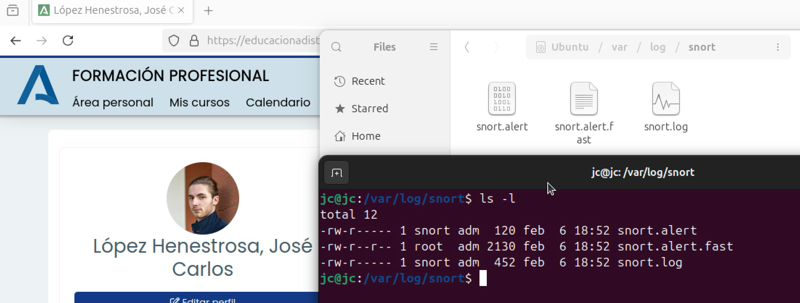

# TAREA Unidad 5: Diseño de redes seguras

## Recursos 

- Nmap: [https://nmap.org/](https://nmap.org/)
- Snort: [https://www.snort.org/downloads](https://www.snort.org/downloads)
- Adicionalemente, puedes instalar la interfaz gráfica Snorby para tener un dashboard gráfico: [https://github.com/Snorby/snorby](https://github.com/Snorby/snorby)

## ¿Qué te pedimos que hagas?

### Seguridad Wi-Fi

>[!NOTE]
>Configura en la seguridad Wi-Fi del router el filtrado MAC y añade a la lista una MAC de un dispositivo que esté a tu alcance (móvil, portátil, etc.).

En primer lugar, tenemos que averiguar la dirección MAC del dispositivo que queremos añadir a la lista. En este caso, es un dispositivo Android, por lo que vamos a **Ajustes > Acerca del teléfono > Estado > Dirección MAC Wi-Fi**.

<div align="center">
	
</div>

>Dirección MAC del dispositivo Android, el cual está en francés

Una vez obtenida, tenemos que ir a los ajustes de la red y cambiar los ajustes de privacidad para que se utilice la dirección MAC del dispositivo en lugar de una aleatoria.

Tras esto, tenemos que obtener la dirección IP del router, por lo que ejecutamos `arp -a` y tomamos como referencia la primera IP obtenida.

<div align="center">
	
</div>

>IP del router señalado en rojo

También tenemos que hallar la dirección MAC del ordenador desde el que modificamos la configuración del router para poder tener acceso a Internet. Mi equipo macOS está conectado por Wi-Fi, por lo que ejecutamos este comando:

```bash
ifconfig en0 | grep ether
```

<div align="center">
	
</div>

>Dirección MAC del macOS

<br>

Acto seguido, vamos a la configuración del router introduciendo la IP obtenida anteriormente. En nuestro caso, la dirección es `192.168.18.1`.

<div align="center">
	
</div>

>Pantalla de login para acceder a la configuración del router

Introducimos el usuario y contraseña establecidos para acceder. Si no hay ninguno configurado, podemos consultar la página web del fabricante para ver las credenciales por defecto. En el caso de Huawei, las predeterminadas son `Epuser` / `userEp`.

Una vez dentro, vamos a **Advanced > Security > Wi-Fi MAC Filtering** y activamos la opción **Enable MAC Filter**. También tenemos que cambiar el **Filter Mode** de Blacklist a **Whitelist**, ya que queremos que sólo los dispositivos con una determinada dirección MAC puedan conectarse al router.

Tras ello, añadimos las direcciones MAC del dispositivo Android y el equipo macOS para que tengan acceso a la red. Tenemos que configurarlas tanto para los **índices 1** (frecuencia 2.4GHz) y **5** (5.2GHz) del **SSID (Service Set Identifier)**.

<div align="center">
	
</div>

>Configuración de filtro por MAC en modo _whitelist_

Con esto, ya tendríamos el filtro de conexión por dirección MAC listo.

<br>

>[!NOTE]
>Desde una distribución Kali u otra de Linux, ya sea en un entorno virtualizado o nativo, suplanta el dispositivo autorizado modificando su dirección MAC (**MAC Spoofing**) con la aplicación adecuada y demuéstralo con capturas de pantalla.

Antes de entrar en detalles sobre cómo realizar la suplantación de MAC, conviene señalar que este proceso es un tanto complicado en un entorno virtualizado, ya que al suplantar la MAC, la máquina virtual pierde la red y no puede conectar de nuevo al router. Como solución, he creado un Live USB con Kali Linux para que se ejecute de forma nativa con ayuda de [esta guía](https://www.kali.org/docs/usb/live-usb-install-with-windows/).

Hay que tener en cuenta que, para que el sistema arranque a partir del Live USB, hay que acceder a la BIOS de la máquina y cambiar el orden de arranque, poniendo el dispositivo USB como la opción principal.

Después de completar este paso, iniciamos Kali Linux e intentamos conectarnos a la red Wi-Fi. Sin embargo, aunque ingresamos la contraseña correctamente, vemos que no podemos establecer la conexión.

<div align="center">
	
</div>

>Conexión fallida con el punto de acceso

Como podemos ver, el filtro por dirección MAC está funcionando correctamente, por lo que procedemos a realizar el MAC _spoofing_. Para ello, Kali cuenta con la herramienta `macchanger`, la cual nos permitirá cambiar la dirección MAC.

El proceso se desglosa en los siguientes pasos:

1. **Verificar la interfaz de red**

	Ejecutamos ip a para mostrar las interfaces de red disponibles. Para la conexión Wi-Fi, como es nuestro caso, nos interesa fijarnos en `wlan0`.

2. **Desactivar la interfaz de red antes de cambiar la MAC**

	Para evitar errores al cambiar la MAC, tenemos que desactivar la interfaz:

	```bash
	sudo ip link set wlan0 down
	```

3. **Cambiar la dirección MAC**

	Para suplantar una MAC de un dispositivo autorizado, como por ejemplo la del teléfono móvil, ejecutamos el comando:

	```bash
	sudo macchanger -m a4:55:90:cb:46:f4 wlan0
	```

	Y verificamos el cambio realizado:

	```bash
	macchanger -s wlan0
	```

4. **Reactivar la interfaz de red**

	Ahora que tenemos la MAC suplantada, activamos de nuevo la interfaz:

	```bash
	sudo ip link set wlan0 up
	```

5. **Conectar a la red manualmente**

	Podemos hacerlo a través de la GUI o de la terminal. Para que esté en consonancia con el resto del proyecto, vamos a realizarlo desde la terminal mediante la ejecución del siguiente comando:

	```bash
	nmcli device wifi connect "BRS05" password "hola123456"
	```	

	Si el cambio se ha realizado correctamente, la máquina tiene que conectarse sin problemas a la red, tal y como podemos apreciar en la siguiente captura de todo el proceso.

<div align="center">
	
</div>

>Proceso de MAC _spoofing_ completo

<br>

Como última prueba, podemos hacer un `ping` para comprobar que la conexión con la red funciona correctamente.

<div align="center">
	
</div>

>Realizando conexión vía `ping` para comprobar que funciona correctamente

Tal y como podemos comprobar, el proceso de spoofing se ha llevado a cabo con éxito. Como podemos ver, es bastante sencillo lanzar este tipo de ataques, por lo que esta capa de seguridad no es suficiente para proteger un punto de acceso. Para incrementar su seguridad, es necesario configurar el router para que use el protocolo de seguridad WPA2/3 con una contraseña fuerte en lugar de depender solo del filtrado MAC. Además, es conveniente establecer un IDS (Sistema de Detección de Intrusiones) y, si fuese necesario, un IPS (Sistema de Prevención de Intrusiones).

### Implementación IDS

>[!NOTE]
>Despliega una solución de IDS de código abierto, como Snort, y configúrala.

Vamos a instalar Snort en Ubuntu con este comando:

```bash
sudo apt-get install snort
```

Tras ejecutarlo, veremos la siguiente pantalla para configurar la herramienta:

<div align="center">
	
</div>

>Primera pantalla de configuración de Snort

<br>

Al continuar, nos pedirá introducir el intervalo de direcciones IP para la red local. La IP de mi router es `192.168.18.1`, lo cual significa que mi red local usa el rango `192.168.18.0/24`, lo que abarca las direcciones `192.168.18.1` - `192.168.18.254`.

<div align="center">
	
</div>

>Configuración del intervalo de direcciones IP para la red local

Al aceptar, la instalación se completará correctamente. Para comprobar que, efectivamente, Snort está disponible en el sistema, ejecutamos `snort -V`, lo cual debe mostrar el número de versión instalada.

<div align="center">
	
</div>

>La versión de Snort aparece, lo que indica que ha sido instalado con éxito

<br>

>[!NOTE]
>Realiza un escaneo con Nmap que trate de identificar los servicios para ver cómo se comporta la herramienta. Para ello, se requiere una máquina de ataque, que puede ser Kali, y otra máquina para desplegar Snort (puede ser otra distribución Linux o Windows).

Para realizar el ataque con Nmap, primero tenemos que identificar la IP de la máquina virtual con Ubuntu, el cual tiene instalado Snort. Para ello, ejecutamos el comando `ifconfig` en ella:

<div align="center">
	
</div>

>Ejecución del comando `ifconfig` con la IP de la máquina virtual marcada en rojo

Como podemos ver, la IP de la máquina virtual es `192.168.18.68` y está conectada a través de la interfaz de red enp0s10, el cual es un dato relevante para desplegar Snort. 

Una vez hallada la IP, ejecutaremos el siguiente comando para lanzar Snort con el fin de registrar alertas y analizar el tráfico de la interfaz de red a la que está conectada la máquina virtual.

```bash
sudo snort -l /var/log/snort/ -c /etc/snort/snort.conf -i enp0s10
```

Donde:

- `sudo`: Ejecuta Snort con privilegios de administrador, ya que requiere acceso a la interfaz de red y a archivos de configuración.
- `snort`: Llama al programa Snort.
- `-l /var/log/snort/`: Indica el directorio donde Snort almacenará los logs y las alertas generadas.
- `-c /etc/snort/snort.conf`: Especifica el archivo de configuración que Snort usará. Define las reglas, filtros y configuraciones del IDS.
- `-i enp0s10`: Define la interfaz de red en la que Snort monitoreará el tráfico. En este caso, enp0s10, ya que el ataque con Nmap se lanzará a la red Wi-Fi a la que también está conectada la máquina virtual donde hemos instalado Snort.

<div align="center">
	
</div>

>Ejecución de `snort`

Ahora que Snort está registrando y analizando el tráfico de la red, vamos al equipo con Kali Linux para lanzar el escaneo con Nmap. Para ello, ejecutamos el siguiente comando:

```bash
sudo nmap -sS 192.168.18.68
```

Donde:

- `sudo`: Ejecuta Snort con privilegios de administrador, ya que requiere acceso a la interfaz de red y a archivos de configuración.
- `nmap`: Llama al programa Nmap.
- `-sS`: Indica a Nmap que realice un **escaneo SYN** para identificar los puertos abiertos de manera rápida y sigilosa, sin establecer una conexión TCP completa. Este tipo de escaneo es ideal para descubrir servicios en ejecución en una máquina remota sin dejar huellas claras.
- `192.168.18.68`: IP de la máquina que va a recibir el ataque.

<div align="center">
	
</div>

>Lanzamiento de rastreo con Nmap

Como podemos ver, el ataque se ha ejecutado correctamente

>Interpreta los resultados de los logs del IDS tras lanzar el ataque con Nmap.

Para comprobar la respuesta de Snort ante el ataque con Nmap, volvemos a la máquina virtual con Ubuntu para comprobar los logs, los cuales se encuentran en el directorio `/var/log/snort/`, tras y como indicamos al ejecutar el programa. Ahí encontraremos tres archivos: `snort.alert`, `snort.alert.fast` y `snort.log`.

<div align="center">
	
</div>

>Archivos generados por Snort almacenados en el directorio `/var/log/snort/`

<br>

Abrimos el archivo `snort.alert.fast`, el cual contiene alertas simplificadas con un formato más conciso que otros archivos de logs completos, como `snort.alert`. Para ello, ejecutamos el comando `vim snort.alert.fast`:

<div align="center">
	
</div>

>Contenido del archivo `/var/log/snort/snort.alert.fast`

He aquí el contenido del archivo:

```
01_directorio_log_snort.png2/06-18:52:09.341530  [**] [1:1421:11] SNMP AgentX/tcp request [**] [Classification: Attempted Information Leak] [Priority: 2] {TCP} 192.168.18.55:34109 -> 192.168.18.68:705
02/06-18:52:09.348998  [**] [1:1418:11] SNMP request tcp [**] [Classification: Attempted Information Leak] [Priority: 2] {TCP} 192.168.18.55:34109 -> 192.168.18.68:161
02/06-18:52:09.341530  [**] [1:1421:11] SNMP AgentX/tcp request [**] [Classification: Attempted Information Leak] [Priority: 2] {TCP} 192.168.18.55:34109 -> 192.168.18.68:705
02/06-18:52:09.348998  [**] [1:1418:11] SNMP request tcp [**] [Classification: Attempted Information Leak] [Priority: 2] {TCP} 192.168.18.55:34109 -> 192.168.18.68:161
```

Como podemos apreciar, las alertas generadas por Snort nos informan de que ha habido actividad relacionada con escaneo o recopilación de información a través de SNMP. Para entrar en más profundidad sobre lo que revelan los datos, analizaremos la estructura de la primera alerta:

```
02/06-18:52:09.341530  [**] [1:1421:11] SNMP AgentX/tcp request [**] [Classification: Attempted Information Leak] [Priority: 2] {TCP}
192.168.18.55:34109 -> 192.168.18.68:705
```

Donde:

- **Fecha y hora en la que se notificó la alerta**: `02/06-18:52:09.341530`
- **ID de la alerta**: `[1:1421:11]`
	- `1`: ID de la familia de reglas (en este caso, podría referirse a una familia como "ET" o "Snort").
	- `1421`: ID de la regla específica de Snort que disparó la alerta.
	- `11`: Indica cuántas veces ha sido actualizada dicha regla.
- **Descripción de la alerta**: `SNMP AgentX/tcp request`
	- Esta alerta está asociada con una request (petición) de **SNMP AgentX** sobre el protocolo **TCP**.
	- **SNMP (Simple Network Management Protocol)** es un protocolo utilizado para gestionar y monitorizar dispositivos de red.
	- **AgentX** es un protocolo para que los agentes SNMP se comuniquen con otros procesos de gestión.
- **Clasificación de la alerta**: `[Classification: Attempted Information Leak]`. Indica que ha detectado un intento de fuga de información (Attempted Information Leak), lo cual sugiere que la alerta está relacionada con un comportamiento potencialmente malicioso o sospechoso, como la filtración de información de configuración o datos del sistema.
- **Prioridad de la alerta**: `[Priority: 2]`. El 2 indica que es una alerta de baja a media gravedad. No es crítica, pero aún así requiere atención.
- **Protocolo de transporte utilizado en el ataque**: `{TCP}` (Transmission Control Protocol).
- **IP de la máquina atacante**: `192.168.18.55:34109`.
- **IP de la máquina víctima**: `192.168.18.68:705`. El puerto `705` es  generalmente utilizado para AgentX.

Observamos, en definitiva, que las alertas almacenadas en el log están relacionadas con **intentos de consulta SNMP** desde la máquina `192.168.18.55` hacia la máquina `192.168.18.68`. Como ya hemos comentado, en uno de los registros se utiliza el puerto `705`, que es usado para AgentX (un protocolo para la extensión de SNMP), y en el otro se utiliza el puerto estándar `161` para SNMP.

La clasificación de ambas alertas es "Attempted Information Leak" (Intento de fuga de información), lo que sugiere que estas solicitudes pueden estar intentando acceder a información sensible o configuración de la máquina de destino sin autorización.

### Bibliografía

- Documentación de Kali Linux. (2024, 6 de marzo). _Making a Kali Bootable USB Drive on Windows_. [https://www.kali.org/docs/usb/live-usb-install-with-windows/](https://www.kali.org/docs/usb/live-usb-install-with-windows/) 
- Documentación de Kali Linux. (2024, 17 de noviembre). _macchanger_. [https://www.kali.org/tools/macchanger/](https://www.kali.org/tools/macchanger/)
- 0x00sec. (2016, 31 de mayo). _Macchanger - Spoofing your MAC Address_. [https://0x00sec.org/t/macchanger-spoofing-your-mac-address](https://0x00sec.org/t/macchanger-spoofing-your-mac-address)
- Hacklido. (2024, 11 de julio). _Getting started with Snort IPS - A QuickStart Guide_. [https://hacklido.com/blog/873-getting-started-with-snort-ips-a-quickstart-guide](https://hacklido.com/blog/873-getting-started-with-snort-ips-a-quickstart-guide)
- Manual Snort. [http://manual-snort-org.s3-website-us-east-1.amazonaws.com/](http://manual-snort-org.s3-website-us-east-1.amazonaws.com/)
- Blue Hosting. (2016, 23 de julio). _¿Cómo usar Nmap para escanear los puertos de un VPS?_ [https://docs.bluehosting.cl/tutoriales/servidores/como-usar-nmap-para-escanear-los-puertos-de-un-vps.html](https://docs.bluehosting.cl/tutoriales/servidores/como-usar-nmap-para-escanear-los-puertos-de-un-vps.html)

---

## Resultado

### Calificación

10,00 / 10,00

### Comentarios de retroalimentación y rúbrica

