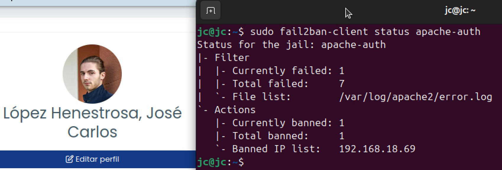

# TAREA Unidad 6: Configuración de dispositivos y sistemas informáticos I

## Índice

- [Introducción y objetivos](#introducción-y-objetivos)
- [Material de ayuda](#material-de-ayuda)
- [¿Qué te pedimos que hagas?](#qué-te-pedimos-que-hagas)
	- [Estado del sistema previo a `fail2ban`](#estado-del-sistema-previo-a-fail2ban)
	- [Instalación de `fail2ban`](#instalación-de-fail2ban)
	- [Configuración de `fail2ban`](#configuración-de-fail2ban)
	- [Ataque y reacción de `fail2ban`](#ataque-y-reacción-de-fail2ban)
	- [Comprobación de direcciones IP baneadas](#comprobación-de-direcciones-ip-baneadas)
	- [Desbaneo de direcciones IP](#desbaneo-de-direcciones-ip)
	- [Envío de email](#envío-de-email)
	- [Protección de otros servicios con `fail2ban`](#protección-de-otros-servicios-con-fail2ban)
	- [Bibliografía](#bibliografía)
- [Resultado](#resultado)
	- [Calificación](#calificación)
	- [Comentarios de retroalimentación y rúbrica](#comentarios-de-retroalimentación-y-rúbrica)

<br>

## Introducción y objetivos

>[!NOTE]
>En ocasiones, nos encontraremos con infinidad de accesos por SSH desde multitud de direcciones IP desconocidas que intentan acceder a nuestros sistemas, normalmente con los usuarios por defecto conocidos para SSH. En este tipo de ataques de fuerza bruta por SSH se usa mucho el usuario `root`, `admin`, `oracle`, y, en el caso de la Raspberry Pi, el usuario `pi`.
>
>Estos ataques pueden tener consecuencias similares a las de un ataque **DDoS (Denial-of-service Attack)**, que provoca que ciertos servicios dejen de funcionar por saturación. Además, se trata de intentos de acceso no autorizados, por lo que debemos hacer algo para pararlos.
>
>Utilizaremos el servicio `fail2ban`, que es una utilidad ya muy veterana (pero no obsoleta) y que permite securizar múltiples servicios, como SSH, pero también otros como Apache, nginx, correo, FTP, etc.

## Material de ayuda

>[!NOTE]
>Vamos a servirnos del siguiente material de Internet, aunque, como siempre, son sugerencias. Si encuentras un material mejor, por favor, hazlo saber para beneficio de los demás.
>
>- [https://foratdot.info/como-instalar-fail2ban-en-linux/](https://foratdot.info/como-instalar-fail2ban-en-linux/)
>- [https://servidordebian.org/es/squeeze/security/brute_force_attack/fail2ban](https://servidordebian.org/es/squeeze/security/brute_force_attack/fail2ban)

## ¿Qué te pedimos que hagas?

### Estado del sistema previo a `fail2ban`

Para entender la mejora que supone `fail2ban` en el sistema, simularemos un pequeño ataque por fuerza bruta a nuestro sistema. Para ello, debemos instalar un servidor SSH, por lo que actualizamos los paquetes con este comando:

```bash
sudo apt update && sudo apt upgrade
```

E instalamos el servidor SSH con este otro:

```bash
sudo apt install openssh-server
```

<div align="center">
	
</div>

>Instalando `openssh-server`

<br>

Para hallar la IP del servidor SSH en la red doméstica, ejecutamos:

```bash
hostname -I
```

<div align="center">
	
</div>

>Dirección IP de la máquina virtual con el servidor SSH instalado

Ahora que tenemos el servidor SSH instalado y la IP de la máquina hallada, intentamos realizar el ataque desde una máquina externa conectada a la misma red que el servidor SSH. Para ello, ejecutaremos sistemática este comando:

```bash
ssh usuario@192.168.18.68
```

El usuario no es importante, ni la contraseña (que obviamente el atacante no conoce), ya que el objetivo del ataque es el servicio SSH en nuestra IP. Podemos usar la configuración menos restrictiva de SSH.

Para ejecutar el ataque, utilizaremos la herramienta `hydra` en Kali Linux, la cual viene instalada por defecto en dicha distribución. Vamos a usar un diccionario bastante simple para ejecutar el ataque, ya que sólo queremos comprobar cómo reacciona el servidor SSH ante los intentos de acceso. Para crearlo, ejecutaremos el siguiente comando:

```bash
echo -e "contrasena1\ncontrasena2\ncontrasena3" > diccionario.txt
```

Cabe destacar que Kali también incluye algunos diccionarios por defecto, los cuales están almacenados en el directorio `/usr/share/wordlists/`. Entre ellos, incluye uno de los diccionarios de contraseñas más famoso, el cual es `rockyou.txt`.

Tras crear el diccionario, ejecutamos este comando para lanzar el ataque:

```bash
sudo hydra -l usuario -P diccionario.txt ssh://192.168.18.68
```

<div align="center">
	
</div>

>Ejecución del ataque con hydra desde Kali Linux al servidor SSH de la máquina virtual

<br>

Paralelamente a estos ataques, monitorizamos en nuestro servidor cómo se manifiestan dichos intentos de log en el fichero que ya conocemos, `/var/log/auth.log`, con el siguiente comando:

```bash
tail -f /var/log/auth.log
```

<div align="center">
	
</div>

>Contenido del archivo `/var/log/auth.log` que refleja los intentos de login externos por SSH

---

### Instalación de `fail2ban`

Procedemos a instalar `fail2ban` desde los repositorios debidamente actualizados de nuestro servidor. En caso de no haberlos actualizado en el apartado anterior, ejecutamos:

```bash
sudo apt update && sudo apt upgrade
```

Tras ello, procedemos a instalar `fail2ban`:

```bash
sudo apt install fail2ban
```

<div align="center">
	
</div>

>Instalando `fail2ban`

Ahora comprobamos que el servicio está instalado y funciona. Lo podemos comprobar tanto con 

```bash
service fail2ban status
```

como con 

```bash
fail2ban-client status
```

<div align="center">
	
</div>

>Comprobación de que `fail2ban` está activo en el sistema

---

### Configuración de `fail2ban`

Dado que `fail2ban` es un programa que tiene bastante trayectoria, las posibilidades que ofrece son muy amplias. Realizaremos una configuración base para que veamos su funcionamiento ante un ataque por fuerza bruta.

`fail2ban` utiliza lo que llama _jails_ (cárceles), las cuales son reglas o filtros que supervisan los registros el sistema en busca de intentos de acceso no autorizados y aplican bloqueos si detectan actividad sospechosa. Estas se utilizan para configurar  los diferentes servicios que ofrece `fail2ban`. Nosotros nos centraremos principalmente en un _jail_ para SSH.

Para ello, primero hacemos una copia del fichero inicial de configuración:

```bash
cp -p /etc/fail2ban/jail.conf /etc/fail2ban/jail.local
```

Ahora trabajaremos con el fichero `jail.local`, por lo que editamos con el siguiente comando:

```bash
sudo vim /etc/fail2ban/jail.local
```

En la sección `[DEFAULT]` indicaremos las siguientes directivas:

```
[DEFAULT]
# Comando personalizado que se ejecutará  antes de bloquear una dirección IP. En este caso, no se ejecuta ninguno.
ignorecommand = 

# Tiempo que una IP permanecerá baneada.
bantime = 240s

# Tiempo en el que deben ocurrir los intentos fallidos para activar el baneo.
findtime = 5m

# Número máximo de intentos fallidos dentro del findtime antes de banear.
maxretry = 3
```

<div align="center">
	
</div>

>Configuración de la sección `[DEFAULT]` del archivo `/etc/fail2ban/jail.local`

A continuación, buscamos el _jail_ de SSH, en ese mismo fichero, en la sección `[sshd]`, y pondremos las siguientes directivas:

```
[sshd]
# Como su valor es true, activa la _jail_ para SSH
enabled = true

# Protege el puerto 22 (o el configurado para SSH)
port = ssh

# Usa el filtro sshd.conf para detectar accesos fallidos
filter = sshd

# Busca intentos fallidos en este archivo 
logpath = /var/log/auth.log

# Bloquea una IP tras 3 intentos fallidos
maxretry = 3

# Método usado para leer logs (systemd, polling, etc.)
backend = %(sshd_backend)s
```

<br>

<div align="center">
	
</div>

>Configuración de la sección `[sshd]` del archivo `/etc/fail2ban/jail.local`

Una vez configurado el archivo, lo guardamos y reiniciamos el servicio de `fail2ban` con este comando:

```bash
sudo service restart fail2ban
```

---

### Ataque y reacción de `fail2ban`

Ahora repetiremos el mismo ataque que al principio de la práctica. No obstante, a diferencia del apartado [Estado del sistema previo a `fail2ban`](#estado-del-sistema-previo-a-fail2ban), ahora prestaremos atención a dos ficheros de log en lugar de a uno: `/var/log/auth.log` y `/var/log/fail2ban.log`.

<div align="center">
	
</div>

>Configuración del archivo `/var/log/auth.log` que refleja los intentos de login externos por SSH

<br>

<div align="center">
	
</div>

>Contenido del archivo `/var/log/fail2ban.log` que refleja la actividad recibida de la IP de la máquina desde la que se han lanzado los ataques y su posterior baneo

Como podemos apreciar, una vez que se cumplen las condiciones marcadas en el fichero de configuración `/etc/fail2ban/jail.local`, se bloqueará la IP desde la que se está realizando el ataque durante el tiempo que le indiquemos.

---

### Comprobación de direcciones IP baneadas

En continuación con el apartado anterior, comprobaremos la lista de las direcciones IP baneadas en el momento de ejecutar el siguiente comando (recuerdo que el baneo es temporal):

```bash
sudo fail2ban-client get sshd banip
```

<div align="center">
	
</div>

>Lista de direcciones IP baneadas

<br>

Por último, podremos comprobar que el método de baneo es el de incorporar una nueva regla al firewall `iptables`, donde se indica que la IP en cuestión es rechazada. Lo podremos ver con el comando:

```bash
sudo iptables -L
```

<div align="center">
	
</div>

>Comprobación de `iptables`

Como podemos ver, la IP de la máquina desde la que hemos ejecutado el ataque se ha añadido a la cadena `f2b-sshd` (`fail2ban`), ya que se está bloqueando todo el tráfico proveniente de la IP `192.168.18.55`  y se está respondiendo con un mensaje `ICMP Port Unreachable`.

---

### Desbaneo de direcciones IP

Puede que nuestro `fail2ban` haya baneado alguna IP que podamos considerar "correcta". Ante tal situación, podemos desbanear la IP con este comando:

```bash
sudo fail2ban-client set sshd unbanip 192.168.18.55
```

<div align="center">
	
</div>

>Desbaneo de dirección IP correcta

Como podemos ver, el comando devuelve `1`, lo que indica que la IP se ha desbaneado correctamente. En caso de no desbanear a la IP, devolvería el valor `0`.

Por otro lado, y de cara a que no ocurra nuevamente, podemos incluir nuestra IP o conjunto de direcciones IP en una _whitelist_ (lista blanca) para que no sean baneadas en el futuro. Esto lo indicaremos una vez más añadiendo la directiva `ignore = 192.168.18.55` a la sección `[DEFAULT]` del fichero `/etc/fail2ban/jail.local`. Podemos indicar tanto una IP concreta como un rango en formato CIDR.

<div align="center">
	
</div>

>IP de la máquina atacante añadida a la _whitelist_ de `fail2ban`

<br>

Por último, reiniciamos el servicio `fail2ban` y probamos que la IP no es baneada tras lanzar el ataque con `hydra`.

<div align="center">
	
</div>

>Ataque con IP ignorada

---

### Envío de email

Ahora debemos buscar la manera de enviar un correo electrónico al administrador desde el propio servidor para notificarle que se ha producido una alerta. Para ello, seguiremos los siguientes pasos:

1. **Configurar un método para enviar correos**

	`fail2ban` puede usar `sendmail` o `mailx` para enviar notificaciones. Nosotros usaremos `mailx`, por lo que instalamos el paquete `mailutils` en Ubuntu:

	```bash
	sudo apt install mailutils
	```

	Al ejecutar el comando, tendremos que seleccionar la configuración del servidor de correo. En nuestro caso, como solo tenemos que enviar alertas con un correo de Gmail, la opción más adecuada es "Internet site".

	<div align="center">
		
	</div>

	>Pantalla de configuración al instalar el paquete `mailutils`

	<br>

	<div align="center">
		
	</div>

	>Pantalla de configuración al instalar el paquete `mailutils`

	Luego, encontraremos otro ajuste relativo a **System mail name** (el nombre de correo del sistema), en el que tendremos que introducir nuestro nombre de dominio. Se puede dejar en blanco si no tenemos nombre de dominio, ya que vamos a utilizar Gmail en lugar del servidor local como servidor de correo.

	<div align="center">
		
	</div>

	>Pantalla de configuración al instalar el paquete `mailutils`

	Con este, ya tendremos, por el momento, la configuración inicial de `postfix`.

2. **Instalar `libsa12-modules`**

	Este paquete contiene los módulos necesarios para la implementación de la autenticación **SASL (Simple Authentication and Security Layer)**, el cual es un marco de autenticación que se utiliza para añadir soporte de autenticación a servicios como el correo electrónico. En el caso de `postfix`, SASL es utilizado para autenticar el servidor de correo como un servidor remoto, como Gmail.

	Procedemos a instalarlo con el siguiente comando:

	```bash
	sudo apt install libsas12-modules
	```

3. **Configurar `postfix` para usar Gmail**

	Abrimos la configuración de `postfix`:

	```bash
	sudo vim /etc/postfix/main.cf
	```

	Y añadimos o modificamos las siguientes líneas al final del archivo para que apunten a Gmail:

	```
	# Configuración para usar Gmail SMTP
	relayhost = [smtp.gmail.com]:587

	# Autenticación con Gmail
	smtp_sasl_auth_enable = yes
	smtp_sasl_password_maps = static:correo@gmail.com:app_password
	smtp_sasl_security_options = noanonymous
	smtp_use_tls = yes
	tls_random_source = dev:/dev/urandom

	# Otras configuraciones necesarias
	myhostname = localhost.localdomain
	mydomain = localdomain
	myorigin = /etc/mailname
	inet_interfaces = all
	inet_protocols = ipv4
	```

	<div align="center">
		
	</div>

	>Configuración aplicada al archivo `/etc/postfix/main.cf`

	Para generar la `APP_PASSWORD` con una cuenta de Google, es conveniente visitar [este enlace](#https://support.google.com/accounts/answer/185833?hl=es).

4. **Configurar el nombre de la máquina de correo (FDQN)**

	Editamos el archivo `/etc/mailname` y sustituimos el contenido por lo siguiente:

	```bash
	localhost.localdomain
	```

5. **Reiniciar `postfix`**

	Tras esto, reiniciamos `postfix` para que los cambios surtan efecto:

	```bash
	sudo systemctl restart postfix
	```

6. **Probar la configuración**

	Para asegurarnos de que `postfix` está configurado correctamente y que los correos se envían a través de Gmail, podemos enviar un correo de prueba:

	```bash
	echo "Este es un mensaje de prueba" | mail -s "Prueba de Postfix con Gmail" info@henestrosa.dev
	```

	Acto seguido, revisamos la bandeja de _spam_ del correo `info@henestrosa.dev` para comprobar que, efectivamente, hemos recibido el correo de prueba correctamente.

	<div align="center">
		
	</div>

	>Correo enviado con el comando de arriba

7. **Configurar `fail2ban` para enviar correos**

	Tenemos que volver a modificar el archivo `/etc/fail2ban/jail.local` y modificar las siguientes líneas:

	```
	[DEFAULT]
	# Dirección del administrador que recibirá los correos
	destemail = info@henestrosa.dev

	# Dirección desde la que se envían los correos
	sender = fail2ban@henestrosa.dev

	# Método de envío de correos (mail, sendmail o exim)
	mta = mail

	# Acción que fail2ban tomará. En este caso, envía el correo electrónico con # el log y el archivo de acción.
	action = %(action_mwl)s
	```

	<div align="center">
		
	</div>

	>Cambios realizados en el archivo `/etc/fail2ban/jail.local`

	Tras realizar los cambios, reiniciamos `fail2ban` para aplicar la nueva configuración:

8. **Verificar que los correos se envían correctamente**

	Para asegurarnos de que `fail2ban` está enviando los correos correctamente, podemos forzar una prueba de intento de registro fallido con este comando:

	```bash
	sudo fail2ban-client set sshd banip 1.2.3.4
	```

	<div align="center">
		
	</div>

	>Baneo manual de una IP para recibir el correo

	<br>

	A continuación, miramos la bandeja de _spam_ de la dirección de correo que configuramos como `destemail` (`info@henestrosa.dev`) y comprobamos que, efectivamente, hemos recibido el correo con éxito:

	<div align="center">
		
	</div>

	>Prueba de recepción de correo con detalle de IP baneada

---

### Protección de otros servicios con `fail2ban`

`fail2ban` permite ampliar el ámbito de protección más allá de SSH, por lo que vamos a probar a bastionar otro servicio contra ataques de fuerza bruta con dicho paquete, como el servidor web Apache.

Para ello, seguimos los siguientes pasos:

1. **Instalar Apache** 

	Ejecutamos el siguiente comando:

	```bash
	sudo apt install apache2
	```

	Y verificamos que está en ejecución:

	```bash
	sudo systemctl status apache2
	```

	<div align="center">
		
	</div>

	>Apache funcionando correctamente

2. **Configurar _jail_ para Apache**

	Añadimos la siguiente configuración al archivo `/etc/fail2ban/jail.local` a la sección `[apache-auth]` para proteger Apache:

	```
	[apache-auth]
	enabled = true
	port = http,https
	filter = apache-auth
	logpath = /var/log/apache2/error.log
	maxretry = 5
	bantime = 3600
	findtime = 600
	```

	<div align="center">
		
	</div>

	>Configuración de la sección `[apache-auth]` del archivo `/etc/fail2ban/jail.local`

3. **Configurar el filtro de `fail2ban` para Apache**

	Editamos o creamos el archivo `/etc/fail2ban/filter.d/apache-auth.conf`, el cual es necesario para definir el filtro que `fail2ban` usará para detectar intentos de acceso fallidos en los logs de Apache. Si una dirección IP aparece en los logs con estos patrones más de lo permitido (`maxretry` en el archivo `jail.local`), `fail2ban` la bloquea.

	Dentro de dicho archivo, tenemos que verificar que las directivas `failregex` e `ignoreregex` están tal que así, las cuales son las que vienen por defecto:

	```
	failregex = ^client (?:denied by server configuration|used wrong authentication scheme)\b
            ^user (?!`)<F-USER>(?:\S*|.*?)</F-USER> (?:auth(?:oriz|entic)ation failure|not found|denied by provider)\b
            ^Authorization of user <F-USER>(?:\S*|.*?)</F-USER> to access .*? failed\b
            ^%(auth_type)suser <F-USER>(?:\S*|.*?)</F-USER>: password mismatch\b
            ^%(auth_type)suser `<F-USER>(?:[^']*|.*?)</F-USER>' in realm `.+' (auth(?:oriz|entic)ation failure|not found|denied by provider)\b
            ^%(auth_type)sinvalid nonce .* received - length is not\b
            ^%(auth_type)srealm mismatch - got `(?:[^']*|.*?)' but expected\b
            ^%(auth_type)sunknown algorithm `(?:[^']*|.*?)' received\b
            ^invalid qop `(?:[^']*|.*?)' received\b
            ^%(auth_type)sinvalid nonce .*? received - user attempted time travel\b
            ^(?:No h|H)ostname \S+ provided via SNI(?:, but no hostname provided| and hostname \S+ provided| for a name based virtual host)\b
	ignoreregex =
	```

	<div align="center">
		
	</div>

	>Configuración del archivo `/etc/fail2ban/jail.local`

4. **Crear un directorio protegido**

	Para que `fail2ban` registre intentos de acceso fallidos, primero tenemos que asegurarnos de que Apache tenga un directorio protegido con `.htaccess`, por lo que procedemos a crear uno con el siguiente comando:

	```bash
	sudo mkdir /var/www/html/protegido
	```

5. **Configurar la autenticación del directorio protegido**

	Creamos el archivo `.htaccess` dentro de `/var/www/html/protegido` y añadimos lo siguiente:

	```
	AuthType Basic
	AuthName "Zona Segura"
	AuthUserFile /etc/apache2/.htpasswd
	Require valid-user
	```

	<div align="center">
		
	</div>

	>Configuración del archivo `/var/www/html/protegido/.htaccess`
	
6. **Crear usuarios para autenticación básica**

	Generamos un usuario y contraseña para este directorio:

	```bash
	sudo htpasswd -c /etc/apache2/.htpasswd test
	```

	Al ejecutarlo, nos pedirá que introduzcamos una contraseña.

	<div align="center">
		
	</div>

	>Añadiendo usuario y contraseña para el directorio protegido `/var/www/html/protegido`

7. **Habilitar el uso de `.htacess` en Apache**

	Editamos la configuración de Apache:

	```bash
	sudo vim /etc/apache2/sites-available/000-default.conf
	```

	Y buscamos la sección `<Directory /var/www/html>`, la cual tiene que estar tal que así:

	```
	<Directory /var/www/html>
		AllowOverride All
	</Directory>
	```

	<div align="center">
		
	</div>

	>Configuración del archivo `/etc/apache2/sites-available/000-default.conf`

8. **Reiniciar `fail2ban` y Apache**

	Necesario para que los cambios surtan efecto.

	```bash
	sudo systemctl restart fail2ban
	sudo systemctl restart apache2
	```

9. **Lanzar ataque contra Apache**

	Desde otra máquina conectada a la red local, lanzamos 5 intentos de conexión fallida con este comando:

	```bash
	curl --user test:test http://192.168.18.68/protegido/
	```

	<div align="center">
		
	</div>

	>Ataque desde máquina conectada a la red local

10. **Comprobar baneo de la dirección IP de la máquina atacante**

	Después de 5 intentos fallidos (según `maxretry` en la sección `apache-auth` configurada anteriormente), verificamos si la IP ha sido bloqueada mediante la _jail_ `apache-auth`:

	```bash
	sudo fail2ban-client status apache-auth
	```

	<div align="center">
		
	</div>

	>La dirección IP desde la que hemos realizado los intentos fallidos de autenticación está baneada.

	<br>
	
	También podemos revidar `iptables`, donde se indica que la IP en cuestión es rechazada.

	<div align="center">
		
	</div>

	>Las peticiones procedentes de la máquina atacante son bloqueadas

	<br>

	Por último, también podemos comprobar el log de `fail2ban` donde se registra el ataque y la acción de `fail2ban` ante el ataque al servidor Apache.

	<div align="center">
		
	</div>

	>`fail2ban` detecta y bloquea el ataque a Apache

---

### Bibliografía

- Documentación de fail2ban. https://github.com/fail2ban/fail2ban/wiki
- Documentación de Hydra. https://hydra.cc/docs/intro/
- Documentación de Apache. https://httpd.apache.org/docs/
- DigitalOcean. (2022, 4 de julio). _How To Protect SSH with Fail2Ban on Ubuntu 18.04_. https://www.digitalocean.com/community/tutorials/how-to-protect-ssh-with-fail2ban-on-ubuntu-20-04
- DigitalOcean. (2020, 6 de julio). _How To Install and Configure Postfix as a Send-Only SMTP Server on Ubuntu 18.04_. https://www.digitalocean.com/community/tutorials/how-to-install-and-configure-postfix-as-a-send-only-smtp-server-on-ubuntu-18-04
- UKHost4u. (2020, 6 de julio). _How To Protect an Apache Server with Fail2Ban on Ubuntu 20.04_. https://www.ukhost4u.com/how-to-protect-an-apache-server-with-fail2ban-on-ubuntu-20-04/
- nixCraft. (2023, 12 de agosto). _How To Set Apache Password Protected Directories With .htaccess File_. https://www.cyberciti.biz/faq/howto-setup-apache-password-protect-directory-with-htaccess-file/

---

## Resultado

### Calificación

10,00 / 10,00

### Comentarios de retroalimentación y rúbrica

