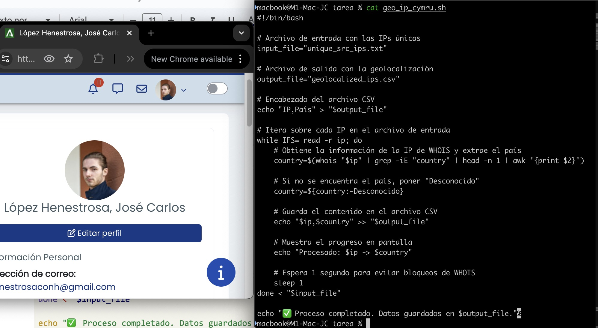

# TAREA Unidad 7: Configuración de dispositivos y sistemas informáticos II

## Índice

- [¿Qué te pedimos que hagas?](#qué-te-pedimos-que-hagas)
	- [Análisis del fichero de datos de conexiones](#análisis-del-fichero-de-datos-de-conexiones)
	- [Análisis de logs](#análisis-de-logs)
	- [Bibliografía](#bibliografía)
- [Resultado](#resultado)
	- [Calificación](#calificación)
	- [Comentarios de retroalimentación y rúbrica](#comentarios-de-retroalimentación-y-rúbrica)

<br>

## ¿Qué te pedimos que hagas?

### Análisis del fichero de datos de conexiones

>[!NOTE]
>Elabora de manera detallada y precisa un listado de IPs únicas atacantes.

Para obtener el listado de IPs únicas, descargamos el archivo adjunto en la tarea con el nombre `datos_conexiones.dat` y ejecutamos el siguiente comando en Linux:

```bash
awk '{print $5}' datos_conexiones.dat | cut -d':' -f1 | sort -u > datos_conexiones_ips_unicas.txt
```

El cual podemos desglosar de esta forma para su explicación:

```bash
awk '{print $5}' datos_conexiones.dat
```

- `awk`: Analiza y manipula archivos de texto estructurados en columnas.
- `'{print $5}'`: Comando de `awk` que imprime en pantalla el resultado de la operación. `$5$` Representa la quinta columna de cada línea del archivo.
- `datos_conexiones.dat`: Archivo a analizar y manipular con `awk`.

<br>

```bash
`cut` -d':' -f1
```

- `cut`: Permite extraer secciones de un texto basándose en delimitadores o posiciones de caracteres.
- `-d':'`: Especifica un delimitador para separar los campos.
- `-f1`: Indica qué parte extraer después de dividir la línea con el delimitador. Significa todo lo que está antes del primer `:` en cada línea. Si quisiéramos extraer también el puerto junto a la IP, utilizaríamos la opción `-f1,2`.

<br>

```bash
sort -u
```

- `sort`: Ordena las direcciones IP obtenidas a partir de `grep`.
- `-u` (unique): Elimina duplicados.

<br>

```bash
> datos_conexiones_ips_unicas.txt
```

- Guarda el resultado en el archivo `datos_conexiones_ips_unicas.txt`.

Al ejecutar este comando, se creará el archivo `datos_conexiones_ips_unicas.txt` en el mismo directorio que `datos_conexiones.dat`.

---

>[!NOTE]
>Geolocaliza e identifica las IPs filtradas

Para geolocalizar las IPs, podemos usar el servicio `whois` indicando la IP. Esto nos devolverá información acerca de la IP, como el país. Para ello, podemos crear un script en Bash en el mismo directorio en el que se ubica el archivo con las IPs filtradas (`datos_conexiones_ips_unicas.txt`):

```bash
#!/bin/bash

# Archivo de entrada con las IPs únicas
input_file="unique_src_ips.txt"

# Archivo de salida con la geolocalización
output_file="geolocalized_ips.csv"

# Encabezado del archivo CSV
echo "IP,País" > "$output_file"

# Itera sobre cada IP en el archivo de entrada
while IFS= read -r ip; do
    # Obtiene la información de la IP de WHOIS y extrae el país
    country=$(whois "$ip" | grep -iE "country" | head -n 1 | awk '{print $2}')

    # Si no se encuentra el país, poner "Desconocido"
    country=${country:-Desconocido}

    # Guarda el contenido en el archivo CSV
    echo "$ip,$country" >> "$output_file"

    # Muestra el progreso en pantalla
    echo "Procesado: $ip -> $country"

    # Espera 1 segundo para evitar bloqueos de WHOIS
    sleep 1
done < "$input_file"

echo "✅ Proceso completado. Datos guardados en $output_file."
```


>Contenido del script `geo_ip_cymru.sh`

<br>

Tras crearlo, le damos permisos de ejecución:

```bash
chmod +x geo_ip_whois.sh
```

Y ejecutamos el script:

```bash
./geo_ip_whois.sh
```


>Ejecución del archivo `geo_ip_whois.sh` obteniendo los países las IPs

<br>


>Finalización de obtención de los países de las IPs

<br>

Una vez terminado el proceso, abrimos el archivo CSV generado para comprobar que los países se muestran correctamente:


>Contenidos del archivo `geolocalized_ips.csv`

---

### Análisis de logs

>[!NOTE]
>Reconoce las herramientas ofensivas utilizadas a partir del fichero `access.log`.

Si le echamos un vistazo a dicho fichero, podemos identificar las siguientes herramientas ofensivas:

- **Nmap**

	La podemos identificar a partir del `User-Agent` de la cabecera de la petición:

	`Mozilla/5.0 (compatible; Nmap Scripting Engine; https://nmap.org/book/nse.html)`

	Dentro de las actividades detectadas, encontramos las siguientes:

	- **Escaneo de puertos y servicios:**

		```
		GET /nice%20ports%2C/Tri%6Eity.txt%2ebak
		```

	- **Enumeración de archivos y directorios sensibles:**

		```
		GET /nice%20ports%2C/Tri%6Eity.txt%2ebak
		```

	- **Verificación de rutas personalizadas:**

		```
		GET /nmaplowercheck1618132114
		GET /NmapUpperCheck1618132114
		GET /Nmap/folder/check1618132114
		```

- **Hydra**

	La podemos identificar a partir del `User-Agent` de la cabecera de la petición:

	`Mozilla/5.0 (Hydra)`

	Dentro de las actividades detectadas, encontramos las siguientes:

	- **Ataque de fuerza bruta contra el endpoint de login:**

		```
		POST /rest/user/login HTTP/1.0
		```

	- **Respuestas comunes:**

		```
		401 Unauthorized (credenciales incorrectas)
		500 Internal Server Error (posiblemente por sobrecarga o errores en el servidor)
		```

- **sqlmap**

	La podemos identificar a partir del `User-Agent` de la cabecera de la petición:

	`sqlmap/1.5.2#stable (http://sqlmap.org)`

	Dentro de las actividades detectadas, encontramos las siguientes:

	- **Inyección SQL probando parámetros en la búsqueda de productos:**

		```
		GET /rest/products/search?q=1%27%20AND%201%3D1%20--%20
		GET /rest/products/search?q=1%20AND%209700%3D9700
		```

	- **Pruebas de inyección basadas en tiempo y errores:**

		```
		GET /rest/products/search?q=1%27%20AND%201%3D1%20--%20
		GET /rest/products/search?q=1%20AND%209700%3D9700
		```

	- **Intentos de extracción de información de la base de datos:**

		```
		GET /rest/products/search?q=1%20AND%20EXTRACTVALUE%287542%2CCONCAT%280x5c%2C0x717a6b7171%2C%28SELECT%20%28ELT%287542%3D7542%2C1%29%29%29%2C0x716a787071%29%29
		```

Podemos usar los siguientes comandos en Linux con `grep` para poder detectar de una forma inmediata si un sistema ha sido atacado por alguna de estas herramientas:

```bash
# Buscar Nmap (NSE)
grep -i "Nmap Scripting Engine" access.log

# Buscar Hydra en logs (User-Agent)
grep -i "Mozilla/5.0 (Hydra)" access.log

# Buscar sqlmap (User-Agent)
grep -i "sqlmap" access.log
```


>Ejecución del comando `grep -i "Nmap Scripting Engine" access.log`

---

>[!NOTE]
>Identifica las páginas web sobre las que se ha realizado el ataque a partir del fichero `access.log`.

Si le echamos un vistazo al archivo, vemos que la estructura de la información es la siguiente:

```
<IP> - - [fecha] "<método> <ruta> <versión>" <código> <bytes> "<referer>" "<user-agent>"
```

Ahora que tenemos la estructura identificada, podemos ejecutar el siguiente comando para obtener los sitios web atacados con `Nmap`:

```bash
grep 'Nmap Scripting Engine' access.log | awk -F'"' '{print$2}' | sort | uniq -c | sort -nr
```

Donde:

- `grep 'Nmap Scripting Engine' access.log`: Filtra solo las líneas que contienen "Nmap Scripting Engine'".
- `awk -F'"' '{print $2}'`: Divide por comillas (") y extrae la segunda parte, que contiene la solicitud HTTP completa.
- `sort | uniq -c`: Cuenta y ordena los intentos únicos.
- `sort -nr`: Ordena por número de intentos en orden descendente.

Al ejecutarlo, obtenemos lo siguiente:

```
3 PROPFIND / HTTP/1.1
2 POST / HTTP/1.1
1 POST /sdk HTTP/1.1
1 GET /nmaplowercheck1618132114 HTTP/1.1
1 GET /NmapUpperCheck1618132114 HTTP/1.1
1 GET /Nmap/folder/check1618132114 HTTP/1.1
1 GET /.git/HEAD HTTP/1.1
```


>Ejecución del comando `grep 'Nmap Scripting Engine' access.log | awk -F'"' '{print$2}' | sort | uniq -c | sort -nr`

<br>

Procedemos a realizar el proceso para analizar los sitios web atacados por `Hydra`:

```bash
grep 'Mozilla/5.0 (Hydra)' access.log | awk -F'"' '{print$2}' | sort | uniq -c | sort -nr
```

Al ejecutarlo, obtenemos lo siguiente:

```
144 POST /rest/user/login HTTP/1.0
144 GET /rest/user/login HTTP/1.0
```


>Ejecución del comando `grep 'Mozilla/5.0 (Hydra)' access.log | awk -F'"' '{print$2}' | sort | uniq -c | sort -nr`

<br>

Por último, volvemos a repetir el proceso para `sqlmap`:

```bash
grep 'sqlmap/1.5.2#stable (http://sqlmap.org)' access.log | awk -F'"' '{print$2}' | sort | uniq -c | sort -nr
```

Debido a la cantidad de líneas, he adjuntado un archivo llamado `sqlmap_sitios_web.txt` en el que aparecen todos los sitios atacados por `sqlmap`.


>Ejecución del comando `grep 'sqlmap/1.5.2#stable (http://sqlmap.org)' access.log | awk -F'"' '{print$2}' | sort | uniq -c | sort -nr`

<br>

Podemos unificar estos tres comandos en un script de Bash para identificar todos los sitios atacados:

```bash
#!/bin/bash

# Hay que cambiar la ruta del archivo en caso de que no esté en el mismo directorio que este script
LOG_FILE="access.log"

# Lista de herramientas a buscar
TOOLS=(
    "Nmap Scripting Engine"
    "Mozilla/5.0 (Hydra)"
    "sqlmap/1.5.2#stable (http://sqlmap.org)"
)

# Iterar sobre cada herramienta y proesar el log
for TOOL in "${TOOLS[@]}"; do
    echo -e "\n==== Endpoints escaneados por $TOOL ===="
    grep "$TOOL" "$LOG_FILE" | awk -F'"' '{print$2}' | sort | uniq -c | sort -nr
done
```

Para poder ejecutarlo, le damos permisos de ejecución:

```bash
chmod +x analizar_logs.sh
```

Y lo ejecutamos:

```bash
./analizar_logs.sh
```

Para evitar este tipo de ataques, podemos implementar límite de intentos y CAPTCHA, proteger y sanear las peticiones para evitar inyecciones SQL, restringir el acceso a directorios ocultos (como `.git`) con reglas de firewall, implementar `fail2ban` y habilitar autenticación en dos pasos para usuarios `admin`.


>Ejecución del script

Para evitar este tipo de ataques, podemos implementar límite de intentos y CAPTCHA, proteger y sanear las peticiones para evitar inyecciones SQL, restringir el acceso a directorios ocultos (como `.git`) con reglas de firewall, implementar `fail2ban` y habilitar la autenticación en dos pasos para usuarios admin.

---

>[!NOTE]
>Identifica correctamente los usuarios utilizados en cada servicio utilizado a partir del fichero `auth.log`

Si le echamos un vistazo al archivo, como las siguientes líneas:

```
Apr 11 09:41:19 thunt sshd[8260]: Accepted password for www-data from 192.168.10.5 port 40112 ssh2
Apr 11 09:39:52 thunt sshd[8229]: Disconnecting authenticating user www-data 192.168.10.5 port 40078: Too many authentication failures [preauth]
Apr 11 09:39:37 thunt sshd[8232]: Failed password for www-data from 192.168.10.5 port 40084 ssh2
```

Podemos identificar estos detalles del ataque:

- **Nombre del sistema en el que ocurren los eventos:** `thunt`
- **Usuario objetivo**: `www-data`
- **Servicio atacado**: `sshd` (servicio SSH)
- **IP atacante**: `192.168.10.5`
- **Método**: Múltiples intentos de autenticación fallidos en rápida sucesión desde diferentes puertos.

Si analizamos el archivo con más detalle, veremos que el patrón de ataque consiste en _password spraying_, que se caracteriza por los numerosos intentos fallidos de contraseña para `www-data` desde la misma IP, pero con diferentes puertos.

Con respecto a las conexiones exitosas, encontramos estas dos:

```
Apr 11 09:41:32 thunt sshd[8494]: Accepted password for www-data from 192.168.10.5 port 40114 ssh2
Apr 11 09:41:19 thunt sshd[8260]: Accepted password for www-data from 192.168.10.5 port 40112 ssh2
```

Como podemos apreciar, **el ataque tuvo éxito dos veces**:

- A las 09:41:19 se aceptó una contraseña correcta y se abrió una sesión para `www-data`.
- A las 09:41:32 hubo otra conexión exitosa para `www-data`.

En este caso, podemos utilizar algunos comandos útiles de Linux para identificar los ataques, tales como:

```bash
# Ver intentos fallidos recientes
grep 'Failed password' auth.log

# Ver conexiones SSH exitosas
grep 'Accepted password' auth.log

# Ver sesiones abiertas actuales
who

# Ver historial de comandos del usuario www-data
sudo -u www-data cat ~www-data/.bash_history
```


>Ejecución del comando `grep 'Failed password' auth.log`

<br>

Aparte del servicio sshd, se accede a otros tres más, que son `cron`, `systemd`, `su` y `sudo`, tal y como se evidencia en estas líneas:

```
# cron
Apr 11 09:39:01 thunt CRON[8164]: pam_unix(cron:session): session opened for user root by (uid=0)
Apr 11 09:39:01 thunt CRON[8164]: pam_unix(cron:session): session closed for user root

# su
Apr 11 09:42:57 thunt su: pam_unix(su:session): session closed for user thunt
Apr 11 09:42:57 thunt su: pam_unix(su:session): session closed for user www-data
Apr 11 09:42:01 thunt sudo: pam_unix(sudo:session): session closed for user root

# sudo
Apr 11 09:43:35 thunt sudo: pam_unix(sudo:auth): Couldn't open /etc/securetty: No such file or directory
Apr 11 09:43:37 thunt sudo: pam_unix(sudo:auth): Couldn't open /etc/securetty: No such file or directory

# systemd
Apr 11 09:41:19 thunt systemd-logind[737]: New session 12 of user www-data.
Apr 11 09:41:19 thunt systemd: pam_unix(systemd-user:session): session opened for user www-data by (uid=0)
Apr 11 09:41:25 thunt systemd-logind[737]: Session 12 logged out. Waiting for processes to exit.
Apr 11 09:41:25 thunt systemd-logind[737]: Removed session 12.
Apr 11 09:41:32 thunt systemd-logind[737]: New session 14 of user www-data.
Apr 11 09:41:44 thunt systemd-logind[737]: Session 14 logged out. Waiting for processes to exit.
Apr 11 09:41:44 thunt systemd-logind[737]: Removed session 14.
```

Como podemos ver en los logs, hay tres usuarios víctimas de los ataques, que son:

- `root` → `cron, sudo`
- `www-data` → `sshd, su, systemd`
- `thunt` → `su`

Para evitar estos ataques, es necesario tomar medidas como, por ejemplo, cambiar la contraseña del usuario `www-data`, deshabilitar el acceso SSH para este usuario (en caso de que no sea necesario), implementar `fail2ban` para bloquear IPs después de múltiples intentos fallidos, habilitar la autenticación por clave SSH en lugar de solo contraseña y revisar el sistema para comprobar posibles compromisos de información como consecuencia del acceso no autorizado del atacante.

---

>[!NOTE]
>Comprueba el servicio al que ha tenido acceso al atacante y los ficheros que ha descargado y mediante qué método a partir del fichero `vstftpd.log`.

A partir de dicho archivo, podemos apreciar que el atacante ha accedido al servicio FTP, como se desprende de los registros de descarga (`OK DOWNLOAD`) y autenticación (`OK LOGIN`) en las siguientes líneas:

```
Sun Apr 11 09:35:37 2021 [pid 8152] [ftp] OK LOGIN: Client "::ffff:192.168.10.5", anon password "?"
Sun Apr 11 09:35:45 2021 [pid 8154] [ftp] OK DOWNLOAD: Client "::ffff:192.168.10.5", "/www-data.bak", 2602 bytes, 544.81Kbyte/sec
```

El método de acceso del atacante fue login anónimo, usando contraseñas como `?`, `ls`, `IEUser@`, tal y como podemos concluir a partir de estas líneas:

```
Sun Apr 11 09:35:37 2021 [pid 8152] [ftp] OK LOGIN: Client "::ffff:192.168.10.5", anon password "?"
Sun Apr 11 09:08:34 2021 [pid 8020] [ftp] OK LOGIN: Client "::ffff:192.168.10.5", anon password "IEUser@"
Sun Apr 11 08:18:07 2021 [pid 6627] [ftp] OK LOGIN: Client "::ffff:127.0.0.1", anon password "ls"
```

Respecto a los archivos descargados encontramos estos dos, los cuales se descargaron mediante el comando `DOWNLOAD` de FTP después de la autenticación anónima exitosa.

- `/www-data.bak`
- `/coupons_2013.md.bak`

Estas son las líneas del archivo de registro que lo demuestran:

```
Sun Apr 11 09:35:45 2021 [pid 8154] [ftp] OK DOWNLOAD: Client "::ffff:192.168.10.5", "/www-data.bak", 2602 bytes, 544.81Kbyte/sec
Sun Apr 11 09:36:08 2021 [pid 8154] [ftp] OK DOWNLOAD: Client "::ffff:192.168.10.5", "/coupons_2013.md.bak", 131 bytes, 3.01Kbyte/sec
```

Para evitar este acceso indebido, se debería deshabilitar el acceso anónimo en FTP si no es necesario, auditar los archivos `.bak` para determinar si contenían información sensible,  monitorizar la IP que ha accedido de forma anónima (`192.168.10.5`), deshabilitar cuentas predeterminadas y restringir el acceso por IP (_whitelist_).

Adicionalmente, siempre es recomendable tener copias de seguridad seguras, actualizar los servicios para parchear vulnerabilidades conocidas y utilizar protocolos cifrados.

---

### Bibliografía

- Documentación de `sqlmap`. https://sqlmap.org/
- LinuxConfig. (2021, 12 de octubre). _Linux commands cheat sheet_. https://linuxconfig.org/linux-commands-cheat-sheet
- Documentación de `Hydra`. https://hydra.cc/docs/intro/
- Documentación de `WHOIS`. https://whois.cymru.com/
- Documentación de `Nmap`. https://nmap.org/

---

## Resultado

### Calificación

- / 10,00

### Comentarios de retroalimentación y rúbrica


