# TAREA Unidad 8: Configuración de dispositivos para la instalación de sistemas informáticos

## Índice

- [Introducción y objetivos](#introducción-y-objetivos)
- [Requisitos iniciales](#requisitos-iniciales)
- [¿Qué te pedimos que hagas?](#qué-te-pedimos-que-hagas)
	- [Situación de partida](#situación-de-partida)
	- [Técnica 3: Cambiar propietario del fichero](#técnica-3-cambiar-propietario-del-fichero)
	- [Técnica 4: Uso de ACLs](#técnica-4-uso-de-acls)
	- [Técnica 5: Uso del permiso SetUID](#técnica-5-uso-del-permiso-setuid)
	- [Técnica 6: Configuración del fichero `sudoers` (`visudo`)](#técnica-6-configuración-del-fichero-sudoers-visudo)
	- [Conclusiones](#conclusiones)

<br>

## Introducción y objetivos

>[!NOTE]
>Esta práctica tiene como objetivo probar distintas técnicas para que un usuario tenga privilegios a la hora de realizar una acción concreta, así como demostrar que "no todo vale" con tal de lograr un objetivo en el sistema, ya que puede conllevar graves efectos colaterales. 
>
>En este caso se trata de permitirle visualizar un fichero de sistema (`/var/log/syslog`) a un usuario que inicialmente no tiene permiso para hacerlo. 
>
>Evaluaremos los pros y contras de cada una de las técnicas con criterios como: facilidad de implementación de la medida, conocimientos previos necesarios, nivel de seguridad comprometido, ámbito de aplicación, etc. 

## Requisitos iniciales

>[!NOTE]
>El escenario se puede realizar con un sistema operativo Linux Ubuntu o similar (no usar Kali).
>
>Para desarrollar esta práctica, utilizaremos dos usuarios:
>
>- El primero será nuestro usuario habitual, que es administrador (pertenece al grupo `sudo`), con el que realizaremos las operaciones.
>- El segundo será un usuario sin privilegios y que se llamará como tu usuario IDEA. Este usuario será el que intente realizar la operación descrita en los objetivos. De partida debe tener los mínimos privilegios posibles. 
>- Si ya tienes creado un usuario IDEA y pertenece a `sudo`, puedes sacarlo del grupo con el comando `gpasswd -d <IDEA> sudo`.

>[!IMPORTANT]
>Al final de cada una de las pruebas, tendremos que volver al estado original del sistema, para poder probar cada técnica de manera individual.

Para crear el usuario IDEA (jlophen1202 en mi caso), seguimos el siguiente proceso:

1. Creamos el usuario sin privilegios con el comando `sudo adduser jlophen1202`.

	<div align="center">

	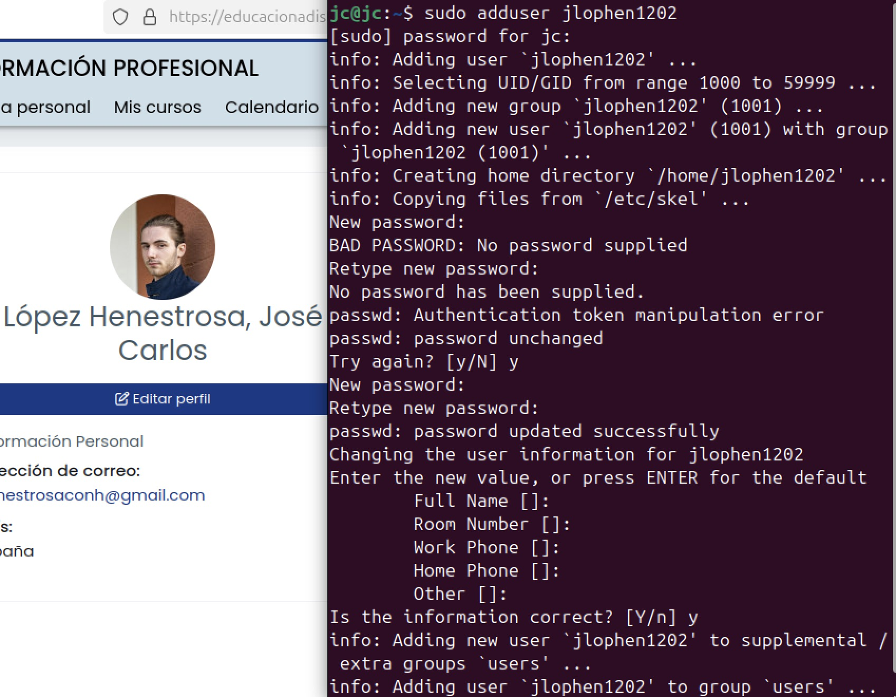
	</div>

	>Creación del usuario

2. Verificamos que el usuario no pertenece al grupo `sudo` con el comando `groups jlophen1202`.
	<div align="center">

	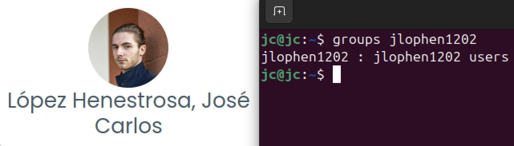
	</div>
	
	>Verificación del grupo al que pertenece el usuario jlophen1202

## ¿Qué te pedimos que hagas?

### Punto de partida

>[!NOTE]
>Prueba que el usuario IDEA no puede leer el fichero `/var/log/syslog`. Esta es la situación de partida de cada una de las técnicas a probar. 
>
>Por cada técnica, se tiene que realizar el siguiente procedimiento:
>1. Indica cómo realizarlo.
>2. Prueba de que IDEA puede leer el fichero.
>3. Evalúa pros.
>4. Evalúa contras.
>5. Vuelve a la situación de partida.

Iniciamos sesión con el usuario y comprobamos que, efectivamente, no se permite leer el fichero `/var/log/syslog`.

<div align="center">

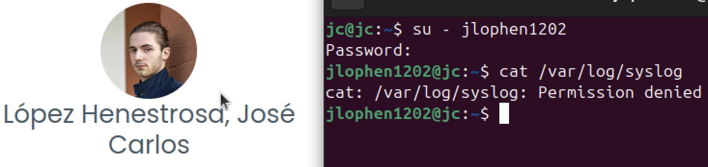
</div>

>Permiso denegado al intentar leer el fichero con el usuario IDEA sin privilegios

---

### Técnica 1: Cambiar permisos al fichero

>[!NOTE]
>Cambia los permisos mínimos necesarios para poder leer el fichero.
>
>Por cada técnica, se tiene que realizar el siguiente procedimiento:
>1. Indica cómo realizarlo.
>2. Prueba de que IDEA puede leer el fichero.
>3. Evalúa pros.
>4. Evalúa contras.
>5. Vuelve a la situación de partida.

Para cambiar los permisos del fichero `/var/log/syslog`, tenemos que ejecutar el comando con un usuario que pertenezca a un grupo con permisos de `sudo`. Con él, ejecutamos:

```bash
sudo chmod +r /var/log/syslog
```

Tras ello, cambiamos de usuario con `su - jlophen1202` y leemos el fichero con `cat /var/log/syslog`.

<div align="center">

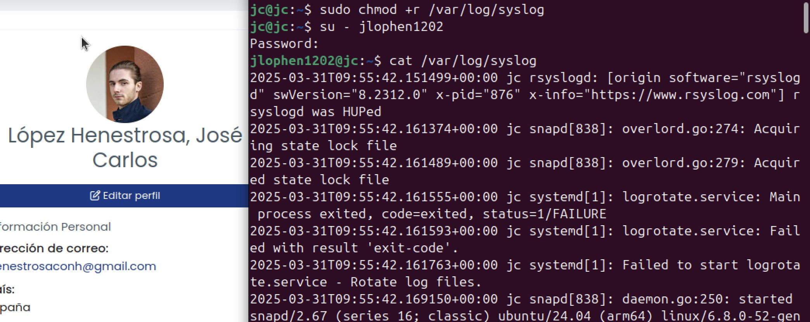
</div>

>Captura del proceso

Como podemos comprobar, ahora el usuario IDEA tiene acceso al archivo. A pesar de que esta técnica es bastante fácil y rápida de aplicar, no es la más segura, ya que ahora cualquier usuario puede leer el archivo.

Para revertir los cambios, cambiamos al usuario con permisos de `sudo` y ejecutamos el siguiente comando:

```bash
sudo chmod 640 /var/log/syslog
```

Acto seguido, cambiamos de nuevo al usuario IDEA para comprobar que los cambios se han aplicado correctamente.

<div align="center">

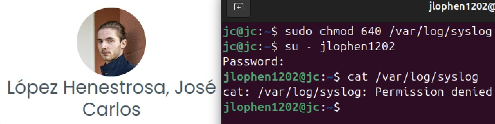
</div>

>Captura del proceso

---

### Técnica 2: Incluir al usuario en el grupo `adm` o `root`

>[!NOTE]
>Incluye al usuario IDEA en el grupo `adm` o `root` (según el estado inicial), de manera que pueda acceder al contenido del fichero. 
>
>**Nota**: Requiere "reiniciar" sesión con `su - ${USER}`.

Con un usuario con permisos de `sudo`, ejecutamos el siguiente comando para añadir al usuario IDEA al grupo `adm`:

```bash
sudo usermod -G adm jlophen1202
```

Comprobamos el grupo al que pertenece ahora el usuario IDEA para verificar que el cambio se ha realizado correctamente:

```bash
groups jlophen1202
```

Tras ello, cambiamos de usuario al usuario IDEA y leemos el archivo con `cat /var/log/syslog`.

<div align="center">

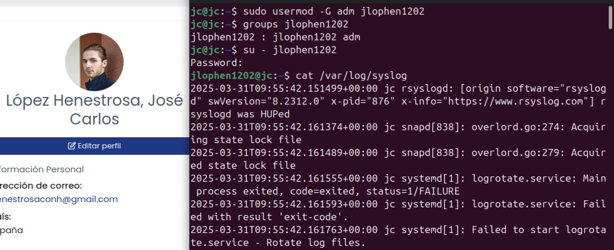
</div>

>Captura del proceso

Como podemos ver, el usuario IDEA puede leer el archivo sin problemas. Este proceso es igual de sencillo y rápido que la [técnica 1](#técnica-1-cambiar-permisos-al-fichero), ya que solo requiere añadir al usuario a un grupo existente que ya tiene acceso de lectura a este fichero. No obstante, al añadir al usuario al grupo `adm`, le estamos dando más permisos de los que requiere para acceder al archivo, lo que conlleva riesgos como la exposición de información sensible.

Para revertir los cambios, cambiamos al usuario con permisos de `sudo` y eliminamos al usuario del grupo `adm` con este comando:

```bash
sudo gpasswd -d usuario adm
```

A continuación, volvemos a cambiar al usuario IDEA para comprobar que los cambios se han aplicado correctamente.

<div align="center">

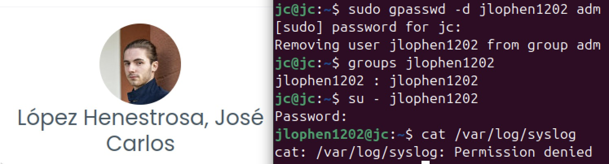
</div>

>Captura del proceso

---

### Técnica 3: Cambiar propietario del fichero

>[!NOTE]
>Asigna como propietario de `/var/log/syslog` al usuario IDEA. Pero cuidado, porque podrías perder el acceso al fichero y, por tanto, a su actualización.

Con un usuario con permisos de `sudo`, ejecutamos el siguiente comando para cambiar el propietario del archivo `/var/log/syslog`:

```bash
sudo chown jlophen1202:jlophen1202 /var/log/syslog
```

Comprobamos que el cambio de propietario se ha realizado correctamente:

```bash
ls -l /var/log/syslog
```

Por último, cambiamos al usuario IDEA y leemos el archivo con `cat /var/log/syslog`:

<div align="center">

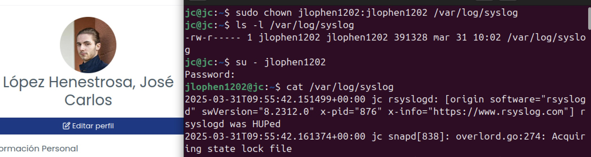
</div>

>Captura del proceso

Como podemos apreciar, el usuario IDEA puede leer el archivo correctamente.

Aunque esta técnica también es sencilla, rápida y no depende de grupos o configuraciones complejas, este cambio interfiere con la administración del sistema, ya que los archivos de registro suelen ser gestionados por el sistema o por un usuario administrador. Esto interfiere con los mecanismos del sistema que dependen de estos archivos, hasta el punto de que el sistema no pueda escribir en el archivo y se generen errores en el registro de logs. También comporta problemas potenciales de seguridad al otorgar acceso innecesario a datos sensibles y que el usuario pueda modificar su contenido a su antojo.

Para revertir los cambios, cambiamos al usuario con permisos de `sudo` y cambiamos el propietario del archivo:

```bash
sudo chown root:adm /var/log/syslog
```

Por último, comprobamos que los cambios han surtido efecto correctamente:

```bash
ls -l /var/log/syslog
```

<div align="center">

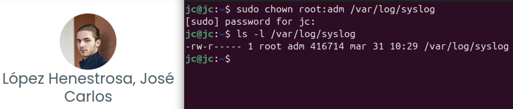
</div>

>Captura del proceso

---

### Técnica 4: Uso de ACLs

>[!NOTE]
>Añade una ACL al fichero para que el usuario IDEA tenga el permiso de sólo lectura. 
>
>Recuerda que, para volver al estado inicial, eliminamos la regla ACL con el comando `sudo setfacl -x user:usuario fichero` o "resetear" la ACL con `sudo setfacl -b fichero`.

Con un usuario con permisos de `sudo`, ejecutamos el siguiente comando para añadir una ACL que permita solo leer el archivo al usuario IDEA:

```bash
sudo setfacl -m u:jlophen1202:r /var/log/syslog
```

Donde:
- `setfacl -m` → Modifica las ACL.
- `u:jlophen1202:r` → Le da al usuario (`u`) jlophen1202 permisos de solo lectura (`r`) sobre el archivo `/var/log/syslog`.

Tras ello, verificamos que la ACL se ha añadido correctamente ejecutando este comando:

```bash
getfacl /var/log/syslog
```

Lo cual muestra esto por pantalla:

```
# file: /var/log/syslog
# owner: root
# group: adm
user::rw-
user:jlophen1202:r--
group::rw-
mask::rw-
other::---
```

Esto indica que el usuario jlophen1202 tiene permisos de solo lectura (`user:jlophen1202:r--`) en el archivo `/var/log/syslog`.

Hecho esto, comprobamos que el usuario puede leer correctamente el archivo con el comando `cat /var/log/syslog`.

<div align="center">

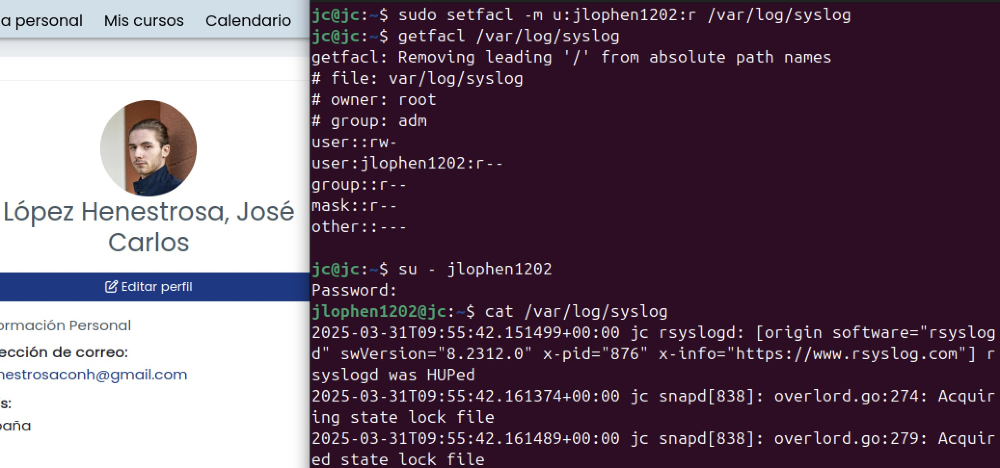
</div>

>Captura del proceso

Esta técnica permite especificar permisos detallados por usuario, lo que permite otorgar exactamente los permisos que necesitamos sin alterar los permisos globales del archivo o conceder más permisos de los necesarios al usuario en cuestión sin afectar a otros usuarios. Esto hace que sea más fácil saber quién tiene acceso a qué, ya que la configuración de ACL permite editar los permisos de varios usuarios o grupos para el mismo fichero o directorio.

Entre sus contras, encontramos la ligera complejidad administrativa que conlleva la gestión de permisos, ya que muchos ficheros y usuarios hacen que, potencialmente, aumente el número de configuraciones de ACL. Por otra parte, también pueden generar confusión si alguien no está acostumbrado a trabajar con ACL, ya que los permisos tradicionales y las ACL pueden entrar en conflicto o no resultar obvios al inspeccionar los permisos de un archivo. Asimismo, no todos los sistemas de archivos o herramientas son compatibles con ACL, lo que puede provocar errores o accesos no autorizados.

Para revertir los cambios, cambiamos al usuario con permisos de `sudo` y eliminamos la ACL:

```bash
sudo setfacl -x u:jlophen1202 /var/log/syslog
```

Donde:
- `setfacl -x` → Elimina una entrada ACL.
- `u:jlophen1202` → Indica que queremos eliminar la ACL asociada al usuario jlophen1202.

Acto seguido, comprobamos que los cambios han surtido efecto correctamente:

```bash
getfacl /var/log/syslog
```

Lo cual muestra esto por pantalla:

```
# file: /var/log/syslog
# owner: root
# group: adm
user::rw-
group::rw-
mask::rw-
other::---
```

<div align="center">

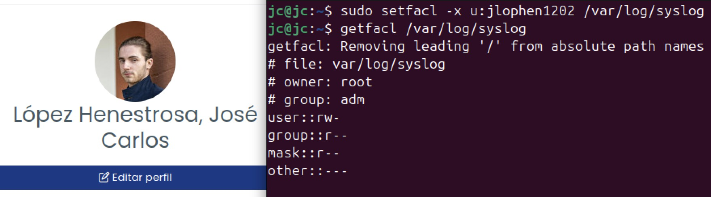
</div>

>Captura del proceso

Como podemos apreciar, ya no aparece la línea `user:jlophen1202:r--`.

---

### Técnica 5: Uso del permiso SetUID

>[!NOTE]
>Modifica el bit `setuid` a algún comando que permita leer ficheros (por ejemplo, `less` o `more`) de manera que adquiera permisos de `root` al acceder al fichero `/var/log/syslog`.
>
>La manera de asignarlo será con `sudo chmod 4755 Ruta_de_less`.

Para permitir que el usuario IDEA lea el archivo `/var/log/syslog` con permisos de `root`, podemos utilizar el comando `chmod` para establecer los permisos adecuados en un archivo o comando. El objetivo es que el usuario pueda ejecutar un comando como `less` o `more` con privilegios elevados cuando lea dicho archivo.

La manera de hacerlo, a nivel conceptual, sería:

1. Crear un enlace simbólico o ajustar los permisos de un comando como `less` o `more` para que se ejecute con privilegios de `root` cuando lea el archivo `syslog`. Para eso, podemos aplicar el bit `setuid` a dichos comandos.

2. Usar el comando `chmod` con el bit `setuid`, cuyo valor es 4755. Este bit permite que el programa se ejecute con los privilegios del propietario del archivo, que en este caso es el usuario `root`.

Dada esta descripción, solo nos queda ejecutar este comando con un usuario con permisos de `root`:

```bash
sudo chmod 4755 $(which less)
```

Donde:

- `sudo chmod 4755` → Aplica el bit `setuid` para el usuario propietario al comando `less`, lo que hace que `less` se ejecute con los privilegios del usuario `root`. Sin embargo, esto **no implica** otorgar acceso completo a la shell de `less` a aquellos usuarios que **no** dispongan de los permisos necesarios.
- `4755`:
	- `4`: Indica que el bit `setuid` se debe establecer.
	- `7`: Otorga permisos de lectura, escritura y ejecución al propietario (en este caso, `root`).
	- `5`: Otorga permisos de lectura y ejecución al grupo.
	- `5`: Otorga permisos de lectura y ejecución a otros usuarios (como el usuario IDEA).
- `$(which less)` → Obtiene la ruta del comando `less`.

Con esta configuración, el usuario IDEA podrá ejecutar el comando `less /var/log/syslog` con privilegios de `root` y leer el archivo.

<div align="center">

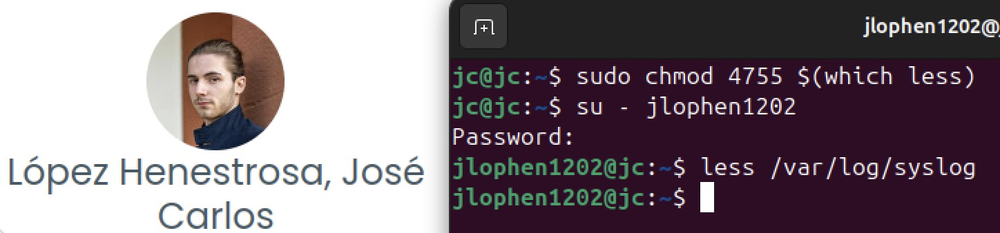
</div>

<div align="center">

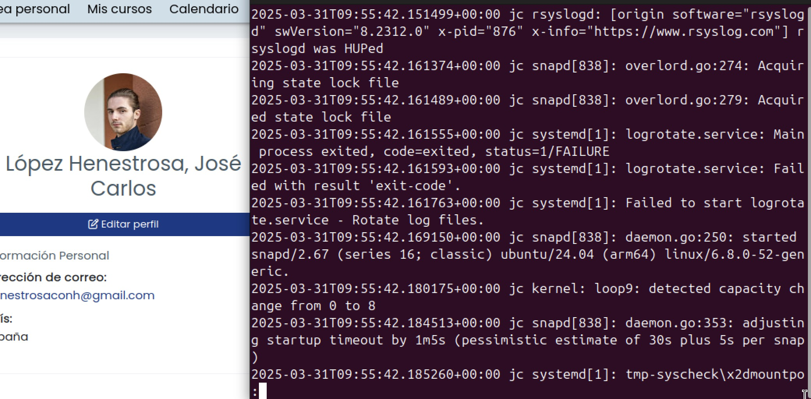
</div>

>Captura del proceso

Debido al uso del bit `setuid`, el programa `less` puede ser ejecutado con permisos de `root`, pero el acceso a una shell a través de `:!sh` dentro de `less` no concede privilegios elevados. La shell no tendría permisos de `root`, ya que el comando `less` se ejecuta con permisos de `root`, pero cualquier comando que se ejecute dentro de `less` (como una shell) no hereda estos permisos elevados.

Esta técnica tiene como pros la facilidad de acceso a archivos protegidos y el acceso controlado a un solo comando específico (`less`, en este caso). Por otro lado, tal y como se plantea el ejercicio con el uso del comando `chmod 4755`, cualquier usuario puede usar `less` para abrir ficheros que requieran permisos elevados, lo cual no es óptimo a nivel de ciberseguridad.

Para revertir el proceso, restablecemos los permisos de `less` cambiándoselos a 0755 (estado original) y volvemos a probar a abrir el archivo `/var/log/syslog` con el usuario IDEA:

<div align="center">

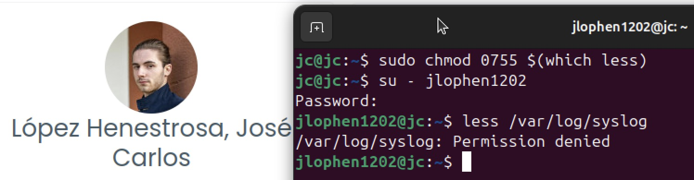
</div>

>Captura del proceso

Como podemos ver, el comando `less` se ha restablecido correctamente.

---

### Técnica 6: Configuración del fichero `sudoers` (`visudo`)

>[!NOTE]
>Añade una regla mediante el comando `sudo visudo` que permita al usuario IDEA acceder al fichero `/var/log/syslog` mediante el uso del comando `less`.

Para permitir que el usuario IDEA pueda leer el archivo usando `less` con `sudo`, debemos añadir una regla en el archivo de configuración de `sudo` (`sudoers`). Para ello, abrimos dicho archivo con un usuario con permisos de `sudo`:

```bash
sudo visudo
```

Y añadimos la siguiente línea al final del archivo:

```
jlophen1202 ALL=(ALL) /usr/bin/less /var/log/syslog
```

Donde:
- `jlophen1202` → Nombre del usuario al que se le da el permiso.
- `ALL=(ALL)` → Permite ejecutar el comando como cualquier usuario.
- `/usr/bin/less /var/log/syslog` → Restringe el uso de `sudo` únicamente para ejecutar `less` sobre `/var/log/syslog`.

Al añadirlo, guardamos el archivo y lo cerramos.

<div align="center">

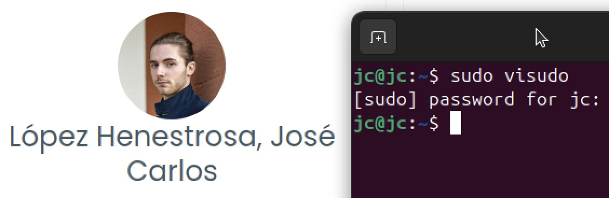
</div>

<div align="center">

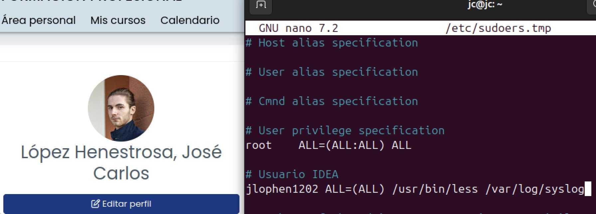
</div>

>Captura del proceso

Una vez hecho esto, cambiamos al usuario IDEA y ejecutamos el siguiente comando para abrir el archivo `/var/log/syslog`:

```bash
sudo less /var/log/syslog
```

<div align="center">

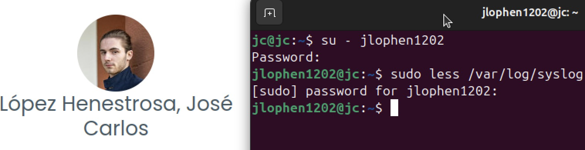
</div>

<div align="center">

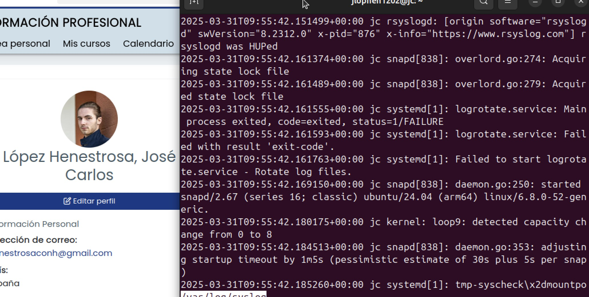
</div>

>Captura del proceso

Esta técnica evita la exposición innecesaria al cambiar los permisos del archivo o añadir al usuario a grupos con más privilegios, tal y como hemos hecho en técnicas anteriores. Hay que destacar que cualquier intento del usuario de leer el archivo queda registrado en los logs de `sudo`, lo que permite realizar registrar los accesos para auditorías.

Como contrapartida, a pesar de haber controlado el acceso del usuario al comando específico (`less`) y al archivo concreto (`/var/log/syslog`) sin otorgarle permisos generales de `sudo`, el usuario está ejecutando `less` con permisos elevados. Esto implica que puede usar `:!sh` con privilegios de superusuario y acceder a otras configuraciones, lo que podría ocasionar cambios no deseados. Para solucionarlo, habría que usar otros comandos, como `cat`, `tail` o `head` en lugar de `less` para que el usuario solo pueda ver el contenido del archivo.

Para revertir el proceso, eliminamos la línea añadida al fichero `sudoers` y volvemos a intentar abrir el archivo `/var/log/syslog` con el usuario IDEA:

<div align="center">


</div>

<div align="center">


</div>

>Captura del proceso

Como podemos ver, los cambios se han restablecido correctamente.

---

### Conclusiones

>[!NOTE]
>Una vez vistas y probadas todas las técnicas, responde:
>
>¿Cuál elegirías y por qué?

Si tenemos en cuenta los pros y los contras que hemos planteado por cada técnica, podemos concluir que las tres mejores son el uso de ACL, el uso del permiso SetUID y la modificación del fichero `sudoers`, ya que permiten un control granular sobre la lectura de un determinado archivo para un usuario sin privilegios. No obstante, todas estas técnicas presentan contras: ACL es un servicio que puede no estar disponible en ciertos sistemas y que no es auditable, el acceso con la modificación del bit `setuid` tampoco es auditable y permite a usuarios sin privilegios abrir archivos que requieren privilegios elevados y el acceso granular como usuario `sudo` implica que se puedan hacer cambios desde la shell de `less`.

A pesar de los inconvenientes presentados, escogería la técnica con el uso de ACL si el sistema que usamos lo tiene disponible, ya que, aunque no es auditable (o no de forma sencilla, al menos), es el que permite tener un mayor control sobre los permisos de cada usuario a la hora de manipular un fichero.

Como nota adicional, la opción ideal sería añadir el usuario IDEA a `sudoers` y permitirle ejecutar el comando `cat` como superusuario en lugar de `less`, tal y como se expone en [su desarrollo](#técnica-6-configuración-del-fichero-sudoers-visudo), para evitar el uso indebido de la shell de `less`, ya que cuenta con la ventaja de ser auditable de forma sencilla.

---

>[!NOTE]
>¿Conoces otra técnica o combinación que logre el mismo objetivo?

Como técnica alternativa para que el usuario IDEA sin privilegios pueda leer el fichero `/var/log/syslog`, podemos crear un grupo de usuarios al que asignarle permisos de lectura a dicho fichero.

Para ello, creamos un grupo con el siguiente comando, ejecutándolo con un usuario con permisos de `sudo`:

```bash
sudo groupadd logs
```

Donde `groupadd logs` crea un nuevo grupo llamado `logs`.

A continuación, añadimos al usuario IDEA al grupo logs recién creado:

```bash
sudo usermod -aG logs jlophen1202
```

Donde:
- `usermod` → Modifica la configuración de un usuario.
- `-aG logs` → Añade (`-a`) al usuario especificado al grupo logs sin eliminarlo de otros grupos.
- `jlophen1202` → Nombre del usuario al que vamos a añadir al grupo.

Tras esto, cambiamos el grupo propietario del archivo `/var/log/syslog`:

```bash
sudo chown root:logs /var/log/syslog
```

Donde `chown root:logs /var/log/syslog` cambia el propietario del archivo `/var/log/syslog` para que el propietario siga siendo `root`, pero el grupo ahora sea `logs`.

A pesar de que, por defecto, los permisos del fichero `/var/log/syslog` deberían ser 640, los cambiamos a dicha combinación para asegurarnos de que sean los adecuados:

```bash
sudo chmod 640 /var/log/syslog
```

Donde:
- `chmod 640 /var/log/syslog` → Cambia los permisos del archivo:
- `640`:
	- `6` (`rw-`): El propietario (`root`) tiene permisos de lectura y escritura.
	- `4` (`r--`): Los miembros del grupo (`logs`) solo tienen permisos de lectura.
	- `0` (`---`): Otros usuarios no tienen permisos de escritura ni de lectura.

<div align="center">

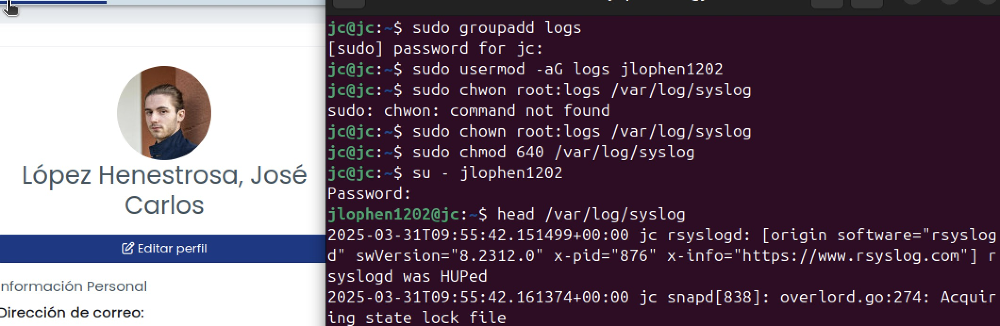
</div>

>Captura del proceso

Para revertir este cambio, eliminamos al usuario IDEA del grupo `logs` con el usuario con permisos de `root`:

```bash
sudo gpasswd -d jlophen1202 logs
```

Donde `gpasswd -d jlophen1202 logs` elimina al usuario IDEA del grupo de usuarios `logs`.

Por último, deshacemos el cambio de propiedad del archivo al grupo original (`root`) con este comando:

```bash
sudo chwon root:root /var/log/syslog
```

<div align="center">

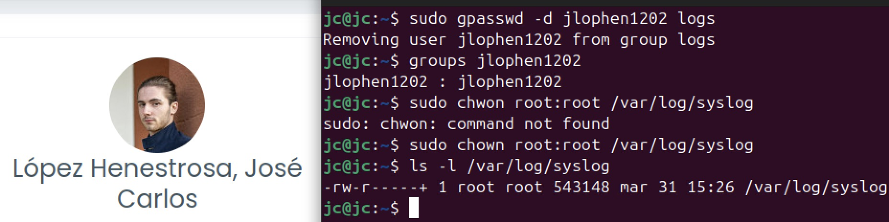
</div>

>Captura del proceso

---

## Resultado

### Calificación

- / 10,00

### Comentarios de retroalimentación y rúbrica

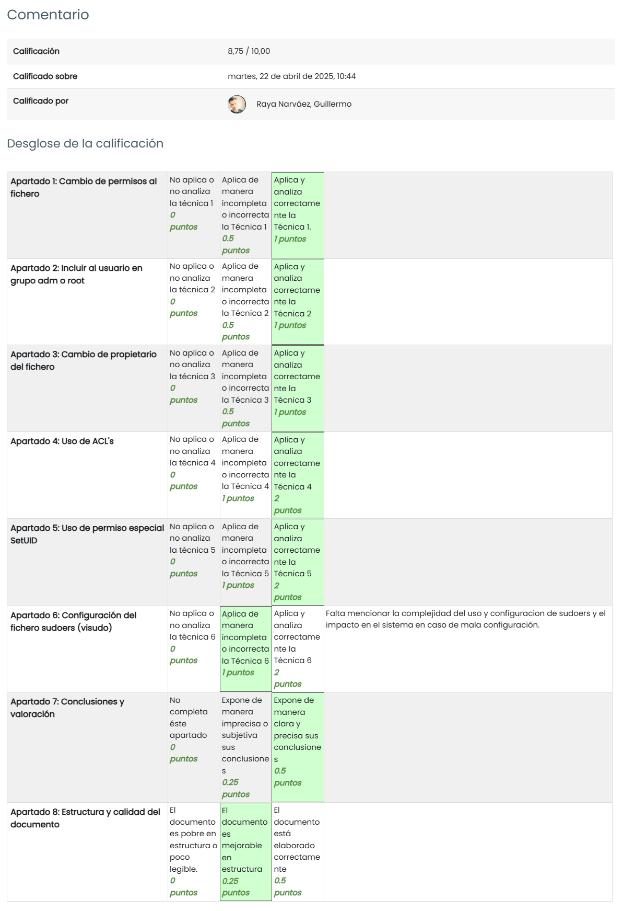