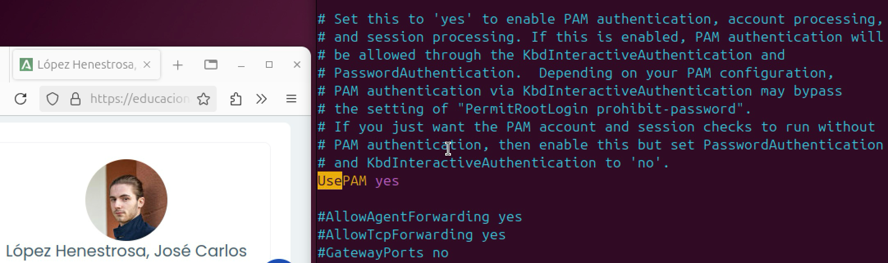
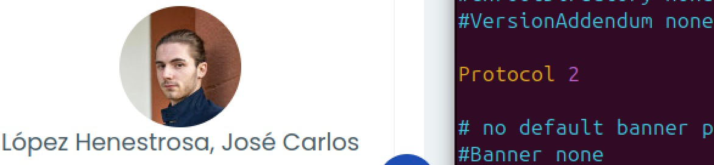

# TAREA Unidad 9: Configuración de sistemas informáticos

## Índice

- [Introducción y objetivos](#introducción-y-objetivos)
- [¿Qué te pedimos que hagas?](#qué-te-pedimos-que-hagas)
	- [Apartado 1](#apartado-1)
	- [Apartado 2](#apartado-2)
	- [Apartado 3](#apartado-3)
	- [Apartado 4](#apartado-4)
	- [Apartado 5](#apartado-5)
	- [Apartado 6](#apartado-6)
	- [Apartado 7](#apartado-7)
	- [Apartado 8](#apartado-8)
	- [Apartado 9](#apartado-9)
	- [Apartado 10](#apartado-10)
- [Resultado](#resultado)
	- [Calificación final](#calificación-final)
	- [Comentarios de retroalimentación y rúbrica](#comentarios-de-retroalimentación-y-rúbrica)

<br>

## Introducción y objetivos

El responsable de seguridad de una empresa ha decidido que un servicio crítico y muy utilizado por los administradores debe estar protegido, con el fin de aumentar el nivel de seguridad de las tareas asociadas a la utilización del SSH. Por ello, ha decidido implementar las medidas de seguridad expuestas en cada apartado.

Los objetivos de esta tarea son los siguientes:

- Se han enumerado y eliminado los programas, servicios y protocolos innecesarios que hayan sido instalados por defecto en el sistema.
- Se han configurado las características propias del sistema informático para imposibilitar el acceso ilegítimo mediante técnicas de explotación de procesos.
- Se ha incrementado la seguridad del sistema de administración remoto SSH y otros.
- Se ha instalado y configurado un Sistema de detección de intrusos en un Host (HIDS) en el sistema informático.
- Se han instalado y configurado sistemas de copias de seguridad.

Propuesta de herramientas para su realización:

- **Máquina con sistema operativo Linux**: Centos, Debian, Ubuntu,...
- **Servicio de SSH corriendo en la máquina Linux**: OpenSSH
- **Máquina que permita la conexión al servicio para realizar las pruebas de seguridad**. Se podrá utilizar una máquina asociado al pentesting (ej: Kali Linux) o una herramienta gráfica de un entorno Windows (ej: Putty, MobaXTerm,…)
- **Opcional**. Herramientas de auditoría de seguridad del servicio: `nmap`, `metasploit`, `hydra`, scripts de GitHub…

Se evaluará con 1 punto cada tarea relativa al bastionado. **Deberá aportarse una prueba de que la medida de protección funciona, con una antes y otra después de aplicarla**. Se contará cada apartado como válido si se demuestra la protección a través de los parámetros de configuración del servicio.

## ¿Qué te pedimos que hagas?

### Apartado 1

>[!NOTE]
>Bloquear el acceso remoto con el usuario `root`

Primero tenemos que habilitar el inicio de sesión de root con contraseña para poder conectarnos a este usuario mediante SSH. Para ello, ejecutamos los siguientes comandos:

```
# Verifica que el usuario root está en el sistema
getent passwd root

# Verifica si tiene contraseña establecida
# Si la salida es root L, login deshabilitado
# Si la salida es root P, login habilitado
sudo passwd -S root 

# Establece o cambia la contraseña de root
sudo passwd root
```

<div align="center">


</div>

>Activar login de `root` por contraseña

<br>

Ahora probamos a conectarnos mediante SSH al usuario `root`:

```bash
ssh root@IP_PRIVADA
```

<div align="center">


</div>

>Conexión por SSH correcta

<br>

Para bloquear el acceso remoto con el usuario `root`, tenemos que modificar el fichero `/etc/ssh/sshd_config` con privilegios de superusuario, el cual contiene la configuración del servidor SSH. Para ello, utilizamos el siguiente comando:

```bash
sudo vim /etc/ssh/sshd_config
```

Una vez dentro, tenemos que buscar la línea `PermitRootLogin` y descomentarla. A su vez, tendremos que cambiar el valor por defecto `prohibit-password` por `no` para bloquear el acceso remoto con el usuario `root`.

<div align="center">


</div>

>Captura del archivo `/etc/ssh/sshd_config` con la línea modificada

<br>

Tras esto, guardamos los cambios, salimos y reiniciamos el servicio:

```bash
sudo systemctl restart ssh
```

Si intentamos conectarnos de nuevo al usuario `root` por SSH, veremos que sale el aviso "Permission denied", lo cual bloquea la conexión con el usuario `root`, por lo que la configuración se ha aplicado correctamente.

<div align="center">


</div>

>Captura del proceso

---

### Apartado 2

>[!NOTE]
>Bloquear la sesión si permanece sin actividad durante 5 minutos

Para conseguir esto, tenemos que tener en cuenta que el proceso varía en función de la versión de ssh que tengamos instalada, ya que a partir de la 9.2 los métodos divergen. En este caso, tengo la versión 9.7 instalada, por lo que tenemos que añadir las directivas `ChannelTimeout` para cerrar automáticamente los canales que no han tenido tráfico en un intervalo de tiempo determinado y `UnusuedConnectionTimeout` para terminar las conexiones de cliente que no tienen canales abiertos durante un período de tiempo determinado:

<div align="center">


</div>

>Captura del archivo `/etc/ssh/sshd_config` con las directivas añadidas

<br>

Tras esto, guardamos los cambios, salimos y reiniciamos el servicio:

```bash
sudo systemctl restart ssh
```

Para comprobar que la sesión se cierra correctamente tras el periodo de tiempo detallado, esperamos los 5 minutos, tras los cuales aparece un mensaje que informa de que se ha cerrado la conexión.

<div align="center">


</div>

A pesar de que no se pueda demostrar el proceso fielmente con capturas de pantalla, podemos ver que, tras el periodo de inactividad, la conexión SSH se cierra correctamente.

Fuente: https://serverfault.com/questions/1162826/how-to-ensure-that-ssh-drops-the-connection-after-8-hours-of-no-typing

---

### Apartado 3

>[!NOTE]
>Forzar el acceso de los usuarios al servicio con claves públicas/privadas
>
>Las claves privadas de los usuarios deberán tener configuradas los permisos correctamente para que un usuario no pueda manipular claves privadas de otros usuarios.

Primero, tendremos que desactivar la autenticación mediante contraseña en SSH. Para ello, modificamos el archivo `/etc/ssh/sshd_config` con estas líneas:

```
PasswordAuthentication no           # valor previo: línea comentada
ChallengeResponseAuthentication no  # valor previo: línea comentada
UsePAM no                           # valor previo: yes
PubkeyAuthentication yes            # valor previo: línea comentada
```

Al poner `UsePAM no`, le indicamos al servidor SSH que no utilice Pluggable Authentication Modules y que solo siga los mecanismos básicos de autenticación de OpenSSH, como las claves públicas.

<div align="center">




</div>

Una vez cambiado el valor de estas directivas, guardamos los cambios y salimos.

Ahora, creamos las claves públicas/privadas para cada usuario que vaya a acceder al servidor. Para ello, usamos el siguiente comando para el usuario `jc`:

```bash
ssh-keygen -t ed25519 -C "usuario@servidor"
```

Donde:

- `ssh-keygen`: Herramienta de Linux para generar claves SSH.
- `-t ed25519`: Especifica el tipo de clave. En este caso, es ED25519, un algoritmo moderno, seguro y rápido.
- `-C "usuario@servidor"`: Añade un comentario a la clave pública para identificarla fácilmente. No afecta al funcionamiento.

<div align="center">


</div>

>Captura del proceso de creación y configuración de las claves públicas/privadas

Al realizar el proceso, se generan tanto la clave privada (`~/.ssh/id_ed25519`) como la clave pública (`~/.ssh/id_ed25519.pub`).

Hecho esto, copiamos la clave pública al servidor con este comando:

```bash
ssh-copy-id "jc@192.168.100.111"
```

Esto copiará la clave pública al archivo:

```
/home/jc/.ssh/authorized_keys
```

Al ejecutarlo, encontraremos lo siguiente:

<div align="center">


</div>

>Copia la clave pública al servidor

<br>

Ahora que tenemos todo configurado, reiniciamos el servicio SSH:

```bash
sudo systemctl restart ssh
```

Y probamos a conectarnos al usuario `jc`:

<div align="center">


</div>

>Conexión por SSH correcta

---

### Apartado 4

>[!NOTE]
>Limitar el acceso al servicio únicamente para un usuario

Para ello, tenemos que modificar el archivo `/etc/ssh/sshd_config` y añadir la directiva `AllowUsers` con el nombre de usuario que queremos permitir. En este caso, será `jc`.

```
AllowUsers jc
```

<div align="center">


</div>

>Directiva añadida al archivo `/etc/ssh/sshd_config`

Tras esto, guardamos los cambios y salimos.

Para comprobar que los cambios se han aplicado correctamente, creamos un nuevo usuario en el sistema:

```bash
sudo adduser usuario_prueba_ssh
```

Reiniciamos el servicio para que los cambios surtan efecto:

```bash
sudo systemctl restart ssh
```

Por último, intentamos establecer una conexión SSH con el usuario recién creado:

<div align="center">


</div>

>Prueba fallida de conexión SSH al nuevo usuario

<br>

Como podemos comprobar, la conexión es rechazada. En cambio, si intentamos establecer la conexión con el usuario `jc`, veremos que se lleva a cabo correctamente:

<div align="center">


</div>

>Conexión por SSH correcta

---

### Apartado 5

>[!NOTE]
>Limitar el acceso al servicio para determinadas IPs

Para ello, editamos el archivo `/etc/ssh/sshd_config` y añadimos las directivas `Match Address` para restringir el acceso SSH por IP o rango de IP y la directiva `DenyUsers` para bloquear todo por defecto.

<div align="center">


</div>

>Directiva añadida al archivo `/etc/ssh/sshd_config`

<br>

Tras esto, guardamos los cambios, salimos y reiniciamos el servicio:

```bash
sudo systemctl restart ssh
```

Para comprobar que la configuración funciona correctamente, probamos a conectarnos por SSH al usuario `jc` desde otra máquina conectada a la misma red. Cabe destacar que se han desactivado temporalmente los cambios realizados en el [apartado 3](#apartado-3) para verificar esta directiva específicamente:

<div align="center">


</div>

>Conexión por SSH desde otra máquina con una dirección IP no autorizada

<br>

Como podemos observar, no se permite realizar la conexión. En cambio, si probamos desde la máquina con la IP autorizada, veremos que, efectivamente, se efectúa la conexión correctamente:

<div align="center">


</div>

>Conexión por SSH correcta con la dirección IP autorizada

---

### Apartado 6

>[!NOTE]
>Implementar la versión segura del protocolo
>
>Para esto se debe usar la directiva `Protocol`

SSH tiene estas dos versiones principales: 

SSH-1 es un protocolo antiguo y vulnerable. Ya no es seguro.
SSH-2 es la versión moderna, segura y recomendada.

Para implementar la versión segura (SSH-2), tenemos que editar el archivo /etc/ssh/sshd_config y buscar la directiva Protocol, a la que le tendremos que asignar el valor 2. Esto indica que el servidor SSH solo aceptará conexiones usando el protocolo SSH versión 2.

<div align="center">


</div>

>Directiva añadida al archivo `/etc/ssh/sshd_config`

Tras esto, guardamos los cambios, salimos y reiniciamos el archivo:

```bash
sudo systemctl restart ssh
```

---

### Apartado 7

>[!NOTE]
>Bloquear "Port-forwarding" y "X11 Forwarding" a través del servicio
>
>Para probarlo, debe usarse el parámetro de `ssh -X`. Con algunos clientes de SSH como MobaXTerm puede darnos ideas de dicha configuración.

Para ello, tenemos que modificar el archivo de configuración `/etc/ssh/sshd_config` y añadir estas líneas para desactivar el reenvío:

```
AllowTcpForwarding no             # valor previo: línea comentada
X11Forwarding no                  # valor previo: yes
```

<div align="center">


</div>

>Directiva añadida al archivo `/etc/ssh/sshd_config`

<br>

Tras esto, guardamos los cambios, salimos y reiniciamos el archivo:

```bash
sudo systemctl restart ssh
```

Para comprobar que está bloqueado el X11 Forwarding, ejecutamos el siguiente comando:

```bash
ssh -X jc@192.168.100.111
```

<div align="center">


</div>

>Conexión por SSH correcta con el aviso de que la petición X11 forwarding falló, lo cual es correcto

---

### Apartado 8

>[!NOTE]
>Mostrar un mensaje a los usuarios en el inicio de sesión en el que se indique el tipo de sistema al que están accediendo y la obligación de cumplir con la normativa interna de la empresa
>
>Directiva `Banner`.

En primer lugar, crearemos un archivo (/etc/ssh/ssh-banner.txt) con el mensaje que queremos mostrar, que en este caso será el siguiente:

```
****************************************************
*  Bienvenido al Servidor Ubuntu Corporativo       *
*                                                  *
*  Este sistema es propiedad de la empresa XYZ.    *
*  El acceso está restringido y regulado por la    *
*  normativa interna. Cualquier uso indebido será  *
*  sancionado.                                     *
****************************************************
```

<div align="center">


</div>

>Fichero `/etc/ssh/ssh-banner.txt` con el mensaje especificado anteriormente

<br>

Guardamos y cerramos el archivo.

A continuación, configuramos la directiva Banner en el fichero de configuración del servidor SSH `/etc/ssh/sshd_config`:

<div align="center">


</div>

<br>

Tras esto, guardamos los cambios, salimos y reiniciamos el servicio:

```bash
sudo systemctl restart ssh
```

Para comprobar que aparece el mensaje especificado, iniciamos una sesión SSH:

<div align="center">


</div>

>Conexión SSH en el que aparece el mensaje configurado en la directiva `Banner`

---

### Apartado 9

>[!NOTE]
>Establecer el protocolo de cifrado SHA2-512 o SHA2-256
>
>Para probar esto, podemos usar el comando `nmap --script ssh2-enum-algos -sV -p 22 localhost`.

Para usar uno de estos protocolos de cifrado, tenemos que configurar el archivo `/etc/ssh/sshd_config` y añadir las siguientes líneas para forzar el uso de algoritmos modernos con SHA2:

```
# Algoritmos de intercambio de claves
KexAlgorithms curve25519-sha256@libssh.org,diffie-hellman-group-exchange-sha256

# Algoritmos de cifrado simétrico
Ciphers aes256-ctr

# Algoritmos de integridad con SHA2-512
MACs hmac-sha2-512
```

<div align="center">


</div>

>Directivas añadidas al archivo `/etc/ssh/sshd_config`

Tras esto, guardamos los cambios, salimos y reiniciamos el servicio:

```bash
sudo systemctl restart ssh
```

Por último, comprobamos los algoritmos soportados con `nmap` ejecutando este comando:

```bash
nmap --script ssh2-enum-algos -sV -p 22 localhost
```

<div align="center">


</div>

>Rastreo realizado con `nmap`

Con este comando, se listan los algoritmos soportados por el servidor SSH. Como podemos comprobar, todos los algoritmos configurados aparecen correctamente en el resumen del escaneo realizado por `nmap`.

---

### Apartado 10

>[!NOTE]
>Activar los logs del servicio para poder enviárselos al SOC

Para ello, configuramos la directiva LogLevel en el archivo /etc/ssh/sshd_config. Hay que destacar que hay distintos niveles posibles de log, los cuales son los siguientes:

- QUIET
- FATAL
- ERROR
- INFO (por defecto)
- VERBOSE
- DEBUG

En este caso, vamos a configurarlo con el nivel VERBOSE:

<div align="center">


</div>

>Directiva añadida al archivo `/etc/ssh/sshd_config`

Tras esto, guardamos los cambios, salimos y reiniciamos el servicio:

```bash
sudo systemctl restart ssh
```

Por defecto en Ubuntu, los logs de SSH se almacenan en el fichero `/var/log/auth.log`. Para comprobar que se están guardando correctamente, probamos a iniciar sesión por SSH:

<div align="center">


</div>

>Conexión por SSH

<br>

A continuación, revisamos dicho fichero:

<div align="center">


</div>

>Contenido del archivo `/var/log/auth.log`

Como podemos comprobar, los logs se almacenan correctamente con el nivel indicado en la configuración del servicio SSH.

---

## Resultado

### Calificación final

- / 10,00

### Comentarios de retroalimentación y rúbrica

