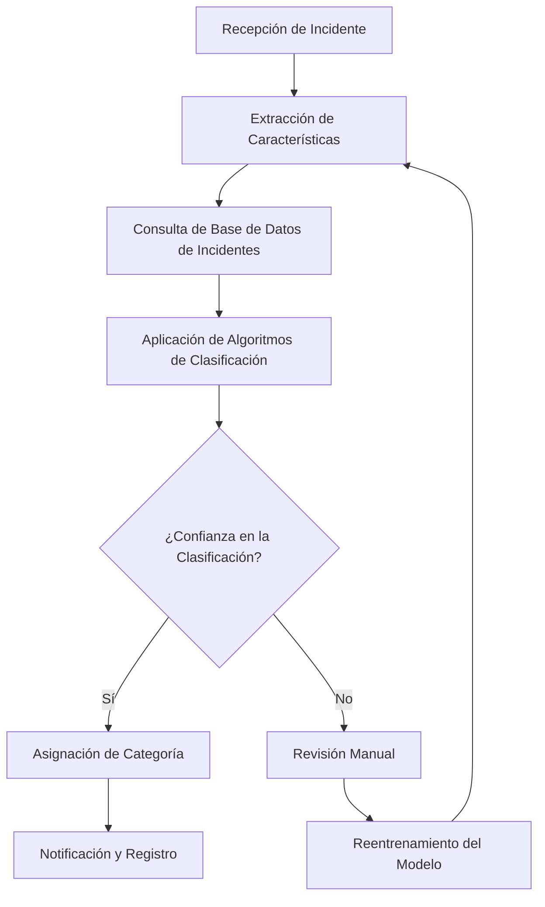
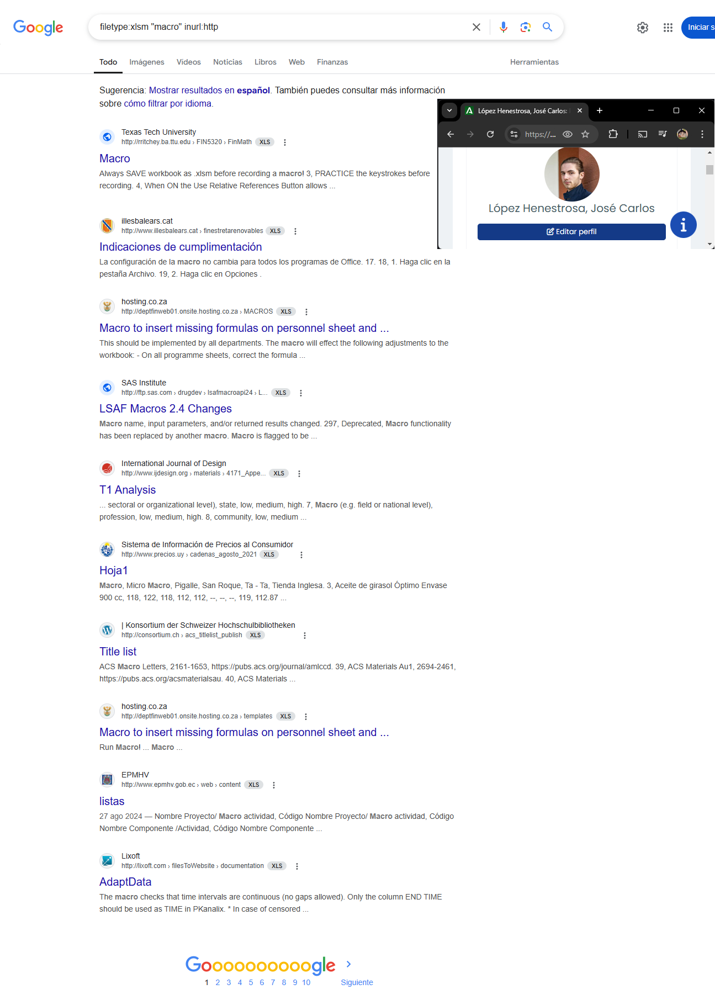
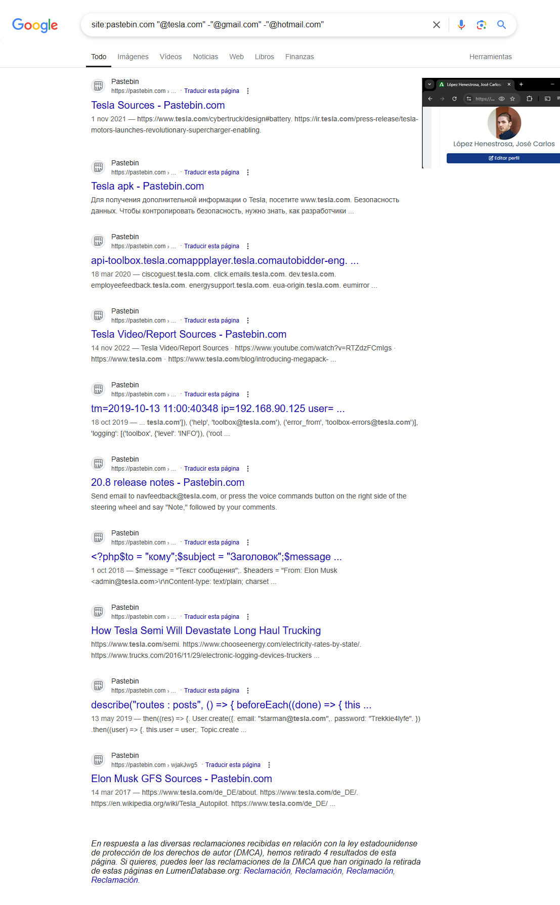
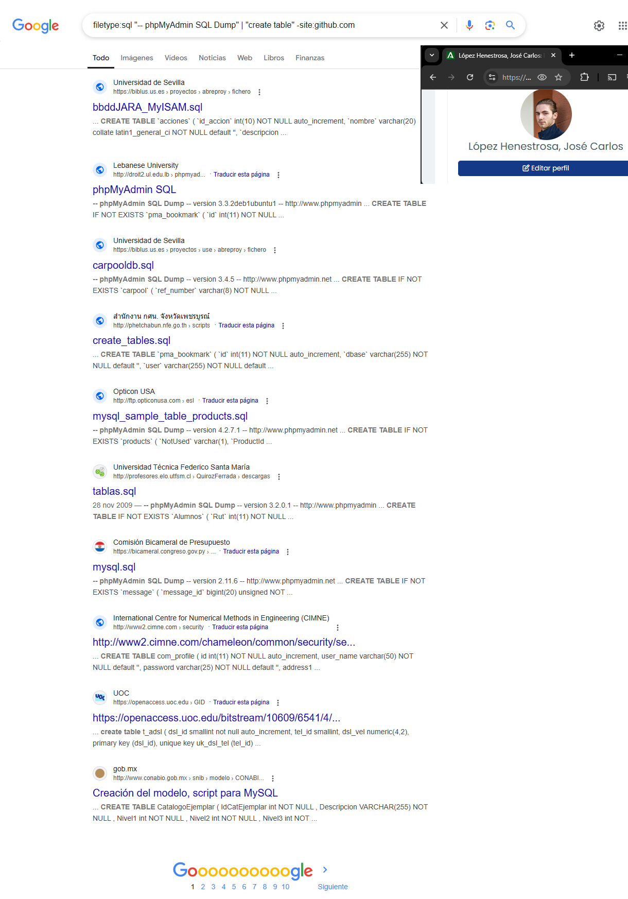
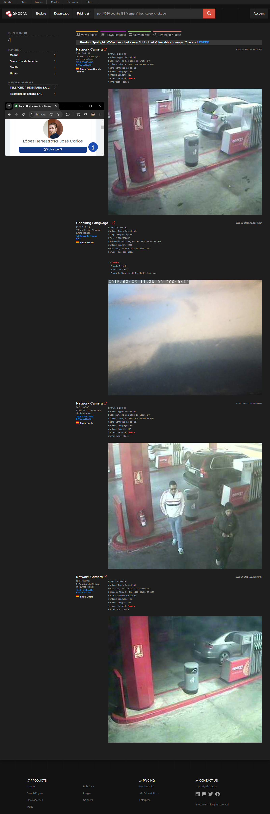

# TAREA Unidad 2: Auditoría de incidentes de ciberseguridad

## Introducción

**El Clasificador Automático de Incidentes**

Un Sistema de Alerta Temprana levanta alarmas cuando la información que recibe cualifica con alguna regla. No obstante, el hecho de cumplir con condiciones predefinidas no garantiza al 100% que el evento alertado constituya un Incidente de Ciberseguridad.

Aparte de esto, hay otra cuestión importante. Si un Sistema de Alerta Temprana detecta y notifica con celeridad un potencial incidente, pero el análisis de datos posterior se demora en exceso, se pierde la ventaja derivada de la anticipación y el posible incidente puede llegar a manifestarse en toda su dimensión y con gran impacto.

Así pues, el proceso de análisis de evidencias, alertas y datos contextuales que lleva a concluir que un evento es un incidente de seguridad es un proceso crítico que conviene automatizar, máxime cuando de él se derivan avisos, notificaciones oficiales y medidas urgentes de contención y/o mitigación (como veremos en unidades posteriores de este mismo módulo formativo).

En esta tarea desarrollaremos un Clasificador Automático de Incidentes, que efectuará el análisis de datos mencionado mediante algoritmos de Inteligencia Artificial, produciendo una salida rápida para contener y notificar lo que proceda en cada caso. Además, este sistema aprenderá por sí mismo a identificar nuevos incidentes analizando la información relativa a las evidencias y también a las consecuencias de cada evento.

Por último, se deberá profundizar en la descripción funcional del bloque central, así como proponer distintas tareas de monitorización que va a realizar como posible alerta de eventos de ciberseguridad.

## ¿Qué te pedimos que hagas?

### Diseño del Diagrama de Bloques del Clasificador Automático de Incidencias

>[!NOTE]
>Diseña el Diagrama de Bloques del sistema a alto nivel. El objetivo de esta tarea es proporcionar la información básica de análisis para que los Técnicos Informáticos puedan desarrollar el sistema clasificador.



<br>

>[!NOTE]
>Describe a alto nivel la funcionalidad en general y de cada bloque propuesto (sin entrar en detalle).

El bloque central del diagrama de flujo muestra el ciclo que va desde la obtención de los requisitos a través de la extracción de características del incidente hasta la aplicación de la inteligencia mediante algoritmos de clasificación. Dentro de este proceso, hemos desglosado cada paso en el Diagrama de Bloques propuesto más arriba, en el que distinguimos los siguientes puntos:

1. Recepción de incidente: Recibe incidentes reportados desde diversas fuentes.
2. Extracción de características: Extrae información clave del incidente para su análisis.
3. Consulta de base de datos de incidentes: Consulta incidentes previos para contextualizar el caso.
4. Aplicación de algoritmos de clasificación: Aplica algoritmos de clasificación para determinar la categoría del incidente.
5. ¿Confianza en la clasificación?: Evalúa si la clasificación alcanzó un nivel aceptable de confianza.
6. Asignación de categoría: Asigna la categoría correspondiente si la clasificación es confiable.
7. Revisión manual: En caso de baja confianza, se envía a revisión manual.
8. Reentrenamiento del modelo: Los incidentes revisados manualmente pueden ser usados para mejorar el modelo.
9. Notificación y registro: Finalmente, el incidente se notifica y registra en el sistema.

<br>

### Diseño del interior del bloque central con herramientas OSINT

>[!NOTE]
>Teniendo en cuenta que el Clasificador Automático pertenece a una empresa ficticia (invéntate el nombre y dominio en internet) y que incorpora un bloque central, deberás efectuar las siguientes tareas:
>Describe detalladamente las funciones a realizar por el bloque central dentro del Diagrama de Bloques propuesto en el apartado anterior.

Ahora que sabemos la funcionalidad en general a alto nivel del bloque central, nos adentramos en cada función en más detalle:

1. **Recepción de incidente**: Este es el primer paso del proceso. Se encarga de captar y registrar los incidentes que llegan al sistema. La recepción puede realizarse de varias formas, las cuales dependen de la fuente del incidente. Dentro de las fuentes, podemos distinguir, principalmente, los reportes manuales y los sistemas de monitoreo automático.

	Durante esta etapa, es importante detallar la descripción del incidente y recopilar datos clave, como el usuario afectado, el nivel de urgencia o la fecha y hora del incidente. Una vez se verifica que esta información es completa y comprensible, se envía a la siguiente fase para su análisis automático.

2. **Extracción de características**: Este paso se encarga de analizar el incidente recibido y extraer datos relevantes que puedan ayudar en su clasificación. Se puede llevar a cabo gracias a los logs y registros del sistema, a partir de los cuales se puede aplicar análisis de texto para extraer palabras clave que puedan ayudar a identificar el tipo de incidente.

3. **Consulta de base de datos de incidentes**: Aquí se accede a una base de datos histórica que almacena información sobre incidentes previos para buscar patrones similares y ayudar en la clasificación. Si el incidente tiene características similares a eventos pasados, se puede recuperar la categoría y la solución asociada.

4. **Aplicación de algoritmos de clasificación**: Este procedimiento emplea modelos de aprendizaje automático o reglas definidas para asignar una categoría inicial al incidente. Dichos modelos devuelven una clasificación junto con una medida de certeza o confianza en la predicción, por lo que durante el post-procesamiento de resultados se puede hacer una combinación de predicciones para mejorar la precisión.

5. **¿Confianza en la clasificación?**: Dependiendo del resultado de dicha clasificación, podemos asignar la categoría automáticamente, en caso de que la confianza sea alta. Por otro lado, si la confianza es baja, el incidente pasaría a revisión manual, que posteriormente serviría para reentrenar el modelo y mejorar la precisión futura.

6. **Asignación de categoría**: Ocurre cuando la confianza en la clasificación automática es lo suficientemente alta, tal y como hemos puntualizado anteriormente. Aquí, el sistema asigna una categoría predefinida específica al incidente. Dependiendo de la categoría, se puede atribuir un nivel de urgencia determinado para su resolución y asignárselo a una persona o equipo concreto para su gestión.

7. **Notificación y registro**: Una vez que el incidente ha sido categorizado correctamente, se notifica a las partes interesadas y se registra en la base de datos.  Dependiendo de la criticidad del incidente, se pueden activar procesos de escalamiento y generar reportes sobre la cantidad y tipo de incidentes recibidos.

8. **Revisión manual**: Si la confianza en la clasificación es baja, el incidente se envía a un analista humano para su revisión y categorización manual. Asimismo, el analista puede añadir más detalles que no fueron detectados automáticamente, como notas o contexto adicional del incidente, las cuales son almacenadas para mejorar el modelo en futuras clasificaciones.

9. **Reentrenamiento del modelo**: Durante este proceso, se busca mejorar la precisión del modelo utilizando nuevos datos obtenidos de la revisión manual y los incidentes clasificados correctamente. Para ello, se optimizan los parámetros del modelo para mejorar su precisión y se vuelve a entrenar con los datos actualizados. Posteriormente, se mide la precisión y la capacidad del modelo optimizado para clasificar correctamente incidentes nuevos.

<br>

>[!NOTE]
>Propón las acciones de búsqueda que debe realizar el bloque central para realizar búsquedas automáticas en Google de la siguiente información:
>Archivos Excel con macros (`.xlsm`) que se alojen en páginas no seguras.

Con el fin de realizar las búsquedas automáticas en Google, el bloque central debe emplear Google Dorking, lo cual es una técnica que consiste en aplicar la búsqueda avanzada de Google para conseguir encontrar en Internet información concreta a base de ir filtrando los resultados con operadores conocidos como Dorks, que son símbolos que especifican una condición. Por ejemplo, si ponemos en nuestro texto de búsqueda las dobles comillas ("texto"), buscará información que coincida exactamente con el texto. Es decir, si buscamos "OSI", nos devolverá el contenido que concuerde exactamente con ese término. También podemos acceder a la búsqueda avanzada a través de este enlace.

Dicho esto, pasamos a plantear la búsqueda adecuada para el caso propuesto.

Para encontrar este formato de archivos alojados en sitios web no seguros (HTTP en lugar de HTTPS), podemos utilizar la siguiente búsqueda:

```
filetype:xlsm "macro" inurl:http
```

Donde:

- `filetyppe:xlsm` → Busca exclusivamente archivos con extensión .xlsm.
- `"macro"` → Busca páginas donde aparezca la palabra "macro" en el contenido. Esto aumenta las probabilidades de encontrar archivos que contienen macros.
- `inurl:http` → Asegura que la URL contenga estrictamente el protocolo HTTP (páginas no seguras)

<div align="center">
	
</div>

<br>

>[!NOTE]
>Busca en https://pastebin.com correos electrónicos pertenecientes al nombre de tu empresa y excluye las direcciones de Gmail y Hotmail.

Dado que Google indexa el contenido de Pastebin, se puede utilizar la siguiente consulta para buscar direcciones de correo electrónico con el dominio de nuestra empresa (supongamos que el nombre de la empresa es Tesla, cuyo dominio de correo es @tesla.com) y excluir direcciones de Gmail y Hotmail:

```
site:pastebin.com "@tesla.com" -"@gmail.com" -"@hotmail.com"
```

Donde:

- `site:pastebin.com` → Limita la búsqueda a Pastebin.
- `"@tesla.com"` → Busca correos que contengan el nombre de la empresa. En este caso, voy a utilizar una con renombre, como Tesla, para obtener más resultados en la búsqueda.
- `-"@gmail.com" -"@hotmail.com"` → Excluye correos de Gmail y Hotmail.

<div align="center">
	
</div>

<br>

>[!NOTE]
>Ficheros SQL con volcado de una base de datos, excluyendo GitHub.

Para ello, podemos usar:

```
filetype:sql "-- phpMyAdmin SQL Dump" | "create table" -site:github.com
```

Donde:

- `filetype:sql` → Busca archivos con extensión .sql.
- `"-- phpMyAdmin SQL Dump"` → Filtra resultados que contienen la firma de un volcado generado por phpMyAdmin.
- `"create table"` → Filtra volcados que contienen estructuras de base de datos.
- `-site:github.com` → Excluye resultados provenientes de GitHub.

<div align="center">
	
</div>

<br>

>[!NOTE]
>Propón que el sistema compruebe los dispositivos conectados a Internet que tengan el puerto 8080 abierto, dispongan de una captura de imagen y estén ubicados en España.

Para conseguir esto, podemos usar Shodan, el cual es un motor de búsqueda que indexa dispositivos conectados a Internet. Para realizar la consulta planteada en el enunciado, podemos hacer lo siguiente:

```
port:8080 country:ES "camera" has_screenshot:true
```

Donde:

- `port:8080` → Filtra dispositivos que tienen el puerto 8080 abierto.
- `country:ES` → Limita los resultados a España.
- `"camera"` → Busca específicamente cámaras.
- `has_screenshot:true` → Busca cámaras que tienen una captura de pantalla asociada en la base de datos de Shodan.

<div align="center">
	
</div>

<br>

### Bibliografía

- INCIBE. (2014, 28 de mayo). _OSINT - La información es poder_. https://www.incibe.es/incibe-cert/blog/osint-la-informacion-es-poder
- INCIBE. (2023, 15 de marzo). _Google Dorks te ayuda a encontrar información sobre ti en la Red_. https://www.incibe.es/ciudadania/blog/google-dorks-te-ayuda-encontrar-informacion-sobre-ti-en-la-red
- AVG. (2022, 14 de octubre). _Google dorks: ¿Qué son los Google Hacks y cómo se utilizan?_ https://www.avg.com/es/signal/google-dorks
- Autumn Skerritt. (2023, 11 de junio). _Shodan - The Complete Guide, Featured on TryHackMe_. https://skerritt.blog/shodan/

---

## Resultado

### Calificación

- / 10,00