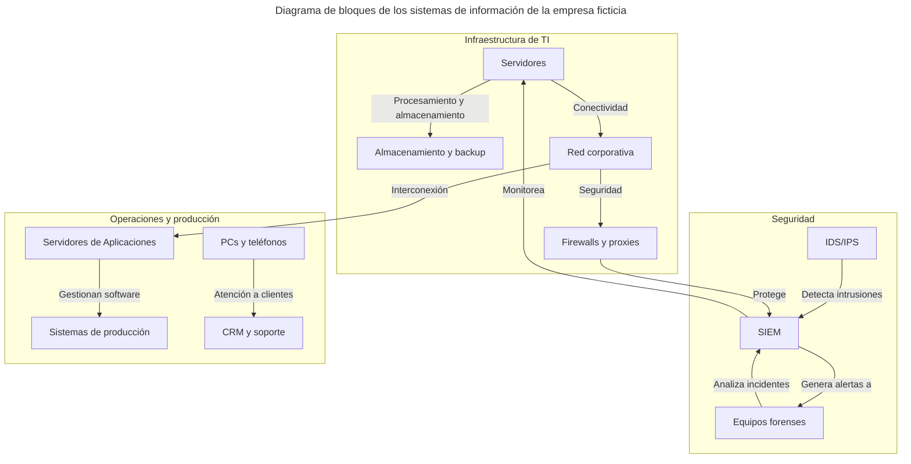
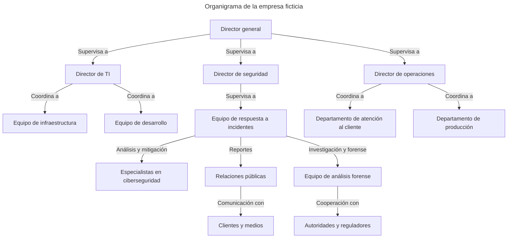
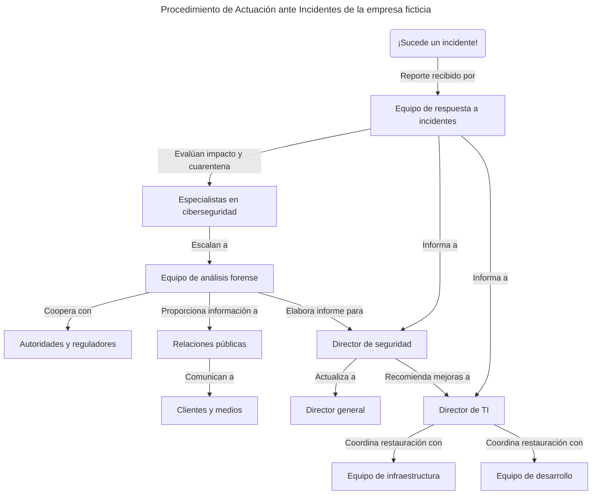
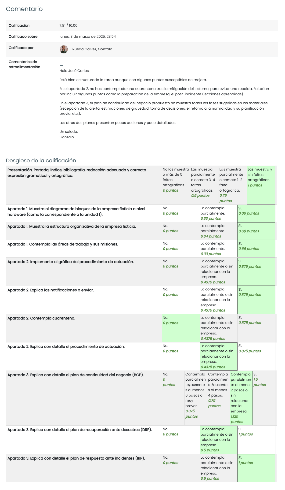

# TAREA Unidad 4: Implantación de medidas de ciberseguridad

## Introducción

**Las medidas de Ciberseguridad ante Incidentes**

Como hemos estudiado en la Unidad 4, en los momentos iniciales de manifestación de un incidente suele existir un cierto desconcierto en lo relativo a las medidas que se deben tomar, por parte de quién y en qué orden, lo cual suele aumentar la afectación del incidente.

Este desconcierto se combate diseñando un Procedimiento de Actuación ante Incidentes. Este procedimiento suele ser de alto nivel y podrá desglosarse en tareas concretas en función del área involucrada en cada caso, o bien, en flujos de decisión y escalado para constituir la Estrategia de Contención de Incidentes de Ciberseguridad.

Igualmente, otro procedimiento importante es el dedicado a restablecer los servicios afectados, compuesto por los planes de continuidad del negocio, de recuperación ante desastres y el de respuesta ante incidentes.

## ¿Qué te pedimos que hagas?

### Estructura de la Organización Empresarial

>[!NOTE]
>Define o diseña el diagrama de bloques de la empresa ficticia a nivel hardware.

 

>[!NOTE]
>Define o diseña el organigrama de una empresa ficticia para la que se definirá el Procedimiento de Actuación ante Incidentes.

Dentro del organigrama planteado, distinguimos tres áreas comandadas por el director general. He aquí un desglose detallando brevemente las áreas de trabajo junto a sus misiones:

- **Director general**

	Lidera la empresa, define la estrategia global y supervisa la correcta operación de todas las áreas. 

- **Área de TI**

	Dirigida por el director de TI, quien se encarga de garantizar el correcto funcionamiento y la escalabilidad tecnológica de los sistemas de la empresa.

	Dentro de esta área distinguimos dos equipos:

	- **Equipo de infraestructura**: Mantiene servidores, redes, almacenamiento y servicios en la nube.
	- **Equipo de desarrollo**: Diseña, implementa y da soporte a software y aplicaciones internas y externas.

- **Área de seguridad**

	Dirigida por el director de seguridad, quien procura proteger los activos digitales, la infraestructura y la información de la empresa contra amenazas internas y externas.

	Dentro de esta área distinguimos varios equipos:

	- **Equipo de respuesta a incidentes**: Detecta, mitiga y gestiona incidentes de seguridad.
	- **Especialistas en ciberseguridad**: Analizan vulnerabilidades y previenen ataques.
	- **Equipo de análisis forense**: Investiga incidentes graves y colabora con reguladores.
	- **Relaciones públicas**: Gestionan la comunicación de crisis con clientes y medios.

- **Área de operaciones**

	Liderada por el director de operaciones, quien trata de asegurar la continuidad y eficiencia de los procesos operativos, entre las que se incluyen estos departamentos:

	- **Departamento de atención al cliente**: Brinda soporte a usuarios y gestiona las consultas y quejas.
	- **Departamento de producción**: Supervisa la entrega de productos o servicios.

### Detalle del Procedimiento de Actuación

>[!NOTE]
>Define a alto nivel el Procedimiento de Actuación ante Incidentes, indicando las áreas involucradas en cada caso y los destinatarios de las notificaciones progresivas que se irán efectuando.
>
>**NOTA**: Cada una de las fases de este procedimiento podrá ser susceptible de un desglose de bajo nivel; no obstante, este desglose queda fuera del alcance de este apartado.

Desglose del esquema del Procedimiento de Actuación ante Incidentes:

1. **¡Sucede un incidente!**

	El incidente puede ser detectado por cualquier área de la empresa, pero generalmente será identificado por el equipo de respuesta a incidentes, tal y como se plantea en el esquema.

2. **Notificación inicial y cuarentena**

	El equipo de respuesta a incidentes recibe el informe y analiza su impacto. Si se trata de una brecha de seguridad o un ciberataque, el equipo de especialistas en ciberseguridad aislará los sistemas afectados (cuarentena). A su vez, se da una notificación inicial interna en la que se informa de la situación al director de seguridad y al de TI.

3. **Análisis y escalamiento**

	Cuando el equipo de respuesta a incidentes clasifica la incidencia, el equipo de análisis forense comienza una investigación. Si es necesaria la cooperación con terceros, dicho equipo informará a las autoridades y a los reguladores. Al mismo tiempo, también proporcionará actualizaciones constantes al director de seguridad a través de informes de situación.

4. **Comunicación y mitigación**

	El equipo de desarrollo y el equipo de infraestructura, bajo la supervisión del director de TI, que seguirá las recomendaciones y directrices del director de seguridad, trabajarán en la restauración de sistemas y la aplicación de parches de seguridad, mientras que el director general recibirá información periódica sobre el impacto que está teniendo el incidente.
	
	El director de seguridad actualizará al director general de la situación.

	Si el incidente afecta a los clientes, el departamento de relaciones públicas elaborará un comunicado y coordinará la respuesta con los clientes y los medios.

### Detalle del procedimiento para restablecer los servicios afectados

>[!NOTE]
>Define a alto nivel el Procedimiento de Continuidad del Negocio que permita restablecer los servicios afectados. Este deberá incluir:
>- Plan de Continuidad del Negocio.
>- Plan de Recuperación ante Desastres.
>- Plan de Respuesta ante Incidentes.

El Procedimiento de Continuidad de Negocio se compone de tres pilares fundamentales:

- Plan de Continuidad del Negocio (PCN)
- Plan de Recuperación ante Desastres (PRD)
- Plan de Respuesta ante Incidentes (PRI)

Cada uno de estos planes tiene objetivos específicos, pero trabajan en conjunto para minimizar interrupciones y restaurar la operación en el menor tiempo posible.

Dicho lo cual, procedemos a desglosar cada pilar en detalle:

1. **Plan de Continuidad del Negocio (PCN)**

	Su objetivo principal es garantizar que los procesos críticos sigan funcionando durante y después de una interrupción.

	A continuación, se detalla un plan en 6 pasos, considerando la estructura organizativa de la empresa proporcionada.

	1. **Análisis de riesgos y evaluación de impacto**

		Identifica amenazas  y evalúa su impacto en las operaciones.

		**Reparto de tareas dentro del marco operativo de la empresa ficticia**:
		- Director de seguridad: Coordina el análisis de amenazas físicas y cibernéticas.
		- Equipo de respuesta a incidentes: Identifica vulnerabilidades y propone soluciones.
		- Equipo de infraestructura: Evalúa posibles fallos en la infraestructura y riesgos operacionales.
		- Director de operaciones: Evalúa riesgos en producción y atención al cliente.

		**Acciones comunes a los directores**:
		- Realizar análisis de impacto en el negocio (BIA).
		- Identificar activos críticos.
		- Determinar el tiempo máximo de inactividad aceptable (RTO, RPO).

	2. **Desarrollo de estrategias de continuidad**

		Establece estrategias para mantener la operación en caso de interrupciones.

		**Reparto de tareas dentro del marco operativo de la empresa ficticia**:
		- **Director de TI**: Elabora planes de recuperación tecnológica e implementa redundancia en la infraestructura tecnológica.
		- **Director de seguridad**: Desarrolla estrategias ante incidentes de ciberseguridad.
		- **Director de operaciones**: Considera alternativas para la continuidad en producción y servicio al cliente.
		- **Relaciones públicas**: Desarrollan protocolos de comunicación con clientes y medios. Además, también crean acuerdos con proveedores estratégicos.

		**Acciones comunes a los directores**:
		- Definir planes de recuperación ante desastres (DRP).

	3. **Implementación del PCN**

		Despliegue de las estrategias definidas y aseguramiento de su funcionalidad.

		**Reparto de tareas dentro del marco operativo de la empresa ficticia**:
		- **Director general**: Aprueba y supervisa el plan.
		- **Director de TI**: Coordina la implementación de herramientas de respaldo y recuperación.

	4. **Pruebas y mantenimiento del plan**

		Evalúa la efectividad del plan y lo actualiza regularmente.

		**Reparto de tareas dentro del marco operativo de la empresa ficticia**:
		- **Director de seguridad**: Planteamiento de pruebas de resiliencia ante ataques cibernéticos.
		- **Equipo de análisis forense**: Evalúa las respuestas a incidentes por parte de los activos críticos.
		- **Departamento de producción**: Verifica planes alternos en la cadena de suministro.

		**Acciones comunes a los directores**:
		- Realizar pruebas de recuperación de desastres.
		- Auditar el cumplimiento de normativas.
		- Ajustar el plan en base a las nuevas amenazas que se detecten.

	5. **Concienciación**

		Prepara al personal para responder ante incidentes.

		**Reparto de tareas dentro del marco operativo de la empresa ficticia**:
		- **Director de seguridad**: Capacitación en gestión de crisis y ciberseguridad.
		- **Equipo de respuesta a incidentes**: Simulacros de incidentes tecnológicos.
		- **Departamento de atención al cliente**: Establece protocolos de comunicación con usuarios afectados.

		**Acciones comunes a los directores**:
		- Realizar simulacros de interrupciones en los sistemas y la operatividad de la empresa.
		- Entrenar al equipo en procedimientos de recuperación.
		- Sensibilizar a los sobre posibles ataques, como phishing o ransomware.

	6. **Respuesta y recuperación ante incidentes**

		Garantiza una reacción eficiente y el restablecimiento rápido de las operaciones. Se analiza con más profundidad en el Plan de Respuesta ante Incidentes (PRI).

 

2. **Plan de Recuperación ante Desastres (PRD)**

	El fin de este plan consiste en restablecer la infraestructura y los servicios tecnológicos tras un desastre, como un ciberataque o un desastre natural.

	**Reparto de tareas dentro del marco operativo de la empresa ficticia**:

	- **Director de operaciones**: Coordina la reactivación del departamento de atención al cliente y el departamento de producción.
	- **Director de TI**: Coordina la recuperación de sistemas tecnológicos.
		- **Equipo de infraestructura**: Restaura servidores y redes.
		-	**Equipo de desarrollo**: Verifica la integridad de las aplicaciones tras la recuperación.
	- **Director de seguridad**: Garantiza que los sistemas restaurados sean seguros.
		-	**Equipo de respuesta a incidentes**: Evalúa daños y previene nuevos ataques.
		-	**Equipo de análisis forense**: Investiga la causa del desastre (si es un ciberataque).

 

3. **Plan de Respuesta ante Incidentes (IRP)**

	La misión fundamental de este plan es detectar, contener y resolver incidentes de seguridad o fallos críticos.

	**Reparto de tareas dentro del marco operativo de la empresa ficticia**:

	- **Equipo de respuesta a incidentes**: Primera línea de defensa ante ataques y fallos.
		- **Especialistas en ciberseguridad**: Analizan y mitigan amenazas.
		- **Equipo de análisis forense**: Investiga incidentes críticos y reporta a reguladores.
	- **Director de seguridad**: Decide el escalamiento del incidente y comunicación interna.
		- Si el incidente afecta a clientes, las relaciones públicas tienen que informar a medios y usuarios.
	- **Director de TI**: Coordina la restauración de los sistemas afectados.

### Bibliografía

- Material didáctico correspondiente a esta unidad.
- Organigrama10. _Estructura organizativa de IT_. https://organigrama10.com/organigrama/organigrama-de-it
- Organigrama10. _Estructura de Seguridad de la Información: Organigrama y Funciones_. https://organigrama10.com/organigrama/organigrama-seguridad-de-la-informacion
- Tecnet One. (2024, 16 de febrero). _Estructura Organizacional en la Gestión de Información_. https://blog.tecnetone.com/estructura-organizacional-en-la-seguridad-de-la-informaci%C3%B3n
- Inesem. _Plan de respuesta a incidentes: contar con un plan no es opcional_. https://www.inesem.es/revistadigital/gestion-integrada/plan-de-respuesta-a-incidentes
- INCIBE. _Políticas de seguridad para la pyme: respuesta a incidentes_. https://www.incibe.es/sites/default/files/contenidos/politicas/documentos/respuesta-incidentes.pdf
- Proof Point. _Respuesta ante incidentes (Incident Response)_. https://www.proofpoint.com/es/threat-reference/incident-response
- INCIBE. _Plan de Contingencia y Continuidad de Negocio_. https://www.incibe.es/sites/default/files/contenidos/dosieres/metad_plan_de_contingencia_y_continuidad_de_negocio.pdf

---

## Resultado

### Calificación

7,81 / 10,00

### Comentarios de retroalimentación y rúbrica

