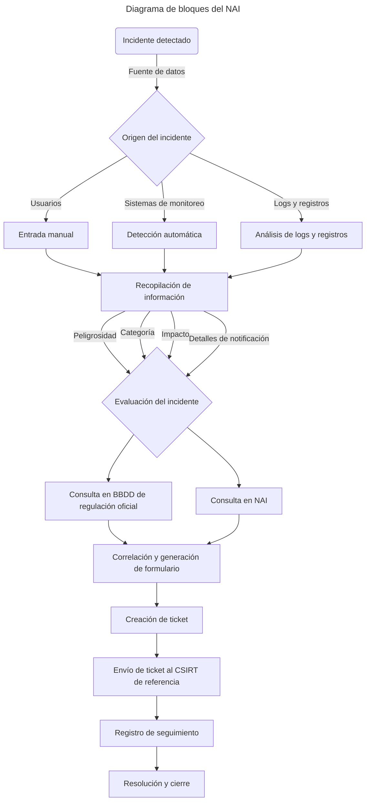
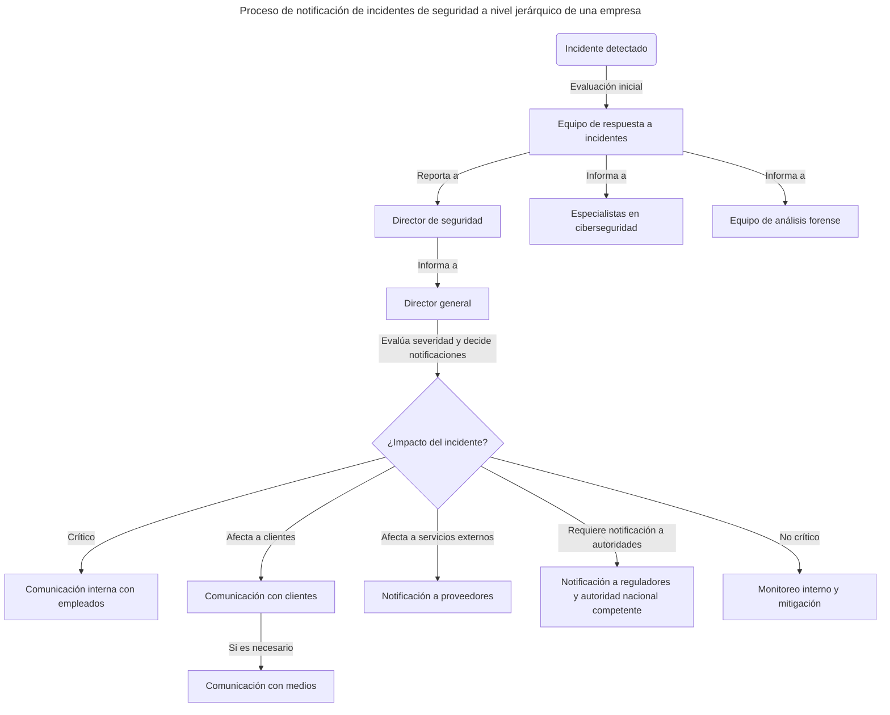
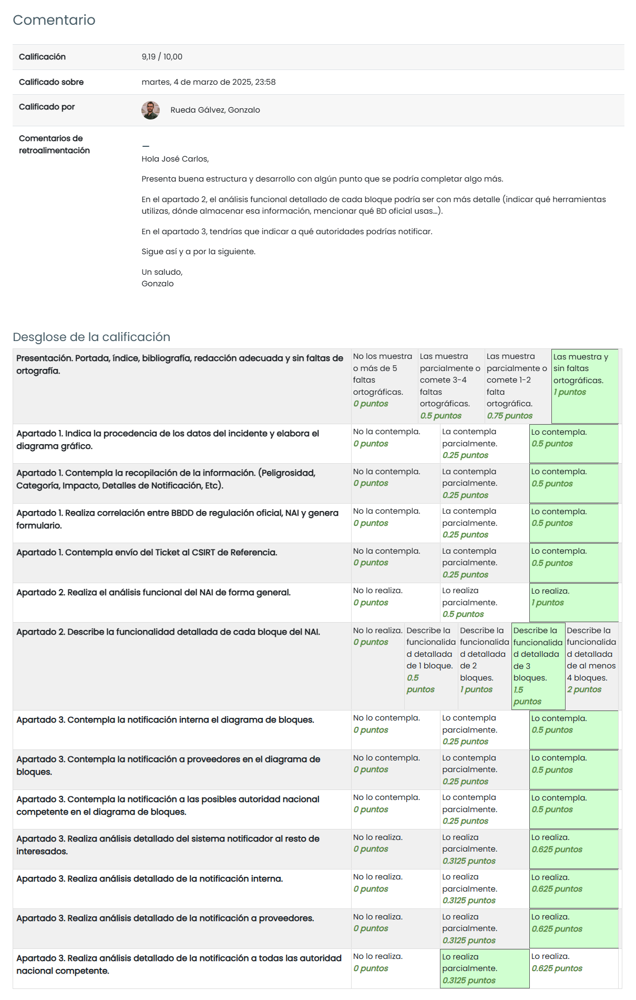

# TAREA Unidad 5: Detección y documentación de incidentes de ciberseguridad

## Introducción

**El notificador automático de Incidentes**

Cuando un incidente se ha de reportar a Entidades Oficiales, se ha de documentar suficientemente antes de su envío a las Ventanillas Únicas establecidas.

La recopilación de toda la información necesaria en relación con clasificación, peligrosidad, impacto, afectación a infraestructuras, etc. suele ser un proceso tedioso y con errores frecuentes, que puede retrasar la toma de medidas pertinentes en los ámbitos afectados.

Además de disponer de toda la información necesaria, se le debe dar un formato concreto para que pueda ingresar en los sistemas oficiales en tiempo y forma, y progresar adecuadamente dentro de sus flujos de decisión.

En esta tarea desarrollaremos un Notificador Automático de Incidentes, que efectuará la recopilación de toda la información derivada del análisis de los mismos, que se requiere para el reporte a las Ventanillas Únicas oficiales. Hecho esto, la formateará adecuadamente y la enviará a las Ventanillas respetando los tiempos regulados.

El objetivo de la tarea será diseñar el Notificador a alto nivel, para que pueda ser implementado por los técnicos informáticos.

## ¿Qué te pedimos que hagas?

>[!WARNING]
>Los enunciados del archivo PDF han sido modificados para ceñirse exclusivamente a la información relevante para la realización de cada apartado. En cambio, los enunciados mostrados en este archivo sí que se corresponden con los de la tarea original, aunque también han sido ligeramente editados para mejorar su comprensión.

### Diseño del Diagrama de Bloques del Notificador Automático de Incidencias (NAI)

>[!NOTE]
>La notificación de incidentes se lleva a cabo en el procedimiento de actuación (tarea IC0401) después de clasificar el incidente (tarea IC0201). Ahora, deberás diseñar un Diagrama de Bloques del Notificador Automático de Incidencias a alto nivel.
>
>El objetivo de esta tarea es proporcionar la información básica de análisis para que los Técnicos Informáticos puedan desarrollar el sistema. Deberá mostrar gráficamente qué pasos deben realizarse desde que sucede el incidente hasta que llega al CSIRT de referencia.

### Descripción detallada de la funcionalidad general y por bloques

>[!NOTE]
>Realiza un análisis funcional en general del sistema notificador e interpreta detalladamente el Diagrama de Bloques del apartado anterior.

Un Notificador Automático de Incidencias (NAI) consiste en un sistema diseñado para detectar, evaluar y notificar incidentes de seguridad en entornos tecnológicos. Su propósito principal es recopilar datos sobre incidentes procedentes de diversas fuentes para evaluar su impacto y peligrosidad, a partir de los cuales se generan notificaciones y se gestionan tickets de respuesta. Este proceso permite trazar un seguimiento más eficaz de los incidentes y que los equipos de seguridad (CSIRT) ofrezcan una respuesta eficiente.

En base a esto, este es el funcionamiento de un NAI desglosado en bloques, el cual está basado en el diagrama del [primer apartado](#diseño-del-diagrama-de-bloques-del-notificador-automático-de-incidencias-nai):

1. **Detección del incidente**

	- **Incidente detectado**: Representa el punto de inicio del sistema, donde se detecta un incidente.
	- **Origen del incidente**: Aquí se identifican las fuentes desde las cuales se detecta el incidente. Estas pueden ser:
		- **Usuarios**: Entrada manual proporcionada por un usuario que informa sobre un incidente.
		- **Sistemas de monitoreo**: Herramientas automatizadas que detectan anomalías o amenazas.
		- **Logs y registros**: Análisis de logs y registros para identificar eventos sospechosos.

2. **Recopilación y evaluación del incidente**

	- **Recopilación de información**: Consolida la información proveniente de todas las fuentes anteriores para un análisis más profundo.
	- **Evaluación del incidente**: Se analizan diferentes aspectos del incidente, tales como:
		- **Peligrosidad**: Nivel de riesgo que representa.
		- **Categoría**: Tipo de incidente.
		- **Impacto**: Consecuencias potenciales.
		- **Detalles de notificación**: Información relevante para su gestión.

3. **Consulta y generación de formularios**

	- **Consulta en BBDD de regulación oficial**: Se verifica si el incidente tiene regulaciones específicas que deban considerarse.
	- **Consulta en NAI**: Se consulta una base de datos de incidentes previos para identificar patrones o coincidencias.
	- **Correlación y generación de formulario**: Se cruzan los datos de la consultas anteriores para generar un formulario estructurado con la información del incidente.

4. **Creación y envío de ticket**

	- **Creación de ticket**: Se genera un ticket con los detalles del incidente.
	- **Envío de ticket al CSIRT de referencia**: Se envía el ticket al equipo de respuesta a incidentes para su análisis y resolución.

5. **Seguimiento y resolución**

	- **Registro de seguimiento**: Se documenta el seguimiento del incidente para futuras referencias.
	- **Resolución y cierre**: Una vez gestionado el incidente, se cierra oficialmente con su debida documentación.

### Diseño y descripción detallada de la funcionalidad de las notificaciones al resto de interesados

>[!NOTE]
>Igual que la notificación a los CSIRT de referencia es importante para iniciar las acciones de protección necesarias, es importante también mantener actualizados a las distintas partes involucradas (personal interno con responsabilidad, resto de empleados, posibles afectados, clientes, proveedores, medios de comunicación, etc.) Deberás efectuar la siguiente tarea:
>
>Diseña un diagrama de bloques a alto nivel que incluya la notificación tanto a las personas responsables que correspondan en tu estructura jerárquica de la tarea IC0401 (si crees que te faltó alguno, inclúyelo ahora sin problema) como a los empleados, proveedores, clientes y medios de comunicación. Recuerda tener en cuenta que, dependiendo del tipo de incidente, puede que necesites notificar a organismos adicionales.

 

>[!NOTE]
>Realiza un análisis funcional general del sistema notificador al resto de interesados e interpreta detalladamente el Diagrama de Bloques del punto anterior.

El sistema notificador de incidentes de seguridad tiene como objetivo garantizar una respuesta estructurada y eficiente ante incidentes que puedan afectar a la organización, sus empleados, clientes, proveedores y autoridades reguladoras. Para ello, se sigue un flujo lógico que abarca la detección, evaluación y comunicación del incidente, y se asegura que cada parte interesada reciba la información relevante en función de la gravedad del suceso.

Este sistema debe cumplir con varias funciones esenciales, tales como la detección y evaluación inicial del incidente, la notificación interna a equipos especializados, la evaluación del impacto y decisiones de notificación en función del impacto del incidente, la notificación a empleados en caso de que afecte a la operatividad interna, la notificación a clientes, medios de comunicación y proveedores en caso de que se vean afectados y, por último, la notificación a autoridades dependiendo de la legislación local vigente.

A partir de esta definición, procedemos a interpretar detalladamente el diagrama de bloques planteado en el punto anterior según su flujo:

1. **Detección y evaluación inicial**

	a. **Incidente detectado**

	Representa el punto de partida del proceso, donde se identifica un evento que podría comprometer la seguridad de la organización. Puede ser detectado a través de diversas fuentes, tal y como vimos en el diagrama del primer apartado.

	b. **Equipo de respuestas a incidentes**

	Grupo especializado que recibe el reporte del incidente y realiza un análisis preliminar para determinar su gravedad. A su vez, también aplica medidas inmediatas para contener la amenaza y notifica a los responsables de seguridad sobre el incidente.

2. **Notificación interna**

	a. **Director de seguridad**

	Supervisa la gestión del incidente con tal de asegurar que se tomen las medidas adecuadas para contenerlo y responder eficazmente. Además, informa al director general sobre el incidente.

	b. **Director general**

	Toma decisiones estratégicas sobre la comunicación del incidente a niveles más altos y externos. En definitiva, determina si el incidente es los suficientemente grave como para requerir notificaciones a clientes, proveedores y medios. Además, coordina con las relaciones públicas y las autoridades en caso de que la situación lo requiera.

3. **Evaluación del impacto y decisión sobre notificaciones**

	a. **¿Impacto del incidente?**

	Punto de decisión donde se analiza el impacto del incidente y se define el nivel de respuesta. En base a esto, podemos encontrarnos con estos caminos:

	- Si el incidente es **crítico**, se procede con notificaciones internas al resto de empleados de la empresa.
	- Si el incidente **no es crítico**, se mantiene un monitoreo interno sin notificación a terceros y se toman medidas correctivas.

	Ahora bien, dependiendo de los grupos a los que afecte el incidente, podemos distinguir el siguiente flujo de notificaciones externas:

	- Si los **clientes** pueden verse afectados, se les informa del incidente. Puede darse en situaciones en las que haya una fuga de datos o interrupciones de los servicios.
	- Si el incidente tiene un impacto en la reputación de la empresa o podría ser difundido públicamente, las **relaciones públicas** tienen que emitir un comunicado oficial en el que se informe sobre el incidente.
	- Si el incidente involucra la infraestructura o servicios de **proveedores**, estos deben ser informados para que tomen medidas preventivas.
	- Si el incidente debe ser reportado a **reguladores o autoridades** según la legislación vigente, la empresa tiene que cumplir con sus obligaciones legales.

---

## Resultado

### Calificación

- / 10,00

### Comentarios de retroalimentación y rúbrica

