# TAREA Unidad 6: IDS/IPS Snort

## Índice

- [Introducción](#introducción)
- [¿Qué te pedimos que hagas?](#qué-te-pedimos-que-hagas)
	- [Estudio de Rsyslog](#estudio-de-rsyslog)
	- [Configuración teórica de clientes y servidor Rsyslog](#configuración-teórica-de-clientes-y-servidor-rsyslog)
	- [Implementación de la maqueta de detección multipunto (Raspberry Pi o máquinas virtuales)](#implementación-de-la-maqueta-de-detección-multipunto-raspberry-pi-o-máquinas-virtuales)
	- [Bibliografía](#bibliografía)
- [Resultado](#resultado)
	- [Calificación](#calificación)
	- [Comentarios de retroalimentación y rúbrica](#comentarios-de-retroalimentación-y-rúbrica)

<br>

## Introducción

**La Detección Multipunto de Incidentes**

En la Unidad 6 hemos estudiado cómo instalar y configurar el IDS Snort, situándolo en la misma máquina en la que estará el SIEM que procesará su información una vez filtrada y almacenada.

Sin embargo, aunque esta configuración es habitual en los laboratorios, no es la corriente en las instalaciones reales. En cualquier entorno productivo suele haber una sonda Snort en cada una de las máquinas perimetrales, comprometidas, vulnerables, etc., cuya información de logging se ha de redirigir hacia una única máquina en la que estará instalado el SIEM (Unidad 7).

En esta tarea abordaremos el envío de logs en tiempo real entre diferentes máquinas utilizando la aplicación Rsyslog. Tras un estudio completo de Rsyslog, se planteará una posible instalación de sondas SNORT en una organización.

## ¿Qué te pedimos que hagas?

### Estudio de Rsyslog

>[!NOTE]
>Investiga en Internet el funcionamiento de Rsyslog.

Rsyslog es un sistema de registro de logs muy utilizado en sistemas operativos Linux. Su nombre viene de "Rocket-fast System for Log Processing". Es una evolución del sistema tradicional `syslog`, con muchas más capacidades y un rendimiento mejorado.

Dentro de sus características principales destaca el filtrado avanzado, el formato flexible de los logs recogidos, el transporte seguro con distintos protocolos, la salida a múltiples destinos (email, bases de datos, sistemas remotos…) y su alto rendimiento.

En sistemas Linux con Rsyslog, los archivos de log se almacenan en directorios específicos, normalmente dentro de `/var/log/`. La ubicación exacta de cada tipo de log y su destino se define en los archivos de configuración de Rsyslog.

Estas son algunas ubicaciones por defecto de los archivos de log:

<table>
	<tr>
		<td><strong>ARCHIVO</strong></td>
		<td><strong>DESCRIPCIÓN</strong></td>
	</tr>
	<tr>
		<td><code>/var/log/syslog</code></td>
		<td>Kernel del sistema operativo</td>
	</tr>
	<tr>
		<td><code>/var/log/messages</code></td>
		<td>Aplicaciones del usuario</td>
	</tr>
	<tr>
		<td><code>/var/log/auth.log</code></td>
		<td>Servicios de correo electrónico</td>
	</tr>
	<tr>
		<td><code>/var/log/secure</code></td>
		<td>Daemon del sistema (servicios en segundo plano)</td>
	</tr>
	<tr>
		<td><code>/var/log/cron</code></td>
		<td>Autenticación del sistema (login, su, etc.)</td>
	</tr>
	<tr>
		<td><code>/var/log/mail.log</code></td>
		<td>Mensajes del propio daemon <code>syslog</code></td>
	</tr>
	<tr>
		<td><code>/var/log/kern.log</code></td>
		<td>Subsistemas de impresión</td>
	</tr>
	<tr>
		<td><code>/var/log/dmesg</code></td>
		<td>Buffer de mensajes de arranque del kernel</td>
	</tr>
	<tr>
		<td><code>/var/log/boot.log</code></td>
		<td>Proceso de arranque</td>
	</tr>
</table>

Los mensajes de log se clasifican según dos ejes principales:

* **Subsistemas** o **facilidades (facilities)**: Indica el tipo de servicio o subsistema que generó el mensaje.
* **Niveles de severidad (severities)**: Indica la criticidad del log.

Dentro de los subsistemas, podemos identificar los siguientes como los más comunes:

<table>
	<tr>
		<td><strong>CÓDIGO</strong></td>
		<td><strong>NOMBRE</strong></td>
		<td><strong>DESCRIPCIÓN</strong></td>
	</tr>
	<tr>
		<td>0</td>
		<td><code>kern</code></td>
		<td>Kernel del sistema operativo</td>
	</tr>
	<tr>
		<td>1</td>
		<td><code>user</code></td>
		<td>Aplicaciones del usuario</td>
	</tr>
	<tr>
		<td>2</td>
		<td><code>mail</code></td>
		<td>Servicios de correo electrónico</td>
	</tr>
	<tr>
		<td>3</td>
		<td><code>daemon</code></td>
		<td>Daemon del sistema (servicios en segundo plano)</td>
	</tr>
	<tr>
		<td>4</td>
		<td><code>auth</code></td>
		<td>Autenticación del sistema (login, su, etc.)</td>
	</tr>
	<tr>
		<td>5</td>
		<td><code>syslog</code></td>
		<td>Mensajes del propio daemon <code>syslog</code></td>
	</tr>
	<tr>
		<td>6</td>
		<td><code>lpr</code></td>
		<td>Subsistemas de impresión</td>
	</tr>
	<tr>
		<td>7</td>
		<td><code>news</code></td>
		<td>Noticias (NNTP, servicios antiguos de noticias)</td>
	</tr>
	<tr>
		<td>8</td>
		<td><code>uucp</code></td>
		<td>Unix-to-Unix Copy</td>
	</tr>
	<tr>
		<td>9</td>
		<td><code>cron</code></td>
		<td>Planificador de tareas</td>
	</tr>
	<tr>
		<td>10</td>
		<td><code>authpriv</code></td>
		<td>Autenticación con privacidad</td>
	</tr>
	<tr>
		<td>11</td>
		<td><code>ftp</code></td>
		<td>Servidores FTP</td>
	</tr>
</table>

Por otra parte, también distinguimos los niveles de prioridad que indican la importancia o urgencia del mensaje de log. Van desde el más crítico hasta el más informativo.

He aquí una tabla detallada con cada nivel con su respectivo nombre y descripción:

<table>
	<tr>
		<td><strong>CÓDIGO</strong></td>
		<td><strong>NOMBRE</strong></td>
		<td><strong>DESCRIPCIÓN</strong></td>
	</tr>
	<tr>
		<td>1</td>
		<td><code>alert</code></td>
		<td>Se necesita acción inmediata.</td>
	</tr>
	<tr>
		<td>2</td>
		<td><code>crit</code></td>
		<td>Error grave, como fallo de hardware.</td>
	</tr>
	<tr>
		<td>3</td>
		<td><code>err</code></td>
		<td>Errores en ejecución, pero el sistema sigue funcionando.</td>
	</tr>
	<tr>
		<td>4</td>
		<td><code>warning</code></td>
		<td>Algo inesperado ocurrió, pero no es grave.</td>
	</tr>
	<tr>
		<td>5</td>
		<td><code>notice</code></td>
		<td>Eventos importantes pero normales.</td>
	</tr>
	<tr>
		<td>6</td>
		<td><code>info</code></td>
		<td>Mensajes informativos, como el estado de los servicios.</td>
	</tr>
	<tr>
		<td>7</td>
		<td><code>debug</code></td>
		<td>Mensajes detallados para desarrolladores o diagnóstico.</td>
	</tr>
</table>

Para ver su uso en Rsyslog, podemos usar esta línea de un archivo de configuración como ejemplo, la cual registra solo mensajes de error o más graves del subsistema `authpriv`.:

```
authpriv.err      /var/log/auth_errors.log
```

---

>[!NOTE]
>Prepara una guía de uso resumida de Rsyslog (instalación, configuración y uso).

**INSTALACIÓN**

Para instalar Rsyslog en Ubuntu/Debian, ejecutamos el siguiente comando:

```bash
sudo apt install rsyslog
```

<div align="center">

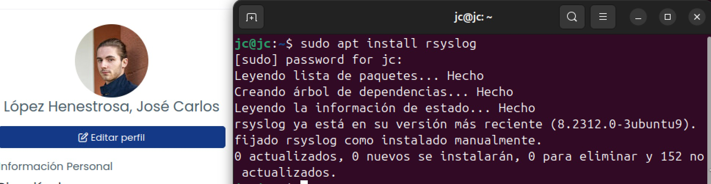
</div>

>Instalación de Rsyslog en Ubuntu

**CONFIGURACIÓN**

El archivo principal para la configuración de Rsyslog se encuentra en `/etc/rsyslog.conf`, aunque también existen archivos de configuración en la ruta `/etc/rsyslog.d/*.conf`, donde `*.conf` se refiere a todos los archivos de configuración localizados en el directorio `/etc/rsyslog.d`. Es usada para almacenar configuraciones adicionales o personalizadas de Rsyslog.

El orden de carga de los ficheros es el siguiente:

1. `/etc/rsyslog.conf`
2. Si está habilitado en el archivo `/etc/rsyslog.conf`, se incluyen todas las configuraciones que estén en `/etc/rsyslog.d/*.conf`.

Esto permite organizar configuraciones en archivos separados, crear reglas de log específicas por servicio o aplicación y añadir o quitar configuraciones sin modificar el archivo principal.

En los archivos de configuración se pueden realizar los siguientes ajustes:

* **Cargar módulos**

	Cada módulo proporciona una funcionalidad (recepción local, remota, por TCP/UDP, etc.).

	Ejemplo:

	```
	module(load="imuxsock")        # Recibe logs del sistema
	module(load="imklog")          # Recibe logs del kernel
	input(type="imudp" port="514") # Recibe logs por UDP en el puerto 514
	module(load="imtcp")           # Recibe logs por TCP (servidor)
	```

* **Definición de plantillas**

	Crea una ruta dinámica para guardar logs de cada host remoto y aplicación.

	```
	template(name="RemoteLogs" type="string"
	         string="/var/log/remote/%HOSTNAME%/%PROGRAMNAME%.log")
	```

* **Reglas de filtrado y destino**

	```
	authpriv.*          /var/log/secure
	mail.*              -/var/log/mail.log
	cron.*              /var/log/cron.log
	*.emerg             *
	```

	* **Formato**: `FACILIDAD.NIVEL DESTINO`
	* El `-` antes del nombre de archivo reduce el uso de disco, ya que no fuerza la sincronización inmediata.
	* El `*` significa "todos".

* **Incluir archivos adicionales**

	Permite dividir la configuración en archivos separados, para facilitar la gestión.

	```
	$IncludeConfig /etc/rsyslog.d/*.conf
	```

**USO**

Se pueden realizar multitud de acciones con Rsyslog. Estas son algunas de las más utilizadas, las cuales también se ven en el [siguiente apartado](#configuración-teórica-de-clientes-y-servidor-rsyslog):

* **Enviar logs a un servidor remoto**

	Para ello, añadimos la siguiente línea en un archivo de configuración de Rsyslog:

	```
	*.* @@192.168.1.100:514
	```

	Donde:

	* `*.*`: Aplica a todos los logs, sin importar la facilidad (como auth, mail, cron, etc.) ni el nivel de gravedad (como info, error, debug, etc.)
	* `@@192.168.1.100:514`: Envía dichos logs a la dirección IP `192.168.1.100` por el puerto `514` usando TCP (`@@`).

	Para que los cambios surtan efecto, reiniciamos el servicio:

	```bash
	sudo systemctl restart rsyslog
	```

* **Recibir logs en un servidor remoto**

	Habilitamos la recepción de logs editando el archivo `/etc/rsyslog.conf`  o usando módulos:

	```
	# Para UDP
	module(load="imudp")
	input(type="imudp" port="514")

	# Para TCP
	module(load="imtcp")   
	input(type="imtcp" port="514")
	```

	Permitir el puerto 514 en el firewall:

	```bash
	sudo ufw allow 514/tcp
	sudo ufw allow 514/udp
	```

	Para que los cambios surtan efecto, reiniciamos el servicio:

	```bash
	sudo systemctl restart rsyslog
	```

---

>[!NOTE]
>Incluye la instalación de Snort en dicha guía.

Vamos a instalar Snort en Ubuntu con este comando:

```bash
sudo apt-get install snort
```

Tras ejecutarlo, veremos la siguiente pantalla para configurar la herramienta:

<div align="center">

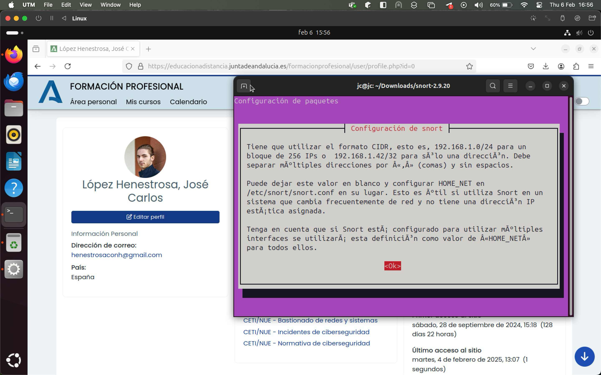
</div>

>Primera pantalla de configuración de Snort

<br>

Al continuar, nos pedirá introducir el intervalo de direcciones IP para la red local. La IP de mi router es `192.168.18.1`, lo cual significa que mi red local usa el rango `192.168.18.0/24`, lo que abarca las direcciones `192.168.18.1` - `192.168.18.254`.

<div align="center">

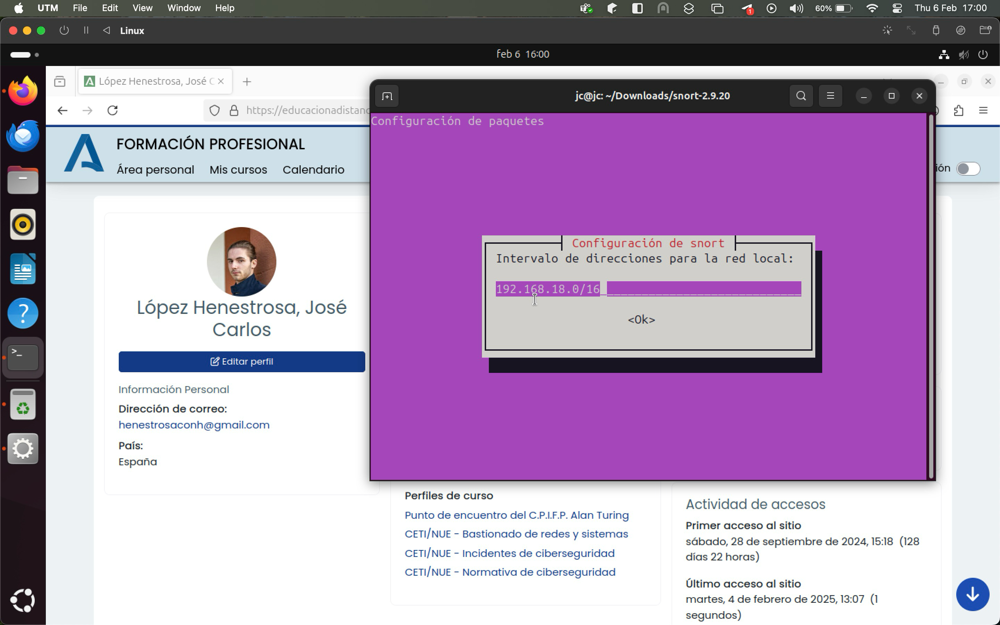
</div>

>Configuración del intervalo de direcciones IP para la red local

<br>

Al aceptar, la instalación se completará correctamente. Para comprobar que, efectivamente, Snort está disponible en el sistema, ejecutamos `snort -V`, lo cual debe mostrar el número de versión instalada.

<div align="center">

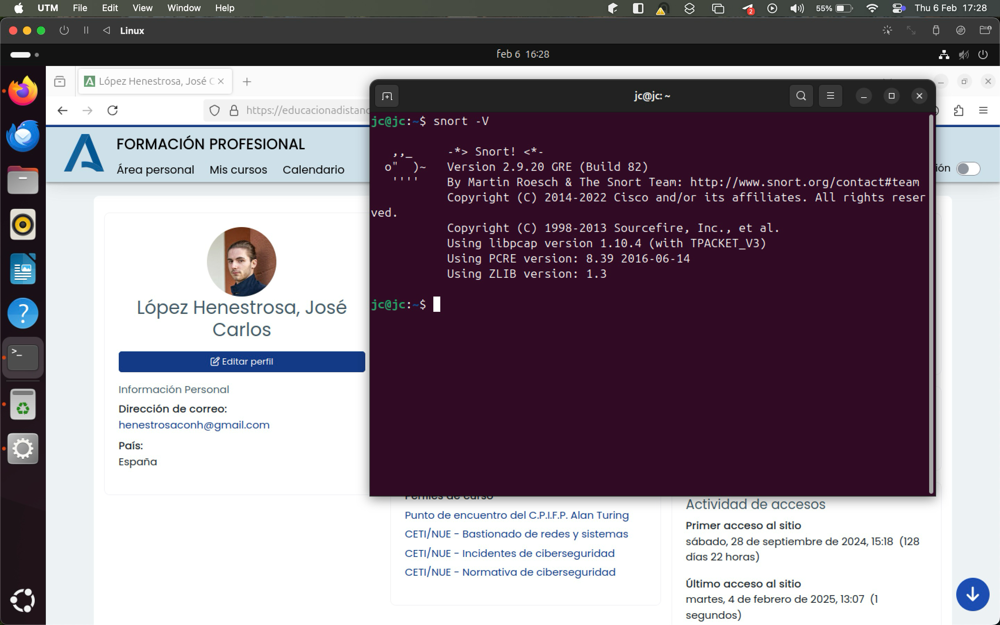
</div>

>La versión de Snort aparece, lo que indica que ha sido instalado con éxito

---

### Configuración teórica de clientes y servidor Rsyslog

>[!NOTE]
>Describe las labores de configuración necesarias para comunicar los clientes con el servidor Rsyslog.


---

>[!NOTE]
>Documenta en detalle los datos a consignar en los ficheros de configuración.

Para comunicar clientes con un servidor Rsyslog, se requiere una configuración en ambos extremos: en el servidor (que recibe logs) y en los clientes (que los envían). 

**CONFIGURACIÓN EN EL SERVIDOR**

En primer lugar, configuramos el **servidor de Rsyslog**, el cual será el **receptor** de los logs. Para ello, seguimos estos pasos.

1. **Crear o editar el archivo **`/etc/rsyslog.d/30-snort.conf`

	```bash
	sudo vim /etc/rsyslog.d/30-snort.conf
	```

2. **Habilitar recepción por UDP y/o TCP**

	```
	# Para UDP
	module(load="imudp")
	input(type="imudp" port="514")

	# Para TCP
	module(load="imtcp")     
	input(type="imtcp" port="514")
	```

3. **Añadir regla de filtrado para logs de Snort**

	Esta línea sirve para filtrar y redirigir los logs generados por Snort a un archivo específico.

	```
	# Filtrado de logs de Snort
	if $programname == 'snort' then /var/log/snort/snort.log
	& stop
	```

4. **Guardar y cerrar el archivo**

5. **Crear o editar el archivo `/etc/rsyslog.d/remote.conf`**

	```bash
	sudo vim /etc/rsyslog.d/remote.conf
	```

6. **Crear una regla de guardado**

	```
	$template RemoteLogs,"/var/log/remote/%HOSTNAME%/%PROGRAMNAME%.log"
	*.* ?RemoteLogs
	& stop
	```

	Esta regla hace que los logs de los clientes se guarden de forma ordenada en carpetas por host y programa. `& stop` asegura que los logs solo se guarden en el archivo especificado y no se redirijan a otros destinos.

7. **Guardar y cerrar el archivo**

8. **Crear el directorio <code>/var/log/remote</code> y darle los permisos pertinentes**

	```
	sudo mkdir -p /var/log/remote
	sudo chmod 755 /var/log/remote
	```

9. **Abrir el puerto 514 en el firewall**

	```
	sudo ufw allow 514/udp  # Para UDP
	sudo ufw allow 514/tcp  # Para TCP
	```

10. **Reiniciar Rsyslog**

	```
	sudo systemctl restart rsyslog
	```

**CONFIGURACIÓN EN EL CLIENTE**

Una vez hecho esto, **configuramos los clientes Rsyslog**, los cuales serán los **emisores** de los logs. Con tal de conseguirlo, seguimos estos pasos:

1. **Comprobar IP privada del servidor**

	Desde la máquina que aloja el servidor, tenemos que ejecutar el siguiente comando y apuntar la dirección IP:

	```
	hostname -I
	```

2. **Editar o crear el archivo <code>90-forwarding.conf</code> en el directorio `/etc/rsyslog.d/`**

	```bash
	sudo vim /etc/rsyslog.d/90-forwarding.conf
	```

3. **Añadir configuración**

	Para ello, añadimos la siguiente línea en un archivo de configuración de Rsyslog:

	```
	*.* @@IP_SERVIDOR:514
	```

	Donde:

	1. `*.*`: Aplica a todos los logs, sin importar la facilidad (como auth, mail, cron, etc.) ni el nivel de gravedad (como info, error, debug, etc.)
	2. `@@IP_SERVIDOR:514`: Envía dichos logs a la dirección IP del servidor por el puerto `514` usando TCP (`@@`).

4. **Reiniciar Rsyslog**

	```bash
	sudo systemctl restart rsyslog
	```

Para verificar que todo está correcto, miramos los logs entrantes en el servidor con este comando:

```bash
tail -f /var/log/remote/*/*.log
```

En el cliente, generamos un mensaje de prueba:

```bash
logger "Mensaje de prueba desde cliente"
```

Al ejecutar este comando, el servidor debería recibir el mensaje de prueba enviado por el cliente.

---

### Implementación de la maqueta de detección multipunto (Raspberry Pi o máquinas virtuales)

>[!NOTE]
>Prepara una maqueta (estructura con la ubicación de las máquinas y su IP en la organización) que tenga al menos un cliente (puede tener más) y un servidor Rsyslog.

<div align="center">

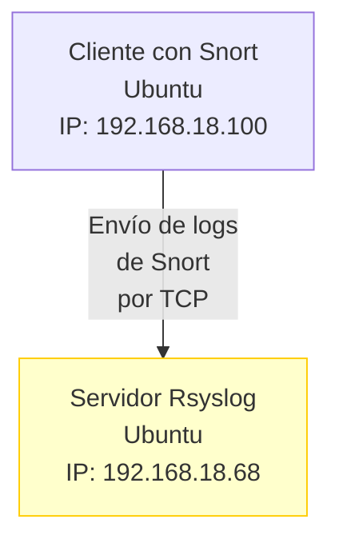
</div>

---

>[!NOTE]
>Configura Rsyslog en los clientes y el servidor utilizando los datos del apartado anterior (incluye capturas de pantalla).

**CONFIGURACIÓN EN EL SERVIDOR**

Vamos a aplicar los pasos detallados en el [apartado anterior](#configuración-teórica-de-clientes-y-servidor-rsyslog) para la parte del **servidor**:

1. **Crear el archivo `/etc/rsyslog.d/30-snort.conf`**

	<div align="center">

	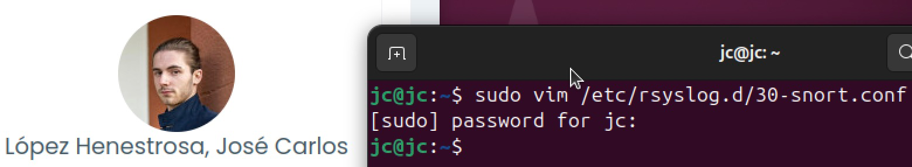
	</div>

2. **Añadir la configuración especificada al archivo**

	<div align="center">

	
	</div>

	Tras esto, cerramos y guardamos el archivo

3. **Crear el archivo `/etc/rsyslog.d/remote.conf`**

	<div align="center">
	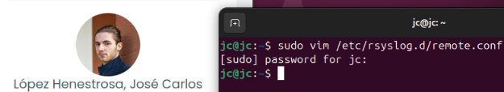
	</div>

	Tras esto, cerramos y guardamos el archivo

4. **Añadir la configuración especificada al archivo**

	<div align="center">
	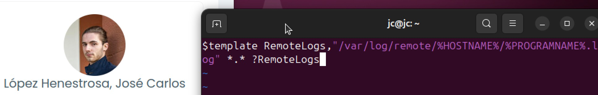
	</div>

5. **Crear el directorio <code>/var/log/remote</code> y darle los permisos pertinentes**

	<div align="center">
	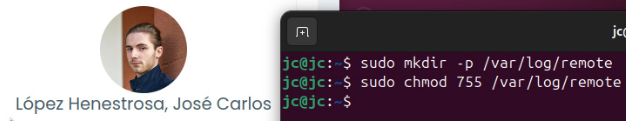
	</div>

6. **Abrir el puerto 514 en el firewall**

	<div align="center">
	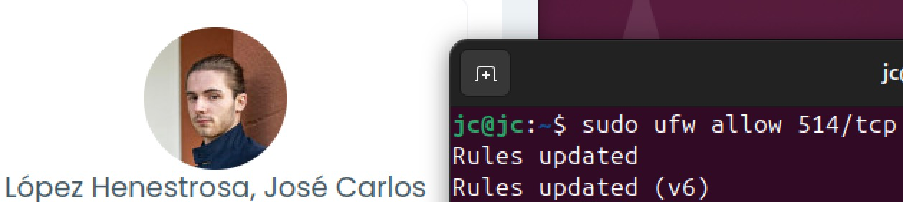
	</div>

7. **Reiniciar Rsyslog**

	<div align="center">
	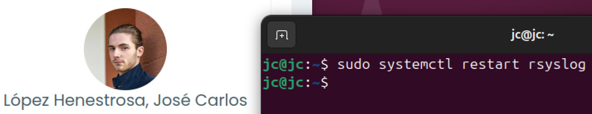
	</div>

**CONFIGURACIÓN EN EL CLIENTE**

Vamos a aplicar los pasos detallados en el [apartado anterior](#configuración-teórica-de-clientes-y-servidor-rsyslog) para la parte del **cliente** en otra máquina virtual diferente a la del servidor:

1. **Comprobar IP privada del servidor**

	Es importante matizar que si clonamos una máquina virtual de otra, probablemente ambas compartan la misma dirección MAC. Esto puede causar que reciban la misma dirección IP del servidor DHCP, lo que genera conflictos en la red.

	Para solucionar este problema, es importante cambiar la dirección MAC de una de las dos. La forma de hacerlo depende del programa que se esté utilizando. En el caso de UTM (Mac), tenemos que seleccionar la máquina clonada (en este caso, la del cliente), e ir a *Configuración > Red*. Una vez ahí, generamos una dirección MAC aleatoria y guardamos los cambios para continuar.

	Una vez hecho esto, ejecutamos el siguiente comando en la **máquina servidor**:

	```bash
	hostname -I
	```

2. **Crear el archivo <code>90-forwarding.conf</code> en el directorio `/etc/rsyslog.d/`**

	<div align="center">
	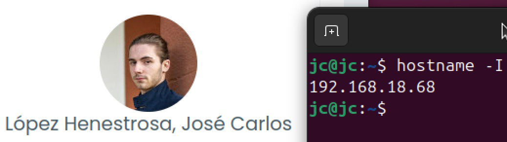
	</div>

3. **Añadir la configuración especificada al archivo**

	<div align="center">
	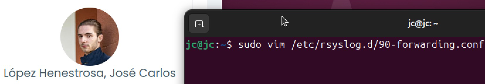
	</div>

4. **Reiniciar Rsyslog**

	<div align="center">
	
	</div>

Una vez hecho esto, la configuración de Rsyslog en el **cliente** ya está concluida.

---

>[!NOTE]
>Configurar al menos 4 reglas en total de los agentes Snort (incluye capturas de pantalla).

Para configurar dichas reglas de los agentes Snort, debemos incluirlas en un archivo `.rules` (por ejemplo, `local.rules`) y referenciarlas desde el archivo principal de configuración de Snort (`snort.conf`).

Dicho esto, procedemos a crear el archivo `/etc/snort/rules/local.rules` y le añadimos las siguientes reglas, donde `192.168.18.100` es la IP privada del cliente:

```
# 1. Detección de ping (ICMP echo-request)
alert icmp any any -> any any (msg:"[SNORT] ICMP Echo Request (ping) detectado"; itype:8; sid:1000001; rev:1;)

# 2. Detección de intentos de acceso a Telnet (puerto 23 TCP)
alert tcp any any -> any 23 (msg:"[SNORT] Intento de conexión a Telnet detectado"; flags:S; sid:1000002; rev:1;)

# 3. Detección de tráfico HTTP no autorizado hacia una IP concreta
alert tcp any any -> 192.168.18.100 80 (msg:"[SNORT] HTTP sospechoso hacia host protegido"; flow:to_server,established; sid:1000003; rev:1;)

# 4. Detección de escaneo SYN (SYN scan)
alert tcp any any -> any any (msg:"[SNORT] Posible escaneo SYN detectado"; flags:S; threshold:type threshold, track by_src, count 10, seconds 5; sid:1000004; rev:1;)
```

<div align="center">

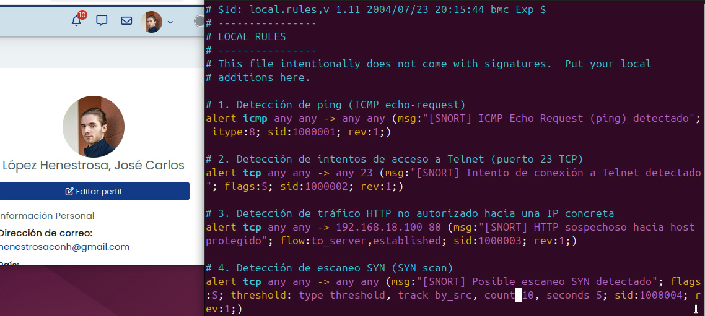
</div>

Para habilitar estas reglas, tenemos que asegurarnos de que Snort esté leyendo el archivo recién creado `local.rules`. Para ello, abrimos el archivo de configuración global de Snort, `/etc/snort/snort.conf` e incluimos la siguiente línea:

```
include $RULE_PATH/local.rules
```

<div align="center">

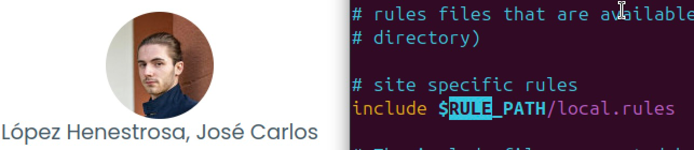
</div>

<br>

Una vez modificado, reiniciamos Snort:

```bash
sudo systemctl restart snort
```

<div align="center">


</div>

---

>[!NOTE]
>Comprueba el funcionamiento de la configuración efectuada, revisando el envío de información de logging desde los clientes hasta el servidor (incluye capturas de pantalla).

Ahora que tenemos las reglas de Snort configuradas junto a las configuraciones pertinentes de Rsyslog tanto en el cliente como en el servidor, procedemos a ejecutar un tráfico que dispare una regla Snort establecida.

Para ello, probamos a hacer un ping al cliente Snort (IP local `192.168.1.50`) desde otra máquina distinta:

```bash
ping 192.168.18.100
```

Lo cual dispara esta regla:

```bash
# 1. Detección de ping (ICMP echo-request)
alert icmp any any -> any any (msg:"[SNORT] ICMP Echo Request (ping) detectado"; itype:8; sid:1000001; rev:1;)
```

<div align="center">

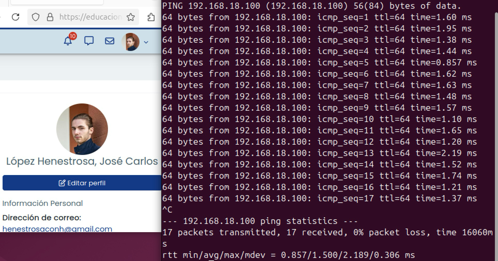
</div>

<br>

Si comprobamos el directorio `/var/log/remote/*/snort.log` en la máquina **servidor**, donde el `*` es el nombre del cliente, encontramos lo siguiente:

<div align="center">

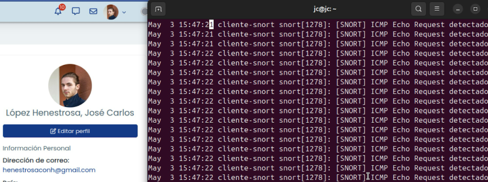
</div>

Como podemos apreciar, el servidor recibe correctamente los logs enviados por el cliente.

---

### Bibliografía

* Rsyslog. *Wikipedia*. [https://en.wikipedia.org/wiki/Rsyslog](https://en.wikipedia.org/wiki/Rsyslog)
* Registros centralizados en Linux con Rsyslog. *ochobitshacenunbyte*. [https://www.ochobitshacenunbyte.com/2018/10/29/registros-centralizados-en-linux-con-rsyslog](https://www.ochobitshacenunbyte.com/2018/10/29/registros-centralizados-en-linux-con-rsyslog) 
* Documentación oficial de Rsyslog. [https://www.rsyslog.com/doc/index.html](https://www.rsyslog.com/doc/index.html)
* Chapter 14. Configuring a remote logging solution. *Red Hat*. [https://docs.redhat.com/en/documentation/red_hat_enterprise_linux/9/html/security_hardening/assembly_configuring-a-remote-logging-solution_security-hardening](https://docs.redhat.com/en/documentation/red_hat_enterprise_linux/9/html/security_hardening/assembly_configuring-a-remote-logging-solution_security-hardening)
* How to Set Up Centralized Logging on Linux with Rsyslog. *Better Stack*. [https://betterstack.com/community/guides/logging/how-to-configure-centralised-rsyslog-server/](https://betterstack.com/community/guides/logging/how-to-configure-centralised-rsyslog-server/)
* Configuración de Open Source SNORT (con Rsyslog). *IBM*. [https://www.ibm.com/docs/es/dsm?topic=snort-configuring-open-source](https://www.ibm.com/docs/es/dsm?topic=snort-configuring-open-source)
* Alert Logging. *Documentación de Snort.* [https://docs.snort.org/start/alert_logging](https://docs.snort.org/start/alert_logging)
* How to Set Up Remote Logging on Linux Using rsyslog. *Make Use Of.* [https://www.makeuseof.com/set-up-linux-remote-logging-using-rsyslog/](https://www.makeuseof.com/set-up-linux-remote-logging-using-rsyslog/)

---

## Resultado

### Calificación

8,63 / 10,00

### Comentarios de retroalimentación y rúbrica

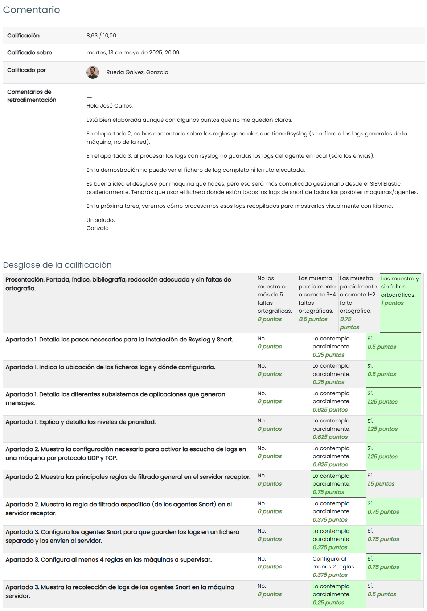