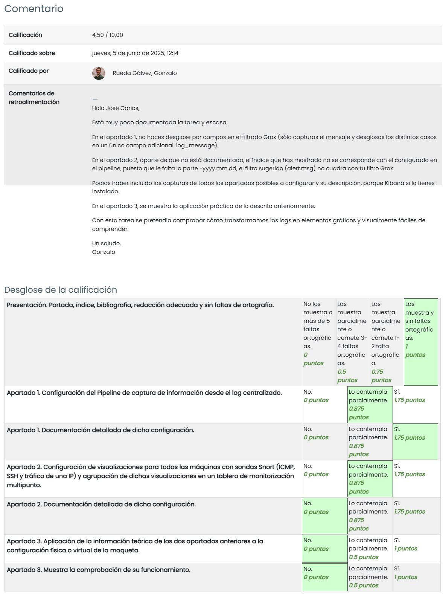

# TAREA Unidad 7: SIEM ELK

## Índice

- [Introducción](#introducción)
- [¿Qué te pedimos que hagas?](#qué-te-pedimos-que-hagas)
	- [Configuración y arranque del SIEM](#configuración-y-arranque-del-siem)
	- [Tablero de monitorización multipunto](#tablero-de-monitorización-multipunto)
	- [Implementación del tablero de monitorización multipunto en la maqueta de la tarea IC0601](#implementación-del-tablero-de-monitorización-multipunto-en-la-maqueta-de-la-tarea-ic0601)
	- [Bibliografía](#bibliografía)
- [Resultado](#resultado)
	- [Calificación](#calificación)
	- [Comentarios de retroalimentación y rúbrica](#comentarios-de-retroalimentación-y-rúbrica)

 

## Introducción

**La monitorización multipunto en el SIEM**

En la Unidad 7 hemos estudiado cómo instalar y configurar un SIEM ELK completo, situándolo en la misma máquina en la que estará el IDS que detectará las intrusiones y enviará la información de logging para su tratamiento.

Como comentamos en la Tarea 6, aunque esta configuración es habitual en los laboratorios, no es la corriente en las instalaciones reales. En cualquier entorno productivo suele haber una sonda Snort en cada una de las máquinas perimetrales, comprometidas, vulnerables, etc., cuya información de logging se ha de redirigir hacia una única máquina en la que estará instalado el SIEM.

Pues bien, continuando con el trabajo iniciado en la Tarea 6 asociada a la Unidad 6, en esta tarea abordaremos la lectura y tratamiento del log que centraliza la información de todas las sondas Snort, filtrando su contenido, almacenándolo en la base de datos y preparando un conjunto de visualizaciones que recogeremos en un Tablero de Monitorización Multipunto. Por lo tanto, la instalación y configuración de esta tarea se realizará en la máquina MES que recibe todos los logs de los agentes.

## ¿Qué te pedimos que hagas?

### Configuración y arranque del SIEM

>[!NOTE]
>Detalla la configuración a efectuar en Logstash para crear un Pipeline que lea el log centralizado que habremos creado en la Tarea IC0601. Prepara el fichero de configuración correspondiente.

---

### Tablero de monitorización multipunto

>[!NOTE]
>Detalla la configuración a efectuar en Kibana para crear las nuevas visualizaciones de las máquinas con sondas Snort (tráfico ICMP y SSH, así como de tráfico proveniente de una IP concreta de tu red).

---

>[!NOTE]
>Detalla la configuración a efectuar en Kibana para crear el Tablero de Monitorización Multipunto.

---

### Implementación del tablero de monitorización multipunto en la maqueta de la tarea IC0601

>[!NOTE]
>Comprueba el funcionamiento de la configuración efectuada, revisando la presentación de información de tráfico ICMP y SSH, así como de tráfico proveniente de una IP concreta de tu red, de las sondas Snort en el tablero (capturar pantallas).

---

### Bibliografía

---

## Resultado

### Calificación

4,50 / 10,00

### Comentarios de retroalimentación y rúbrica

