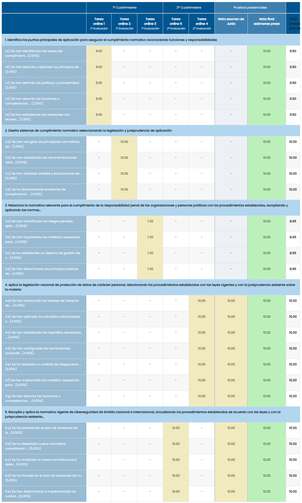

# Normativa de Ciberseguridad (24/25)

## Desglose de las unidades

>[!NOTE]
>Cada tarea tiene su correspondiente corrección en el archivo `rubrica.png`, el cual está adjunto en cada `README`.

<table>
	<tr>
		<th>UNIDAD</th>
		<th>EXAMEN</th>
		<th>CALIFICACIÓN DE LA TAREA</th>
	</tr>
	<tr>
		<td>
			<a href="u1">
				1. Puntos principales sobre el cumplimiento normativo
			</a>
		</td>	
		<td>
			<a href="u1/examen">Enlace</a>
		</td>
		<td>9,00 / 10,00</td>
	</tr>
	<tr>
		<td>
			<a href="u2">
				2. Diseño de sistemas de gestión de cumplimiento normativo
			</a>
		</td>
		<td>
			<a href="u2/examen">Enlace</a>
		</td>
		<td>10,00 / 10,00</td>
	</tr>
	<tr>
		<td>
			<a href="u3">
				3. Legislación para el cumplimiento de la responsabilidad penal
			</a>
		</td>
		<td>
			<a href="u3/examen">Enlace</a>
		</td>
		<td>7,33 / 10,00</td>
	</tr>
	<tr>
		<td>
			<a href="u4">
				4. Legislación y jurisprudencia en materia de protección de datos
			</a>
		</td>
		<td>
			<a href="u4/examen">Enlace</a>
		</td>
		<td>10,00 / 10,00</td>
	</tr>
	<tr>
		<td>
			<a href="u5">
				5. Normativa vigente de ciberseguridad de ámbito nacional e internacional
			</a>
		</td>
		<td>
			<a href="u5/examen">Enlace</a>
		</td>
		<td>10,00 / 10,00</td>
	</tr>
	<tr>
		<td colspan="3"></td>
	</tr>
	<tr>
		<td colspan="2"><strong>CALIFICACIÓN MEDIA</strong></td>
		<td>9,23 / 10,00</td>
	</tr>
</table>

## Desglose de la calificación final

