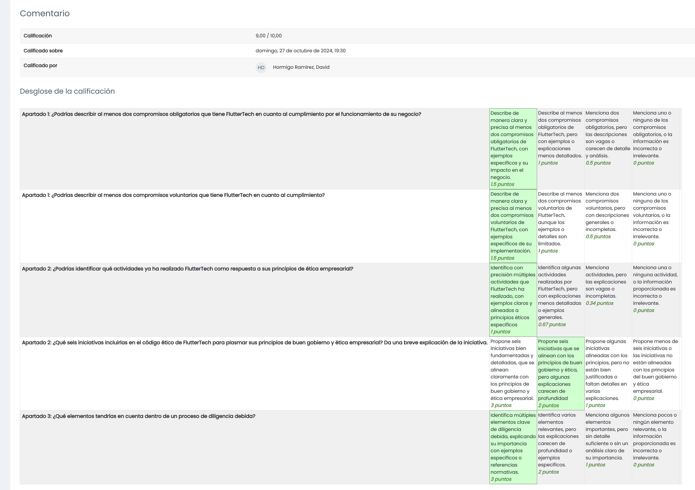

# TAREA Unidad 1: Puntos principales sobre el cumplimiento normativo

## Índice

- [Caso práctico](#caso-práctico)
- [¿Qué te pedimos que hagas?](#qué-te-pedimos-que-hagas)
	- [Apartado 1: Compromisos de la organización.](#apartado-1-compromisos-de-la-organización)
	- [Apartado 2: Principios del buen gobierno y ética empresarial.](#apartado-2-principios-del-buen-gobierno-y-ética-empresarial)
	- [Apartado 3: Relaciones con terceras partes.](#apartado-3-relaciones-con-terceras-partes)
- [Resultado](#resultado)
	- [Calificación](#calificación)
	- [Comentarios de retroalimentación y rúbrica](#comentarios-de-retroalimentación-y-rúbrica)

 

## Caso práctico

La empresa **FlutterTech Solutions S.A.** se especializa en el desarrollo de aplicaciones móviles multiplataforma utilizando Flutter, un framework moderno y eficiente. Ofrece sus servicios a clientes en España y América Latina, trabajando con diversas industrias como el sector financiero, comercio electrónico y telecomunicaciones.

Con sede en **Málaga**, FlutterTech fue fundada en 2018 y ha crecido rápidamente, contando actualmente con una cartera de 2.000 clientes. La empresa se destaca por su capacidad para desarrollar aplicaciones móviles de alto rendimiento tanto para Android como para iOS.

Comprometida con la igualdad de género y la inclusión, FlutterTech ha implementado políticas que aseguran la equidad dentro de su equipo, con un 50% de mujeres en puestos directivos. Además, fomenta un ambiente de trabajo flexible y remoto, apoyando la conciliación entre la vida personal y laboral de sus empleados.

Como parte de su responsabilidad social,  FlutterTech ha colaborado con centros educativos locales, donando equipos informáticos reutilizados como ordenadores y tablets a escuelas y universidades con menos recursos. Estos dispositivos, previamente utilizados en la empresa, son reacondicionados y actualizados por su equipo técnico, brindando a los estudiantes acceso a herramientas tecnológicas esenciales. Además, FlutterTech organiza talleres gratuitos de programación en Flutter  para ayudar a los jóvenes a desarrollar competencias tecnológicas.

La empresa también se encuentra en proceso de obtener las certificaciones ISO9001 e ISO27001, con el objetivo de garantizar la calidad y seguridad en todos sus servicios.

## ¿Qué te pedimos que hagas?

### Apartado 1: Compromisos de la organización.

>[!NOTE]
>¿Podrías describir al menos dos compromisos obligatorios que tiene FlutterTech en cuanto al cumplimiento por el funcionamiento de su negocio?

A pesar de que no se menciona explícitamente en el caso práctico, podemos dar por hecho que FlutterTech cumple con la **legislación vigente** de aquellos países en los que opera, ya que el mantenimiento de su actividad implica cumplir con la legislación de cada uno. Dentro del marco legislativo español, es esencial destacar el obligatorio cumplimiento de ciertas leyes relacionadas con el tratamiento de los datos personales almacenados por la empresa, como el Reglamento General de Protección de Datos y la Ley Orgánica de Protección de Datos.

Aunque tampoco se menciona expresamente este detalle, hay que tener en cuenta que la empresa está obligada a cumplir los **mandamientos judiciales, tribunales o sentencias judiciales**. Esto puede implicar proporcionar cierta información a un organismo del estado o modificar el modelo de negocio para que se establezca conforme a la ley.

Por otra parte, la empresa está llevando a cabo el riguroso **cumplimiento de compromisos contractuales** de certificación en normas ISO aplicables a su sector gracias al proceso de obtención de las certificaciones ISO9001 e ISO27001.

---

>[!NOTE]
>¿Podrías describir al menos dos compromisos voluntarios que tiene FlutterTech en cuanto al cumplimiento?

Dentro de los compromisos voluntarios de FlutterTech, destaca la clara definición de un **código ético** empresarial, el cual se refleja en detalles como su compromiso con la igualdad de género, la inclusión y su colaboración con centros educativos locales en materia de responsabilidad social.

Otro compromiso voluntario al que se ha adherido la empresa es el establecimiento de **normas y estándares**. En concreto, la implementación de los estándares ISO mencionados en la pregunta anterior. No obstante, hay que enfatizar que su carácter puede ser tanto obligatorio como opcional. Esto depende de los compromisos contractuales establecidos con terceros, ya que algunos pueden requerir el cumplimiento de estas normas, mientras que otras empresas pueden verlo como un valor añadido de carácter opcional.

Como propuesta, la empresa podría instaurar una serie de **buenas prácticas y mejores prácticas** con el fin de ofrecer un mejor servicio y aumentar la eficiencia en la ejecución de los objetivos de la empresa. Hay que destacar que las buenas prácticas son acciones recomendadas que han resultado satisfactorias para llevar a cabo una actividad, mientras que las mejores prácticas son buenas prácticas que han sido monitorizadas y optimizadas para obtener mejores resultados.

---

### Apartado 2: Principios del buen gobierno y ética empresarial.

>[!NOTE]
>¿Podrías identificar qué actividades ya ha realizado ya FlutterTech como respuesta a sus principios de ética empresarial?

Tal y como he expuesto en la pregunta 2 del apartado 1, los principios éticos de la empresa se manifiestan en los siguientes puntos:

- Compromiso con la **igualdad de género**: El 50% de los puestos directivos están ocupados por mujeres.
- **Conciliación entre la vida personal y laboral**: Se fomenta un ambiente de trabajo flexible y remoto.
- **Responsabilidad social con el entorno**: "FlutterTech ha colaborado con centros educativos locales, donando equipos informáticos reutilizados como ordenadores y tablets a escuelas y universidades con menos recursos. Estos dispositivos, previamente utilizados en la empresa, son reacondicionados y actualizados por su equipo técnico, brindando a los estudiantes acceso a herramientas tecnológicas esenciales. Además, FlutterTech organiza talleres gratuitos de programación en Flutter para ayudar a los jóvenes a desarrollar competencias tecnológicas.""

---

>[!NOTE]
>¿Qué seis iniciativas incluirías en la el código ético de FlutterTech para plasmar sus principios de buen gobierno y ética empresarial?

Las seis iniciativas que incluiría en el código ético de la empresa son las siguientes:

- Optimizar el modelo de producción de la empresa para reducir su **impacto medioambiental**. 
- Promover iniciativas que reflejen la **responsabilidad social corporativa** con el fin de favorecer el crecimiento y el bienestar de la comunidad en las zonas en las que opera FlutterTech.
- **Evitar la competencia desleal**. Un ejemplo de ello sería evitar la venta de los productos o servicios por debajo de su coste.
- Cumplir unos estándares mínimos de **calidad** y ganar la confianza del cliente a través de los productos y políticas transparentes.
- **Evitar publicidad engañosa** para generar confianza sin utilizar argumentos de venta inválidos o incorrectos.
- **Gestión de los recursos humanos** con el fin de fomentar un buen clima laboral a través de, por ejemplo, la conciliación de la vida laboral y familiar de los empleados.

---

### Apartado 3: Relaciones con terceras partes. 

>[!NOTE]
>FlutterTech quiere adquirir la empresa de desarrollo web LaravelTech con sede en Argentina para ampliar los servicios que presta y, potencialmente, ampliar su cartera de clientes.
>
>¿Qué elementos tendrías en cuenta dentro de un proceso de diligencia debida?

Para controlar si los compromisos empresariales de LaravelTech se alinean con los de FlutterTech, es necesario realizar la diligencia debida. En su definición general, esto implica supervisar a las empresas que colaboran con la organización. En este caso, FlutterTech se encarga de realizar el proceso de diligencia debida sobre LaravelTech para comprobar si esta se ajusta a sus principios. 

Para la elaboración de una correcta diligencia debida, debemos analizar los siguientes puntos que sugiere la guía de diligencia debida de la Organización para la Cooperación y el Desarrollo Económico (OCDE):

- Derechos humanos.
- Empleo y relaciones laborales.
- Medio ambiente.
- Lucha contra la corrupción, soborno y extorsión.
- Intereses de los consumidores.
- Divulgación de información.

Con los puntos anteriores en mente, el proceso de la diligencia debida se distingue en tres fases:

- **Análisis de antecedentes** del comportamiento de LaravelTech. Es necesario para valorar la información financiera, los responsables de las organizaciones, las relaciones con la administración pública y los problemas con la administración o problemas legales previos.
- **Formalización de la compra** de LaravelTech por parte de FlutterTech a través de un contrato. Este debe establecer cláusulas relacionadas con el cumplimiento legal de LaravelTech con sus servicios, la veracidad de la información que proporcionan, los valores de la organización, y la existencia de procesos de gestión de cumplimiento, además de la posibilidad de ser auditados.
- **Monitorización del tercero** para asegurar que se cumple el contrato estipulado.

---

## Resultado

### Calificación

9,00 / 10,00

### Comentarios de retroalimentación y rúbrica

