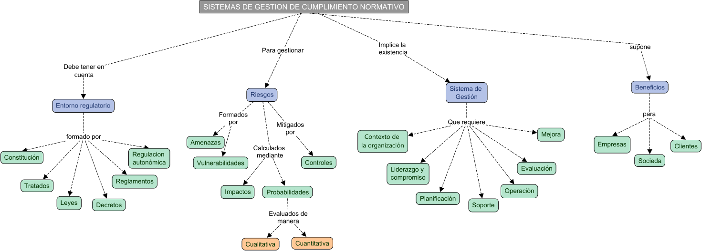

# RESUMEN Unidad 2: Diseño de sistemas de gestión de cumplimiento normativo

>Mapa conceptual

## 1. Sistemas de Gestión de compliance

### Definición de un sistema de gestión de compliance

Un Sistema de Gestión de Compliance (SGC) es un proceso integrado en una organización que garantiza el cumplimiento de leyes, normativas, códigos de conducta y ética, con el objetivo de evitar riesgos derivados del incumplimiento.

El cumplimiento normativo es esencial para el funcionamiento legal y ético de un negocio, y puede ser un argumento de venta al mejorar la reputación y competitividad.

### Beneficios de un sistema de gestión de compliance

- **Para empresas**: Evita sanciones, mejora la reputación, reduce fraudes, fomenta una cultura ética y ofrece ventajas competitivas.
- **Para clientes**: Garantiza que los proveedores respeten normas y no dañen su imagen.
- **Para la sociedad**: Fomenta la confianza, igualdad y justicia social.

### Evolución del estándar de sistema de gestión de cumplimiento normativo, de ISO19600 a ISO 37301

La norma ISO 19600 (guía no certificable) fue reemplazada por la ISO 37301:2021, que es certificable y aplicable a todo tipo de organizaciones.

### El estándar ISO 37301

La norma incluye 10 dominios y un anexo, que cubren desde el contexto de la organización hasta la mejora continua del sistema de cumplimiento.

**Dominios clave**: Contexto de la organización, liderazgo, planificación, soporte, operación, evaluación de desempeño y mejora.

## 1.1. Entorno regulatorio de aplicación

### Tipología de documentos jurídicos

Una ley se define como una norma jurídica dictada por un legislador, en que se obliga o prohíbe algo en consonancia con la justicia y cuyo incumplimiento conlleva una sanción.

Cuando una ley se aprueba, pasa a formar parte del ordenamiento jurídico, cuya jerarquía es la siguiente:

1. Constitución de 1978 y Tratados internacionales.
2. Leyes orgánicas.
3. Leyes ordinarias.
4. Normas reglamentarias.
5. Decretos legislativos.
6. Decreto ley.
7. Reglamentos de gobierno.
8. Leyes y reglamentos de las comunidades autónomas.

### Jurisdicciones

| ÓRGANO                                      | FUNCIÓN                                                                                                                                                                                                        |
|---------------------------------------------|----------------------------------------------------------------------------------------------------------------------------------------------------------------------------------------------------------------|
| Tribunal Supremo                            | Máximo órgano judicial.                                                                                                                                                                                        |
| Audiencia Nacional                          | Corte de Apelaciones, Corte Penales Superior, Corte Superior para Casos Administrativos Contenciosos (terrorismo, falsificación de moneda y crimen organizado).                                                |
| Tribunales Superiores de Justicia           | Cortes Regionales Supremas                                                                                                                                                                                     |
| Audiencias provinciales                     | Civil (Corte de Magistrados) y Criminal (investigación, penal, menores, seguimiento del encarcelamiento)                                                                                                       |
| Juzgados de Primera Instancia e Instrucción | Delito flagrante y registro civil.                                                                                                                                                                             |
| Juzgados de lo Mercantil                    | Litigios relacionados con la ley empresarial.                                                                                                                                                                  |
| Juzgados de lo Penal                        | Casos en que el encarcelamiento es menor a 5 años y otros castigos inferiores a 10 años.                                                                                                                       |
| Juzgados de lo Contencioso-Administrativo   | Litigios relacionados con la gestión de la Administración y autorización de allanamiento de morada.                                                                                                            |
| Juzgados de lo Social                       | Litigios relacionados con el trabajo o la seguridad social.                                                                                                                                                    |
| Juzgados de Vigilancia Penitenciaria        | Ejecución del encarcelamiento (excepto para menores).                                                                                                                                                          |
| Juzgados de Menores                         | Delitos cometidos por menores que tienen entre 14 y 18 años y, en ciertos casos, mayores que tienen entre 18 y 21 años.                                                                                        |
| Juzgados de Violencia sobre la Mujer        | Además de lo que indica su nombre, son juzgados de familia en un sentido amplio.                                                                                                                               |
| Juzgados de Paz                             | Los jueces de estas cortes no son profesionales sino ciudadanos importantes con derechos civiles y sin antecedentes criminales. Se ocupan de controversias en vecindarios, protección animal, etc.             |
| Tribunal Constitucional                     | Juzga la naturaleza constitucional de los textos legislativos votados por el Estado o las comunidades autónomas. Se ocupa de todos los conflictos de jurisdicción entre el Estado y las comunidades autónomas. |
| Tribunal de Cuentas                         | Monitoreo de la actividad económica y financiera del Estado. Cada comunidad autónoma tiene una corte regional similar.                                                                                         |

### Legislación nacional y acuerdos internacionales

- **Reglamento General de Protección de Datos (RGPD, o GDPR por sus siglas en inglés)** y la **Ley Orgánica de Protección de Datos (LOPD)**. Son las dos principales normas que velan por la privacidad de los datos personales. Todas las empresas deben tenerlas en cuenta y cumplirlas escrupulosamente.
- **Ley de Propiedad Intelectual (LPI)**. Protege las creaciones originales, en cualquier formato y medio: grabaciones, emisiones de radio, etc. Debe tenerse en cuenta, no obstante, que no incluye ideas, procesos ni conceptos de matemáticas.
- **Leyes de Propiedad Industrial**. Similares a la anterior, pero, en este caso, destinadas a la protección de diseños industriales, marcas, nombres comerciales, patentes, etc. Son varias normativas diferentes: de marcas, de patentes…
- **Ley de Servicios de la Sociedad de la Información y de Comercio Electrónico (LSSI-CE)**. Regula todos los intercambios comerciales realizados a través de Internet. Si tienes o piensas montar una tienda online, te interesa especialmente.
- **Reglamento Europeo de Identificación Electrónica y Servicios de Confianza en el Mercado Interior (eIDAS)**. Refuerza la seguridad y la confianza de las transacciones electrónicas realizadas dentro del marco del Mercado Único Digital Europeo.

## 1.2. Análisis y gestión de riesgos, mapas de riesgos

### La gestión de riesgo con ISO 31000

**Objetivo**: Gestionar riesgos de manera efectiva para proteger el valor de la organización.

Conceptos clave:

- **Activo**: Recurso imprescindible para la actividad de una empresa que debe protegerse.
- **Evento**: Ocurrencia de una circunstancia o cambio en un conjunto de circunstancias.
- **Vulnerabilidad**: Debilidad que presenta un activo o un proceso.
- **Amenaza**: Circunstancias que pueden causar daños.
- **Consecuencia**: Efecto de un evento que afecta a un objetivo.
- **Impacto**: Materialización de una amenaza sobre un activo aprovechando una vulnerabilidad.
- **Probabilidad**: Posibilidad de que suceda algo.
- **Riesgo**: Resultado de la multiplicación del impacto por la probabilidad.
- **Control**: Medida que mitiga un riesgo.

### La gestión del riesgo

Se rige por un proceso formado por tres fases:

1. **Identificación**: Detectar posibles riesgos.
2. **Evaluación**: Analizar impacto y probabilidad.
3. **Tratamiento**: Evitar, mitigar, transferir o aceptar el riesgo.

## 1.3. Documentación del sistema de cumplimiento normativo diseñado

### Documentación de soporte sobre el sistema de gestión de compliance

Según la norma ISO 37301, el sistema de gestión debe contar con una documentación con los siguientes puntos. Los primeros tres dominios son explicativos de la norma, por lo que no requieren de documentación específica.

4. **Contexto de la organización**: Documentar el entorno interno y externo, partes interesadas y riesgos de cumplimiento.
5. **Liderazgo y compromiso de la dirección**: Establecer una política de compliance, roles y responsabilidades.
6. **Planificación del sistema de gestión de cumplimiento**: Definir objetivos, acciones y recursos para cumplir con los requisitos.
7. **Soporte al sistema de gestión de cumplimiento**: Asegurar recursos humanos, financieros y tecnológicos, y establecer procedimientos de comunicación.
8. **Operación del sistema de gestión de cumplimiento**: Implementar controles y canales de denuncia.
9. **Evaluación de desempeño**: Monitorear el desempeño, realizar auditorías internas y revisiones por la dirección.
10. **Mejora**: Implementar acciones correctivas y mejorar continuamente el sistema.
