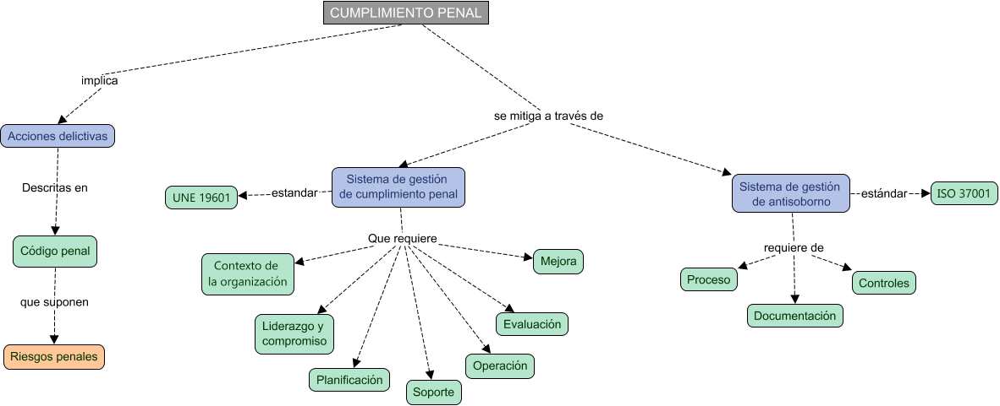
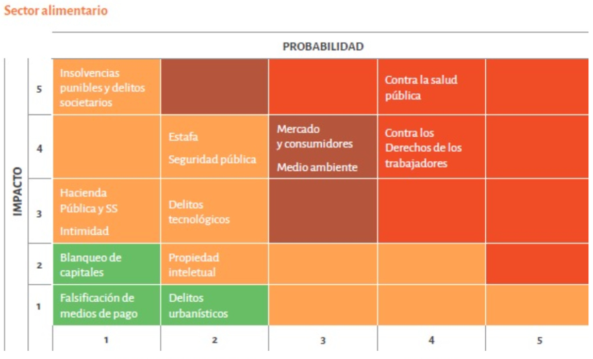

# RESUMEN Unidad 3: Legislación para el cumplimiento de la responsabilidad penal

>Mapa conceptual

## 1. Cumplimiento de la responsabilidad penal

### Riesgos penales que afectan a una organización

Surgen del incumplimiento de las leyes aplicables, lo que puede derivar en sanciones. Las leyes son normas jurídicas que obligan o prohíben conductas, y su incumplimiento conlleva consecuencias legales.

El riesgo penal está relacionado con conductas que pueden constituir delitos según el Código Penal Español.

### Principales leyes de afectación a las tecnologías de información en España

- **Reglamento General de Protección de Datos (RGPD, o GDPR por sus siglas en inglés) y la Ley Orgánica de Protección de Datos (LOPD)**: Protección de datos personales.
- **Ley de Propiedad Intelectual (LPI)**: Protección de creaciones originales.
- **Leyes de Propiedad Industrial**: Protección de marcas, patentes, etc.
- **Ley de Servicios de la Sociedad de la Información y de Comercio Electrónico (LSSI-CE)**: Regulación del comercio electrónico.
- **Reglamento Europeo de Identificación Electrónica y Servicios de Confianza en el Mercado Interior (eIDAS)**: Seguridad en transacciones electrónicas.

### Identificación de riesgos penales

En el **código penal** se tipifican los posibles delitos que pueden ser cometidos por una organización, como tráfico ilegal de órganos, trata de seres humanos, delitos informáticos, estafas, blanqueo de capitales, corrupción, entre otros.

El proceso de **análisis de riesgos** es esencial para evaluar el impacto y la probabilidad de ocurrencia de cada delito en función de las actividades de la organización.

>Riesgos penales

## 1.1. Sistemas de gestión de compliance penal (SGCP)

### Introducción a los SGCP

Son un conjunto de elementos para garantizar el cumplimiento legal y reducir riesgos penales.

Beneficios de su existencia:

- Demostrar compromiso con el cumplimiento legal.
- Mejorar la imagen y relaciones comerciales.
- Establecer una cultura de cumplimiento.	

### SGCP según el estándar UNE 19601

La norma UNE 19601 es el estándar español para la gestión de riesgos penales y certificable. Está alineado con el Código Penal.

Elementos con los que debe contar el SGCP según esta norma:

- Liderazgo y cultura de cumplimiento.
- Designación de recursos y responsabilidades.
- Evaluación de riesgos y mecanismos de control.
- Formación, comunicación y concienciación.
- Sistema de denuncias y régimen disciplinario.

Como cualquier otro Sistema de Gestión, el SGCP sigue la misma estructura de otros ya explicados, por lo que se van a especificar únicamente los elementos específicos de éste, emplazando a la unidad anterior, donde en los apartados 2.1 y 2.4 se explican detalladamente las implicaciones de cada epígrafe de la norma.

#### Contexto de la organización

Primer elemento necesario para desarrollar un SGCP. Es necesario analizar el entorno e identificar factores internos (cultura, estructura y recursos) y externos (legales, económicos y sociales) que afectan a la organización.

También se tienen que identificar a las partes interesadas (_stakeholders_), en los que se incluyen a empleados, clientes, proveedores y administraciones públicas, entre otros.

#### Liderazgo de la organización y cultura de cumplimiento

Esta fase define:

- **Compromiso de la dirección**: Establece políticas de cumplimiento, asigna recursos y promueve una cultura ética.
- **Código ético**: Define valores, principios de comportamiento y pautas de conducta para los integrantes de la organización.

#### Designación de recursos

Determina y proporciona los recursos necesarios para la implementación y operación del sistema de gestión de compliance penal. 

El órgano de gobierno debe designar un órgano de compliance penal que se encargue de la supervisión, asesoramiento y adopción de medidas que garanticen el cumplimiento del sistema.

También se debe definir una política de cumplimiento penal para definir las funciones y responsabilidades de todos los integrantes de la organización para vigilar el cumplimiento, así como las medidas de control interno para detectar y prevenir posibles incumplimientos. Debe ser accesible para todos los integrantes de la organización.

#### Análisis de riesgo y planificación

Evalúa los riesgos a través del impacto y la probabilidad de ocurrencia de los delitos.

A partir de esta evaluación, se hace un tratamiento de los riesgos identificados para aceptarlos, mitigarlos o transferirlos.

Los planes de acción resultantes son diseñados para reducir riesgos y alienarse con los objetivos de la organización.

| CONSECUENCIAS   | CRITERIO                                                                                                                                                                                                        | VALOR |
|-----------------|-----------------------------------------------------------------------------------------------------------------------------------------------------------------------------------------------------------------|-------|
| INSIGNIFICANTES | La repercusión de la materialización del riesgo (sanciones, reputación de la organización, etc) no representa ningún impacto significativo (sanciones, reputación de la organización, etc) para la organización | 1     |
| BAJAS           | Si bien la repercusión de la materialización del riesgo del incumplimiento represena un perjuicio para la organización, el impacto (sanciones, reputación, etc) es asumible por esta                            | 2     |
| MODERADAS       | La repercusión de la materialización del incumplimiento representa un perjuicio que pone en riesgo la supervivencia o continuidad de la organización                                                            | 3     |
| INTOLERABLES    | La repercusión de la materialización de incumplimiento impediría la continuidad de la organización.                                                                                                             | 4     |

>Tabla de impacto

 

| IMPACTO         | CRITERIO                                                                                                                                                                                                        | VALOR |
|-----------------|-----------------------------------------------------------------------------------------------------------------------------------------------------------------------------------------------------------------|-------|
| INSIGNIFICANTES | La repercusión de la materialización del riesgo (sanciones, reputación de la organización, etc) no representa ningún impacto significativo (sanciones, reputación de la organización, etc) para la organización | 1     |
| BAJAS           | Si bien la repercusión de la materialización del riesgo del incumplimiento represena un perjuicio para la organización, el impacto (sanciones, reputación, etc) es asumible por esta                            | 2     |
| MODERADAS       | La repercusión de la materialización del incumplimiento representa un perjuicio que pone en riesgo la supervivencia o continuidad de la organización                                                            | 3     |
| INTOLERABLES    | La repercusión de la materialización de incumplimiento impediría la continuidad de la organización.                                                                                                             | 4     |

>Tabla de probabilidad

 

| PROBABILIDAD | FRECUENCIA DE LA ACTIVIDAD QUE CAUSA INCUMPLIMIENTO | VALOR |
|--------------|-----------------------------------------------------|-------|
| BALADÍ       | Casi nula.                                          | 1     |
| BAJA         | Alguna vez al año.                                  | 2     |
| MEDIA        | Alguna vez al trimestre.                            | 3     |
| ALTA         | Alguna vez al mes.                                  | 4     |

>Tratamientos de riesgo

 

| RIESGO           | TRATAMIENTO                                                                                                                                   |
|------------------|-----------------------------------------------------------------------------------------------------------------------------------------------|
| TRIVIAL (T)      | No se requiere acción específica                                                                                                              |
| TOLERABLE (TO)   | No es necesario mejorar los controles actuales a menos que el coste sea bajo. Realizar comprobaciones periódicas para garantizar su eficacia. |
| MODERADO (M)     | Establecer e implementar controles para reducir el riesgo dentro de un plazo establecido.                                                        |
| IMPORTANTE (I)   | Establecer controles para reducir el riesgo e implementarlos en menos tiempo que los moderados.                                               |
| INTOLERABLE (IN) | Establecer controles para reducir el riesgo e implementarlos en menos tiempo que los riesgos moderados.                                          |

>Opciones de tratamiento

#### Medidas para reducir riesgos penales

Establece un listado de medidas preventivas que permiten reducir los riesgos penales, como:

- Políticas de cumplimiento.
- Procesos de diligencia debida con terceros.
- Formación y concienciación de empleados.
- Auditorías internas y externas.
- Canal de denuncias anónimas.

#### Formación y comunicación en compliance

La organización debe establecer un plan de formación que cubra obligaciones, riesgos y responsabilidades de los empleados. Debe ser relevante y estar actualizado y adaptado a las funciones de cada empleado.

Además, se debe establecer un plan de comunicación para definir qué, cuándo y cómo comunicar aspectos relacionados con el cumplimiento.

#### Monitorización y mejora continua

- **Seguimiento del SGCP**: Incluye métricas como número de denuncias, delitos confirmados y eficacia de los controles.
- **Canal de denuncias**: Debe ser accesible, anónimo y proteger al denunciante de represalias.
- **Régimen sancionador**: Establece consecuencias por incumplimientos, desde amonestaciones hasta la rescisión laboral.

## 1.2. Sistema de gestión antisoborno y anticorrupción

Sobornar implica dar dinero o regalos a alguien para conseguir algo de forma ilícita. Para remediarlo en las organizaciones, existe la norma ISO 37001, enfocada en prevenir, detectar y gestionar el soborno y la corrupción.

Requisitos documentales de la norma:

- Política antisoborno.
- Controles financieros y no financieros.
- Debida diligencia con socios y proveedores.
- Auditorías y mejora continua.

Cabe destacar que la ISO 37001 es más específica en corrupción y soborno que la UNE 19601, la cual abarca **todos** los riesgos penales.

### Controles antisoborno

- **Debida diligencia**: Evaluación de riesgos en transacciones, proyectos y socios comerciales.
- **Controles financieros**: Aprobación de transacciones, segregación de funciones y rotación de personal.
- **Controles no financieros**: Publicación de licitaciones, evaluación por múltiples personas y formación anticorrupción.
- **Regalos y beneficios**: Establecimiento de límites y políticas de aceptación.
