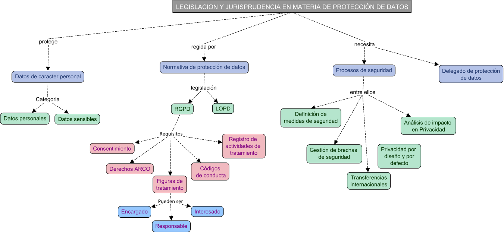

# RESUMEN Unidad 4: Legislación y jurisprudencia en materia de protección de datos

>Mapa conceptual

## 1. Principios de Protección de Datos

### Conceptos básicos

- **Datos personales**: Cualquier información que identifique o pueda identificar a una persona física (nombre, dirección, IP, etc.).
- **Datos no personales**: Información que no lleva a identificar a una persona (número de registro mercantil, correos genéricos (info@empresa.com), datos anonimizados, etc.).
- **Datos sensibles**: Información especialmente protegida, como origen racial, ideología política, salud, orientación sexual, etc. Su tratamiento está prohibido, salvo en casos específicos (consentimiento explícito, interés vital, obligación legal, etc.).

### Legislación vigente

- **Reglamento General de Protección de Datos (RGPD)**: Reglamento europeo que entró en vigor en 2018. Protege los datos personales y regula su libre circulación.
- Ley Orgánica 3/2018, de 5 de diciembre, de Protección de Datos Personales y garantía de los derechos digitales
 (**LOPD-GDD**): Adaptación española del RGPD. Incluye derechos digitales como el derecho a la desconexión digital.

### Principios de protección de datos

Los principios rectores del RGPD incluyen:

- **Exactitud**: Los datos deben ser precisos y actualizados.
- **Confidencialidad**: Debe mantenerse la privacidad de los datos.
- **Consentimiento**: El tratamiento de datos requiere el consentimiento del titular.
- **Licitud, transparencia y lealtad**: Uso legal y transparente de los datos.
- **Finalidad**: Los datos deben tratarse para fines específicos.
- **Minimización**: Recoger solo los datos necesarios.
- **Limitación del plazo de conservación**: Almacenar datos solo durante el tiempo necesario.
- **Seguridad**: Implementar medidas técnicas y organizativas para proteger los datos.
- **Responsabilidad activa**: Demostrar diligencia en el tratamiento de datos.

## 1.1. Regulación General de Protección de Datos de la Unión Europea

### Disposiciones generales de la RGPD

Mirar el apartado [Principios de protección de datos](#principios-de-protección-de-datos).

### Derechos del interesado en la RGPD

- Derecho de información.
- Derecho de rectificación.
- Derecho a la limitación de tratamiento.
- Derecho de acceso.
- Derecho de supresión.
- Derecho a la portabilidad.

### Figuras en el tratamiento de información

- **Interesado**: Persona cuyos datos se tratan.
- **Responsable del tratamiento**: Entidad que decide cómo y para qué se usan los datos.
- **Encargado del tratamiento**: Entidad que procesa los datos en nombre del responsable.

### Registro de actividades de tratamiento

RGPD exige el registro de actividades de tratamiento de la información que almacena la organización, el cual tiene que contener datos de contacto del responsable, corresponsable y encargado del tratamiento de datos y las finalidades del tratamiento, entre otros.

### Medidas de seguridad en el tratamiento de datos

El RGPD exige los siguientes tipos de medidas:

**Técnicas**:

- Sistemas seguridad de red como firewalls.
- Protección del correo electrónico, como protocolos contra el phishing.
- Gestión de actualizaciones para solucionar vulnerabilidades.
- Cifrado de ficheros, discos duros y memorias USB.
- Sistemas de copias de seguridad copias de seguridad.

**Organizativas**:

- Planes de seguridad de la información y de tratamiento de datos.
- Definición de un cuerpo normativo de seguridad que incluya políticas y procedimientos. 
- Protocolos para el control de documentos y registros.
- Política para el manejo y tratamiento de información confidencial.
- Inclusión de cláusula de seguridad y confidencialidad para proveedores.

### Brechas de seguridad

**Definición**: Incidentes que afectan a la confidencialidad, integridad o disponibilidad de los datos personales.
**Notificación**: Debe comunicarse a la autoridad competente (AEPD en España) en un plazo máximo de 72 horas si existe riesgo para los derechos y libertades de las personas.

### Transferencias internacionales de datos

Solo se permiten si el país receptor garantiza un nivel adecuado de protección o se ofrecen garantías adicionales (cláusulas contractuales, normas corporativas, etc.).

Países con nivel de protección adecuado: Suiza, Canadá, Japón, entre otros.

### Agencia española de protección de datos

Supervisa el cumplimiento del RGPD y LOPDGDD.

**Funciones**: Control, asesoramiento, resolución de reclamaciones, y promoción de códigos de conducta y certificaciones.

### Sanciones por incumplimiento de la legislación en protección de datos

- **Infracciones leves**: Multas de hasta 40.000 €.
- **Infracciones graves**: Multas de 40.001 € a 300.000 €.
- **Infracciones muy graves**: Multas de 300.001 € a 20 millones de € o el 4% de la facturación anual.

## 1.2. Privacidad por Diseño y por Defecto

Integrar la privacidad desde la fase de diseño de sistemas y procesos.

**Principios clave**: Proactividad, minimización de datos, transparencia, y respeto por los derechos del usuario.

Ocho estrategias de diseño de la privacidad:

- **Minimizar**
- **Ocultar**
- **Separar**
- **Abstraer**
- **Informar**
- **Controlar**
- **Cumplir**
- **Demostrar**

## 1.3. Análisis de Impacto en Privacidad (PIA)

Obligatorio por el RGPD para tratamientos de alto riesgo (uso de nuevas tecnologías, datos sensibles, observación sistemática a gran escala).

**Evaluación de Impacto en Protección de Datos (EIPD)**: Actividad realizada para identificar los riesgos a los que están expuestos los datos personales

El reglamento establece cuando es necesario llevar a cabo un análisis de impacto en privacidad, siendo obligatorio en situaciones de alto riesgo y cuando hay una evaluación sistemática o un tratamiento de datos a gran escala.

La evaluación incluye evaluación de riesgos, medidas de mitigación, y un plan de acción.

## 1.4. Delegado de Protección de Datos (DPO)

Figura obligatoria en autoridades públicas y organizaciones que traten datos sensibles o realicen observación sistemática a gran escala.

Funciones: 

- Asesorar. 
- Supervisar el cumplimiento del RGPD.
- Actuar como enlace con las autoridades de protección de datos.
