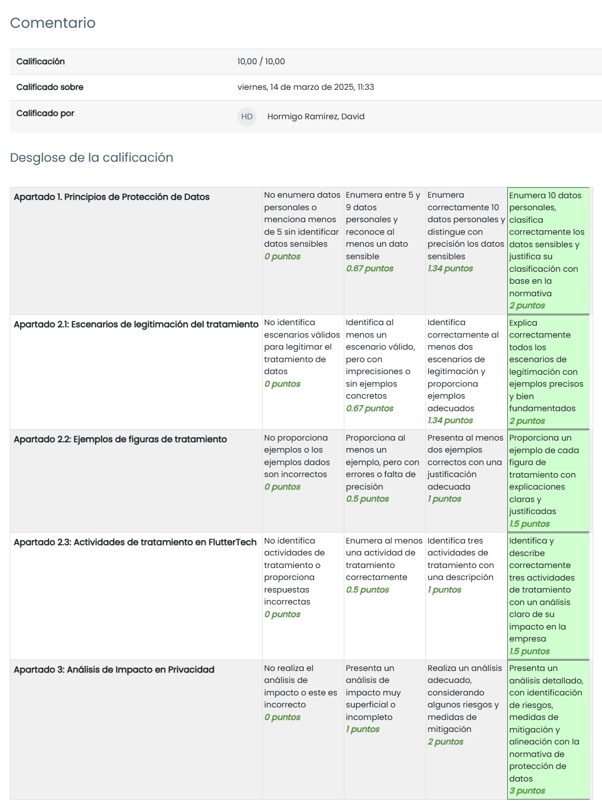

# TAREA Unidad 4: Legislación y jurisprudencia en materia de protección de datos

## Índice

- [Caso práctico](#caso-práctico)
- [¿Qué te pedimos que hagas?](#qué-te-pedimos-que-hagas)
	- [Apartado 1: Principios de protección de datos.](#apartado-1-principios-de-protección-de-datos)
	- [Apartado 2: Regulación General de Protección de Datos.](#apartado-2-regulación-general-de-protección-de-datos)
	- [Apartado 3: Análisis de impacto en privacidad.](#apartado-3-análisis-de-impacto-en-privacidad)
- [Resultado](#resultado)
	- [Calificación](#calificación)
	- [Comentarios de retroalimentación y rúbrica](#comentarios-de-retroalimentación-y-rúbrica)

 

## Caso práctico

La compañía FlutterTech Solutions S.A. se encarga de proveer servicios de desarrollo de aplicaciones móviles multiplataforma, especializándose en la creación de soluciones personalizadas tanto para particulares como para empresas.

FlutterTech tiene una cartera de 2.000 clientes en España, a los que ofrece sus servicios con precios altamente competitivos y adaptados a las necesidades del cliente. Durante el año 2023, FlutterTech se adjudicó el desarrollo de una aplicación móvil para la Consejería de Desarrollo Educativo y Formación Profesional de la Junta de Andalucía.

FlutterTech tiene presencia en varios países de América Latina, lo que le permite atender a multinacionales en el sector financiero, comercio electrónico y telecomunicaciones. Uno de sus principales clientes es una entidad bancaria con altos requisitos de seguridad, que demanda la certificación ISO27001 en todos los proyectos entregados por FlutterTech.

La sede central de FlutterTech se encuentra en Málaga. Sus oficinas están diseñadas bajo criterios de sostenibilidad, incluyendo sistemas de climatización inteligente, jardines en las azoteas para mejorar la eficiencia energética y aprovechar el agua de la lluvia, así como paneles solares para reducir la huella de carbono.

Parte de los esfuerzos de FlutterTech para fomentar su responsabilidad social incluyen la colaboración con centros educativos locales, donando equipos informáticos reacondicionados como ordenadores y tablets a escuelas y universidades con menos recursos. Además, organiza talleres gratuitos de programación en Flutter para capacitar a jóvenes en competencias tecnológicas esenciales.

Dada su cartera de clientes, FlutterTech es responsable de la información de 2.000 clientes, entre los cuales se manejan datos como identificativos, de contacto, bancarios y proyectos en curso, con diferentes niveles de sensibilidad. Existen dos regulaciones cuyo objetivo es la protección de los datos personales de los individuos: la Regulación General de Protección de Datos (GDPR) y la Ley Orgánica de Protección de Datos y Garantía de Derechos Digitales (LOPD-GDD).

## ¿Qué te pedimos que hagas?

### Apartado 1: Principios de protección de datos.

>[!NOTE]
>Enumera 10 datos de carácter personal que podría estar tratando FlutterTech en la prestación de sus servicios. 

Recordemos que los datos de carácter personal son cualquier información relativa a una persona física identificada o identificable.

Entre ellos, podemos distinguir los siguientes, en relación con los servicios de FlutterTech:

- Nombre y apellidos.
- Domicilio.
- Dirección de correo electrónico.
- Número de documento nacional de identidad.
- Datos de acceso, como el usuario y contraseña de una cuenta.
- Datos de localización (como la función de los datos de localización de un teléfono móvil).
- Datos bancarios.
- Dirección de protocolo de internet (IP).
- Identificador de una cookie.
- Datos sobre el historial médico de los pacientes.
- Datos biométricos para acceder a la aplicación.

---

>[!NOTE]
>¿Alguno de los datos enumerados es sensible? ¿Cuáles de ellos?

La Regulación General de Protección de Datos establece los siguientes datos como especialmente sensibles:

- Origen racial.
- Ideología política.
- Religión o creencias.
- Afiliación sindical.
- Datos relativos a la salud.
- Datos relativos a la vida sexual u orientaciones sexuales.
- Datos genéticos y biométricos.

En base a esto, podemos identificar los datos sobre el historial médico de los pacientes y los datos biométricos como sensibles, ya que su uso indebido puede provocar discriminación o afectar a la intimidad del titular.

---

### Apartado 2: Regulación General de Protección de Datos.

>[!NOTE]
>¿Bajo qué escenarios se podría legitimar FlutterTech en el tratamiento de datos de sus clientes?

Por lo general, el tratamiento de estos datos está prohibido, salvo en los siguientes escenarios:

- Otorgamiento del consentimiento por parte del titular de la información para el tratamiento de sus datos con uno o varios fines específicos.
- Cumplimiento de una obligación legal.
- Ejecución de un contrato firmado entre propietario y responsable de los datos.
- Protección de la vida del interesado o de otra persona física.
- Realización de una actividad de interés público.
- Existencia de intereses legítimos perseguidos por el responsable del tratamiento o por un tercero.

Aplicándolos al contexto de la FlutterTech, podemos identificar estos casos como ejemplo:

| ESCENARIO                                                                                                                                    | EJEMPLO                                                                                                                                                                                                       |
|----------------------------------------------------------------------------------------------------------------------------------------------|---------------------------------------------------------------------------------------------------------------------------------------------------------------------------------------------------------------|
| Otorgamiento del consentimiento por parte del titular de la información para el tratamiento de sus datos con uno o varios fines específicos. | Un usuario descarga una aplicación desarrollada por FlutterTech y, antes de usarla, se le solicita su consentimiento para recibir notificaciones de marketing y promociones personalizadas.                   |
| Cumplimiento de una obligación legal.                                                                                                        | FlutterTech conserva los datos de facturación y pago de sus clientes durante al menos cinco años para cumplir con las normativas fiscales y contables en España.                                              |
| Ejecución de un contrato firmado entre propietario y responsable de los datos.                                                               | Un cliente contrata a FlutterTech para desarrollar una aplicación móvil y proporciona datos de contacto y especificaciones del proyecto. La empresa necesita tratar estos datos para cumplir con el contrato. |
| Protección de la vida del interesado o de otra persona física.                                                                               | FlutterTech desarrolla una aplicación de emergencias médicas que permite compartir datos de salud del usuario con servicios de urgencias en caso de accidente.                                                |
| Realización de una actividad de interés público.                                                                                             | FlutterTech colabora con la Junta de Andalucía en el desarrollo de una plataforma educativa que requiere el tratamiento de datos de docentes y alumnos para su correcto funcionamiento.                       |
| Existencia de intereses legítimos perseguidos por el responsable del tratamiento o por un tercero.                                           | Para garantizar la seguridad de sus clientes, FlutterTech implementa herramientas de análisis de tráfico en sus aplicaciones con el fin de detectar y bloquear accesos no autorizados o intentos de fraude.   |

---

>[!NOTE]
>Indica al menos un ejemplo de cada figura de tratamiento de datos. 

En primer lugar, es importante identificar a las figuras implicadas en el tratamiento de datos:

- **Propietario de los datos o interesado**: Individuo sobre el que versan los datos que se están tratando, impactado por la limitación de sus derechos y libertades en caso de que no sea respetada la regulación, y sus datos no sean tratados de manera diligente o existan fugas.
- **Responsable del tratamiento de datos o controlador**: Persona física o jurídica que maneja la información del interesado a través de uno o varios medios con uno o varios fines determinados.
- **Encargado de tratamiento o procesador**: Persona física o jurídica que trata los datos personales en nombre del responsable de tratamiento, siempre bajo el marco de un contrato.

En base a esto, podemos presentar los siguientes ejemplos para FlutterTech:

| FIGURA                                             | EJEMPLO                                                                                                                                                                                                                                                                       |
|----------------------------------------------------|-------------------------------------------------------------------------------------------------------------------------------------------------------------------------------------------------------------------------------------------------------------------------------|
| Propietario de los datos o interesado              | Un cliente que contrata a FlutterTech para desarrollar una aplicación móvil. Sus datos personales, como nombre, correo electrónico y datos bancarios, le pertenecen y él tiene el derecho a decidir sobre su uso.                                                             |
| Responsable del tratamiento de datos o controlador | FlutterTech actúa como responsable del tratamiento cuando recopila y gestiona los datos personales de sus clientes para la ejecución de un contrato de desarrollo de aplicaciones. Es quien decide cómo y con qué finalidad se tratan esos datos.                             |
| Encargado de tratamiento o procesador              | FlutterTech subcontrata a una empresa de hosting en la nube para almacenar las bases de datos de sus aplicaciones. En este caso, la empresa de hosting actúa como encargado del tratamiento, ya que procesa los datos en nombre de FlutterTech y siguiendo sus instrucciones. |

---

>[!NOTE]
>Indica tres actividades de tratamiento que estén llevadas a cabo por FlutterTech.

En base a la información proporcionada en el caso práctico, podemos identificar estas tres actividades de tratamiento:

1. **Gestión de clientes y facturación**: La empresa recopila y almacena datos personales de sus clientes, como los mencionados en el [apartado 1](#apartado-1-principios-de-protección-de-datos), para gestionar contratos, facturación y pagos, entre otros.
2. **Gestión de credenciales**: FlutterTech recoge información de usuarios finales, como credenciales de acceso y datos de uso, para garantizar el correcto funcionamiento de las aplicaciones.
3. **Análisis de seguridad y prevención de fraudes**: Como la organización trabaja para una entidad bancaria con altos requisitos de seguridad, FlutterTech tendrá implantadas medidas de ciberseguridad en las aplicaciones que desarrolla para detectar posibles amenazas y prevenir ciberataques. Para ello, se puede hacer uso de distintos datos, como las direcciones IP de los dispositivos que usan sus servicios para determinar si la actividad del usuario es legítima.

---

### Apartado 3: Análisis de impacto en privacidad. 

>[!NOTE]
>Realiza un análisis de impacto de las tres actividades de tratamiento descritas en el apartado anterior. 

1. **Gestión de clientes y facturación**.

	**Descripción**: La empresa recopila y almacena datos personales de clientes para gestionar contratos, facturación y pagos.

	**Evaluación de la necesidad**: El tratamiento de datos personales como nombres, direcciones y datos financieros es estrictamente necesario para la correcta gestión de clientes, emisión de facturas y cumplimiento de obligaciones fiscales. Sin estos datos, FlutterTech no podría prestar sus servicios ni cumplir con la legislación tributaria.

	**Evaluación de la proporcionalidad**:

	- El tratamiento es adecuado, ya que permite la ejecución de contratos y el cumplimiento de obligaciones legales.
	- Solo se recopilan los datos estrictamente necesarios para facturación y pagos.
	- Se debe asegurar que únicamente se almacenen los datos esenciales durante el tiempo legalmente requerido.

	**Evaluación de riesgos**: 

	- **Tipos de datos tratados**: Personales, como nombres, correos electrónicos, domicilios, números de cuenta y tarjetas de crédito.
	- **Posibles impactos**:
		- Acceso no autorizado a datos personales.
		- Fraude o robo de identidad si los datos son comprometidos.
		- Incumplimiento de normativas como la GDPR y la LOPD-GDD.
	
	**Medidas de mitigación**:

	- Implementación de cifrado en base de datos y almacenamiento seguro de información financiera.
	- Aplicación de controles de acceso restringido.
	- Auditorías periódicas para asegurar el cumplimiento de normativas como GDPR y LOPD-GDD.

2. **Gestión de credenciales**.

	**Descripción**: FlutterTech recoge información de usuarios finales, como credenciales de acceso y datos de uso, para garantizar el correcto funcionamiento de las aplicaciones.

	**Evaluación de la necesidad**: El almacenamiento y tratamiento de credenciales de acceso es imprescindible para garantizar el correcto funcionamiento de las aplicaciones desarrolladas por FlutterTech. Sin este tratamiento, los usuarios no podrían autenticarse ni acceder de forma segura a los servicios digitales.

	**Evaluación de la proporcionalidad**:

	- Es un tratamiento esencial para la prestación de servicios digitales.
	- Se limitan los datos recopilados a lo necesario para la autenticación (usuario, contraseña, tokens).
	- Se almacenan las credenciales solo el tiempo necesario.

	**Evaluación de riesgos**:

	- **Tipos de datos tratados**: Personales, como nombres de usuario, contraseñas y tokens de autenticación.
	- **Posibles impactos**:
		- Filtración de credenciales que permita el acceso no autorizado a cuentas de usuario.
		- Compromiso de la seguridad de la aplicación si se reutilizan contraseñas débiles.
		- Acceso no autorizado a información personal.
	
	**Medidas de mitigación**:

	- Uso de autenticación 2FA o MFA para fortalecer la seguridad de las cuentas.
	- Implementación de hashing y salting en las contraseñas almacenadas para añadir capas extras de seguridad.
	- Implementación de sistemas de detección de accesos sospechosos y alertas de seguridad.

3. **Análisis de seguridad y prevención de fraudes**.

	**Descripción**: Como la organización trabaja para una entidad bancaria con altos requisitos de seguridad, FlutterTech tendrá implantadas medidas de ciberseguridad en las aplicaciones que desarrolla para detectar posibles amenazas y prevenir ciberataques. Para ello, se puede hacer uso de distintos datos, como las direcciones IP de los dispositivos que usan sus servicios para determinar si la actividad del usuario es legítima.

	**Evaluación de la necesidad**: Dado que FlutterTech trabaja con una entidad bancaria con altos requisitos de seguridad, la recopilación de datos como direcciones IP es fundamental para detectar fraudes y prevenir ciberataques.

	**Evaluación de la proporcionalidad**:

	- La actividad es apropiada para evitar ataques y proteger la información de clientes.
	- Se procesan solo los datos necesarios para evaluar riesgos de seguridad (direcciones IP).
	- Se establecen reglas claras de retención y eliminación de datos para evitar almacenamiento innecesario.

	**Evaluación de riesgos**:

	- **Tipos de datos tratados**: Direcciones IP.
	- **Posibles impactos**:
		- Uso indebido de la información recopilada para vigilancia injustificada.
		- Bloqueo erróneo de usuarios legítimos por falsos positivos en el sistema de seguridad.
		- Posible incumplimiento con normativas de seguridad y privacidad si no se le notifica correctamente al usuario del uso de estos datos.
		
	**Medidas de mitigación**:

	- Definir unos criterios claros de análisis para minimizar los falsos positivos.
	- Informar de forma transparente a los usuarios sobre la recopilación de estos datos mediante políticas de privacidad claras.

---

## Resultado

### Calificación

10,00 / 10,00

### Comentarios de retroalimentación y rúbrica

