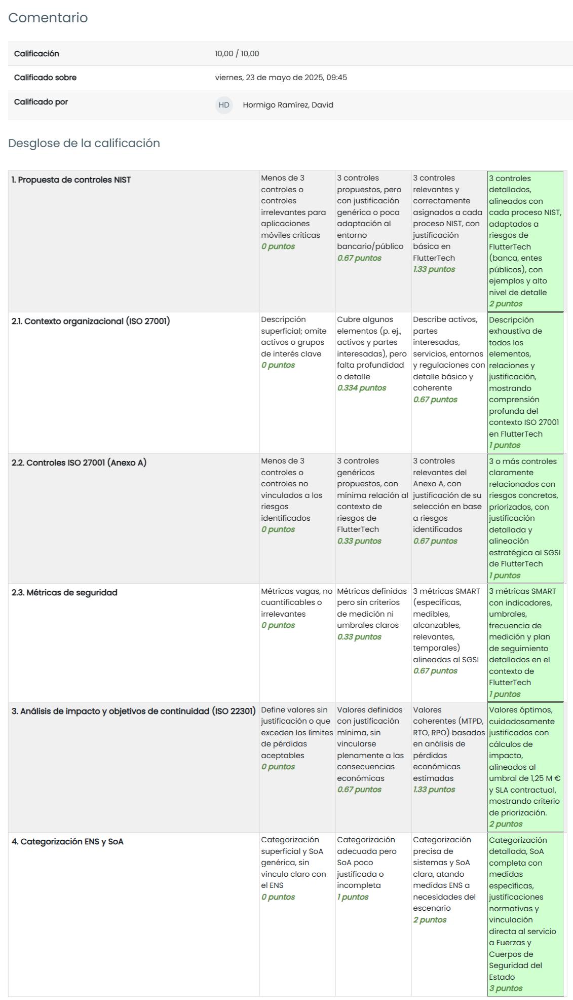

# TAREA Unidad 5: Normativa vigente de ciberseguridad de ámbito nacional e internacional

## Índice

- [Caso práctico](#caso-práctico)
- [¿Qué te pedimos que hagas?](#qué-te-pedimos-que-hagas)
	- [Apartado 1: Normas nacionales e internacionales.](#apartado-1-normas-nacionales-e-internacionales)
	- [Apartado 2. Sistema de gestión de seguridad de la información basado en ISO 27001.](#apartado-2-sistema-de-gestión-de-seguridad-de-la-información-basado-en-iso-27001)
	- [Apartado 3. Sistema de gestión de continuidad de negocio basado en ISO 22301.](#apartado-3-sistema-de-gestión-de-continuidad-de-negocio-basado-en-iso-22301)
	- [Apartado 4: Esquema nacional de seguridad.](#apartado-4-esquema-nacional-de-seguridad)
- [Resultado](#resultado)
	- [Calificación](#calificación)
	- [Comentarios de retroalimentación y rúbrica](#comentarios-de-retroalimentación-y-rúbrica)

 

## Caso práctico

La compañía FlutterTech S.A. se dedica al desarrollo de aplicaciones móviles multiplataforma utilizando el framework Flutter, ofreciendo soluciones tanto a particulares como a empresas.

FlutterTech cuenta con una cartera de 300.000 usuarios activos en España que utilizan sus aplicaciones, muchas de las cuales operan bajo un modelo de suscripción mensual con una tarifa media de 23,50 €.

La empresa tiene presencia en 32 países, lo que le ha permitido trabajar con clientes multinacionales. Durante el año 2022, FlutterTech logró adjudicarse el desarrollo y mantenimiento de las aplicaciones móviles oficiales de todas las embajadas extranjeras en España.

Uno de sus principales clientes es una entidad bancaria internacional con un alto nivel de exigencia en materia de ciberseguridad. Entre sus requisitos destaca que los servicios de desarrollo cumplan con la certificación ISO27001.

La sede central de FlutterTech se encuentra en Málaga, y fue inaugurada en el año 2020. Las instalaciones cuentan con climatización inteligente, jardines en las azoteas para mejorar la eficiencia térmica, recogida de agua de lluvia para el riego de zonas verdes, y un sistema de paneles solares para reducir el consumo energético.

Además, una parte de los terrenos de la empresa ha sido acondicionada como zona verde pública, en colaboración con el ayuntamiento, mejorando el entorno para los residentes. También se ha invertido en la mejora de los accesos por carretera a la zona empresarial donde se encuentra su sede.

En los últimos meses, FlutterTech ha logrado un importante contrato con una institución de las Fuerzas y Cuerpos de Seguridad del Estado, para el desarrollo de aplicaciones móviles seguras y accesibles. Debido a la criticidad del servicio, FlutterTech ha sido designada como proveedor de servicio esencial.

Con este nuevo contrato y los compromisos ya existentes, FlutterTech iniciará el despliegue de un Sistema de Gestión de Seguridad de la Información (SGSI) y un Sistema de Gestión de Continuidad de Negocio (SGCN). Asimismo, deberá cumplir con el Esquema Nacional de Seguridad (ENS) y con la Directiva NIS, dado que sus aplicaciones forman parte de servicios críticos para la seguridad nacional.

En esta tarea se requerirá de los conocimientos adquiridos a lo largo de la unidad para desarrollar los contenidos requeridos en el ejercicio.

## ¿Qué te pedimos que hagas?

### Apartado 1: Normas nacionales e internacionales.

> [!NOTE]
> Propón tres controles de cada proceso de seguridad de la normativa NIST aplicados al contexto de FlutterTech.
>
> **NOTA**: Ten en cuenta que FlutterTech desarrolla aplicaciones móviles que deben cumplir con altos estándares de seguridad para clientes como bancos o instituciones públicas. Puedes centrarte en los controles más relevantes para este tipo de entorno.

- **Proceso NIST: Identificar (ID)**

	**Control: Gestión de activos**

	Mantener un inventario actualizado y clasificado de activos físicos y lógicos (servidores, código fuente, API, librerías externas, contenedores, dispositivos móviles, etc.), especialmente los que dan soporte a servicios críticos como apps bancarias o institucionales.

	FlutterTech desarrolla apps para banca internacional y entes públicos bajo contrato con el estado. Un error en la gestión de activos puede suponer una exposición de código crítico o API con datos sensibles. Para remediar esto, FlutterTech podría, por ejemplo, utilizar herramientas como CMDB (Configuration Management Database) para registrar y etiquetar repositorios Git de apps bancarias y gubernamentales, endpoints de una API con tokens de acceso, dispositivos móviles usados por el equipo de testing para apps de las Fuerzas de Seguridad.

	 

	**Control: Evaluación de riesgos**

	Auditorías internas cada seis meses con herramientas automáticas y análisis manual en apps críticas.

	Con este control se abordan riesgos como la inclusión de vulnerabilidades en versiones de producción y errores en las dependencias de los proyectos. Dentro del contexto de FlutterTech, las aplicaciones deben pasar controles de seguridad rigurosos para garantizar su integridad frente a amenazas de ciberseguridad. Para implementarlo en la organización, se deben realizar análisis de código periódicos y auditorías de la infraestructura en la nube.

	 

	**Control: Cumplimiento normativo**

	Integración de requisitos ISO 27001, ENS (Categoría Alta), NIS2 y RGPD en políticas internas.

	Con este control se mitigan riesgos como multas, incumplimientos contractuales, pérdida de certificaciones o confianza en la empresa. Si lo aplicamos a FlutterTech, los bancos y las fuerzas de seguridad del estado exigen un cumplimiento normativo estricto como parte del contrato y garantía reputacional. Para cumplirlo, FlutterTech podría crear una matriz de cumplimiento vinculada al SGSI que alinee controles con marcos regulatorios.

- **Proceso NIST: Proteger (PR)**

	**Control: Gestión de Identidades y Accesos**

	Controla y limita el acceso a activos y sistemas en función del principio de mínimo privilegio. Como medidas, encontramos la aplicación de la autenticación multifactor (MFA), segmentación de roles y control de cuentas privilegiadas.

	Si lo aplicamos al contexto de FlutterTech, los desarrolladores que trabajan en apps de entidades bancarias o del estado deben tener un acceso controlado, auditable y revocable, especialmente ante riesgos de exfiltración de código o brechas de confidencialidad. Para ello, se debe implementar la estrategia zero trust con autenticación MFA en entornos de desarrollo (e.g., Azure DevOps, GitHub Enterprise), además de roles separados para evitar que los usuarios tengan más permisos de los que deben.

	 

	**Control: Protección de datos**

	Cifrado con AES-256 en reposo y TLS 1.2 (o superior) en tránsito; uso de certificados digitales gestionados mediante PKI.

	Con este control se mitigan riesgos como filtraciones de datos, ataques como _man in the middle_, incumplimiento del RGPD o ENS. Si lo aplicamos a FlutterTech, las apps para fuerzas de seguridad y banca manejan datos personales y confidenciales altamente sensibles, por lo que es necesario implementar cifrado en el almacenamiento y el uso obligatorio del protocolo HTTPS en todas las APIs y apps móviles.

	 

	**Control: Capacitación en seguridad**

	Plan de concienciación de ciberseguridad anual y obligatorio para todos los empleados. Dentro de dicho plan, se incluyen simulaciones de phishing, test de conocimientos y entrenamientos específicos por rol.

	Con este control se mitigan riesgos como la ingeniería social y errores humanos. En general, la cultura de seguridad reduce riesgos internos y es clave en entornos donde el error humano podría ser fatal, como, por ejemplo, el acceso indebido a datos policiales sensibles.

- **Proceso NIST: Detectar (DE)**

	**Control: Detección de actividades anómalas**

	Implementa sistemas que detecten comportamientos inusuales o actividades potencialmente maliciosas dentro del ecosistema FlutterTech, particularmente en proyectos críticos.

	Dentro del contexto de FlutterTech, un actor malintencionado con acceso interno o un exploit en una aplicación crítica podría comprometer información financiera o datos sensibles del gobierno. Por lo tanto, es importante integrar un SIEM para correlacionar logs de acceso a repositorios, bases de datos y entornos de producción. Dentro de las alertas, se pueden establecer accesos fuera del horario laboral, descargas masivas de código o datos y comportamientos inusuales en los entornos de pruebas con datos reales.

	 

	**Control: Monitorización continua**

	SIEM con correlación de eventos en tiempo real y alertas clasificadas por criticidad.

	Con este control se mitigan riesgos como la intrusión, intento de intrusión, malware y actividades sospechosas que pueden pasar desapercibidas. FlutterTech actúa como proveedor esencial según NIS, por lo que la detección inmediata es imperativa. Para incluir este control, es necesario integrar logs en todos los servicios e implementar un firewall.

	 

	**Control: Pruebas de penetración**

	Realización de pentests periódicos sobre las apps móviles, APIs REST y los servicios relacionados con el backend.

	Con este control se mitigan riesgos como la intrusión, intento de intrusión, malware y actividades sospechosas que pueden pasar desapercibidas. FlutterTech actúa como proveedor esencial según NIS, por lo que la detección inmediata es imperativa. Para incluir este control, es necesario integrar logs en todos los servicios e implementar un firewall.

- **Proceso NIST: Responder (RE)**

	**Control: Plan de respuesta a incidentes**

	Manual operativo documentado y probado anualmente con equipos definidos (CERT interno), escalado y roles de comunicación.

	Tener un plan de respuesta es esencial para evitar el caos operativo y caídas prolongadas de los servicios críticos. Para evitar esto, es importante realizar, por ejemplo, simulaciones de ransomware en un entorno controlado, con métricas de tiempo medio de detección (MTTD) y recuperación (MTTR). Tener un plan de esta índole es obligatorio bajo ENS y NIS2. Además, reduce el impacto de un ataque y mejora la resiliencia organizacional.

	 

	**Control: Comunicación de incidentes**

	Plan de comunicación multicanal (interno, clientes, CERT nacional, CCN-CERT) con mensajes predefinidos.

	Tener un plan de comunicación es primordial para evitar una reacción descoordinada ante un ataque y sanciones regulatorias por no informar a tiempo. Para evitar esto, se establecerá un canal automatizado de alertas a responsables y autoridades. Esto aumenta la transparencia y la rapidez de FlutterTech a la hora de comunicar incidentes.

	 

	**Control: Registro y análisis forense**

	Captura y almacenamiento de logs (syslog, API calls, sistema operativo) con retención mínima de 12 meses.

	Al llevar a cabo este proceso, se subsana la incapacidad de investigar ataques. Es indispensable para lecciones aprendidas y procesos judiciales.

- **Proceso NIST: Recuperar (RC)**

	**Control: Plan de recuperación ante desastres**

	Definición de procesos, prioridades, RTO y RPO para restaurar servicios. Incluye pruebas de restauración anual.

	Al instaurar este plan, se mitiga el riesgo de pérdida de continuidad operativa en servicios críticos. En el caso de FlutterTech, es obligatorio definir un plan de este tipo, ya que es un proveedor esencial de servicios y protege la continuidad de las apps de emergencia o banca.

	**Control: Copias de seguridad**

	Backups cifrados diarios, distribuidos en diferentes ubicaciones geográficas, con restauración probada y alertas por fallos.

	Este control mitiga los riesgos de pérdida irreversible de datos y corrupción de servicios críticos. Para llevar a cabo este control en FlutterTech, se debe establecer encriptación, replicación cruzada y alertas en tiempo real en caso de que falle una copia de seguridad. Cabe destacar que este control es obligatorio, ya que, según el ENS, FlutterTech entra en la categoría ALTA.

	 

	**Control: Evaluación post-incidente**

	Procedimiento formal para revisión de cada incidente: análisis causa-raíz, impacto, eficacia del plan de respuesta y ajustes.

	Este control ayuda a que se vuelvan a repetir los mismos errores de pasados ataques, así como aplicar mejoras para subsanar dichos errores. Dentro del contexto de FlutterTech, se debe redactar un informe formal compartido con CISO, CTO y dirección general durante el proceso de la evaluación post-incidente para aplicar los cambios que se estimen convenientes. Asimismo, al aplicar este control, también se estaría realizando una mejora continua del SGSI.

 

**Fuentes**:

- Sección “**Principales estándares internacionales en ciberseguridad**” del apartado “**1. Normas nacionales e internacionales**” del material didáctico de la unidad 5.

---

### Apartado 2. Sistema de gestión de seguridad de la información basado en ISO 27001.

> [!NOTE]
> Desarrolla un contexto descriptivo de la organización alineado con los requisitos de información del estándar ISO 27001
>
> **NOTA**: Deberás considerar aspectos como los activos de información, partes interesadas, servicios ofrecidos, entornos tecnológicos, regulaciones aplicables, etc.

**Comprensión de la organización y su contexto (Cláusula 4.1)**

FlutterTech opera en un entorno altamente digital, internacional y regulado. Su actividad principal (desarrollo de aplicaciones móviles multiplataforma) implica el tratamiento de datos sensibles, cumplimiento con normativas internacionales (ENS, NIS, ISO27001), y gestión de servicios críticos para entidades como bancos, embajadas y fuerzas de seguridad.

Dentro del entorno que rodea a la empresa, encontramos tanto el entorno externo como el interno:

- **Entorno externo**

	FlutterTech atiende a una variedad de clientes, entre los que se incluyen instituciones financieras, organismos gubernamentales y empresas privadas con altos requisitos de seguridad. En cuanto a las normativas de regulación y cumplimiento, la organización debe adherirse a la regulación nacional, europea y, además, a la de los países extracomunitarios en los que opere. También tiene que respetar el Esquema Nacional de Seguridad (ENS) y la Directiva NIS, debido a su papel en el desarrollo de aplicaciones para instituciones críticas, como embajadas y cuerpos de seguridad del Estado.

	Por otra parte, el sector del desarrollo de software se enfrenta a cambios continuos en las tecnologías y a amenazas de ciberseguridad, como ransomware o phishing, por lo que la empresa debe adaptar constantemente sus protocolos de protección de datos. A esto hay que sumarle las expectativas de confidencialidad y disponibilidad de datos por parte de clientes en el sector financiero..

- **Entorno interno**

	La sede central se encuentra en Málaga. Cuenta con una infraestructura sostenible, desde el punto de vista energético, y propia. La estructura tecnológica está distribuida, e incluye un entorno de desarrollo en la nube, repositorios de código gestionados con control de acceso y medidas de seguridad avanzadas.

	El equipo está compuesto por desarrolladores, expertos en ciberseguridad y profesionales del cumplimiento normativo. Por otro lado, FlutterTech está implementando un Sistema de Gestión de Seguridad de la Información (SGSI) y un Sistema de Gestión de Continuidad de Negocio (SGCN), por lo que va a estar preparado para gestionar los riesgos asociados a sus operaciones.

**Comprensión de las necesidades y expectativas de las partes interesadas (Cláusula 4.2)**

Respecto a las partes interesadas, existe una relación con las expectativas que estas tienen respecto a la seguridad de la información:

<table>
	<tr>
		<th><strong>PARTE INTERESADA</strong></th>
		<th><strong>EXPECTATIVAS</strong></th>
	</tr>
	<tr>
		<td>Clientes bancarios internacionales</td>
		<td>Cumplimiento con ISO27001, alta disponibilidad y cifrado de datos.</td>
	</tr>
	<tr>
		<td>Entidades gubernamentales y fuerzas de seguridad</td>
		<td>Aplicaciones seguras, cumplimiento ENS/NIS y continuidad operativa.</td>
	</tr>
	<tr>
		<td>Usuarios finales</td>
		<td>Privacidad de datos, integridad de apps y confianza en la marca.</td>
	</tr>
	<tr>
		<td>Autoridades reguladoras</td>
		<td>Cumplimiento legal, respuesta ante incidentes, auditoría y trazabilidad.</td>
	</tr>
	<tr>
		<td>Empleados</td>
		<td>Accesos seguros, formación en ciberseguridad y protección del entorno de trabajo.</td>
	</tr>
	<tr>
		<td>Ayuntamientos y comunidad local</td>
		<td>Responsabilidad social, zonas verdes e integración urbana.</td>
	</tr>
</table>

Si FlutterTech no atendiera a las expectativas de estas partes, podría perder contratos clave o  ser sancionada por incumplimientos legales y reputacionales.

**Determinación del alcance del SGSI (Cláusula 4.3)**

El SGSI abarca el desarrollo, el mantenimiento, la operación y el soporte de aplicaciones móviles para clientes institucionales y privados, que incluyen servicios críticos prestados a entidades gubernamentales, bancarias y de seguridad desde la sede central en Málaga.

Dentro de la infraestructura TI, el alcance del SGSI aplica también a repositorios de código fuente, a la infraestructura de la nube y a proveedores de servicios subcontratados, como los servicios de hosting o de almacenamiento. Dado que el desarrollo seguro es la actividad principal y núcleo del negocio, su protección es crítica para preservar la continuidad y reputación de la empresa.

**Sistema de gestión de seguridad de la información (Cláusula 4.4)**

Dentro de los elementos clave implementados o previstos en FlutterTech, destacamos los siguientes:

<table>
	<tr>
		<th><strong>ELEMENTO</strong></th>
		<th><strong>APLICADO A FLUTTERTECH</strong></th>
	</tr>
	<tr>
		<td>Política de Seguridad</td>
		<td>Define principios de seguridad para apps bancarias y gubernamentales.</td>
	</tr>
	<tr>
		<td>Roles y responsabilidades</td>
		<td>CISO, DPO, responsables técnicos, gestión de incidentes y continuidad operativa.</td>
	</tr>
	<tr>
		<td>Evaluación de riesgos</td>
		<td>Basada en amenazas reales como ataques DDoS o malware en la cadena de suministro.</td>
	</tr>
	<tr>
		<td>Controles aplicados</td>
		<td>Según Anexo A ISO27001 y mapeados con ENS / NIST.</td>
	</tr>
	<tr>
		<td>Auditoría interna y revisión</td>
		<td>Programas de auditoría semestral y revisión anual del SGSI por la dirección.</td>
	</tr>
	<tr>
		<td>Mejora continua</td>
		<td>Lecciones aprendidas tras incidentes o cambios normativos (por ejemplo, nuevas directivas NIS).</td>
	</tr>
</table>

El SGSI se vincula directamente con el Sistema de Gestión de Continuidad del Negocio (SGCN), ya que FlutterTech está clasificada como proveedor de servicio esencial. Se integra con los controles exigidos por el Esquema Nacional de Seguridad (ENS), en especial en el desarrollo y despliegue de aplicaciones gubernamentales.

---

> [!NOTE]
> Propón al menos tres controles del Anexo A de la norma ISO 27001 para la mitigación de riesgos identificados en el contexto anterior.

1. **A.9.2.1 Registro de usuarios y cancelación del registro**

	**Riesgo asociado**: Accesos no autorizados a entornos de desarrollo, infraestructura cloud o datos sensibles por cuentas no revocadas o mal gestionadas.

	**Prioridad**: Alta

	FlutterTech gestiona información sensible en nombre de bancos y organismos públicos. La permanencia de cuentas inactivas o mal autorizadas puede derivar en compromiso de la información a nivel interno, exposición de datos personales o clasificados e incumplimiento del ENS.

	Para mitigar este riesgo, se debe establecer un proceso automatizado de alta y baja de usuarios y  cancelar inmediatamente los accesos al cesar la relación laboral o al terminar un proyecto. Además, es conveniente realizar una validación semestral de cuentas activas y sus permisos.

	En cuanto a la alineación estratégica con el SGSI, este control refuerza la confidencialidad, evita persistencia de accesos innecesarios y soporta el principio de ciclo de vida seguro de los usuarios. Además, es un requisito transversal en ENS y Directiva NIS.

2. **A.15.1.1 Seguridad de la información en las relaciones con los proveedores**

	**Riesgo asociado**: Fuga de información, acceso indebido a código fuente o introducción de vulnerabilidades mediante terceros (empresas subcontratadas para testing, soporte o mantenimiento).

	**Prioridad**: Crítica

	FlutterTech trabaja con colaboradores externos para ciertas fases del desarrollo y soporte. Sin controles adecuados, puede haber pérdida de control sobre datos confidenciales, riesgos legales por incumplimiento contractual y compromiso de integridad de las apps móviles.

	Para mitigar este riesgo, se debe firmar acuerdos de confidencialidad (NDA) y cláusulas específicas de seguridad con cada proveedor, además de realizar un proceso de diligencia debida para evaluar los riesgos del proveedor antes de contratar sus servicios. 

	En cuanto a la alineación estratégica con el SGSI, este control es clave para la gestión de riesgos de terceros, el cual es un aspecto central del SGSI en entornos que incluyen servicios críticos bajo contratos públicos o financieros. También se alinea con el ENS nivel ALTO, ya que exige control de la cadena de suministro digital.

3. **A.18.1.4 Protección de los datos y privacidad de la información personal**

	**Riesgo asociado**: Filtración, tratamiento indebido o pérdida de datos personales de usuarios finales, empleados o clientes.

	**Prioridad**: Muy alta

	Como proveedor de aplicaciones de uso público y privado, FlutterTech debe cumplir con el Reglamento General de Protección de Datos (RGPD) y la Ley Orgánica de Protección de Datos (LOPD). Una brecha puede generar multas en la facturación anual de la empresa, pérdida de confianza del mercado y daños reputacionales y contractuales severos.

	Para mitigar este riesgo, se deben cifrar los datos sensibles, registrar actividades de tratamiento y tener una canal interno de notificaciones de brechas de seguridad y respuestas a incidentes en menos de 72 horas, tal y como exige la normativa. 

	En cuanto a la alineación estratégica con el SGSI, este control asegura el cumplimiento normativo con leyes de protección de datos, el cual es un componente esencial del SGSI y también requerido explícitamente en proyectos gubernamentales y del sector financiero. Asimismo, refuerza la confidencialidad e integridad de los datos personales en todas las fases del ciclo de vida de las apps.

**Fuentes**:
* A.9.2.1: [https://www.normaiso27001.es/a9-control-de-acceso/](https://www.normaiso27001.es/a9-control-de-acceso/)
* A.15.1: [https://www.normaiso27001.es/a15-relacion-con-proveedores/ ](https://www.normaiso27001.es/a15-relacion-con-proveedores/)
* A.18.1.4: [https://www.normaiso27001.es/a18-cumplimiento/](https://www.normaiso27001.es/a18-cumplimiento/)

---

> [!NOTE]
> Desarrolla tres métricas de seguridad para FlutterTech. Estas métricas deben permitir evaluar la eficacia del SGSI implantado en la empresa

1. **Tiempo de resolución de incidentes de ciberseguridad (TRIC)**

  **Objetivo SMART**: Reducir el tiempo promedio de resolución de incidentes de ciberseguridad a menos de 8 horas antes de finalizar el segundo trimestre de 2025.

  **Indicador**: Tiempo promedio (en horas) desde la detección hasta la resolución de un incidente de seguridad.

  **Umbral aceptable**: ≤ 8 horas.
	* **Alerta amarilla:** entre 8 y 12 horas.
	* **Alerta roja:** > 12 horas.

  **Frecuencia de medición**: Mensual (análisis de incidentes registrados durante el mes).

  **Plan de seguimiento:**
	* Implementar sistema SIEM con alertas en tiempo real.
	* Revisiones mensuales del tiempo de respuesta por parte del equipo de ciberseguridad.
	* Informe mensual al responsable de seguridad.
	* Análisis de causa-raíz en incidentes que excedan el umbral.

2. **Disponibilidad de los servicios críticos (ADS)**

  **Objetivo SMART**: Garantizar una disponibilidad del 99,95% mensual en las aplicaciones móviles críticas utilizadas por instituciones de seguridad antes de diciembre de 2025.

  **Indicador**: Porcentaje de disponibilidad del servicio crítico respecto al tiempo total del mes.

  **Umbral aceptable**: ≥ 99,95% (máximo 21,6 minutos de inactividad al mes).
	* **Alerta amarilla:** 99,90% – 99,94%.
	* **Alerta roja:** &lt; 99,90%.

  **Frecuencia de medición**: Mensual.

  **Plan de seguimiento:**
	* Monitorización 24/7 con herramientas como UptimeRobot o New Relic.
	* Reporte automático mensual al equipo de continuidad del negocio.
	* Simulacros trimestrales de contingencia.
	* Ajuste de infraestructura en la nube si se detectan puntos de fallo.

3. **Número de vulnerabilidades detectadas en auditorías internas**

  **Objetivo SMART**: Alcanzar un nivel de cumplimiento del 95% de los controles del Esquema Nacional de Seguridad y la Directiva NIS antes del 30 de noviembre de 2025.

  **Indicador**: Porcentaje de controles técnicos y organizativos aplicados respecto a los requeridos por el ENS y NIS.

  **Umbral aceptable**: ≥ 95%
	* **Alerta amarilla:** entre 85% y 94%.
	* **Alerta roja:** &lt; 85%.

  **Frecuencia de medición**: Bimensual.

  **Plan de seguimiento:**
	* Auditoría interna cada dos meses.
	* Contratación de auditoría externa semestral.
	* Plan de acción correctivo para cada desviación detectada.
	* Revisión del cumplimiento en el comité de seguridad.

**Fuentes**:
* Luis Rodríguez Conde. *Gestión de Indicadores.* [https://openaccess.uoc.edu/bitstream/10609/64545/5/liziyoTFM0617-ANEXO%20C.pdf](https://openaccess.uoc.edu/bitstream/10609/64545/5/liziyoTFM0617-ANEXO%20C.pdf)

---

### Apartado 3. Sistema de gestión de continuidad de negocio basado en ISO 22301.

> [!NOTE]
> Realiza un análisis de impacto en la continuidad de los sistemas centrales de FlutterTech que dan servicio a sus aplicaciones móviles
>
>El escenario a utilizar para este análisis de impacto es el siguiente:
>
>FlutterTech gestiona varios sistemas centralizados que permiten el funcionamiento de todas sus aplicaciones móviles activas. En caso de indisponibilidad de estos sistemas (por ciberataque, fallo crítico, etc.), ninguna de las aplicaciones funcionaría, y no podrían recibirse pagos, emitir actualizaciones, ni ofrecer soporte a usuarios o empresas.
>
>Consecuencias económicas estimadas:
>* **Lucro cesante**: por incapacidad de facturación y pérdida de ingresos publicitarios. Se estima una pérdida de 60.000 € por hora de caída del servicio.
>* **Compensaciones**: por penalizaciones contractuales con empresas. Los contratos establecen una garantía del 97% de disponibilidad mensual. En caso de caída superior a 30 minutos y con reclamación, a partir de la primera hora se aplican compensaciones de 300.000 € por hora.
>* **Imagen y reputación**: se estima la pérdida del 1% de la cartera de clientes por cada incidencia grave, y la caída en nuevas contrataciones. Esto se ha valorado en 200.000 € por incidencia.
>* **Sanciones**: FlutterTech es proveedor esencial de aplicaciones para organismos públicos. En caso de caída reiterada o prolongada, podrían aplicarse sanciones regulatorias importantes.
>
>La organización no está dispuesta a asumir pérdidas mayores a 1,25 millones de euros por incidente.

Si tenemos en cuenta las consecuencias económicas estimadas y que FlutterTech no está dispuesta asumir pérdidas mayores a 1,25 millones de euros por incidente, podemos presentar los siguientes escenarios para analizar el impacto de la continuidad de los sistemas centrales de FlutterTech:

* Inactividad de los sistemas debido a un fallo prolongado durante **2 horas**:
	* **Lucro cesante**: 120.000 € (2h × 60.000 €).
	* **Compensaciones**: 300.000 € (solo 1h si aplica).
	* **Daño reputacional**: 200.000 € (una vez por incidente).
	* **Impacto total estimado**: 620.000 € (sin incluir sanciones).

* Inactividad de los sistemas debido a un fallo prolongado durante **3 horas**:
	* **Lucro cesante**: 180.000 € (3h × 60.000 €).
	* **Compensaciones**: 600.000 € (2h × 300.000 €).
	* **Daño reputacional**: 200.000 € (una vez por incidente).
	* **Impacto total estimado**: 980.000 € (no supera el umbral).

* Inactividad de los sistemas debido a un fallo prolongado durante **4 horas**:
	* **Lucro cesante**: 240.000 € (4h × 60.000 €).
	* **Compensaciones**: 900.000 € (3h × 300.000 €).
	* **Daño reputacional**: 200.000 € (una vez por incidente).
	* **Sanción por caída prolongada durante 4 horas**: 200.000 €.
	* **Impacto total estimado**: 1.540.000 € (supera el umbral).

Como podemos apreciar, el punto crítico se alcanza a partir de las 3 horas de inactividad, cerca del impacto financiero límite aceptable. Por otra parte, los factores que suponen un mayor riesgo son las compensaciones contractuales (300.000 €/h) y el daño reputacional (200.000 €). No obstante, hay que tener en cuenta que las posibles sanciones regulatorias podrían incrementar el costo total significativamente, como vemos en el último escenario.

Para mitigar los riesgos y reducir el impacto de los escenarios anteriormente expuestos, FlutterTech, debería trabajar en mejorar la capacidad de sus sistemas para operar de manera continua (alta disponibilidad) y redundar los sistemas críticos para poder actuar con rapidez en caso de fallo. Estos puntos podrían incluirse en el Plan de Recuperación ante Desastres (DRP), con un Tiempo de Recuperación Objetivo (RTO) inferior a 1 hora.

Por otro lado, sería conveniente revisar las cláusulas contractuales para reducir las compensaciones, las cuales son un tanto excesivas.

---

> [!NOTE]
> Establece un valor justificado para el MTPD, el RTO y el RPO

* **MTPD (Maximum Tolerable Period of Disruption): 3 horas**

  Dado que la empresa no está dispuesta a asumir pérdidas mayores de 1,25 millones de euros por incidente, y que la pérdida económica estimada es de 660.000 €/hora (sumando lucro cesante y compensaciones), en menos de 2 horas de caída ya se superaría el umbral de tolerancia. Para dar margen a la recuperación, se establece un MTPD de 3 horas, ya que una interrupción más prolongada podría generar daños irreparables en la imagen, sanciones regulatorias y pérdida sustancial de clientes, tal y como se expone en el apartado anterior.

* **RTO (Recovery Time Objective): 30 minutos**

  Los contratos establecen compensaciones a partir de 30 minutos de caída, lo que significa que cualquier interrupción que supere este umbral impactará financieramente a FlutterTech. Por lo tanto, el objetivo debe ser recuperar el servicio en menos de 30 minutos para evitar estos costes y mantener el nivel de servicio comprometido.

* **RPO (Recovery Point Objective): 5 minutos**

  FlutterTech gestiona transacciones financieras y datos en tiempo real, por lo que una pérdida de datos superior a 5 minutos podría ocasionar inconsistencias graves en pagos, actualizaciones y asistencia. Además, un RPO bajo minimiza el riesgo de sanciones regulatorias y de pérdida de confianza de los clientes.

---

### Apartado 4: Esquema nacional de seguridad.

> [!NOTE]
> Categoriza los sistemas asociados al desarrollo y mantenimiento de las aplicaciones móviles críticas de FlutterTech, en función del escenario definido en el caso práctico y por la prestación de servicios a las Fuerzas y Cuerpos de Seguridad del Estado.

Para garantizar el cumplimiento del Esquema Nacional de Seguridad (ENS) en la prestación de servicios a las Fuerzas y Cuerpos de Seguridad del Estado es fundamental realizar una categorización detallada del sistema y establecer una Declaración de Aplicabilidad (SoA) completa. Para ello, primero vamos a categorizar dichos sistemas.

Según el Real Decreto 311/2022, la categorización de un sistema de información se basa en la evaluación del impacto que tendría un incidente de seguridad sobre las dimensiones de seguridad: Disponibilidad, Autenticidad, Integridad, Confidencialidad y Trazabilidad. La categoría del sistema se determina por el nivel más alto asignado a cualquiera de estas dimensiones.

<table>
  <tr>
		<th><strong>DIMENSIÓN DE SEGURIDAD</strong></th>
		<th><strong>NIVEL DE CRITICID.</strong></th>
		<th><strong>JUSTIFICACIÓN</strong></th>
  </tr>
  <tr>
		<td><strong>Disponibilidad</strong></td>
		<td>Alto</td>
		<td>La interrupción de los servicios podría afectar operaciones críticas de las FCSE.</td>
  </tr>
  <tr>
  	<td><strong>Autenticidad</strong></td>
  	<td>Alto</td>
  	<td>La suplantación de identidad podría permitir accesos no autorizados a información sensible.</td>
  </tr>
  <tr>
  	<td><strong>Integridad</strong></td>
  	<td>Alto</td>
  	<td>La alteración de datos podría comprometer investigaciones y operaciones.</td>
  </tr>
  <tr>
  	<td><strong>Confidencialidad</strong></td>
  	<td>Alto</td>
  	<td>La divulgación de información clasificada podría poner en riesgo la seguridad nacional.</td>
  </tr>
  <tr>
  	<td><strong>Trazabilidad</strong></td>
  	<td>Alto</td>
  	<td>La falta de registros adecuados dificultaría la detección y análisis de incidentes.</td>
  </tr>
</table>

Dado que todas las dimensiones alcanzan el nivel ALTO, el sistema se categoriza como de categoría **ALTA** según el ENS.

---

> [!NOTE]
> Desarrolla una declaración de aplicabilidad (SoA) justificada, indicando qué medidas de seguridad del ENS se aplicarán y por qué.

La SoA identifica las medidas de seguridad del Anexo II del ENS aplicables al sistema, justificando su implementación o exclusión. Como previamente hemos categorizado al sistema como ALTA según el ENS, vamos a detallar algunas medidas clave para sistemas de dicha categoría.

Esta Declaración de Aplicabilidad detalla los controles de seguridad del ENS que han sido adoptados y justifica su aplicación en el contexto de la organización:

<table>
  <tr>
  	<th><strong>APARTADO</strong></th>
  	<th><strong>JUSTIFICACIÓN</strong></th>
  	<th><strong>IMPLEMENTACIÓN</strong></th>
  </tr>
  <tr>
  	<td><strong>ORG.1 – Política de Seguridad</strong></td>
  	<td>Establece el marco general para la gestión de la seguridad de la información.</td>
  	<td>Desarrollo y aprobación de una política de seguridad alineada con los objetivos de las Fuerzas y Cuerpos de Seguridad del Estado.</td>
  </tr>
  <tr>
  	<td><strong>OP.ACC – Control de accesos</strong></td>
  	<td>Garantiza que solo usuarios autorizados accedan a la información y recursos.</td>
  	<td>Implementación de autenticación multifactor y gestión de privilegios mínimos.</td>
  </tr>
  <tr>
  	<td><strong>MP.SI.4 – Transporte</strong></td>
  	<td>Protege la confidencialidad e integridad de la información durante su almacenamiento y transmisión.</td>
  	<td>Uso de cifrado robusto (por ejemplo, AES-256) y protocolos seguros (como TLS 1.2 o superior).</td>
  </tr>
  <tr>
  	<td><strong>OP.MON.1 – Detección de intrusión</strong></td>
  	<td>Permite la detección temprana de actividades anómalas o no autorizadas.</td>
  	<td>Despliegue de sistemas de detección de intrusiones (IDS) y análisis de logs en tiempo real.</td>
  </tr>
  <tr>
  	<td><strong>OP.CONT – Continuidad del servicio</strong></td>
  	<td>Asegura la disponibilidad de los servicios en caso de incidentes o desastres.</td>
  	<td>Desarrollo de planes de continuidad y recuperación, con pruebas periódicas.</td>
  </tr>
  <tr>
  	<td><strong>OP.EXP.8 – Registro de la actividad de los usuarios</strong></td>
  	<td>Facilita la trazabilidad y análisis forense en caso de incidentes.</td>
  	<td>Registro detallado de actividades de usuarios y sistemas, con retención conforme a la normativa.</td>
  </tr>
</table>

**Fuentes**:
* Real Decreto 311/2022, de 3 de mayo, por el que se regula el Esquema Nacional de Seguridad. [https://www.boe.es/buscar/doc.php?id=BOE-A-2022-7191](https://www.boe.es/buscar/doc.php?id=BOE-A-2022-7191)
* Inforges. *¿Qué es ENS Esquema Nacional de Seguridad?* [https://inforges.es/blog/que-es-ens-esquema-nacional-de-seguridad](https://inforges.es/blog/que-es-ens-esquema-nacional-de-seguridad)
* Guía CCN-CERT sobre la categorización de sistemas en el ENS. [https://www.ccn-cert.cni.es/es/documentos-publicos/x-jornadas-stic-ccn-cert/1954-como-categorizar-un-sistema-en-el-ens/file?format=html](https://www.ccn-cert.cni.es/es/documentos-publicos/x-jornadas-stic-ccn-cert/1954-como-categorizar-un-sistema-en-el-ens/file?format=html)
* Guía CCN-CERT sobre la Guía de Seguridad de las TIC CCN-STIC 804. [https://www.ccn-cert.cni.es/es/series-ccn-stic/800-guia-esquema-nacional-de-seguridad/505-ccn-stic-804-medidas-de-implantancion-del-ens/file?format=html](https://www.ccn-cert.cni.es/es/series-ccn-stic/800-guia-esquema-nacional-de-seguridad/505-ccn-stic-804-medidas-de-implantancion-del-ens/file?format=html)
* DeleteTechnology. *Requisitos y Niveles de Seguridad del ENS.* [https://www.deletetechnology.com/blog/requisitos-y-niveles-de-seguridad-del-ens](https://www.deletetechnology.com/blog/requisitos-y-niveles-de-seguridad-del-ens)
* Amazon Web Services. *Esquema Nacional de Seguridad (categoría Alta).* [https://aws.amazon.com/es/compliance/esquema-nacional-de-seguridad](https://aws.amazon.com/es/compliance/esquema-nacional-de-seguridad)

---

## Resultado

### Calificación

10,00 / 10,00

### Comentarios de retroalimentación y rúbrica

